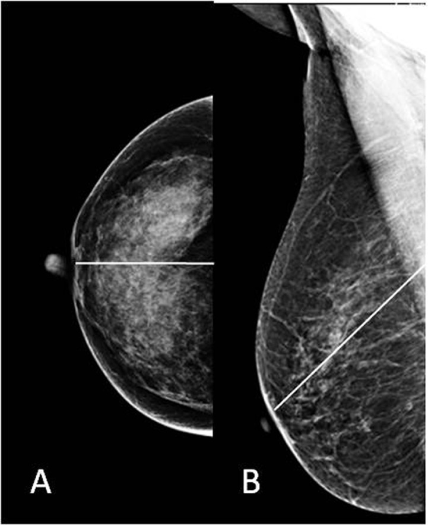
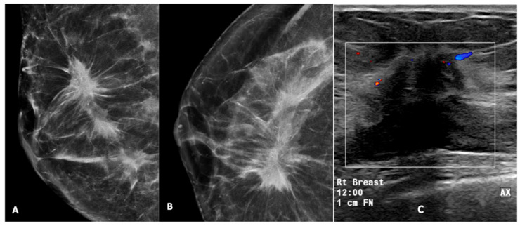
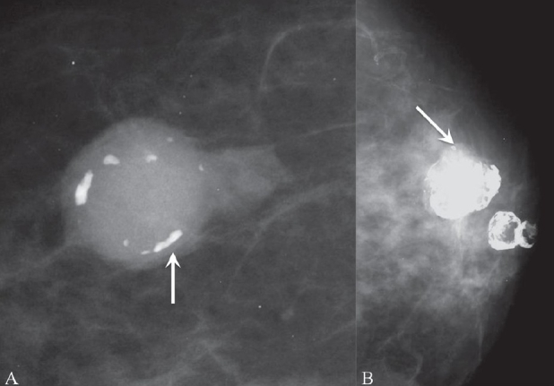
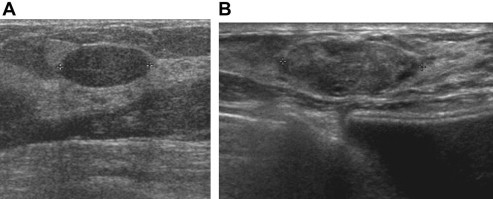
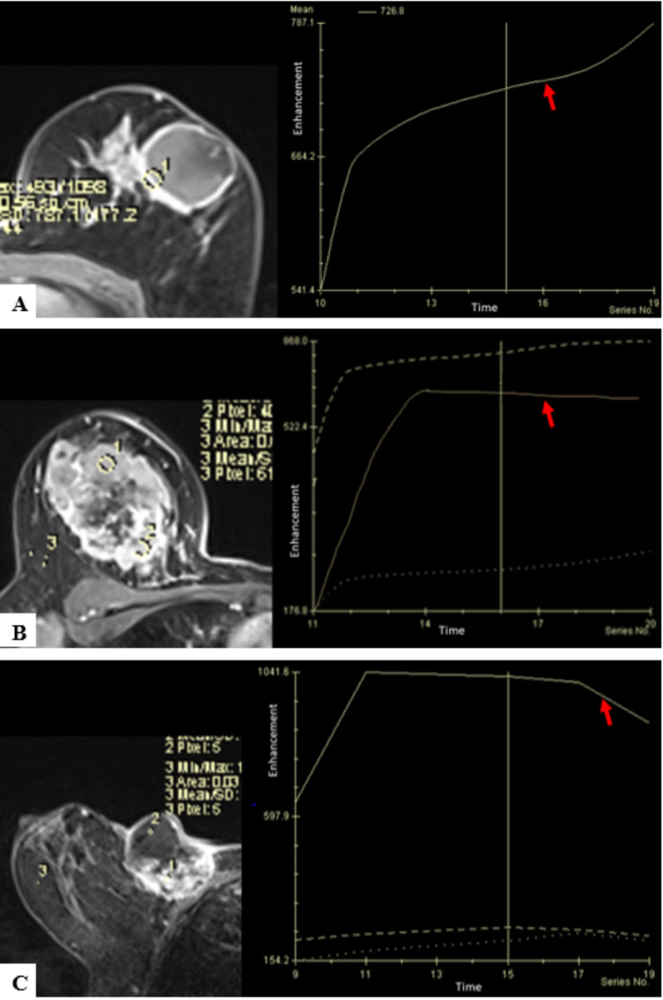
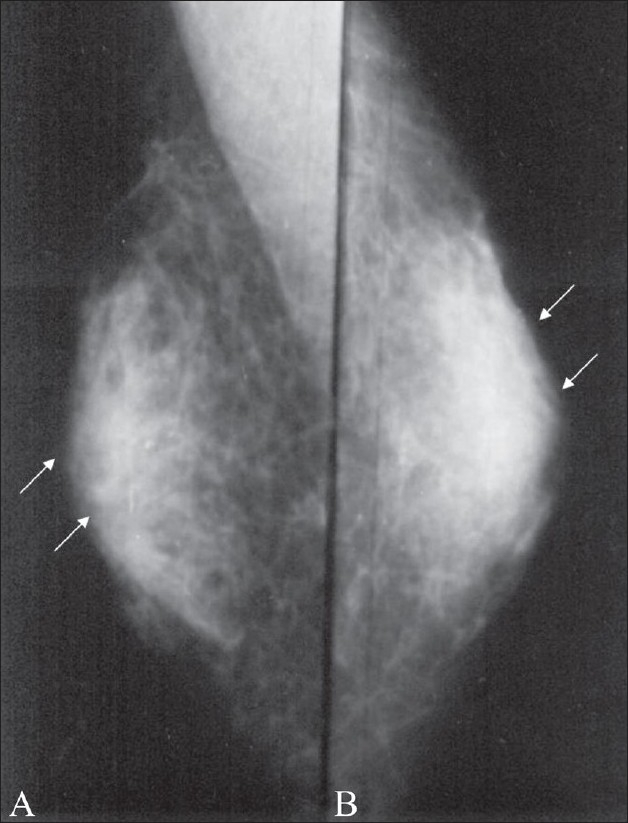

# Breast — Diagnostic Imaging, Benign vs Malignant, BI-RADS

Breast imaging is a triple-assessment discipline (clinical, imaging, pathology) where the radiologist's job is to detect a lesion, characterise it as benign or suspicious using a structured lexicon, assign a BI-RADS category that dictates management, and recommend the next step (follow-up, short-interval surveillance, or biopsy). Get the lexicon and the category-to-management mapping right and most viva answers fall into place.

## 1. Classification / enumeration framework (learn this first)

### 1.1 ACR BI-RADS assessment categories
The Breast Imaging Reporting and Data System (American College of Radiology) is the backbone of every breast report. Every examination ends in a single final category with a defined management implication.

| Category | Meaning | Management | Likelihood of malignancy |
|---|---|---|---|
| 0 | Incomplete — need additional imaging or prior comparison | Recall for further workup (spot/magnification views, US, retrieve priors) | N/A (assessment not yet complete) |
| 1 | Negative | Routine screening | Essentially 0% |
| 2 | Benign finding | Routine screening | Essentially 0% |
| 3 | Probably benign | Short-interval follow-up (commonly 6 months, then periodic) | Greater than 0% but not more than 2% (verify exact value) |
| 4 | Suspicious | Tissue diagnosis (biopsy) | More than 2% up to less than 95%; subdivided 4A/4B/4C (low/moderate/high) (verify exact subcategory cut-offs) |
| 5 | Highly suggestive of malignancy | Tissue diagnosis; appropriate action | At least 95% (verify exact value) |
| 6 | Known biopsy-proven malignancy | Appropriate action (e.g. treatment planning, neoadjuvant response) | Histologically proven |

Key teaching points: Category 0 is an *incomplete* assessment, not a benign/malignant statement — it is used at screening when more information is required. Category 3 carries a duty of short-interval surveillance and should not be over-used; a true category 3 lesion (e.g. a probable fibroadenoma, a focal asymmetry that is non-palpable, a solitary group of round/punctate calcifications) is expected to remain stable. Category 4 is deliberately broad and is sub-divided 4A, 4B, 4C to convey graded suspicion to the clinician and pathologist. Category 6 is reserved for an already-biopsy-proven cancer being imaged again (staging, neoadjuvant monitoring).

### 1.2 The descriptor lexicon (what you actually report)
- **Masses** — described by *shape* (oval, round, irregular), *margin* (circumscribed, obscured, microlobulated, indistinct, spiculated) and *density* (relative to fibroglandular tissue: high, equal, low, fat-containing).
- **Calcifications** — *typically benign* (skin, vascular, coarse/popcorn, large rod-like, round, rim/eggshell, dystrophic, milk-of-calcium, suture) vs *suspicious morphology* (amorphous, coarse heterogeneous, fine pleomorphic, fine linear or fine-linear-branching) plus *distribution* (diffuse, regional, grouped/clustered, linear, segmental — segmental and linear distributions raise concern).
- **Architectural distortion** — no definite mass but the parenchyma is distorted/spiculated; suspicious unless explained by prior surgery/biopsy.
- **Asymmetries** — asymmetry, global asymmetry, focal asymmetry, developing asymmetry (a new or enlarging focal asymmetry is suspicious).
- **Associated features** — skin/nipple retraction, skin thickening, trabecular thickening, axillary adenopathy, architectural distortion.

### 1.3 Breast composition (density)
Reported in four qualitative categories: (a) almost entirely fatty; (b) scattered fibroglandular density; (c) heterogeneously dense (may obscure small masses); (d) extremely dense (lowers mammographic sensitivity). Dense breasts both reduce sensitivity and are an independent risk factor — a reason to consider supplemental US/MRI.

## 2. Modality-wise approach

For breast disease, mammography and ultrasound dominate; CT has essentially no primary diagnostic role; MRI is a powerful problem-solving and screening adjunct; nuclear medicine is niche. Order below follows XR -> US -> CT -> MRI -> nuclear.

### 2.1 Mammography (X-ray)
Mammography is the only modality proven to reduce breast-cancer mortality through screening. Standard screening uses two views per breast: the **craniocaudal (CC)** and the **mediolateral oblique (MLO)**. The MLO is angled along the pectoral muscle and is the single most informative view because it images the greatest volume of breast and the axillary tail; an adequate MLO shows pectoral muscle down to or below the level of the posterior nipple line with the inframammary fold open. The CC images the medial tissue well. Supplementary views include true lateral (mediolateral / lateromedial — used to triangulate a lesion and to demonstrate milk-of-calcium layering), spot compression (to spread out tissue and confirm or dismiss a summation/asymmetry), magnification views (to characterise calcification morphology and number), exaggerated CC, and the Cleopatra/axillary tail view.

**Digital breast tomosynthesis (DBT)** acquires multiple low-dose projections through an arc and reconstructs thin slices, reducing the tissue-superimposition that both hides cancers and creates false "summation" asymmetries. It improves cancer detection and reduces recall rates, and is particularly useful in dense breasts and for confirming architectural distortion.

**Mammographic malignant signs:** a **spiculated mass** (radiating spicules, often with associated architectural distortion) is the classic malignant mass; an irregular shape with indistinct or spiculated margins and high density is suspicious. **Pleomorphic, fine-linear or fine-linear-branching (casting) microcalcifications**, especially in a linear or segmental distribution, suggest ductal carcinoma in situ or invasive disease. **Architectural distortion** without a prior surgical explanation, and a **new/developing focal asymmetry**, are also suspicious. Secondary signs: skin/nipple retraction, skin thickening, and abnormal axillary nodes (rounded, dense, loss of fatty hilum).

**Mammographic benign signs:** a **circumscribed, oval mass** (e.g. cyst, fibroadenoma); **coarse "popcorn" calcification** of an involuting fibroadenoma; **rim / eggshell** calcification (fat necrosis, oil cyst, cyst wall); **vascular (parallel tram-track) calcification**; **large rod-like (secretory)** calcifications of duct ectasia; **dystrophic** post-surgical/post-radiotherapy calcification; **milk-of-calcium** which layers in dependent fashion (teacup appearance on the true lateral view); and a **fat-containing (lucent or mixed-density) mass** such as a lipoma, oil cyst, hamartoma or galactocele — fat density is reassuring for benignity.

### 2.2 Ultrasound
US is the primary tool for characterising a palpable lump (especially in younger/dense breasts), distinguishing cystic from solid, guiding biopsy, and evaluating the axilla. A simple anechoic, thin-walled, well-circumscribed lesion with posterior acoustic enhancement and no internal flow is a benign cyst (BI-RADS 2). For solid masses, the lexicon mirrors mammography.

**Benign US features:** **wider-than-tall (parallel)** orientation, **circumscribed** margins, oval/round shape, gentle macrolobulation (up to a few lobulations), homogeneous hypo/iso-echogenicity, and either no posterior feature or posterior enhancement. A classic fibroadenoma is oval, parallel, circumscribed, hypoechoic and homogeneous.

**Malignant US features:** **taller-than-wide (not-parallel)** orientation, **spiculated, angular, microlobulated or indistinct margins**, marked hypoechogenicity, **posterior acoustic shadowing**, an echogenic halo/rim, internal calcifications, architectural distortion, a thickened/echogenic surrounding rim, ductal extension, and increased internal vascularity on Doppler. Suspicious axillary nodes show cortical thickening, loss of the fatty hilum and a rounded shape.

**Elastography** adds stiffness information — malignant lesions are typically stiffer (harder) than benign lesions; strain or shear-wave elastography can raise or lower the level of suspicion as an adjunct, but it supplements rather than replaces the B-mode (greyscale) lexicon (do not over-rely on a single elastography number — verify local thresholds).

### 2.3 CT
CT has no role in primary breast lesion characterisation or screening. Its breast-related value is incidental (an enhancing breast mass found on a chest CT warrants dedicated workup) and in staging of known advanced cancer (chest/abdomen/pelvis for distant metastasis). Do not propose CT to "characterise a breast lump."

### 2.4 MRI
Dynamic contrast-enhanced breast MRI is the most sensitive modality for invasive cancer but has lower specificity, so it is targeted rather than universal. Recognised **indications** include: screening of high-risk women (e.g. known BRCA mutation carriers and other high lifetime-risk groups — verify local risk thresholds); assessing **extent of disease** and multifocal/multicentric/contralateral disease in newly diagnosed cancer; monitoring **response to neoadjuvant chemotherapy**; evaluating **silicone implant integrity** (using silicone-sensitive sequences — the "linguine sign" of intracapsular rupture); investigating an **occult primary** presenting with axillary nodal metastasis; and problem-solving equivocal conventional findings or suspected recurrence/scar.

Lesions are analysed by **morphology** (mass: shape/margin/internal enhancement; non-mass enhancement: distribution and internal pattern — segmental or clumped/clustered-ring patterns are concerning) and by **kinetics** of enhancement over time, summarised as a time-signal-intensity curve:
- **Type I (persistent / progressive):** signal keeps rising over the delayed phase — most often benign.
- **Type II (plateau):** initial rise then a flat plateau — intermediate/indeterminate.
- **Type III (washout):** rapid initial uptake then a fall in signal — most suspicious for malignancy.

Curve type complements but never overrides morphology; a morphologically suspicious mass with a type I curve is still biopsied.

### 2.5 Nuclear medicine
Niche roles: molecular breast imaging / breast-specific gamma imaging (Tc-99m sestamibi) as a functional adjunct in selected dense-breast or problem-solving settings; FDG PET-CT for staging and treatment response in advanced/recurrent disease and for distant metastasis (not for primary lesion characterisation or screening). Sentinel-node lymphoscintigraphy guides surgical nodal sampling.

## 3. Differentials and comparison tables

### 3.1 Benign vs malignant — quick reference

| Feature | Benign | Malignant |
|---|---|---|
| Mass margin (XR/US) | Circumscribed | Spiculated / indistinct / microlobulated |
| Mass shape | Oval, round | Irregular |
| US orientation | Wider-than-tall (parallel) | Taller-than-wide |
| Posterior US feature | Enhancement (or none) | Shadowing |
| Calcification morphology | Popcorn, eggshell, vascular, rod-like, milk-of-calcium | Fine pleomorphic, fine-linear-branching (casting), amorphous |
| Calcification distribution | Diffuse, scattered | Linear, segmental, clustered |
| Density (XR) | Fat-containing / low | High |
| MRI curve | Type I persistent | Type III washout |
| Elastography | Soft | Stiff/hard |
| Associated signs | None | Skin/nipple retraction, skin thickening, suspicious nodes |

### 3.2 Approach to a breast lump by age
Triple assessment in all; imaging first-line differs by age because of breast density and pre-test probability.

| Age group | First-line imaging | Reasoning / common pathology |
|---|---|---|
| Under ~30 (and pregnant/lactating) | Ultrasound first | Dense glandular breast; commonest lesion fibroadenoma; avoid radiation; mammography added only if US/clinical suspicion of malignancy |
| ~30-39 | Ultrasound, with mammography added if suspicious | Transitional; density still often high |
| 40 and over | Mammography (+ targeted US) | Higher cancer probability; mammographic sensitivity improves as breast involutes |

A simple anechoic cyst needs no further action (aspirate only if symptomatic/complicated). A solid mass that is not classically benign on US, any suspicious mammographic feature, or a clinically suspicious lump despite "negative" imaging, proceeds to image-guided **core biopsy** (the "miss" of benign imaging with malignant clinical findings is a classic exam trap — concordance of triple assessment is required).

### 3.3 Male breast
Gynaecomastia is benign proliferation of the male ductal/stromal tissue, presenting as a typically tender, **subareolar, often bilateral** finding. Mammographically it shows a flame-shaped or fan-like density radiating from the nipple into the breast (nodular and dendritic patterns); it lacks the discrete features of malignancy. Causes include physiological (puberty, senescence), drugs, liver disease, hypogonadism and rarely hormone-secreting tumours. **Male breast cancer** is rare but, in contrast, is usually a **hard, eccentric (not subareolar), unilateral** mass with malignant margins, calcifications, and skin/nipple changes — eccentric location and malignant morphology distinguish it from gynaecomastia. Pseudogynaecomastia (fatty enlargement) shows only fat without glandular density.

## 4. Pearls and buzzwords
- "Wider-than-tall = benign; taller-than-wide = malignant" (US orientation).
- "Posterior enhancement reassures; posterior shadowing worries."
- "Popcorn = involuting fibroadenoma; tram-track = vascular; eggshell/rim = fat necrosis or cyst; milk-of-calcium teacup on the lateral; rod-like = secretory duct ectasia."
- "Fine-linear-branching / casting calcifications in a segmental distribution = think DCIS."
- "Type III washout = most suspicious MRI curve; type I persistent = usually benign; morphology beats kinetics."
- "Linguine sign = intracapsular silicone implant rupture on MRI."
- BI-RADS 0 means incomplete (need more imaging/priors), NOT benign.
- BI-RADS 3 = short-interval follow-up; 4 = biopsy; 5 = highly suggestive (act); 6 = known cancer.
- MLO is the workhorse view; check pectoral muscle reaches the posterior nipple line and the inframammary fold is open for adequacy.
- Young/pregnant/lactating lump -> ultrasound first; over 40 -> mammography first.
- Gynaecomastia is subareolar and often bilateral; male breast cancer is eccentric and unilateral.
- Imaging-clinical discordance overrules a benign read — biopsy if triple assessment is not concordant.

## 5. What to draw
- The BI-RADS 0-6 ladder with the management arrow beside each (recall / routine / routine / short-interval follow-up / biopsy / act / treat).
- CC and MLO positioning diagram, marking pectoral muscle, posterior nipple line and inframammary fold for MLO adequacy.
- Two annotated masses side by side: oval-parallel-circumscribed (benign) vs taller-than-wide-spiculated-shadowing (malignant US).
- The three MRI kinetic curves on one signal-vs-time axis (I persistent, II plateau, III washout).
- A small calcification gallery: popcorn, vascular tram-track, eggshell, milk-of-calcium teacup, fine-linear-branching.
- Gynaecomastia flame-shaped subareolar density vs eccentric malignant mass.

## 6. Further reading
- ACR BI-RADS Atlas (mammography, ultrasound and MRI lexicons and assessment categories) — primary reference for the category framework and descriptors.
- ACR Appropriateness Criteria — breast (palpable mass; breast cancer screening; evaluation of nipple discharge).
- Standard radiology texts: Sutton, Grainger & Allison, and a dedicated breast imaging text (e.g. Kopans, Breast Imaging) for signs and worked examples.
- Note: confirm exact malignancy percentages for categories 3/4/5 and BI-RADS 4 subcategory cut-offs against the current edition of the BI-RADS Atlas before quoting numbers in a viva.
