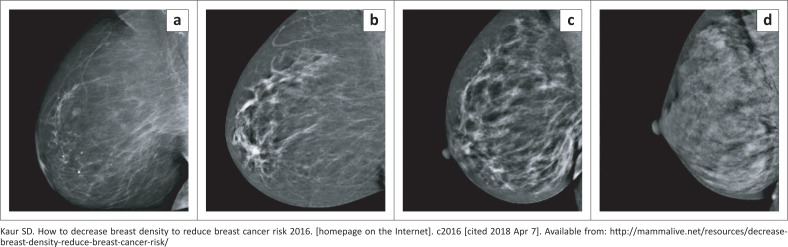
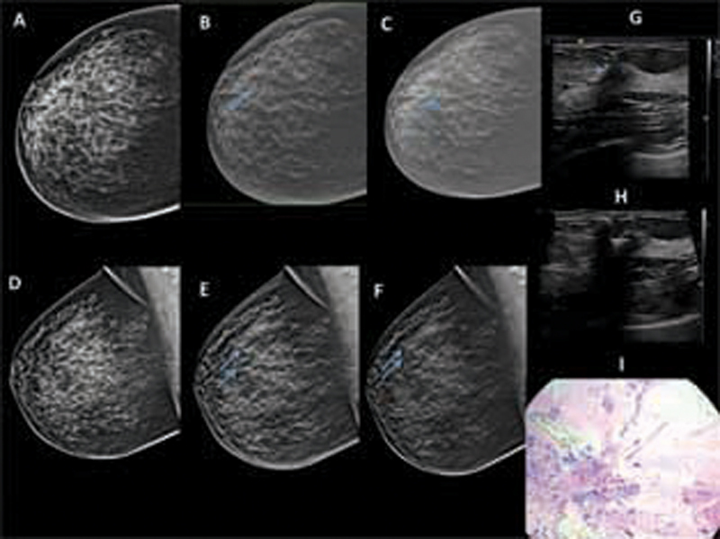
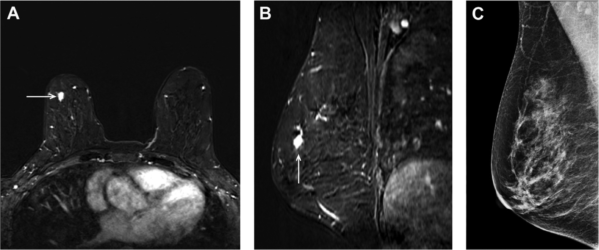
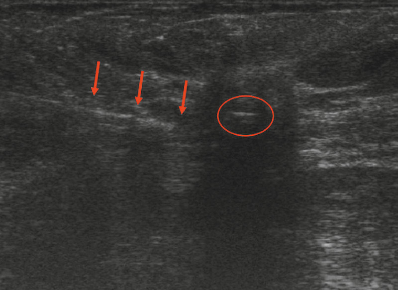

# Breast — Screening, Tomosynthesis & Intervention

A high-yield revision read covering the principles of mammographic screening, the role and physics rationale of digital breast tomosynthesis (DBT), breast density and its impact on sensitivity, supplemental screening, and the full spectrum of image-guided breast intervention anchored to the triple assessment and concordance framework.

## Framework first — how to organise the topic

Before modality detail, fix the four conceptual pillars in your head; almost every exam answer is a recombination of these:

1. **Screening principles** — who (target population/age), how often (interval), with what (modality), and the trade-offs (sensitivity vs recall vs interval cancers vs overdiagnosis).
2. **Breast density** — the dominant variable that degrades mammographic sensitivity and drives supplemental screening decisions.
3. **Tomosynthesis (DBT)** — a problem-solving and screening tool whose entire value proposition is *reducing tissue-overlap masking*.
4. **Image-guided intervention** — sampling (biopsy) and localisation, always interpreted within **triple assessment** and judged by **concordance**.

### Enumeration scaffolds to reproduce in an answer

**BI-RADS breast density categories (qualitative — describe, do not over-commit to exact percentages):**

| Category | Descriptor | Implication |
|---|---|---|
| a | Almost entirely fatty | High mammographic sensitivity |
| b | Scattered fibroglandular density | Sensitivity largely preserved |
| c | Heterogeneously dense | Dense tissue may obscure small masses |
| d | Extremely dense | Sensitivity markedly reduced; masking risk highest |

Density is a *qualitative, perceptual* assessment of fibroglandular tissue extent and its potential to mask findings — it is **not** the same as the BI-RADS final assessment category (0–6).

**BI-RADS final assessment categories (structure, not numeric thresholds):**

| Category | Meaning | Action |
|---|---|---|
| 0 | Incomplete | Needs additional imaging / prior comparison |
| 1 | Negative | Routine screening |
| 2 | Benign | Routine screening |
| 3 | Probably benign | Short-interval follow-up (low malignancy likelihood) |
| 4 | Suspicious (often subdivided 4a/4b/4c) | Tissue diagnosis (biopsy) |
| 5 | Highly suggestive of malignancy | Biopsy; appropriate action |
| 6 | Known biopsy-proven malignancy | Appropriate management |

**Triple assessment (the governing concept):**

1. **Clinical** examination (history + palpation).
2. **Imaging** (mammography ± US ± MRI, age-appropriate).
3. **Pathology** (image-guided needle biopsy — core preferred over FNAC for definitive histology and receptor status).

A lesion is worked up by combining all three; **concordance** is the explicit judgement that the histology result *agrees* with the imaging suspicion.

## Modality-wise discussion

### Mammography / X-ray (the screening backbone)

Full-field digital mammography (FFDM) is the established population screening tool. Standard projections are the **craniocaudal (CC)** and **mediolateral oblique (MLO)** views; the MLO is the single most informative view because it includes the axillary tail and pectoral muscle. Screening detects malignancy primarily through **masses, architectural distortion, asymmetries, and microcalcifications** — the latter being the signature of many in-situ and early invasive cancers and the principal reason X-ray remains irreplaceable (US and MRI are far less reliable for fine calcification).

**Screening principles.** Mammographic screening aims to detect cancer before it is clinically apparent, shifting stage at diagnosis and reducing mortality. Programmes define a **target age range** and a **screening interval** (commonly every two years in organised programmes; some recommend annual screening in higher-risk or younger cohorts — *verify exact age/interval for the jurisdiction the question implies*). Key trade-offs to articulate: longer intervals increase **interval cancers**; broader/younger screening increases **recall, false positives and overdiagnosis**. Examiners reward candidates who frame screening as a *balance*, not an absolute good.

**The density problem.** Sensitivity is high in fatty breasts but falls in **heterogeneously dense (c)** and **extremely dense (d)** breasts because cancer (soft-tissue density) and normal fibroglandular tissue have similar attenuation — a cancer can be *masked* by overlapping dense tissue. Dense tissue is also an independent (modest) risk factor for breast cancer. This dual effect — reduced sensitivity *and* increased risk — is the rationale for supplemental screening.

### Digital breast tomosynthesis (DBT)

DBT acquires multiple low-dose projections across a limited arc as the tube moves, then reconstructs thin (~1 mm) tomographic slices through the breast. Its entire clinical value follows from one principle: by separating overlapping fibroglandular tissue plane-by-plane, it **reduces masking and reduces summation (pseudo) lesions**.

Consequences that the exam wants stated:
- **Improved cancer detection**, particularly of masses and architectural distortion, most evident in dense breasts.
- **Reduced recall rate**, because superimposition artefacts that mimic masses on 2D are resolved as normal overlapping tissue on tomographic slices.
- DBT is frequently combined with a **synthesised 2D image** reconstructed from the tomographic data, avoiding a separate 2D acquisition and limiting dose.
- DBT is excellent for **masses and distortion**; for **microcalcification** assessment, conventional/synthesised 2D mammography (with magnification views) remains central — a useful caveat to include.

### Ultrasound (problem-solving and supplemental screening)

US is the principal adjunct for **dense breasts** and the first-line imaging modality in **younger or pregnant/lactating women** and for any palpable lump. It distinguishes **cystic from solid**, characterises masses (shape, margin, orientation, posterior features), and — critically — is the **default real-time guidance for biopsy** of sonographically visible lesions. Supplemental whole-breast US in dense breasts detects additional, mammographically occult cancers but increases false positives and biopsies. US has no ionising radiation and is widely available, but is operator-dependent and insensitive to many microcalcifications.

### CT

CT has **no role in breast cancer screening or primary lesion characterisation**. It appears only in **staging** of advanced/known breast cancer (distant metastatic disease, nodal assessment beyond the axilla) and as an incidental detector of breast lesions on scans performed for other reasons. State this limitation explicitly rather than forcing CT findings.

### MRI (highest sensitivity; the high-risk and dense-breast tool)

Contrast-enhanced breast MRI is the **most sensitive** modality for invasive breast cancer and is the supplemental screening tool of choice for **high-risk women** (e.g. strong family history / known pathogenic mutation carriers — *describe qualitatively; verify specific risk thresholds*). It relies on **dynamic contrast enhancement**: malignant lesions tend to show rapid early enhancement with washout, assessed via morphology plus kinetic curves. Indications also include extent-of-disease assessment, occult primary with axillary nodal disease, implant integrity, and treatment-response monitoring. Limitations: high sensitivity with comparatively **lower specificity** (benign enhancement causes false positives), cost/access, gadolinium and timing considerations, and the need for a biopsy pathway for MRI-only lesions.

### Nuclear medicine

Limited role. Molecular breast imaging / breast-specific gamma imaging exists as a niche supplemental option in some settings, and **FDG-PET/CT** contributes to **staging and recurrence** of advanced disease rather than screening. Do not overstate; keep to staging/problem-solving context.

## Image-guided intervention

Intervention sits at the pathology limb of triple assessment. Choose the guidance modality by **how the lesion is best seen**.

- **US-guided core biopsy** — first choice whenever the lesion is sonographically visible (most masses, complicated cysts, suspicious nodes). Real-time, no radiation, fast. **Core needle biopsy** (often vacuum-assisted for larger samples) is preferred over **FNAC** because it yields histological architecture, distinguishes invasive from in-situ disease, and provides receptor status.
- **Stereotactic (X-ray–guided) biopsy** — the technique of choice for **microcalcifications** and other lesions seen only on mammography (not on US). Vacuum-assisted devices improve calcification yield; **specimen radiography** confirms that representative calcifications were retrieved.
- **MRI-guided biopsy** — reserved for lesions seen **only on MRI** (no mammographic or sonographic correlate). Performed where a "second-look" targeted US fails to identify the lesion.
- **Clip / marker placement** — a marker clip is deployed at the biopsy site so the lesion can be relocated later (especially if it is small, fully sampled, or expected to regress with neoadjuvant therapy).
- **Localisation of non-palpable lesions before surgery** — **wire (hookwire) localisation** has long been standard; **seed-based** techniques (e.g. radioactive or magnetic/RFID seeds) and other wire-free markers are increasingly used and decouple placement from theatre scheduling (*describe by principle; verify device specifics locally*).

**Concordance — the make-or-break concept.** After any biopsy, the radiologist must judge whether the **histology is concordant** with the imaging suspicion:
- **Concordant benign** → routine or short-interval follow-up.
- **Discordant** (e.g. BI-RADS 5 imaging but "benign" core) → assume sampling error; **repeat biopsy or proceed to excision**. Never accept a benign result that does not explain the imaging.
- Certain "B3"/borderline lesions (e.g. atypia, radial scar, papillary lesions) may warrant **excision or vacuum-assisted excision** regardless of a "benign" core — high-yield to mention.

## Differentials & comparison tables

**Supplemental screening modality selection:**

| Scenario | Preferred supplemental tool | Rationale |
|---|---|---|
| Dense breasts, average risk | Whole-breast US (± DBT) | Detects mammographically masked cancers; no radiation |
| High risk (familial / mutation carrier) | Contrast-enhanced MRI | Highest sensitivity for invasive disease |
| Young / pregnant / lactating, symptomatic | US first | Avoids radiation; characterises palpable lump |
| Microcalcification assessment | Mammography (magnification) | US/MRI unreliable for fine calcification |

**Biopsy guidance selection:**

| Lesion visibility | Guidance | Notes |
|---|---|---|
| Seen on US | US-guided core | Fastest, real-time, no radiation |
| Microcalcifications / mammography-only | Stereotactic, vacuum-assisted | Specimen radiograph mandatory |
| MRI-only (no US/mammo correlate) | MRI-guided | After failed second-look US |

## Pearls & buzzwords

- "**Masking by overlapping dense tissue**" is the unifying phrase linking density, reduced sensitivity, and the DBT solution.
- DBT = **fewer recalls + more cancers detected**, strongest benefit in **dense breasts**; pair with **synthesised 2D** to limit dose.
- **MLO** view shows the axillary tail and pectoral muscle — best single screening view.
- **Core > FNAC** for definitive histology, invasive-vs-in-situ distinction, and receptor status.
- **Stereotactic = calcifications**; **specimen radiography** proves the calcs were sampled.
- **Concordance** is a radiologist's responsibility: a benign result that does not explain a suspicious image is **discordant** until proven otherwise.
- MRI = **most sensitive, less specific**; tool for **high-risk screening** and disease extent.
- Density is a **risk factor** *and* a **sensitivity-limiter** — the double hit.

## What to draw

- A 2×2 of **density vs conspicuity**: fatty breast with an obvious mass; dense breast with the same mass masked.
- A **DBT acquisition diagram**: tube sweeping a limited arc producing reconstructed thin slices, with a summation pseudo-lesion on 2D dissolving on slices.
- The **triple assessment triangle** (clinical–imaging–pathology) with "concordance" written across the centre.
- A **decision tree** for biopsy guidance: "Seen on US? → US core. Calcs only? → stereotactic. MRI only? → MRI-guided," ending in a concordance check box.

## Further reading

- ACR BI-RADS Atlas (mammography, US, MRI lexicons and assessment categories).
- A standard breast imaging text (e.g. a recognised breast radiology reference) for screening principles, DBT physics, and intervention technique.
- Society/programme guidance on screening age and interval, and on supplemental screening for dense breasts and high-risk women (confirm the version relevant to your jurisdiction).
