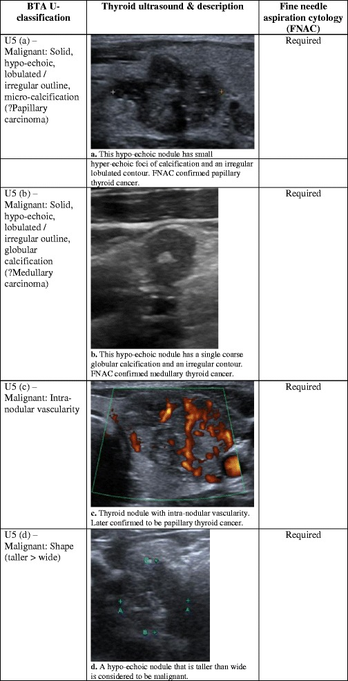
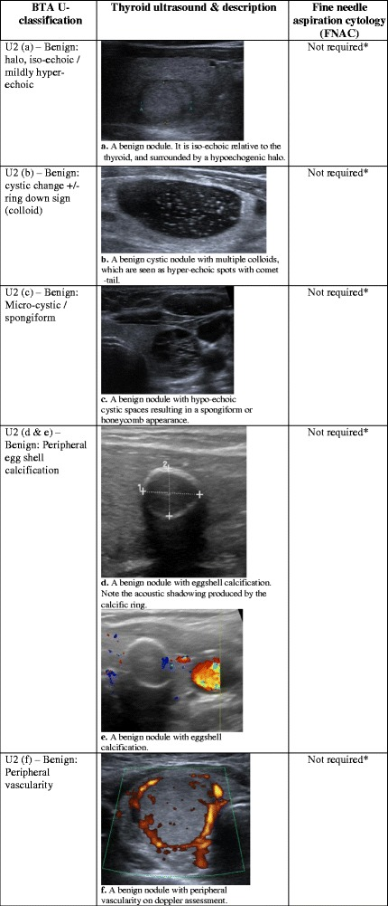
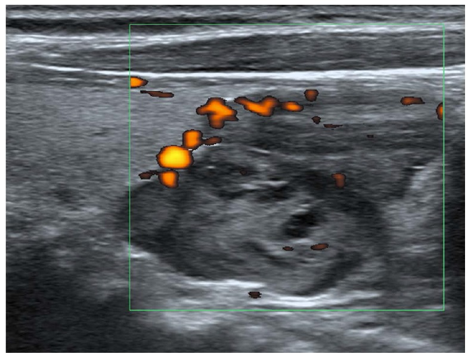
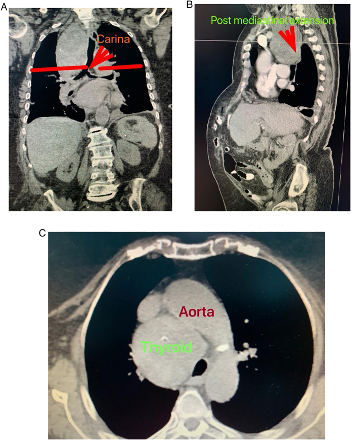
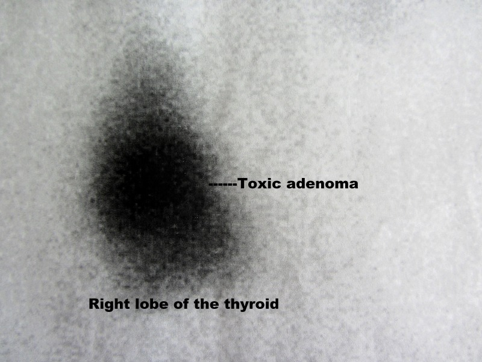
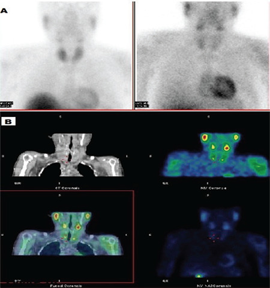

# Thyroid & Parathyroid Imaging

Thyroid imaging is dominated by ultrasound for nodule characterisation, with scintigraphy reserved for functional questions (hyper-/hypofunctioning nodules, diffuse disease) and CT/MRI for retrosternal extension and staging. Parathyroid imaging is a localisation problem in biochemically proven hyperparathyroidism, combining ultrasound, dual-phase sestamibi and 4D-CT. This chapter builds the classification frameworks first (ACR TI-RADS, cancer types, parathyroid localisation), then walks modality by modality.

---

## 1. Classification and enumeration frameworks (learn these first)

### 1.1 The ACR TI-RADS framework (Thyroid Imaging Reporting and Data System)

ACR TI-RADS is a points-based system. Each nodule is scored across **five US feature categories**; points are summed; the total places the nodule in a TR level (TR1-TR5); the TR level plus the maximum nodule diameter determines whether FNA or follow-up is recommended.

The five categories and their point logic (each nodule gets one score from each category, except echogenic foci where points are additive):

1. **Composition** — cystic or almost completely cystic (0), spongiform (0), mixed cystic and solid (1), solid or almost completely solid (2).
2. **Echogenicity** — anechoic (0), hyperechoic or isoechoic (1), hypoechoic (2), very hypoechoic (3).
3. **Shape** — wider-than-tall (0), **taller-than-wide** (3). Assessed on the transverse plane.
4. **Margin** — smooth (0), ill-defined (0), lobulated or irregular (2), extrathyroidal extension (3).
5. **Echogenic foci** (additive across types) — none or large comet-tail artefact (0), macrocalcifications (1), peripheral/rim calcifications (2), **punctate echogenic foci** (3, suspicious for psammomatous microcalcification).

**Summing points to a TR level (standard ACR 2017 structure):**

| Total points | TI-RADS level | Risk descriptor |
|---|---|---|
| 0 | TR1 | Benign |
| 2 | TR2 | Not suspicious |
| 3 | TR3 | Mildly suspicious |
| 4-6 | TR4 | Moderately suspicious |
| 7 or more | TR5 | Highly suspicious |

**FNA / follow-up size thresholds (ACR 2017):**

| Level | FNA recommended at | US follow-up at |
|---|---|---|
| TR1 | No FNA | None |
| TR2 | No FNA | None |
| TR3 | >= 2.5 cm | >= 1.5 cm |
| TR4 | >= 1.5 cm | >= 1.0 cm |
| TR5 | >= 1.0 cm | >= 0.5 cm |

(These cut-offs are the published ACR 2017 values; confirm against the current ACR white paper for any local protocol drift.)

Practical reading rule: spongiform and purely cystic nodules score 0 in composition and are almost always benign. The features that *drive* a nodule up to TR4/TR5 are solid composition, marked hypoechogenicity, taller-than-wide shape, irregular margin and punctate echogenic foci.

### 1.2 Benign vs malignant nodule features

| Feature | Suggests malignant | Suggests benign |
|---|---|---|
| Composition | Solid | Cystic / spongiform |
| Echogenicity | Marked hypoechogenicity | Iso/hyperechoic, anechoic |
| Shape (transverse) | Taller-than-wide (AP > transverse) | Wider-than-tall |
| Margin | Irregular, lobulated, spiculated; extrathyroidal extension | Smooth, well-defined; thin complete halo |
| Echogenic foci | Punctate (microcalcification — psammoma bodies of papillary cancer) | Large comet-tail (colloid); none |
| Vascularity | Intranodular (type) chaotic flow | Perinodular |
| Number | Solitary dominant solid | Multiple, similar appearance |

Extrathyroidal extension (loss of the thyroid capsule line, tumour abutting/invading strap muscles, trachea or recurrent laryngeal nerve groove) is a hard sign of aggressive disease and upstages.

### 1.3 Thyroid cancer types

| Type | Frequency / behaviour | Spread | Imaging note |
|---|---|---|---|
| Papillary | Most common; good prognosis | Lymphatic — cervical nodes (often levels III/IV/VI) | Microcalcifications, cystic nodal metastases, taller-than-wide |
| Follicular | Second; older patients | Haematogenous — lung, bone | US cannot reliably separate follicular adenoma from carcinoma (capsular/vascular invasion is histological) |
| Medullary | C-cell origin; calcitonin; MEN2 association | Lymphatic and haematogenous | Coarse calcification; check for phaeochromocytoma if MEN |
| Anaplastic | Elderly; aggressive, poor prognosis | Rapid local invasion + nodal + distant | Large, invasive, necrotic mass; airway compromise |
| Lymphoma | Background Hashimoto | — | Bulky hypoechoic thyroid; consider in rapidly enlarging Hashimoto gland |

**Nodal metastases on US (papillary):** rounded shape (loss of long-to-short axis ratio), loss of fatty hilum, cystic change, punctate calcification, peripheral/chaotic vascularity, hyperechoic foci within the node. Level VI (central/paratracheal) and lateral levels II-IV are the typical chains.

### 1.4 Parathyroid adenoma localisation (in proven primary hyperparathyroidism)

Localisation is undertaken **after** biochemical diagnosis (raised calcium with inappropriately raised PTH); imaging does not diagnose the disease, it guides minimally invasive parathyroidectomy. The three workhorses:

- **Ultrasound** — first line for accessible neck disease.
- **Tc-99m sestamibi (MIBI), dual-phase +/- SPECT/CT** — functional localisation, good for ectopic glands.
- **4D-CT** — multiphase CT for re-operative or discordant/occult cases.

Most cases are a single adenoma (~85%); the remainder are multigland hyperplasia or, rarely, carcinoma. Common ectopic locations: retro-oesophageal, intrathyroidal, undescended (high near carotid bifurcation) and mediastinal (within thymus).

---

## 2. Modality-by-modality findings

US dominates thyroid and parathyroid work; there is essentially no plain-film role except incidental tracheal deviation, so the order below runs US -> CT -> MRI -> nuclear, with XR noted only briefly.

### 2.1 Plain radiograph (XR)
Limited and incidental. A large goitre may show tracheal deviation/narrowing on a chest or neck film, retrosternal soft-tissue widening of the superior mediastinum, and occasionally coarse curvilinear calcification. Not used for nodule work-up.

### 2.2 Ultrasound (US) — the core modality

**Technique.** High-frequency linear transducer (typically 7-15 MHz). Patient supine, neck extended on a pillow. Scan both lobes and isthmus in transverse and longitudinal planes; measure each nodule in three dimensions. Assess echogenicity relative to adjacent strap muscle and normal thyroid parenchyma. Add colour/power Doppler for vascularity and spectral interrogation where relevant. Always sweep the central and lateral neck nodal stations for adenopathy.

**Approach to a thyroid nodule.** Characterise composition, echogenicity, shape (taller-than-wide on transverse), margin and echogenic foci -> assign TI-RADS points -> derive TR level -> apply the size threshold for FNA or follow-up. Report the dominant/most suspicious nodule and document all nodules meeting thresholds, plus any suspicious nodes.

**Diffuse disease on US.**
- *Graves disease* — diffusely enlarged, hypoechoic gland with markedly increased, chaotic colour Doppler flow ("thyroid inferno").
- *Hashimoto thyroiditis* — heterogeneous, hypoechoic gland with coarsened echotexture and hypoechoic micronodulation separated by echogenic fibrous septa ("giraffe-skin" / pseudonodular pattern); may enlarge then atrophy over time; carries a long-term lymphoma risk.
- *Subacute (de Quervain) thyroiditis* — ill-defined hypoechoic areas, painful gland, reduced flow in the acute phase.

**Parathyroid on US.** A normal parathyroid is usually not seen. An adenoma is a well-defined, ovoid, **homogeneously hypoechoic** structure posterior to the thyroid, with a feeding polar vessel/peripheral arc of vascularity on Doppler. Typical sites are posterior to the upper and lower poles. US is operator-dependent and misses mediastinal/retro-oesophageal glands.

### 2.3 CT

**Retrosternal (substernal) goitre.** CT demonstrates continuity of a mediastinal mass with the cervical thyroid, tracheal deviation/compression and narrowing, and extension (most commonly into the anterior superior mediastinum, occasionally posterior). The goitre typically shows heterogeneous attenuation with areas of high baseline density (iodine content), coarse calcification and avid, often heterogeneous, enhancement. Note relationship to the great vessels and degree of airway compromise for surgical planning.

**Caution with iodinated contrast** in suspected hyperthyroidism / if radioiodine therapy is planned — iodine load can preclude subsequent radioiodine for several weeks.

**Cancer staging.** CT neck/chest assesses extrathyroidal extension, airway/oesophageal invasion, nodal disease (central and lateral neck, mediastinum) and pulmonary metastases.

**4D-CT for parathyroid** — multiphasic CT (typically a non-contrast phase plus arterial and delayed/venous phases). A parathyroid adenoma classically shows low attenuation on non-contrast images, **avid early arterial enhancement** and relative **washout** on delayed phase, distinguishing it from lymph nodes (which enhance less avidly and do not wash out) and thyroid tissue. Best for re-operative cases, ectopic glands and when US/MIBI are discordant or negative.

### 2.4 MRI
Second-line/problem-solving. Useful for assessing extent of large or invasive masses, airway and vascular relationships, and retrosternal extension when CT contrast is contraindicated. Goitre/adenoma signal is variable; haemorrhage and cystic change produce mixed signal. Not a routine nodule tool.

### 2.5 Nuclear medicine

**Thyroid scintigraphy (Tc-99m pertechnetate or I-123).** Used to assess *function*, chiefly in a nodule with suppressed TSH (to identify an autonomously functioning "hot" nodule) and in diffuse hyperthyroidism.
- **Hot (hyperfunctioning) nodule** — focal increased uptake with suppression of the remaining gland; an autonomously functioning **toxic adenoma**. Hot nodules are very rarely malignant, so a confirmed hot nodule generally does not need FNA.
- **Cold nodule** — focal absent/reduced uptake; non-functioning. The majority of cold nodules are still benign, but malignancy is concentrated in this group, so cold nodules are characterised/sampled by US-TI-RADS criteria.
- I-123 (and I-131) reflect organification (trapping + binding); Tc-99m pertechnetate reflects trapping only — a small number of nodules can be discordant between the two.

**Diffuse disease on scintigraphy.**
- *Graves* — diffuse, homogeneously increased uptake; elevated radioiodine uptake.
- *Toxic multinodular goitre* — patchy multifocal hot and cold areas.
- *Subacute/silent thyroiditis (thyrotoxic phase)* — **low uptake** despite biochemical thyrotoxicosis (hormone is leaking from damaged follicles, not being newly synthesised) — a key discriminator from Graves.

**Tc-99m sestamibi (MIBI) parathyroid scan — dual-phase technique.** MIBI is taken up by both thyroid and hyperfunctioning parathyroid tissue, but it **washes out of thyroid faster** than from a mitochondria-rich parathyroid adenoma. Early images (~10-15 min) show both; on delayed images (~1.5-3 h) thyroid activity fades while a **focus of retained activity** marks the adenoma. **SPECT/CT** adds anatomical localisation (depth, ectopic/mediastinal glands). Limitations: smaller adenomas, multigland hyperplasia and coexistent thyroid nodules reduce sensitivity.

---

## 3. Differentials and comparison tables

### 3.1 Diffuse hyperthyroidism — US + scintigraphy discriminators

| | Uptake on scintigraphy | US | Clinical clue |
|---|---|---|---|
| Graves | High, diffuse | Enlarged, hypoechoic, "thyroid inferno" | Eye signs, diffuse goitre |
| Toxic MNG | Patchy multifocal | Multinodular gland | Older patient, long-standing goitre |
| Toxic adenoma | Single hot focus | Solitary nodule | Single palpable nodule |
| Thyroiditis (thyrotoxic phase) | Low | Heterogeneous/hypoechoic | Painful (subacute) or post-partum; self-limiting |

### 3.2 Hot vs cold nodule

| | Hot (hyperfunctioning) | Cold (non-functioning) |
|---|---|---|
| Uptake | Increased, suppresses rest of gland | Absent/reduced |
| Malignancy risk | Very low | Higher (most malignancies are cold) |
| Action | Usually no FNA; treat hyperfunction | Characterise on US / TI-RADS, FNA per threshold |

### 3.3 Parathyroid localisation modalities

| Modality | Strength | Weakness |
|---|---|---|
| US | Cheap, no radiation, first line, guides FNA/PTH wash | Operator-dependent; misses mediastinal/retro-oesophageal/intrathyroidal |
| Dual-phase MIBI (+SPECT/CT) | Functional; finds ectopic and mediastinal glands | Lower yield for small adenomas, hyperplasia; thyroid nodules confound |
| 4D-CT | High sensitivity, anatomical roadmap, re-operative cases | Radiation; iodinated contrast; nodal/thyroid confounders |

---

## 4. Pearls and buzzwords
- **"Thyroid inferno"** — Graves hypervascularity on colour Doppler.
- **"Giraffe-skin" / pseudonodular hypoechoic pattern** — Hashimoto thyroiditis; remember the lymphoma association.
- **Taller-than-wide** (AP greater than transverse on the transverse image) — suspicious; growth against tissue planes.
- **Punctate echogenic foci** — psammomatous microcalcification of papillary carcinoma (vs large comet-tail of benign colloid).
- **Cystic cervical node** in a young patient — think papillary carcinoma metastasis.
- **Hot nodule = (almost) never malignant**; malignancy lives among the cold nodules.
- **Low uptake thyrotoxicosis** = thyroiditis (leak) or exogenous/iodine-induced — not Graves.
- **MIBI**: parathyroid retains, thyroid washes out — read the delayed phase.
- **4D-CT adenoma**: low on non-contrast, bright arterial, washes out on delayed.
- Avoid iodinated contrast if radioiodine therapy is being considered.

## 5. What to draw
- A TI-RADS scoring grid: five feature columns with point values, summed to a TR level, with the size-for-FNA thresholds beside TR3/TR4/TR5.
- A thyroid nodule cartoon contrasting a spongiform/benign nodule with a taller-than-wide, hypoechoic, irregular, microcalcified TR5 nodule.
- Dual-phase MIBI timeline: early (thyroid + parathyroid both light up) vs delayed (thyroid washes out, adenoma retained).
- A neck nodal level diagram (II-IV lateral, VI central) marking typical papillary spread.

## 6. Further reading
- ACR TI-RADS White Paper (Tessler et al., JACR 2017) — composition/echogenicity/shape/margin/echogenic foci points and FNA thresholds.
- ATA Management Guidelines for thyroid nodules and differentiated thyroid cancer.
- Society of Radiologists in Ultrasound consensus on thyroid nodules.
- Standard radiology texts (Grainger & Allison; Dahnert) — thyroid scintigraphy, parathyroid localisation and 4D-CT chapters.
