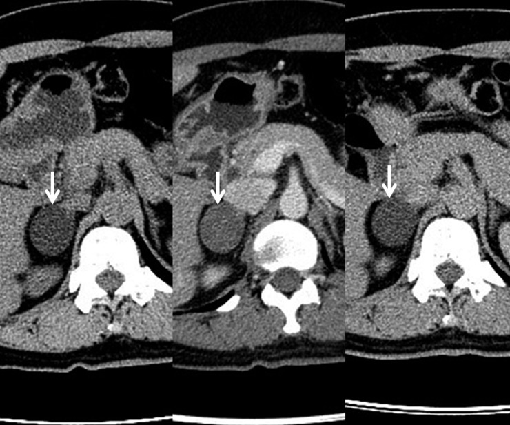
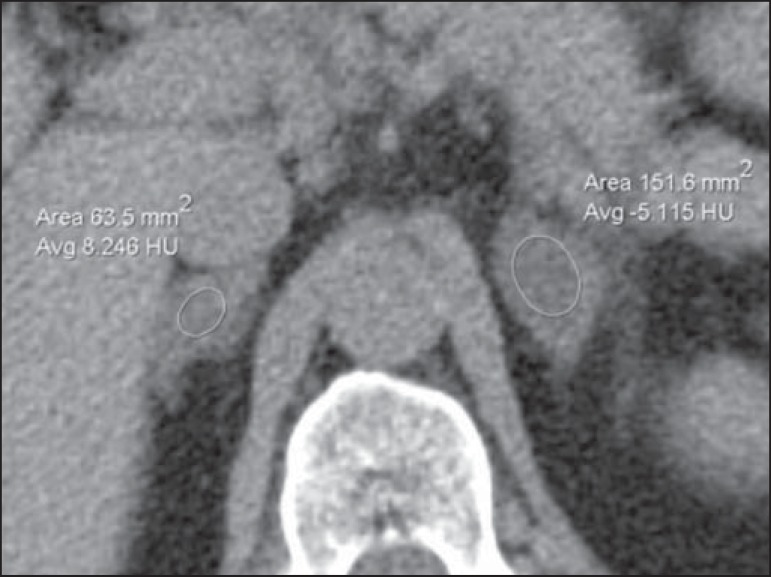
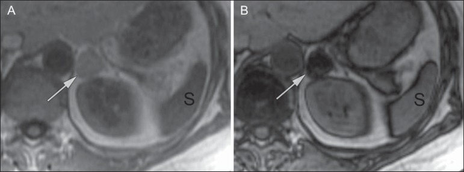
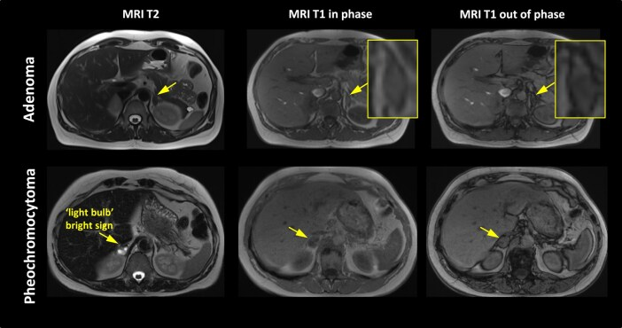

# Adrenal Imaging

The central question for almost every adrenal lesion is binary and clinically driven: is it a benign adenoma that can be left alone, or is it something that needs treatment (malignancy, phaeochromocytoma)? The imaging approach exploits two facts about adenomas — most contain intracellular (microscopic) lipid, and all wash out contrast rapidly — and layers in the biochemical question of whether the lesion is hormonally functional.

## Classification framework

Think of an adrenal mass along two axes that you must answer separately and then combine:

1. **Functional vs non-functional** (a biochemical question, answered by the endocrinologist): does it secrete cortisol (Cushing), aldosterone (Conn), catecholamines (phaeochromocytoma), or sex steroids/androgens? Even an imaging-benign adenoma may be hyperfunctioning and need resection.
2. **Benign vs malignant / which entity** (the imaging question): is it a lipid-rich adenoma, lipid-poor adenoma, myelolipoma, phaeochromocytoma, adrenocortical carcinoma (ACC), metastasis, or haemorrhage?

A practical lesion-based differential:

- **Contains macroscopic (bulk) fat** -> myelolipoma (or rarely a fat-containing metastasis/teratoma).
- **Contains microscopic (intracytoplasmic) lipid** -> lipid-rich adenoma (low unenhanced HU, signal drop on opposed-phase MRI).
- **No lipid but washes out fast** -> lipid-poor adenoma.
- **No lipid, does not wash out** -> indeterminate: phaeochromocytoma, ACC, metastasis, lipid-poor adenoma can overlap here; correlate with size, T2 signal, biochemistry, and a primary tumour history.
- **Very high T2 signal, avid enhancement** -> phaeochromocytoma.
- **Large (>4-6 cm), heterogeneous, necrosis, invasion** -> ACC.
- **Bilateral, history of primary malignancy** -> metastases.
- **Acutely after trauma/stress/anticoagulation, non-enhancing, high attenuation on unenhanced CT** -> haemorrhage.

## Modality-wise findings

### Radiograph (XR)
Plain films have essentially no role in characterising adrenal masses. Occasionally a large calcified mass (old haemorrhage, ganglioneuroma, ACC, or a calcified myelolipoma) or displacement of the kidney/gas pattern is incidentally seen, but cross-sectional imaging is always required.

### Ultrasound (US)
US is operator- and habitus-dependent and is a poor primary tool for the adult adrenal, which is deep and often obscured by bowel gas. It is most useful in two settings: detecting masses in thin patients or children (where neuroblastoma and neonatal adrenal haemorrhage are key), and as the first test that incidentally flags an adrenal mass. A myelolipoma is typically echogenic owing to fat; phaeochromocytoma and ACC are usually heterogeneous; simple cysts are anechoic. US cannot perform washout analysis or lipid quantification, so any solid adrenal mass found on US is referred onward to CT or MRI.

### CT (the workhorse — adrenal protocol)
CT is the dominant modality for adrenal characterisation because it allows both density measurement and quantitative washout. The dedicated adrenal CT protocol has three phases:

1. **Unenhanced**: measure the attenuation (HU) of the lesion through a representative region of interest covering about two-thirds of the lesion, avoiding necrosis and the margin.
   - **Unenhanced attenuation <=10 HU = lipid-rich adenoma.** This is the single most useful number in adrenal imaging — a homogeneous mass at or below 10 HU on a true non-contrast scan is a lipid-rich adenoma and needs no further work-up. The low density reflects intracytoplasmic (microscopic) lipid.
   - Lesions above ~10 HU are indeterminate by density alone (this group includes lipid-poor adenomas, which contain less fat, as well as phaeochromocytoma, ACC, and metastases) and proceed to washout.

2. **Portal/enhanced venous phase** (~60-70 s) and **3. Delayed phase** (~15 min): used to calculate washout.

The concept of washout: adenomas (whether lipid-rich or lipid-poor) enhance and then **de-enhance (wash out) rapidly**, whereas non-adenomas (metastasis, ACC, and notably phaeochromocytoma) retain contrast longer and wash out slowly. Two formulae are used:

- **Absolute percentage washout (APW)** = (enhanced HU - delayed HU) / (enhanced HU - unenhanced HU) x 100. Requires all three phases. An adenoma is suggested by a **high APW (commonly cited around 60%) (verify exact value)**.
- **Relative percentage washout (RPW)** = (enhanced HU - delayed HU) / (enhanced HU) x 100. Used when no unenhanced scan is available. An adenoma is suggested by a **high RPW (commonly cited around 40%) (verify exact value)**.

So the rule of thumb the candidate should recite: **adenoma = washes out a lot (APW above ~60% / RPW above ~40%); non-adenoma = washes out little.** Quote the thresholds as approximate and append the verify caveat — exact cut-offs vary between sources. Important pitfall: phaeochromocytoma and (rarely) some hypervascular metastases or ACC can show adenoma-range washout, so washout is not infallible and biochemistry must always be considered.

### MRI (chemical-shift imaging)
MRI is the problem-solver, particularly for the lipid-poor / indeterminate-density lesion and where radiation is to be avoided (younger patients, follow-up). The key sequence is **chemical-shift imaging (CSI)**, acquired as in-phase and opposed-phase gradient-echo sequences in a single breath-hold.

The physics: water and fat protons precess at slightly different frequencies. On the **opposed-phase** image their signals cancel within a voxel that contains both fat and water; on the **in-phase** image they add. A voxel containing **intracytoplasmic lipid (as in an adenoma)** therefore shows **signal drop (loss of signal) on opposed-phase relative to in-phase** — diagnostic of a lipid-containing adenoma. This is assessed visually (compare lesion to in-phase) and quantitatively (adrenal-to-spleen signal ratio or signal-intensity index). A lesion with no microscopic lipid (most metastases, ACC, phaeochromocytoma, and lipid-poor adenomas) shows **no significant signal drop**.

Note the difference between CT and MRI lipid detection: CT density and CSI both detect the same **microscopic** lipid (so a lipid-poor adenoma can be falsely indeterminate on both). Bulk/macroscopic fat (myelolipoma) is a different finding — it follows fat on all standard sequences and shows India-ink/chemical-shift artefact only at its interface with non-fatty tissue, and suppresses on fat-saturated sequences.

Other MRI signatures: **phaeochromocytoma is classically very bright on T2 ("light-bulb" sign) with avid enhancement**; ACC and metastases are heterogeneous with variable T2; haemorrhage follows blood-product evolution on T1/T2.

### Nuclear medicine
Functional imaging is reserved for specific questions. **MIBG (123-I or 131-I metaiodobenzylguanidine)** is taken up by chromaffin tissue and is used to confirm and localise **phaeochromocytoma/paraganglioma**, especially when multiple, extra-adrenal, or metastatic; it also enables 131-I MIBG therapy. **FDG-PET/CT** helps separate benign from malignant adrenal lesions (metastases and ACC are typically FDG-avid; most adenomas are not) and is valuable in staging known malignancy. Adrenal cortical scintigraphy (NP-59) is historical/limited. **Caution: do not perform biopsy of a suspected phaeochromocytoma — exclude it biochemically first** to avoid hypertensive crisis.

## Differential / comparison tables

| Lesion | Unenhanced CT | Washout | Chemical-shift MRI | T2 | Key clue |
|---|---|---|---|---|---|
| Lipid-rich adenoma | <=10 HU | high (APW ~60%) | signal drop on opposed-phase | low/iso | most common incidentaloma |
| Lipid-poor adenoma | >10 HU | high washout | little/no drop | iso | diagnosed by washout |
| Phaeochromocytoma | usually >10 HU | low (retains) | no drop | very high (light-bulb) | biochemistry, MIBG, rule of 10s |
| Myelolipoma | macroscopic fat (very low/negative HU) | n/a | fat signal, India-ink at margin | fat | bulk fat is diagnostic |
| Adrenocortical carcinoma | >10 HU, heterogeneous | low | no drop (may have necrosis) | heterogeneous | large, necrosis, invasion, functional |
| Metastasis | >10 HU | low (usually) | no drop | variable | known primary, often bilateral |
| Haemorrhage | high (acute, 50-90 HU) | non-enhancing | blood products | evolving | trauma/stress/anticoagulation, no enhancement |

| Phaeochromocytoma "rule of 10s" (classic teaching, approximate) |
|---|
| ~10% bilateral |
| ~10% extra-adrenal (paraganglioma) |
| ~10% malignant |
| ~10% in children |
| ~10% familial/hereditary (now known to be higher with modern genetics) (verify exact value) |
| ~10% not associated with hypertension |

## Pearls and buzzwords

- **<=10 HU unenhanced = lipid-rich adenoma, stop.** The most examinable single fact.
- **Adenoma washes out fast; cancer and phaeo hold contrast.** APW ~60% / RPW ~40% (verify exact value).
- **Opposed-phase signal drop = intracytoplasmic lipid = adenoma.** CT density and CSI detect the *same* microscopic lipid.
- **Macroscopic fat = myelolipoma** (different from the microscopic lipid of an adenoma).
- **T2 "light-bulb" + avid enhancement = phaeochromocytoma**; confirm biochemically, image with MIBG, never biopsy blind.
- **Rule of 10s** for phaeochromocytoma.
- **Big, heterogeneous, necrotic, invasive, >4-6 cm = think ACC** -> resect/refer.
- **Bilateral masses with a known primary = metastases**; bilateral non-enhancing high-density after stress = haemorrhage.
- Lipid-poor adenoma is the classic trap: indeterminate on density and may not drop on CSI — rely on washout.
- A hyperfunctioning but imaging-benign adenoma still warrants surgery — always pair imaging with biochemistry.

## Incidentaloma work-up algorithm

An adrenal incidentaloma is a lesion found on imaging done for another reason. The work-up has two parallel arms:

1. **Biochemical (is it functional?)**: screen all incidentalomas for cortisol excess (overnight dexamethasone suppression), phaeochromocytoma (plasma/urinary metanephrines), and — if hypertensive/hypokalaemic — aldosterone (aldosterone-to-renin ratio). Functional lesions are referred for surgery.
2. **Imaging (is it benign?)**:
   - Unenhanced HU <=10 and homogeneous -> benign lipid-rich adenoma; no further imaging.
   - Macroscopic fat -> myelolipoma; benign.
   - Indeterminate (>10 HU) -> adrenal washout CT or chemical-shift MRI; adenoma-range washout/signal drop confirms adenoma.
   - Still indeterminate, or large (>4 cm), or suspicious morphology, or growing on follow-up -> consider PET/CT, biopsy (only after excluding phaeochromocytoma), or resection. Size threshold and growth on serial imaging raise concern for malignancy.

## What to draw

- The **three-phase washout timeline** (unenhanced -> ~60-70 s enhanced -> ~15 min delayed) with the APW and RPW formulae written out beside it and the ~60% / ~40% thresholds labelled "verify exact value."
- A **two-axis grid**: functional vs non-functional on one axis, benign vs malignant on the other, placing adenoma, phaeo, ACC, met, myelolipoma in the appropriate quadrants.
- **In-phase vs opposed-phase pair** with an arrow showing signal drop in an adenoma (and a contrasting "no drop" lesion).
- A simple **incidentaloma algorithm flowchart** with the biochemical and imaging arms.

## Further reading

- Standard radiology references on adrenal imaging (e.g. major general radiology and body-imaging textbooks).
- Society/consensus statements on adrenal incidentaloma management (radiology and endocrinology guidelines) — confirm current washout thresholds and size cut-offs against the latest version.
