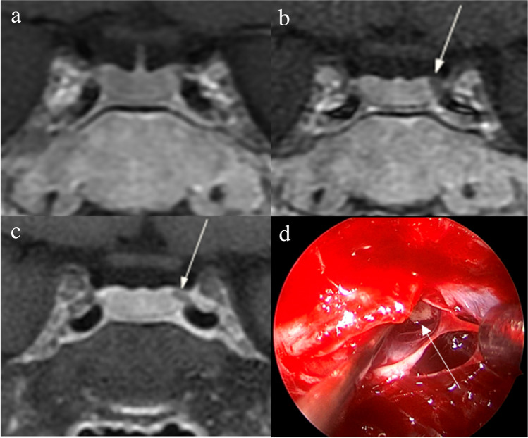
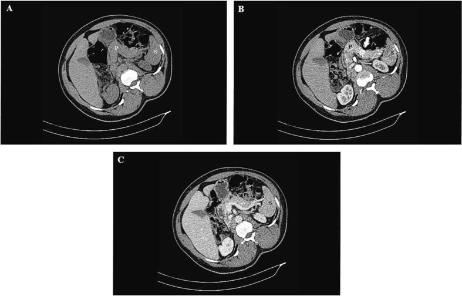
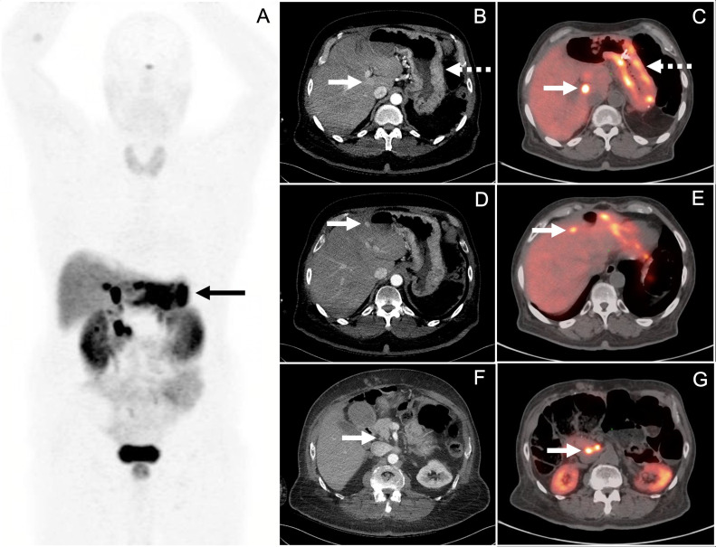
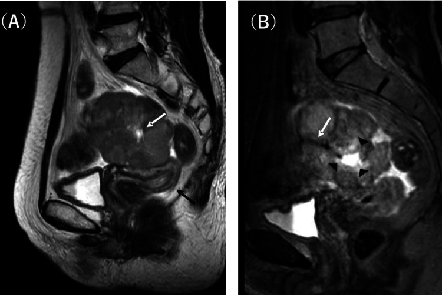
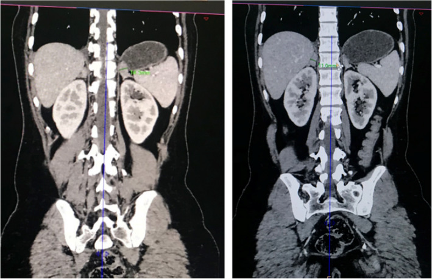

# Pituitary, Pancreatic & Gonadal Endocrine Imaging

A practical, imaging-led tour of the endocrine organs that sit outside the thyroid/adrenal core: the pituitary (functioning microadenomas), the pancreatic neuroendocrine tumours, the gonadal and adrenogenital sources of hormone excess, and the MEN syndromes that thread them together. The unifying theme is *biochemistry-driven, lesion-hunting imaging*: the patient is hormonally proven to harbour a tumour, and the radiologist's job is to find a small, often sub-centimetre lesion and place it in a syndromic context.

## 1. Framework first — how to organise the topic

Think in three anatomical compartments plus one connective concept:

1. **Pituitary** — functioning microadenoma hunting on dynamic MRI (prolactinoma, ACTH/Cushing, GH/acromegaly, TSH-secreting). Detailed pituitary imaging belongs to neuroradiology; here we keep it brief and endocrine-focused.
2. **Pancreatic neuroendocrine tumours (PNETs)** — functioning (insulinoma, gastrinoma, glucagonoma, VIPoma, somatostatinoma) vs non-functioning. Hypervascular, arterial-phase enhancing. Localisation problem: lesions are often small.
3. **Gonadal / adrenogenital** — functioning ovarian and testicular tumours, congenital adrenal hyperplasia (CAH), and the ovarian/adrenal causes of hyperandrogenism and virilisation.
4. **MEN syndromes** — MEN1 and MEN2 as the integrating framework that links pituitary + pancreas + parathyroid (MEN1) and medullary thyroid + phaeochromocytoma + parathyroid (MEN2), with the *surveillance imaging* concept.

A useful mental algorithm for any functioning tumour: **(a) confirm biochemistry** → **(b) regionalise** (which gland) → **(c) localise** the lesion with cross-sectional + functional imaging → **(d) ask "is this syndromic?"** (family history, multiplicity, young age) → **(e) plan surveillance**.

## 2. The pituitary (brief)

### Functioning microadenoma — the dynamic MRI problem

A microadenoma is defined as a pituitary adenoma under 10 mm; a macroadenoma is 10 mm or larger. Functioning microadenomas are hunted because biochemistry (raised prolactin, the dexamethasone/inferior-petrosal-sinus picture in Cushing, raised GH/IGF-1 in acromegaly) tells you a lesion exists even when standard sequences look normal.

The key technique is **dynamic contrast-enhanced MRI**: thin (around 2-3 mm) coronal and sagittal T1 sequences acquired rapidly during and immediately after gadolinium bolus. The normal anterior pituitary enhances briskly and homogeneously; a microadenoma enhances *more slowly*, so on early dynamic frames it appears as a **relatively hypoenhancing focus** against the avidly enhancing normal gland. On delayed images this contrast can reverse or wash out, which is why timing matters — a delayed-only study can miss the lesion.

Ancillary signs of a microadenoma: focal upward convexity of the gland surface, contralateral deviation of the infundibulum, and focal sellar floor depression/erosion. None is specific in isolation.

**Cushing disease pearl:** ACTH-secreting corticotroph adenomas are often the smallest and most occult. When MRI is negative or equivocal but biochemistry is convincing, **bilateral inferior petrosal sinus sampling (BIPSS)** is used to confirm a central (pituitary) source and lateralise it — a catheter-based functional test, not an imaging "picture", but worth knowing as the next step.

**Prolactinoma pearl:** prolactinomas are usually managed medically (dopamine agonists), so MRI is for diagnosis and follow-up of size rather than as a pre-surgical roadmap in most cases.

In MEN1, the pituitary adenoma is the third "P" (see section 5) and is most commonly a prolactinoma.

## 3. Pancreatic neuroendocrine tumours (PNETs)

### Classification / enumeration framework

Classify PNETs along two axes:

- **Functioning vs non-functioning.** Functioning tumours present early with a hormone syndrome; non-functioning tumours present late, larger, with mass effect or are found incidentally.
- **By secreted hormone (functioning):**
  - **Insulinoma** — hypoglycaemia (Whipple triad); usually small, usually benign, almost always intrapancreatic, evenly distributed through the gland.
  - **Gastrinoma** — Zollinger-Ellison syndrome (refractory peptic ulceration, diarrhoea); often small, often multiple, frequently *extrapancreatic*, clustering in the "gastrinoma triangle" (anatomical region bounded around the junction of cystic/common bile duct, junction of 2nd/3rd parts of duodenum, and the pancreatic neck/body region) — verify exact triangle landmarks against a reference figure.
  - **Glucagonoma** — necrolytic migratory erythema, diabetes, weight loss; tends to be larger at diagnosis.
  - **VIPoma** — watery diarrhoea, hypokalaemia, achlorhydria (WDHA / Verner-Morrison).
  - **Somatostatinoma** — diabetes, gallstones, steatorrhoea.

Insulinoma and gastrinoma are the two you must know cold for the exam, and both can be MEN1-associated.

### Modality-wise findings

**Plain radiography** has essentially no role for PNET localisation. (Liver metastases may occasionally calcify, visible on later cross-sectional imaging rather than plain film.)

**Ultrasound.** Transabdominal US is insensitive for small PNETs because of bowel gas and lesion size, but a hypervascular hypoechoic pancreatic nodule may be seen. The decisive ultrasound tool is **endoscopic ultrasound (EUS)**: by placing a high-frequency transducer in the stomach/duodenum directly against the pancreas, EUS detects very small (a few mm) lesions, particularly in the head and uncinate, and allows fine-needle aspiration. EUS is one of the most sensitive modalities for small insulinomas and is complementary to functional imaging. Intra-operative ultrasound (IOUS) is the gold-standard adjunct during surgery, especially for deep or multiple insulinomas.

**CT.** A dedicated **multiphasic pancreatic protocol CT** is the cross-sectional workhorse: unenhanced, then **arterial/late-arterial (pancreatic parenchymal) phase**, then portal-venous phase, with thin sections. Functioning PNETs are classically **hypervascular and enhance avidly in the arterial/late-arterial phase**, becoming iso- or hypodense to pancreas on portal venous phase. The arterial phase is therefore where small lesions stand out as bright nodules; relying on portal-venous-only imaging will miss them. Larger non-functioning tumours may show heterogeneous enhancement, necrosis, cystic change and coarse calcification. CT also stages: nodal and hepatic (typically hypervascular) metastatic disease.

**MRI.** PNETs are typically **low signal on T1**, **high signal on T2**, with **avid early arterial enhancement** on dynamic gadolinium imaging and frequent restricted diffusion on DWI. MRI's high soft-tissue contrast and DWI make it excellent for detecting small lesions and for characterising liver metastases, and it avoids ionising radiation in young or syndromic patients under repeated surveillance. T2 and DWI are particularly valuable for small hepatic deposits.

**Nuclear medicine / molecular imaging.** PNETs over-express somatostatin receptors, exploited by **somatostatin-receptor PET/CT using a gallium-68-labelled DOTA peptide (DOTATATE/DOTATOC)**. This is now the functional imaging standard, with markedly higher sensitivity than the older indium-111 octreotide (OctreoScan) planar/SPECT scintigraphy. DOTATATE PET excels at detecting small primaries, occult disease and metastases, and confirms receptor status that predicts response to peptide-receptor radionuclide therapy (PRRT). An important caveat: **well-differentiated insulinomas may have lower somatostatin-receptor density and can be DOTATATE-negative or only weakly positive**, so a negative scan does not exclude insulinoma — combine with EUS and arterial-phase CT/MRI. FDG-PET is reserved for higher-grade, poorly differentiated tumours that lose receptor expression.

### Localisation strategy in practice

For a biochemically proven **insulinoma**: arterial-phase CT or dynamic MRI first; if negative, EUS (very sensitive for small head lesions); DOTATATE may help but can be falsely negative; IOUS at surgery. For **gastrinoma**: DOTATATE PET is especially valuable because lesions are often small, multiple and extrapancreatic (duodenal wall), where it outperforms CT; combine with arterial-phase CT/MRI and EUS.

## 4. Gonadal and adrenogenital imaging

### Functioning ovarian tumours

Ovarian sex-cord stromal and germ-cell tumours can be hormonally active:

- **Granulosa cell tumour** — oestrogen-secreting; causes precocious puberty in girls, abnormal bleeding/endometrial hyperplasia in adults. On US/MRI: a solid or multicystic adnexal mass, often with internal haemorrhage giving a "Swiss-cheese"/multilocular sponge-like appearance; look for associated endometrial thickening from oestrogen effect.
- **Thecoma/fibrothecoma** — oestrogenic; typically a solid T2-hypointense ovarian mass (fibrous tissue).
- **Sertoli-Leydig cell tumour** — the classic *androgen-secreting* ovarian tumour causing virilisation/hyperandrogenism; usually a solid or solid-cystic, often hypervascular ovarian mass in a young woman with rapid-onset hirsutism and raised testosterone.

### Ovarian causes of hyperandrogenism

The common, non-neoplastic cause is **polycystic ovary syndrome (PCOS)**: bilaterally enlarged ovaries with numerous small peripheral follicles ("string of pearls") and increased echogenic central stroma on US; biochemically mild androgen excess. The critical radiological discriminator: **PCOS gives gradual, mild hyperandrogenism with bilateral polyfollicular ovaries, whereas rapid-onset severe virilisation with markedly raised testosterone should trigger a hunt for an androgen-secreting ovarian (Sertoli-Leydig, steroid cell) or adrenal tumour.** Stromal hyperthecosis (postmenopausal, solid enlarged ovaries) is another androgenic cause.

### Functioning testicular tumours

**Leydig cell tumours** (and other testicular stromal tumours) may secrete androgens or oestrogens, causing precocious puberty in boys or gynaecomastia in men. On scrotal US they are typically small, well-defined, hypoechoic and **hypervascular** intratesticular nodules. Functioning tumours can be small relative to their endocrine effect, so high-frequency US is essential and any biochemically suspected lesion warrants careful sonographic survey.

### Congenital adrenal hyperplasia (CAH)

CAH (most commonly 21-hydroxylase deficiency) drives excess ACTH and consequent **bilateral adrenal hyperplasia**. Imaging findings:

- **Bilaterally enlarged adrenal glands** that usually preserve their normal adreniform shape, sometimes with a **"cerebriform" or wrinkled/lobulated** surface contour on CT/MRI.
- In long-standing/poorly controlled disease, **adrenal myelolipomas** and **testicular adrenal rest tumours (TARTs)** can develop. TARTs are bilateral, hypoechoic, often near the mediastinum testis on scrotal US, and are an important benign mimic of malignancy in young men with CAH.

Imaging in adrenogenital syndromes also looks for an **adrenal cortical tumour** (adenoma or carcinoma) as the source of androgen/oestrogen excess; a large, heterogeneous, irregular adrenal mass with venous invasion or metastases favours adrenocortical carcinoma — but detailed adrenal protocol imaging is covered in the adrenal topic.

## 5. MEN syndromes and surveillance

### Framework

| Feature | MEN1 (Wermer) | MEN2A (Sipple) | MEN2B |
|---|---|---|---|
| Core organs | Parathyroid, Pancreas (PNET), Pituitary ("3 Ps") | Medullary thyroid carcinoma (MTC), Phaeochromocytoma, Parathyroid | MTC, Phaeochromocytoma |
| Parathyroid | Hyperplasia (very common) | Hyperplasia (present) | Usually absent |
| Pancreas | Gastrinoma, insulinoma, non-functioning PNETs | — | — |
| Adrenal medulla | — | Phaeochromocytoma (often bilateral) | Phaeochromocytoma (often bilateral) |
| Other | — | — | Mucosal neuromas, marfanoid habitus, ganglioneuromatosis |
| Gene (concept) | menin (tumour suppressor) | RET proto-oncogene | RET proto-oncogene |

Mnemonic anchors: **MEN1 = the 3 Ps** (Parathyroid, Pancreas, Pituitary); **MEN2 = the thyroid/adrenal axis** (Medullary thyroid + Phaeo + Parathyroid in 2A).

### The surveillance imaging concept

Because affected/gene-carrier patients develop **multiple, metachronous tumours over a lifetime**, MEN imaging is *programmatic surveillance*, not a single diagnostic study. Practical concepts to state in an exam:

- **MEN1:** periodic cross-sectional imaging of the pancreas (multiphasic CT/MRI, often with DOTATATE) to detect PNETs early, periodic pituitary MRI, plus biochemistry for hyperparathyroidism. Radiation-sparing MRI is favoured for lifelong repeated follow-up in young patients.
- **MEN2:** biochemical surveillance (calcitonin, plasma/urinary metanephrines) with imaging (neck US for thyroid, and CT/MRI plus MIBG or DOTATATE for phaeochromocytoma) triggered by biochemistry; prophylactic thyroidectomy is genetics/calcitonin-driven.
- General principle: **multiplicity, bilaterality and young age are red flags for a syndrome** — when you find one functioning endocrine tumour, actively look for the others and ask about family history.

## 6. Differentials and comparison tables

### Insulinoma vs gastrinoma

| Feature | Insulinoma | Gastrinoma |
|---|---|---|
| Syndrome | Hypoglycaemia (Whipple triad) | Zollinger-Ellison (ulcers, diarrhoea) |
| Usual size | Often very small (<2 cm) | Often small, may be multiple |
| Location | Intrapancreatic, even distribution | Often gastrinoma triangle, frequently extrapancreatic/duodenal |
| Malignant potential | Usually benign | Higher rate of malignancy |
| Best functional test | EUS + arterial CT/MRI (DOTATATE may be negative) | DOTATATE PET strongly positive |
| MEN1 link | Yes | Yes (strong) |

### Modality strengths for PNET localisation

| Modality | Strength | Limitation |
|---|---|---|
| Transabdominal US | Quick, no radiation | Insensitive for small lesions (gas, depth) |
| EUS | Highest sensitivity for small head/uncinate lesions; FNA | Operator dependent, invasive, tail less accessible |
| Multiphasic CT | Hypervascular arterial enhancement, staging | Misses very small/iso-enhancing lesions if arterial phase poor |
| MRI (T2/DWI/dynamic) | Small lesions, liver mets, no radiation | Availability, motion |
| DOTATATE PET/CT | Whole-body, occult disease, receptor status for PRRT | Insulinomas may be receptor-poor/negative |

### Hyperandrogenism in women — quick discriminator

| Clue | Likely PCOS | Likely androgen-secreting tumour |
|---|---|---|
| Onset | Gradual, peripubertal | Rapid, progressive |
| Testosterone | Mildly raised | Markedly raised |
| Ovaries | Bilateral polyfollicular ("string of pearls") | Unilateral solid/hypervascular mass |
| Other | Metabolic features | Frank virilisation |

## 7. Pearls and buzzwords

- "Biochemistry says it's there — go find it." Functioning endocrine tumour imaging is lesion-hunting against proven hormone excess.
- Microadenoma = **relatively hypoenhancing** on early dynamic post-gadolinium frames against avidly enhancing normal pituitary; timing is everything.
- Cushing disease + negative MRI → **inferior petrosal sinus sampling**.
- PNETs are **hypervascular** → image in the **arterial/late-arterial phase**; portal-venous-only protocols miss them.
- **Insulinoma can be DOTATATE-negative** — a key, frequently tested caveat.
- **Gastrinoma triangle**, often small/multiple/duodenal → DOTATATE PET shines.
- DOTATATE PET has replaced OctreoScan (better sensitivity) and predicts **PRRT** response.
- Sertoli-Leydig (ovary) and Leydig (testis) = the classic **androgen-secreting gonadal tumours**; granulosa/thecoma = **oestrogenic**.
- CAH → **bilateral adrenal hyperplasia (preserved adreniform shape, cerebriform contour)**; watch for **TARTs** in the testes and myelolipomas.
- **MEN1 = 3 Ps**; **MEN2 = MTC + phaeo + parathyroid**; multiplicity/bilaterality/youth = think syndrome and **start surveillance**.

## 8. What to draw

- **Dynamic pituitary microadenoma:** coronal sella with avidly enhancing normal gland and a single focal hypoenhancing nodule, infundibulum deviated to the opposite side, focal floor depression.
- **PNET enhancement curves / phases:** a pancreas in arterial phase with a bright nodule, and the same nodule fading to iso-density on portal-venous phase — annotate "arterial = bright".
- **Gastrinoma triangle:** simple line drawing of the triangle landmarks (label cystic/CBD junction, 2nd/3rd duodenum junction, pancreatic neck) — mark "verify landmarks".
- **MEN Venn / table:** two overlapping circles or a small table showing MEN1 (3 Ps) vs MEN2A/2B organs.
- **Hyperandrogenism algorithm:** rapid severe virilisation → unilateral solid ovarian/adrenal mass; gradual mild → bilateral polyfollicular PCOS ovaries.

## 9. Further reading

- A standard radiology reference text section on pancreatic neuroendocrine tumours and multiphasic pancreatic CT protocols.
- Society/consensus guidance on gallium-68 DOTATATE PET/CT in neuroendocrine tumours and on PRRT patient selection.
- Endocrine/neuroradiology reference on dynamic pituitary MRI technique and microadenoma signs.
- A review of MEN1 and MEN2 surveillance imaging protocols.
- Gynaecological imaging reference on sex-cord stromal ovarian tumours and the imaging of hyperandrogenism.

*(Use these as scaffolding alongside actual image plates; confirm any numeric threshold, triangle landmark, or staging detail against a primary source before quoting it in the exam.)*
