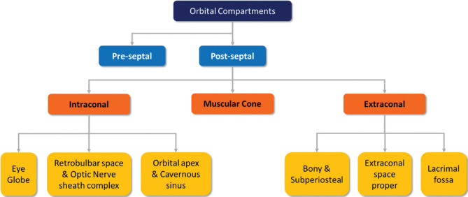
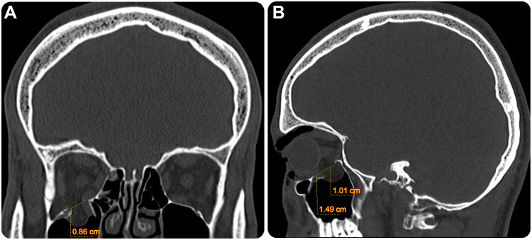
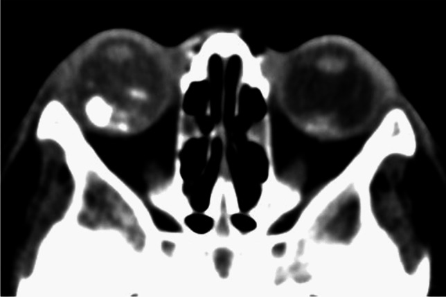
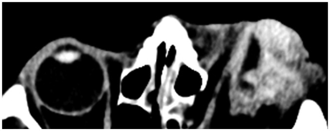

# Orbit — Intraocular, Orbital Masses, Exophthalmos, Trauma

The orbit is a compact bony pyramid where lesions are localised primarily by compartment (intraocular vs orbital, and within the orbit: intraconal, conal, extraconal) and then characterised by imaging. CT and MRI dominate orbital work; ultrasound has a focused role for the globe and plain radiographs are essentially obsolete except for radio-opaque foreign body screening before MRI.

## 1. Anatomy and compartmental framework

The orbit is bounded by seven bones forming a four-walled pyramid with the apex at the optic canal and superior orbital fissure. Key surgical landmarks: the thin medial wall (lamina papyracea of the ethmoid) and the orbital floor (maxillary roof) are the weakest and the commonest sites of fracture and of sinogenic infection spread.

The **muscle cone** is the funnel formed by the four recti and their intermuscular septa, converging on the annulus of Zinn at the apex. This divides the retrobulbar orbit into:

- **Intraconal** compartment — inside the cone; contains the optic nerve-sheath complex, ophthalmic artery, superior ophthalmic vein, and orbital fat.
- **Conal** compartment — the extraocular muscles themselves.
- **Extraconal** compartment — between the cone and the periorbita; contains the lacrimal gland (superolateral), trochlea, and peripheral fat.

A practical lesion-localisation framework (use this to structure any differential):

| Compartment | Typical lesions |
|---|---|
| Globe (intraocular) | Retinoblastoma, uveal melanoma, PHPV, Coats disease, metastasis |
| Intraconal | Cavernous haemangioma (venous malformation), optic nerve glioma, optic nerve sheath meningioma, schwannoma, varix |
| Conal (muscles) | Thyroid eye disease, orbital myositis (pseudotumour), metastasis, rhabdomyosarcoma |
| Extraconal | Dermoid/epidermoid, lacrimal gland lesions, rhabdomyosarcoma, subperiosteal abscess, lymphoma |
| Optic canal/apex | Meningioma, glioma extension, perineural spread |

## 2. Approach to proptosis / exophthalmos

Proptosis is forward globe displacement; exophthalmos is the same term applied classically to thyroid eye disease. The imaging approach answers three questions in order: (1) Which compartment? (2) Unilateral or bilateral? (3) Mass vs infiltrative vs vascular vs inflammatory?

- **Bilateral proptosis** strongly favours thyroid eye disease (commonest cause of both unilateral and bilateral proptosis in adults); also lymphoma, IgG4/pseudotumour, leukaemic infiltration, and venous congestion.
- **Axial proptosis** suggests an intraconal lesion (cone displaces the globe straight forward).
- **Eccentric (non-axial) proptosis** suggests an extraconal mass displacing the globe away from it.
- **Pulsatile proptosis** suggests a vascular lesion (carotid-cavernous fistula, varix) or absent greater sphenoid wing (neurofibromatosis type 1).
- **Proptosis worsening on Valsalva/dependent position** suggests orbital varix.

## 3. Modality roles (H&N — CT and MRI dominate)

**Plain radiograph (XR):** Minimal role. Used historically for orbital foreign body localisation and to detect a fracture, but largely superseded by CT. Its one persisting use is as a quick screen for a metallic intraocular foreign body before MRI when history is uncertain.

**Ultrasound (US):** Excellent for the globe and anterior orbit where the fluid-filled eye is an ideal acoustic window. B-scan characterises intraocular masses, retinal detachment, vitreous haemorrhage, and detects calcification (retinoblastoma). A-scan reflectivity and Doppler help differentiate uveal melanoma (low internal reflectivity, internal vascularity) from metastasis and haemorrhage. US is operator-dependent and cannot assess the orbital apex or intracranial extension; never compress a globe with suspected rupture.

**CT:** First-line for trauma and acute infection. Strengths: rapid, superb for bone (fractures), calcification (retinoblastoma calcifies; optic nerve sheath meningioma may show tram-track calcification), and metallic/most foreign bodies. Contrast-enhanced CT defines cellulitis, abscess and vascular lesions. Limitation: lower soft-tissue contrast than MRI at the apex and for intracranial/perineural spread; radiation to the lens is a concern especially in children.

**MRI:** Best for soft-tissue characterisation, the optic nerve, orbital apex, cavernous sinus and intracranial extension. Use fat-suppressed T2 and fat-suppressed post-contrast T1 to see lesions against orbital fat. Essential for optic pathway tumours, perineural spread, and characterising intraocular melanoma (melanin is intrinsically T1-hyperintense, T2-hypointense). Contraindicated/risky if a ferromagnetic intraocular foreign body is suspected — screen with CT first.

**Nuclear medicine:** Limited primary role. PET-CT contributes to staging of orbital lymphoma, metastatic disease and aggressive primaries (rhabdomyosarcoma), and to assessing treatment response, rather than to local lesion characterisation.

## 4. Intraocular lesions

| Lesion | Age | Laterality | Calcification | Key imaging | Pitfall/buzzword |
|---|---|---|---|---|---|
| Retinoblastoma | <3 yr (commonest intraocular malignancy of childhood) | Uni > bi; bilateral if hereditary | Yes (typical) | Enhancing intraocular mass with Ca++; assess optic nerve, "trilateral" pineal lesion | Leukocoria; calcified mass in a young child = retinoblastoma until proven otherwise |
| Uveal melanoma | Adult (commonest primary intraocular malignancy in adults) | Unilateral | No | T1 hyperintense, T2 hypointense (melanin); "collar-button"/mushroom shape if breaks Bruch membrane | Low internal reflectivity on US |
| PHPV | Neonate/infant | Unilateral; microphthalmic eye | No | Small globe, retrolental soft tissue, persistent hyaloid canal; no Ca++ | Microphthalmos, no calcification distinguishes from retinoblastoma |
| Coats disease | Boys, older child | Unilateral; normal-size globe | No | Exudative retinal detachment with subretinal lipoproteinaceous exudate (T1 hyperintense), no mass, no Ca++ | Leukocoria without calcification and without a mass |

Leukocoria differential (white pupillary reflex) is the high-yield grouping: retinoblastoma (calcified mass), PHPV (microphthalmic, no calcification), Coats (exudative detachment, no calcification, no mass), and toxocariasis/retinopathy of prematurity. Presence or absence of calcification and globe size are the two discriminators that imaging resolves quickly.

## 5. Orbital masses by compartment

### Intraconal

- **Cavernous haemangioma (orbital venous malformation):** Commonest benign orbital mass in adults. Well-defined intraconal mass, often lateral to the optic nerve, with characteristic progressive ("fill-in") enhancement from a focal node spreading across the lesion. Slow-flow, no significant pulsation.
- **Optic nerve glioma:** Commonest optic nerve tumour in children; strong association with neurofibromatosis type 1 (consider bilateral involvement in NF1). Fusiform enlargement of the optic nerve; the nerve and tumour are inseparable; may show a kink/buckle of the nerve.
- **Optic nerve sheath meningioma:** Adults, female predilection. Tumour grows around the nerve producing the "tram-track" sign (enhancing sheath surrounding the non-enhancing nerve on axial; "doughnut" on coronal); may calcify. The nerve is preserved and seen separately — the key contrast with glioma.

| Feature | Optic nerve glioma | Optic nerve sheath meningioma |
|---|---|---|
| Typical age | Child | Adult |
| Association | NF1 | (sporadic; NF2 less commonly) |
| Morphology | Fusiform nerve enlargement, nerve inseparable | Sheath tumour around an identifiable nerve |
| Enhancement sign | Diffuse | Tram-track / doughnut |
| Calcification | Rare | May calcify |

### Conal (extraocular muscle disease) — see also thyroid eye disease below

Muscle-centred disease: thyroid eye disease, orbital myositis (idiopathic inflammation), metastasis, lymphoma, and rhabdomyosarcoma (though the latter is more often extraconal).

### Extraconal

- **Dermoid/epidermoid cyst:** Commonest orbital cystic lesion in children; typically superolateral near the frontozygomatic suture. Fat content (dermoid) gives low CT attenuation and T1 hyperintensity that suppresses on fat-saturation; may scallop adjacent bone.
- **Lacrimal gland lesions:** Superolateral mass. Differential includes pleomorphic adenoma (benign, smooth bony remodelling), adenoid cystic carcinoma (painful, bone destruction, perineural spread), lymphoma and inflammatory/IgG4 dacryoadenitis.
- **Rhabdomyosarcoma:** Commonest primary orbital malignancy of childhood; rapidly progressive proptosis. Aggressive soft-tissue mass, often extraconal/superonasal, may show bone destruction; can mimic infection clinically.

## 6. Thyroid eye disease (Graves orbitopathy)

Commonest cause of proptosis (uni- and bilateral) in adults. Imaging hallmark is fusiform enlargement of the extraocular muscle bellies with **sparing of the tendinous insertions** — the discriminator from orbital myositis, which involves the tendon. Inferior and medial recti are most frequently affected; classic mnemonic order **I-M-S-L-O** (inferior, medial, superior, lateral, then oblique/levator). Increased intraconal fat may also occur. The high-yield emergency is apical crowding causing compressive optic neuropathy — assess the orbital apex.

| Feature | Thyroid eye disease | Orbital myositis (pseudotumour) |
|---|---|---|
| Laterality | Often bilateral | Often unilateral |
| Tendon insertion | Spared | Involved |
| Muscles | Multiple, symmetric (I>M>S>L) | One or few |
| Pain | Usually painless | Painful |
| Steroid response | Variable | Dramatic, rapid |

## 7. Inflammatory and infective

**Orbital cellulitis** is staged by the Chandler classification, which separates pre- from postseptal disease and grades complications:

1. Preseptal cellulitis (anterior to orbital septum)
2. Orbital (postseptal) cellulitis
3. Subperiosteal abscess
4. Orbital abscess
5. Cavernous sinus thrombosis

Most cases are sinogenic, spreading through the lamina papyracea from the ethmoids; contrast-enhanced CT (and MRI for intracranial extension) is used to detect a drainable subperiosteal abscess and cavernous sinus involvement.

**Idiopathic orbital inflammation (pseudotumour)** is a diagnosis of exclusion: any orbital structure may be involved (myositis, dacryoadenitis, diffuse). Painful, unilateral, steroid-responsive. **IgG4-related disease** is a systemic mimic that classically causes bilateral lacrimal gland enlargement and may involve the infraorbital nerve; consider it when "pseudotumour" is bilateral or recurrent.

## 8. Vascular lesions

- **Orbital varix:** Distensible venous malformation. Proptosis that increases with Valsalva or dependency and reduces when upright; image with and without Valsalva. May contain a phlebolith. Risk of thrombosis/haemorrhage.
- **Carotid-cavernous fistula (CCF):** Abnormal communication between carotid arterial flow and the cavernous sinus. Causes pulsatile proptosis, chemosis, an audible bruit, and a dilated superior ophthalmic vein with a bulging cavernous sinus on imaging. High-flow (direct, often post-traumatic) vs low-flow (dural). Catheter angiography is the reference standard and the route to treatment.

## 9. Orbital trauma

- **Blow-out fracture:** Sudden rise in intraorbital pressure fractures the weakest walls — the floor (into the maxillary sinus) and the medial wall (lamina papyracea). CT shows the bony defect, herniated fat/muscle ("teardrop" sign of soft tissue hanging into the antrum), and the critical complication of inferior rectus entrapment causing restricted upgaze and diplopia. Assess for orbital emphysema (medial wall) and infraorbital nerve involvement (floor).
- **Foreign body:** CT localises and characterises — metallic and most glass are dense and easily seen; organic/wooden foreign bodies are CT-occult or can mimic air and are better seen on MRI (but exclude metal first). Always determine intra- vs extraocular location.
- **Globe rupture:** CT signs include altered globe contour/volume loss, a flat anterior chamber, scleral discontinuity, intraocular air or haemorrhage, and lens dislocation. Do not compress the globe (no US). It is a surgical emergency.

## 10. Pearls and buzzwords

- Calcified intraocular mass in a child under three = retinoblastoma until proven otherwise; look for the trilateral pineal lesion.
- Melanin = T1 bright, T2 dark — uveal melanoma.
- Leukocoria split: retinoblastoma (Ca++), PHPV (microphthalmos, no Ca++), Coats (exudative detachment, no mass, no Ca++).
- Tram-track = optic nerve sheath meningioma; fusiform inseparable nerve = optic nerve glioma (think NF1).
- Cavernous haemangioma = progressive fill-in enhancement, commonest adult orbital mass.
- Thyroid eye disease spares the tendon; myositis involves it.
- Dermoid = superolateral, fat-containing, frontozygomatic suture.
- Pulsatile proptosis + dilated superior ophthalmic vein = carotid-cavernous fistula; Valsalva-dependent = varix.
- Blow-out: floor and lamina papyracea; watch inferior rectus entrapment.
- Screen with CT for metallic foreign body before any orbital MRI.

## 11. What to draw

- The orbital pyramid in axial section: globe, four recti forming the cone, optic nerve-sheath complex intraconally, lacrimal gland superolaterally, with the three compartments labelled.
- A 2x2 leukocoria grid (calcification yes/no against globe size normal/small) placing retinoblastoma, PHPV and Coats.
- Coronal sketch of the tram-track / doughnut sign versus fusiform optic nerve enlargement.
- Coronal orbit showing a floor blow-out fracture with inferior rectus and fat herniating into the maxillary sinus (teardrop).

## 12. Further reading

- Standard head and neck radiology reference texts (orbit chapters) for compartmental anatomy and lesion characterisation.
- A dedicated orbital imaging review covering the intraconal/conal/extraconal localisation approach.
- Ophthalmic ultrasound reference for A- and B-scan characterisation of intraocular masses.
- Trauma imaging text for orbital fracture patterns and globe injury signs.
