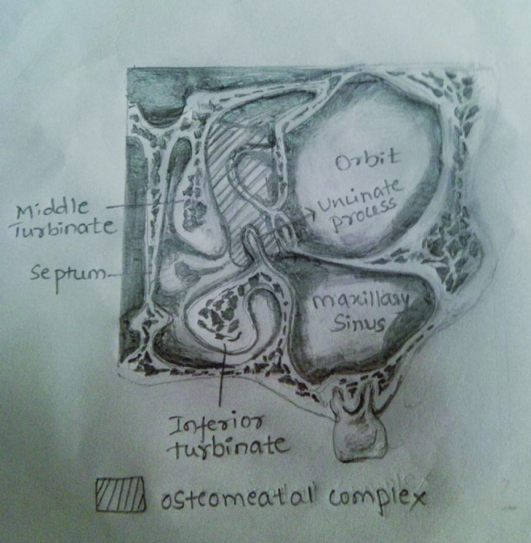
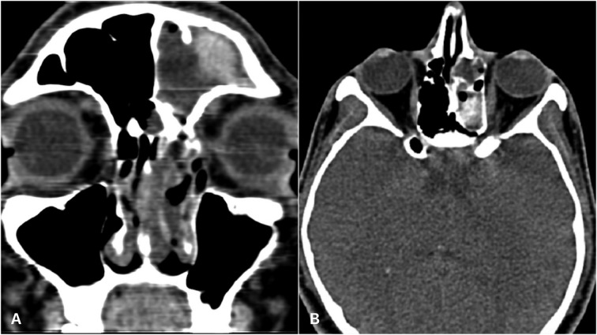

# Nose & Paranasal Sinuses

A high-yield Head & Neck topic dominated by cross-sectional imaging: CT defines bony anatomy and the pre-FESS roadmap, while MRI characterises soft tissue, perineural spread and intracranial/orbital extension. Plain radiographs and ultrasound have a minimal role and are noted only for completeness.

## Classification and enumeration frameworks

Approach the sinonasal tract by first fixing the drainage anatomy, then layering pathology onto it.

**Drainage pathways.** Two functional units. (1) The **ostiomeatal unit (OMU)** is the common final drainage channel for the maxillary sinus, anterior ethmoid air cells and frontal sinus into the middle meatus. Its components are the maxillary sinus ostium, the infundibulum, the uncinate process, the ethmoid bulla, the hiatus semilunaris and the middle meatus. (2) The **sphenoethmoidal recess** drains the posterior ethmoid air cells and the sphenoid sinus into the superior meatus. The nasolacrimal duct drains into the inferior meatus.

**Pre-FESS CT checklist (anatomic variants the surgeon must know).**
- **Concha bullosa** — pneumatisation of the middle turbinate; may narrow the OMU.
- **Haller cell (infraorbital ethmoid cell)** — an ethmoid air cell projecting along the inferomedial orbital floor / maxillary roof; narrows the infundibulum.
- **Onodi cell (sphenoethmoidal cell)** — the most posterior ethmoid cell pneumatising posterolateral, lying superolateral to the sphenoid sinus and intimately related to the **optic nerve and carotid** — flagging it protects against catastrophic surgical injury.
- **Keros classification** of olfactory fossa / cribriform plate depth (depth of the lateral lamella of the cribriform plate): Type I shallow, Type II intermediate, Type III deep. The deeper the fossa (Type III), the longer and more vulnerable the lateral lamella, raising the risk of iatrogenic CSF leak (verify exact depth values).
- Also report: uncinate process orientation/attachment, septal deviation and spurs, dehiscence of the lamina papyracea, position of the anterior ethmoidal artery, sphenoid septations inserting on the carotid canal, and skull base asymmetry.

**Inflammatory patterns (Harnsberger-style mucosal patterns).** Infundibular, OMU, sphenoethmoidal recess, sinonasal polyposis and a sporadic/unclassified pattern. Recognising the obstructed unit tells you which variant or lesion to hunt for.

**Fungal sinusitis.** Split first by invasion. (1) **Non-invasive** — allergic fungal rhinosinusitis (AFRS) and fungal ball (mycetoma). (2) **Invasive** — acute fulminant (immunocompromised/diabetic, e.g. mucormycosis), chronic, and granulomatous forms.

## Modality-wise findings

### Plain radiography (XR)
Largely historical. Occipitomental (Waters) and other views may show an air-fluid level, mucosal thickening or an opacified sinus, but XR cannot evaluate the OMU, the bony skull base or soft-tissue extent and is superseded by CT. Do not rely on it for surgical planning or staging.

### Ultrasound (US)
No meaningful role in the paranasal sinuses owing to overlying bone and air. It is mentioned only to be dismissed; the imaging workhorses here are CT and MRI.

### CT
The primary modality for inflammatory disease and the surgical roadmap. Use thin-section multiplanar (coronal reformats are essential for the OMU) on bone and soft-tissue windows.
- **Acute sinusitis:** air-fluid levels, frothy/bubbly secretions, mucosal thickening.
- **Chronic sinusitis:** mucoperiosteal thickening, sclerotic/thickened reactive bony walls (osteitis), polypoid change.
- **Mucocele:** an expanded, completely opacified, airless sinus with smooth bony remodelling/thinning; frontal and ethmoid sinuses most often; attenuation varies with protein content.
- **AFRS:** expansile multi-sinus disease with characteristic **hyperdense** central material (inspissated allergic mucin with calcium/metal concentration) and smooth bony expansion/remodelling.
- **Fungal ball (mycetoma):** usually a single sinus (commonly maxillary) with a hyperdense mass, often punctate calcification, and reactive wall thickening.
- **Invasive fungal disease:** the key CT sign is **bony erosion/destruction** with infiltration of periantral fat planes and extension into the orbit, pterygopalatine fossa or skull base — in the right host, treat as an emergency.
- **Antrochoanal polyp:** soft-tissue density arising in the maxillary antrum, passing through a widened accessory/maxillary ostium and the choana into the nasopharynx; smooth antral widening.
- **JNA:** soft-tissue mass centred on the **sphenopalatine foramen / pterygopalatine fossa (PPF)**, with anterior bowing of the posterior maxillary sinus wall (**Holman-Miller / antral sign**) and **widening of the PPF**; avid enhancement.
- **Malignancy:** soft-tissue mass with aggressive bony destruction (rather than remodelling); CT best shows cortical bone involvement.

### MRI
The problem-solver for soft tissue, complications and tumour mapping. Superior for separating obstructed retained secretions from tumour, and for perineural, orbital, dural and brain involvement.
- **Inspissated secretions / fungal material:** can be markedly **low / signal-void on T2** and variable on T1 — a classic pitfall that may mimic a normally aerated (black) sinus; correlate with CT hyperdensity.
- **Mucocele:** signal varies with protein/water content (often T1 bright when proteinaceous); a peripherally enhancing rim with non-enhancing centre.
- **Tumour vs secretions:** tumour enhances solidly and is usually intermediate on T2, whereas obstructed secretions are typically T2-bright and non-enhancing (peripheral mucosal enhancement only).
- **JNA:** intensely enhancing mass with **flow voids** ("salt-and-pepper"); MRI/MRA maps intracranial and cavernous sinus extension; catheter angiography confirms feeders (commonly internal maxillary artery) and enables preoperative embolisation.
- **Esthesioneuroblastoma (olfactory neuroblastoma):** dumbbell mass straddling the cribriform plate with **peripheral intracranial cysts** at the tumour-brain interface as a suggestive sign; MRI defines dural/brain invasion.
- **Perineural spread:** enhancement and thickening of nerves (e.g. V2 through foramen rotundum, the vidian nerve); look for replacement of fat in the PPF.
- **CSF leak:** high-resolution T2 / cisternographic sequences localise the meningocele/encephalocele and active leak; pairs with thin bone CT to find the bony defect.

### Nuclear medicine
Limited routine role. FDG-PET/CT contributes to staging and post-treatment surveillance of sinonasal malignancy and lymphoma; it does not characterise inflammatory disease.

## Differentials and comparison tables

### Fungal sinusitis subtypes

| Type | Host | Sinuses | CT density | Bone | MRI clue |
|---|---|---|---|---|---|
| AFRS | Atopic, immunocompetent | Multiple, bilateral, expansile | Hyperdense mucin | Smooth expansion/remodelling | T2 signal void of mucin |
| Fungal ball (mycetoma) | Immunocompetent | Single (often maxillary) | Hyperdense, punctate Ca++ | Reactive thickening | Low T2 focus |
| Acute invasive | Immunocompromised/diabetic | Variable, aggressive | Soft tissue + fat infiltration | Erosion/destruction | Loss of mucosal enhancement; periantral/orbital spread |

### Hyperdense / opacified sinus — pattern differential

| Cause | Density pattern | Key discriminator |
|---|---|---|
| AFRS | Central hyperdense, peripheral mucosa | Multi-sinus, atopy, T2 void |
| Fungal ball | Focal hyperdensity ± Ca++ | Single sinus |
| Inspissated chronic secretions | Variable high T1, low T2 | No expansion/destruction |
| Haemorrhage | High density acutely | Clinical context |
| Mucocele (proteinaceous) | Variable | Expanded airless sinus, smooth remodelling |

### Nasopharyngeal/nasal mass in a young patient

| Lesion | Typical patient | Centre/origin | Enhancement | Bone |
|---|---|---|---|---|
| JNA | Adolescent male | Sphenopalatine foramen / PPF | Avid, flow voids | PPF widening, Holman-Miller bowing |
| Antrochoanal polyp | Children/young adults | Maxillary antrum -> choana | Minimal/peripheral | Smooth ostial widening |
| Esthesioneuroblastoma | Bimodal age | Cribriform plate / olfactory recess | Moderate | Permeative; dumbbell, peripheral cysts |

### Malignancy quick comparison

| Tumour | Favoured site | Imaging signature |
|---|---|---|
| SCC | Maxillary antrum most common | Aggressive bone destruction; commonest sinonasal malignancy |
| Esthesioneuroblastoma | Olfactory recess at cribriform plate | Dumbbell across skull base; peripheral intracranial cysts |
| Non-Hodgkin lymphoma | Nasal cavity, midline | Bulky homogeneous soft tissue, often relatively preserved bone, restricted diffusion |

Note on staging: sinonasal SCC follows site-specific AJCC TNM (maxillary sinus vs nasal cavity/ethmoid); esthesioneuroblastoma is commonly described with the **Kadish** staging system (A confined to nasal cavity, B extending to sinuses, C beyond), with a Hyams histological grade. State exact T-category boundaries only from a current AJCC table (verify exact values).

## Pearls and buzzwords
- **Onodi cell = optic nerve at risk**; report it before FESS.
- **Keros III = deepest olfactory fossa = highest CSF-leak risk** along the lateral lamella.
- **AFRS = hyperdense allergic mucin + T2 signal void** in an atopic, immunocompetent patient; can mimic an aerated sinus on MRI.
- **Holman-Miller (antral) sign** = anterior bowing of the posterior maxillary wall in **JNA**; the PPF widens; adolescent male; never biopsy blindly (vascular).
- **Antrochoanal polyp** = maxillary antrum origin -> through choana -> nasopharynx; benign.
- **Esthesioneuroblastoma** = dumbbell across the cribriform plate with **peripheral intracranial cysts**.
- **Sinonasal lymphoma / midline destructive disease** -> consider NK/T-cell lymphoma and GPA in the differential.
- **GPA (granulomatosis with polyangiitis)** = nasal septal/turbinate destruction, septal perforation, "saddle-nose", mucosal thickening with bony erosion and neo-osteogenesis; correlate with c-ANCA.
- Distinguish **remodelling (benign/expansile)** from **destruction (aggressive)** on bone-window CT.
- On MRI, **trapped secretions are T2-bright and non-enhancing**; **tumour is intermediate T2 and enhances** — this separates the airless-but-benign sinus from extending tumour.

## What to draw
- A labelled **coronal OMU diagram**: maxillary ostium, infundibulum, uncinate process, ethmoid bulla, hiatus semilunaris, middle meatus — and where a concha bullosa and Haller cell sit.
- A **Keros I/II/III** schematic showing increasing depth of the olfactory fossa and lengthening lateral lamella.
- The **Onodi cell** relationship to the optic nerve and carotid, posterosuperolateral to the sphenoid.
- A **JNA** sketch: mass at the sphenopalatine foramen, widened PPF, and anterior bowing of the posterior maxillary wall (Holman-Miller).

## Further reading
- Harnsberger, *Diagnostic Imaging: Head and Neck*.
- Som & Curtin, *Head and Neck Imaging*.
- A current AJCC Cancer Staging Manual for sinonasal TNM (verify exact category values before quoting).
