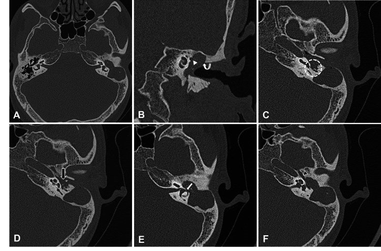
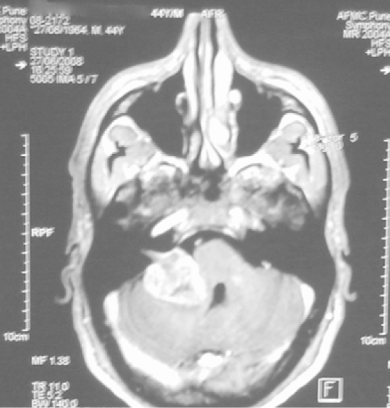
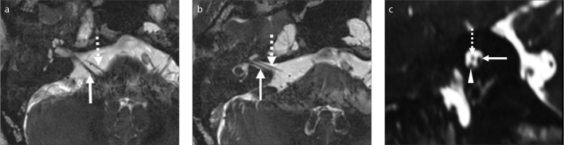

# Ear / Temporal Bone — HRCT & Inner Ear MRI

The temporal bone is the densest, most intricately compartmentalised bone in the body, and its tiny structures (ossicles, labyrinth, facial nerve canal) demand sub-millimetre resolution. The two workhorse modalities are HRCT (bone detail, ossicles, otic capsule, fractures, conductive pathology) and high-resolution MRI (membranous labyrinth fluid, CPA/IAC contents, soft-tissue tumours, complications). Get the framework of compartments and lesion categories first, then read modality by modality.

## 1. Classification / enumeration framework

Think of the temporal bone in three functional compartments and one nerve canal, then sort disease by category.

Anatomical compartments
- External ear / external auditory canal (EAC) — bony and cartilaginous canal, tympanic membrane.
- Middle ear (tympanic cavity) — ossicular chain (malleus, incus, stapes), scutum, Prussak space (lateral epitympanic recess, bounded laterally by the scutum and pars flaccida, medially by the ossicular neck), aditus ad antrum, mastoid air cells, Eustachian tube, oval and round windows.
- Inner ear / otic capsule — cochlea, vestibule, three semicircular canals (SCCs), vestibular and cochlear aqueducts, the membranous labyrinth within.
- Internal auditory canal (IAC) and cerebellopontine angle (CPA) — facial nerve (CN VII), cochlear and superior/inferior vestibular nerves (CN VIII), and the facial nerve canal coursing in labyrinthine, tympanic (with the cog and geniculate ganglion) and mastoid (vertical) segments.

Disease categories (the spine of any answer)
1. Congenital — EAC atresia/stenosis; inner ear malformations (cochlear aplasia/hypoplasia, incomplete partition spectrum, common cavity); large/enlarged vestibular aqueduct (LVA/EVA).
2. Acquired conductive — cholesteatoma (acquired more than congenital), otosclerosis (fenestral and retrofenestral/cochlear).
3. Inflammatory / infective — acute otomastoiditis, coalescent mastoiditis, petrous apicitis, complications (subperiosteal/Bezold abscess, sigmoid sinus thrombosis, intracranial spread).
4. Trauma — temporal bone fractures (longitudinal, transverse, mixed/oblique; or otic-capsule-sparing vs otic-capsule-violating).
5. Neoplastic — paragangliomas (glomus tympanicum, glomus jugulare), facial nerve schwannoma, endolymphatic sac tumour (ELST), and the CPA/IAC trio (vestibular schwannoma, meningioma, epidermoid).

## 2. Modality-wise findings

For the temporal bone, plain radiography is essentially obsolete and ultrasound has no role; CT and MRI dominate. State this explicitly in any exam answer.

### Plain radiography (XR) — historical only
Schuller, Stenvers and Towne projections were once used to assess mastoid pneumatisation and gross fractures, but overlapping dense bone limits them severely. They have been wholly replaced by HRCT and retain only historical interest. Do not build an answer around them.

### Ultrasound (US) — no role
Bone blocks the beam; US contributes nothing to temporal bone imaging. (Neck US may incidentally assess a parotid-region or carotid-space mass adjacent to the skull base, but that is not temporal bone imaging per se.)

### Computed tomography (HRCT) — the bone workhorse
Acquire thin sub-millimetre volumetric data and reconstruct in axial and coronal (and reformatted Poschl/Stenvers) planes with a high-resolution bone algorithm; soft-tissue windows are reviewed for the CPA and skull base. Contrast is generally unnecessary for purely conductive/bony questions but is given when a vascular or enhancing mass (paraganglioma) or infective complication is suspected.

Normal landmarks to confirm on every study: an intact scutum (sharp bony spur), aerated Prussak space and middle ear, an intact ossicular chain ("ice-cream cone" malleus head and incus body on axial epitympanum), a normally dense otic capsule, intact tegmen tympani, and the segments of the facial nerve canal.

Congenital. In EAC atresia, HRCT defines whether the atretic plate is bony or membranous, the degree of middle ear and mastoid pneumatisation, the status and fusion of the ossicles, the position of the facial nerve canal (often anteriorly/inferiorly displaced — critical surgical information), and any associated microtia. Inner ear malformations are classed along a spectrum from complete labyrinthine aplasia (Michel) through cochlear aplasia/hypoplasia to incomplete partition; the cochlea normally shows about two and a half to two and three-quarter turns with an intact modiolus and interscalar septa (verify exact value), so loss of the modiolus or a "cystic" cochleovestibular cavity is the key abnormality. In enlarged vestibular aqueduct, the bony vestibular aqueduct is widened — commonly judged larger than the adjacent posterior SCC, or measured against a threshold (the modern **Cincinnati criteria**: midpoint > 1.0 mm or operculum > 2.0 mm; the older Valvassori cut-off was ~1.5 mm at the midpoint) — and it is the commonest imaging finding in congenital sensorineural hearing loss.

Cholesteatoma. The classic acquired (pars flaccida) cholesteatoma is a non-dependent soft-tissue mass in Prussak space that erodes bone: blunting/erosion of the scutum, medial displacement and erosion of the ossicles (long process of incus and stapes superstructure are vulnerable), and widening of the aditus. Watch for complications — erosion of the lateral SCC (labyrinthine fistula), tegmen dehiscence (intracranial spread), and facial canal erosion. CT shows the erosion superbly but cannot distinguish cholesteatoma from granulation tissue/effusion; that is where diffusion MRI earns its place.

Otosclerosis. Fenestral otosclerosis shows a lucent focus of demineralised otospongiotic bone at the fissula ante fenestram, just anterior to the oval window, often with footplate thickening — the substrate of conductive hearing loss. Retrofenestral (cochlear) otosclerosis shows a confluent lucent "halo" or double-ring of demineralisation around the cochlea on CT and causes a mixed/sensorineural loss; in the active otospongiotic phase this pericochlear bone may enhance.

Inflammatory. Uncomplicated acute otomastoiditis shows non-specific opacification of middle ear and mastoid air cells. The diagnosis of coalescent mastoiditis is made when the thin bony septa between mastoid air cells are demineralised and break down, coalescing into a larger cavity — look then for cortical erosion with a subperiosteal abscess, a Bezold abscess tracking into the upper neck, and erosion toward the sigmoid sinus. Petrous apicitis affects a pneumatised petrous apex (opacification, septal/trabecular breakdown, marginal erosion) and classically produces Gradenigo syndrome (otorrhoea, deep retro-orbital pain from CN V involvement, and CN VI palsy/lateral rectus weakness).

Trauma. Describe fractures by their relationship to the long axis of the petrous bone and, more importantly for prognosis, by otic capsule involvement. Longitudinal fractures (the majority) run parallel to the long axis, typically from a temporoparietal blow, cross the EAC/middle ear, commonly cause ossicular disruption and conductive loss, and frequently spare the otic capsule. Transverse fractures run perpendicular to the long axis, often from an occipital blow, may cross the otic capsule/IAC causing sensorineural loss and a higher rate of facial nerve injury. Many are mixed/oblique. The modern, more prognostic scheme is otic-capsule-sparing versus otic-capsule-violating, the latter carrying higher risk of sensorineural deafness, facial palsy and CSF leak. Always comment on ossicular dislocation, facial canal involvement, tegmen/CSF-leak risk and pneumolabyrinth.

### Magnetic resonance imaging (MRI) — soft tissue, fluid and CPA/IAC
Use a heavily T2-weighted high-resolution sequence (CISS/FIESTA-type 3D gradient echo) to show the fluid-filled membranous labyrinth and the nerves within the IAC as filling defects in bright CSF, plus thin-section T1 pre- and post-gadolinium and diffusion-weighted imaging (DWI).

Cholesteatoma. Non-echo-planar (preferably) DWI shows true restricted diffusion (bright on DWI, low ADC) in keratin debris, distinguishing recurrent/residual cholesteatoma from granulation tissue and effusion, and reducing the need for second-look surgery. Cholesteatoma does not enhance centrally (only a thin peripheral rim of granulation may).

Membranous labyrinth and IAC. On heavily T2 sequences the cochlea, vestibule and SCCs are bright; loss of the normal fluid signal (labyrinthitis ossificans, schwannoma filling the labyrinth) or absent/deficient nerves is shown well. Endolymphatic hydrops protocols (delayed post-contrast or specialised sequences) are an advanced application.

CPA/IAC masses. Post-gadolinium T1 is the reference for small lesions.
- Vestibular schwannoma: avidly enhancing IAC/CPA mass, often with an "ice-cream cone" shape (intracanalicular cone with a CPA component), arising on CN VIII, may widen/funnel the porus acusticus, no dural tail, can be cystic.
- Meningioma: enhancing mass with a broad dural base against the petrous bone, an obtuse angle to the bone, a dural tail, and possible hyperostosis/calcification on CT; centred off the porus rather than within the IAC.
- Epidermoid: a non-enhancing CPA mass that insinuates around vessels and nerves, follows CSF on T1/T2 but characteristically shows restricted diffusion (bright on DWI) — the discriminator from an arachnoid cyst, which does not restrict.

Paragangliomas and other tumours. Glomus tympanicum is a small enhancing soft-tissue mass on the cochlear promontory (best initially characterised on CT in the middle ear, classically with a vascular retrotympanic appearance clinically); glomus jugulare arises at the jugular foramen and, when large, shows "salt-and-pepper" signal on MRI (flow voids = pepper) with **permeative-destructive (moth-eaten)** erosion of the jugular foramen margins on CT. This is the key margin contrast: a **paraganglioma erodes with ragged, permeative-destructive margins**, whereas a **jugular foramen schwannoma produces smooth, sharply corticated scalloping/remodelling** (and meningioma may give hyperostosis/permeative-sclerotic change). Facial nerve schwannoma is an enhancing fusiform mass following and expanding the facial nerve canal, commonly centred at the geniculate ganglion, sometimes "dumbbell" across segments. Endolymphatic sac tumour arises in the retrolabyrinthine posterior petrous bone along the vestibular aqueduct, shows permeative bone destruction with intratumoral bone spicules and intrinsic T1-hyperintense foci (blood/proteinaceous) and avid enhancement; it is associated with von Hippel-Lindau disease.

### Nuclear medicine
No routine role in temporal bone imaging. Labelled white-cell or FDG-PET studies are occasionally adjuncts in suspected skull base osteomyelitis when CT/MRI are equivocal, but they do not feature in the standard work-up and should be mentioned only as a footnote.

## 3. Differentials / comparison tables

Conductive pathology — CT discriminators

| Feature | Cholesteatoma | Otosclerosis (fenestral) | Coalescent mastoiditis |
| --- | --- | --- | --- |
| Location | Prussak space / epitympanum | Fissula ante fenestram (pre-oval-window) | Mastoid air cells |
| Bone change | Erosion (scutum, ossicles) | Lucent otospongiotic focus | Loss of intercellular septa, coalescence |
| Soft tissue | Non-dependent mass | None (bone-density change) | Opacification +/- abscess |
| Key complication | Labyrinthine fistula, intracranial spread | Mixed loss if retrofenestral | Subperiosteal/Bezold abscess, sinus thrombosis |
| MRI clincher | DWI restriction (keratin) | Pericochlear enhancement if active | Restricting abscess, dural enhancement |

CPA/IAC mass — the classic trio

| Feature | Vestibular schwannoma | Meningioma | Epidermoid |
| --- | --- | --- | --- |
| Centre | IAC, extends to CPA (ice-cream cone) | Off-centre, broad dural base | CPA, insinuating |
| Enhancement | Avid, homogeneous | Avid + dural tail | None |
| Bone/IAC | Funnels/widens porus | Hyperostosis, off the porus | No bone change |
| Angle to petrous bone | Acute | Obtuse | n/a |
| DWI | No restriction | No restriction | Restricts (bright) |

Temporal bone fracture comparison

| Feature | Longitudinal | Transverse |
| --- | --- | --- |
| Plane vs petrous long axis | Parallel | Perpendicular |
| Usual mechanism | Temporoparietal blow | Occipital/frontal blow |
| Frequency | Commoner | Less common |
| Hearing loss | Conductive (ossicular) | Sensorineural (otic capsule/IAC) |
| Facial nerve injury | Less common | More common |
| Better modern descriptor | Otic-capsule-sparing (usually) | Otic-capsule-violating (often) |

## 4. Pearls & buzzwords
- "Ice-cream cone" — normal malleus-incus on axial epitympanum; also the shape of a vestibular schwannoma (cone in IAC, scoop in CPA).
- Prussak space + scutum erosion + ossicular medial displacement = pars flaccida cholesteatoma.
- CT shows cholesteatoma erodes; DWI tells you it is cholesteatoma (restricts) and not granulation.
- Fissula ante fenestram lucency = fenestral otosclerosis; pericochlear halo = retrofenestral.
- Gradenigo syndrome (otorrhoea + retro-orbital pain + CN VI palsy) = petrous apicitis until proven otherwise.
- Permeative "moth-eaten" jugular foramen + salt-and-pepper MRI = glomus jugulare; sharply marginated = schwannoma.
- Restrictive DWI in the CPA = epidermoid (vs non-restricting arachnoid cyst).
- ELST: retrolabyrinthine, intratumoral bone spicules, intrinsic T1 bright foci — think von Hippel-Lindau.
- Enlarged vestibular aqueduct = commonest imaging finding in paediatric sensorineural hearing loss.
- Otic-capsule-violating fracture = worse prognosis (SNHL, facial palsy, CSF leak).

## 5. What to draw
- Axial epitympanum showing the "ice-cream cone" malleus-incus, scutum and Prussak space, with an arrow to where a pars flaccida cholesteatoma erodes the scutum.
- Coronal middle ear: scutum, Prussak space, tegmen, lateral SCC and facial canal — mark the four points cholesteatoma can erode.
- The three facial nerve canal segments (labyrinthine, tympanic with geniculate ganglion/cog, mastoid/vertical) on a simple line diagram.
- Longitudinal vs transverse fracture lines drawn against the long axis of the petrous pyramid.
- CPA/IAC schematic with the ice-cream-cone schwannoma vs broad-based meningioma with dural tail.

## 6. Further reading
- Harnsberger, Diagnostic Imaging: Head and Neck — temporal bone chapters.
- Som & Curtin, Head and Neck Imaging — temporal bone and skull base sections.
- Swartz & Loevner, Imaging of the Temporal Bone.
- A current radiology review article on inner ear malformation classification and on the otic-capsule-sparing/violating fracture scheme (confirm latest consensus and exact numeric thresholds against a primary source).
