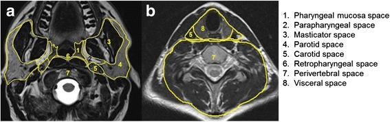
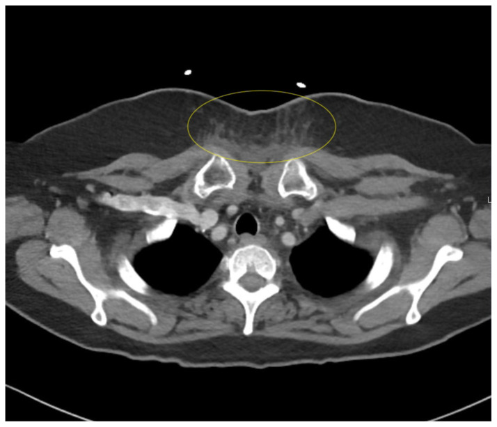
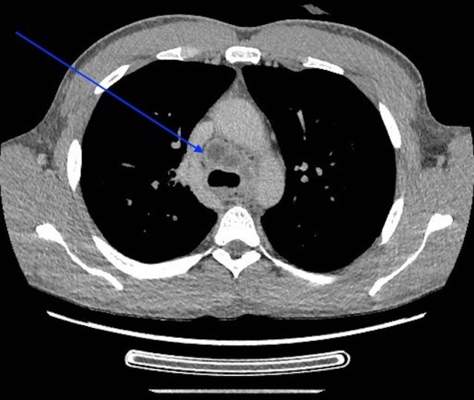

# Neck Spaces — Anatomy, Disease Spread & Nodal Levels

The deep neck is organised by the three layers of the deep cervical fascia into a set of named spaces; identifying which space a lesion arises from, and which direction it displaces the parapharyngeal fat, is the single most useful localising skill in head and neck imaging. CT and MRI are the dominant modalities — plain radiography and ultrasound play only supporting roles below the hyoid and for nodes.

## Classification framework (learn this first)

The deep cervical fascia has three layers, and the spaces are defined by how these layers split and fuse:

- **Superficial (investing) layer** — encloses the neck, splits to enclose the sternocleidomastoid and trapezius, and contributes to the masticator and parotid spaces.
- **Middle (visceral / buccopharyngeal) layer** — surrounds the pharynx, larynx, oesophagus, trachea and thyroid; forms the anterior wall of the retropharyngeal space.
- **Deep (prevertebral) layer** — surrounds the vertebral column and paraspinal muscles; splits into a prevertebral and an alar division, the alar division forming the boundary between the retropharyngeal and danger spaces.

**Spaces relative to the hyoid bone:**

| Suprahyoid neck | Infrahyoid neck | Spanning the whole neck (cranio-caudal) |
|---|---|---|
| Parapharyngeal | Visceral | Retropharyngeal |
| Pharyngeal mucosal | Posterior cervical | Danger |
| Masticator | Anterior cervical | Prevertebral / perivertebral |
| Parotid | | Carotid |
| Carotid (suprahyoid part) | | |
| Buccal | | |

A practical way to memorise the central suprahyoid spaces is that the **parapharyngeal space (PPS)** is a fat-filled crossroads sitting centrally, with the **pharyngeal mucosal space (PMS) medial**, the **masticator space (MS) anterolateral**, the **parotid space (PS) lateral**, the **carotid space (CS) posterolateral**, and the **retropharyngeal space (RPS) posteromedial**. The direction the PPS fat is pushed therefore tells you the space of origin.

### Direction of parapharyngeal fat displacement

| Space of origin | PPS fat displaced | Typical lesions |
|---|---|---|
| Pharyngeal mucosal (medial) | Laterally / posterolaterally | SCC, lymphoid hyperplasia, minor salivary tumour |
| Masticator (anterolateral) | Posteromedially | Odontogenic infection, sarcoma, nerve sheath tumour of V3 |
| Parotid (lateral) | Medially | Pleomorphic adenoma, Warthin, deep-lobe tumours |
| Carotid (posterolateral) | Anteriorly | Paraganglioma, schwannoma, nodal disease |
| Retropharyngeal (posteromedial) | Anterolaterally | Nodal disease, abscess, lipoma |

### Cervical nodal level classification (I-VII)

| Level | Region | Boundaries (working description) |
|---|---|---|
| IA | Submental | Between anterior bellies of digastric, above hyoid |
| IB | Submandibular | Posterior to IA, anterior to posterior edge of submandibular gland |
| II | Upper internal jugular | Skull base to lower body of hyoid; split into IIA/IIB by the spinal accessory nerve |
| III | Mid jugular | Hyoid to lower cricoid cartilage |
| IV | Lower jugular | Lower cricoid to clavicle |
| V | Posterior triangle (spinal accessory + transverse cervical) | Posterior to SCM; VA above and VB below the lower cricoid level |
| VI | Anterior / visceral (pretracheal, prelaryngeal-Delphian, paratracheal) | Hyoid to suprasternal notch, between carotids |
| VII | Superior mediastinal | Below suprasternal notch (caudal extent variably defined — verify exact value) |

## Modality-wise approach (CT/MRI dominate)

**Plain radiography (XR).** Of limited value in the deep neck. A lateral soft-tissue neck film can show widening of the prevertebral / retropharyngeal soft tissues (in a child, prevertebral soft tissue should not greatly exceed the AP width of the adjacent vertebral body — verify exact value), loss of cervical lordosis, an air-fluid level in a retropharyngeal abscess, or gas in the soft tissues with necrotising infection. A chest film is essential when descending mediastinitis is suspected, showing mediastinal widening, an air-fluid level or pleural effusion. Otherwise radiography does not resolve the deep spaces and is largely superseded.

**Ultrasound (US).** The workhorse for superficial nodes and the thyroid, and for guiding fine-needle aspiration, but it cannot see deep to bone or air and so cannot evaluate the retropharyngeal, prevertebral or deep masticator compartments. For nodes, US shows shape (round versus oval), loss of the fatty echogenic hilum, eccentric cortical thickening, and on Doppler a shift from normal hilar vascularity to peripheral or chaotic flow — all features that raise suspicion of malignancy. US is operator-dependent and gives no information on deep extension or skull-base involvement.

**CT.** Contrast-enhanced CT is the primary modality for most deep neck pathology, especially infection, because it is fast, tolerant of unwell patients, and excellent for gas, abscess wall enhancement, bone erosion and airway compromise. A rim-enhancing low-attenuation collection that displaces and effaces adjacent fat plane indicates an abscess; gas within it strongly suggests a necrotising or odontogenic source. CT defines the craniocaudal extent of retropharyngeal and danger-space collections and detects descent into the mediastinum. For nodes, CT shows size, central low-attenuation necrosis, irregular margins and breach of the capsule with stranding of adjacent fat (extranodal extension).

**MRI.** Superior for soft-tissue characterisation, perineural spread, marrow infiltration and skull-base involvement, and therefore the modality of choice for staging neoplasms and for evaluating deep-space and parapharyngeal masses. The fat of the PPS is bright on T1 and provides natural contrast, so the direction of its displacement is best appreciated on a T1 axial sequence. MRI distinguishes a true retropharyngeal abscess (rim-enhancing, restricted diffusion centrally) from non-suppurative oedema (retropharyngeal effusion). Perineural tumour spread is shown as enhancement and thickening along V3 through foramen ovale into the masticator space, or along the facial nerve in the parotid. Marrow signal change on T1 is sensitive for mandibular invasion by an odontogenic or masticator-space process.

**Nuclear medicine.** FDG PET/CT is used for staging, for detecting an unknown primary in a patient presenting with malignant cervical nodes, for assessing treatment response and for surveillance. It complements rather than replaces anatomical CT/MRI; small-volume necrotic nodes and post-treatment inflammation can be pitfalls, and spatial resolution limits assessment of small nodes.

## Imaging criteria for a malignant node

| Feature | Benign / reactive | Suspicious for malignancy |
|---|---|---|
| Shape | Oval (long-to-short axis ratio high) | Round (ratio approaching 1) |
| Short-axis size | Below threshold for the level | Enlarged; level II often cited around 11 mm and other levels around 10 mm, retropharyngeal lower (verify exact value) |
| Hilum | Preserved fatty hilum | Lost hilum |
| Internal architecture | Homogeneous | Central necrosis (most reliable single sign of metastasis) |
| Margin / capsule | Smooth, well defined | Irregular, indistinct; perinodal fat stranding = extranodal extension |
| Vascularity (Doppler) | Central hilar | Peripheral / mixed / chaotic |
| Grouping | Few, scattered | Clustered, three or more borderline nodes |

**Extranodal (extracapsular) extension** — loss of the smooth nodal margin with infiltration of adjacent fat — is a key adverse prognostic feature and now influences staging in many sites; describe it explicitly when present.

## Differentials by space (quick reference)

| Space | Common benign | Common malignant / aggressive | Localising clue |
|---|---|---|---|
| Parapharyngeal | Lipoma, atypical pleomorphic adenoma | Rare primary; usually invaded from neighbours | Fat-containing; lesions usually secondary |
| Pharyngeal mucosal | Tornwaldt cyst, lymphoid hyperplasia | SCC, NHL, minor salivary | Displaces PPS fat laterally |
| Masticator | Odontogenic abscess, benign masseteric hypertrophy | Sarcoma, V3 nerve sheath tumour, SCC spread | Displaces PPS fat posteromedially; check mandibular marrow |
| Parotid | Pleomorphic adenoma, Warthin, sialadenitis | Mucoepidermoid, adenoid cystic (perineural) | Displaces PPS fat medially |
| Carotid | Schwannoma, paraganglioma | Nodal metastasis, NHL | Splays carotid and jugular; flow voids in paraganglioma |
| Retropharyngeal | Effusion, abscess, lipoma | Nodal metastasis (esp. nasopharyngeal) | Midline/paramedian behind pharynx |

## Spread of infection

The named spaces and fascial planes govern how neck infection spreads. **Ludwig angina** is a rapidly spreading cellulitis of the submandibular and sublingual spaces, usually from a mandibular molar, producing floor-of-mouth swelling, tongue elevation and airway threat; CT shows diffuse cellulitis, sometimes frank abscess and gas, and is used chiefly to assess the airway and locate drainable collections. **Retropharyngeal abscess** sits between the buccopharyngeal fascia anteriorly and the alar fascia posteriorly; it can rupture or extend through the alar fascia into the **danger space**, which runs from the skull base to the diaphragm and provides an unobstructed conduit to the posterior mediastinum, causing **descending necrotising mediastinitis** — a life-threatening complication best tracked on CT of the neck and chest. The carotid space is the route by which infection or tumour can reach the mediastinum alongside the great vessels, and septic thrombophlebitis of the internal jugular vein (Lemierre) is a recognised complication.

## Pearls and buzzwords

- The **parapharyngeal fat is the keystone** — read its direction of displacement first.
- **Posteromedial** displacement = masticator origin; **medial** = parotid; **lateral** = mucosal; **anterior** = carotid; **anterolateral** = retropharyngeal.
- **Central necrosis** is the most reliable imaging sign of nodal metastasis; **extranodal extension** is the key prognostic sign.
- A **round node with a lost fatty hilum** is suspicious regardless of borderline size.
- **Danger space** = skull base to diaphragm = highway to mediastinitis.
- **Ludwig angina** = bilateral submandibular/sublingual cellulitis; image to protect the airway.
- **CT first** for infection and airway; **MRI** for perineural spread, marrow and skull base; **PET/CT** for unknown primary and staging.
- Salivary **adenoid cystic carcinoma** loves perineural spread — chase the named nerve.

## What to draw

- An **axial schematic of the suprahyoid neck** with the central parapharyngeal fat and the surrounding mucosal, masticator, parotid, carotid and retropharyngeal spaces, with arrows showing the four directions of PPS fat displacement.
- A **sagittal/coronal schematic of the fascial planes** showing the retropharyngeal space, the alar fascia, and the danger space running down to the mediastinum.
- A **neck outline annotated with nodal levels I-VII** and their key boundaries (hyoid, cricoid, SCM, carotids).
- A **single node diagram** labelling the malignant features: round shape, lost hilum, central necrosis, irregular margin with extranodal extension.

## Further reading

- Harnsberger, *Diagnostic Imaging: Head and Neck* — suprahyoid and infrahyoid spaces.
- Som & Curtin, *Head and Neck Imaging* — fascial spaces and patterns of disease spread.
- Imaging-based nodal level classification consensus guidelines (cross-check current edition for exact boundaries and size thresholds before quoting numbers).
