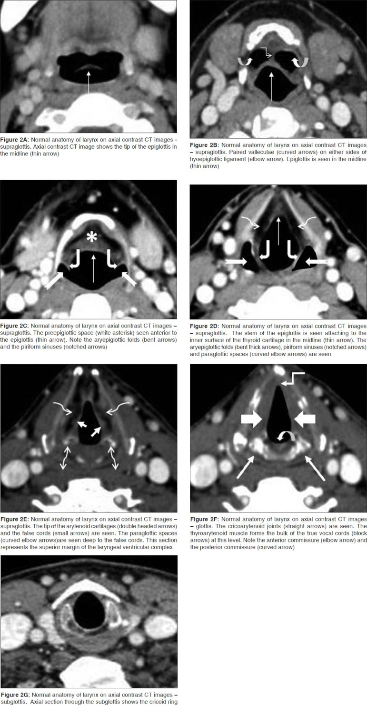
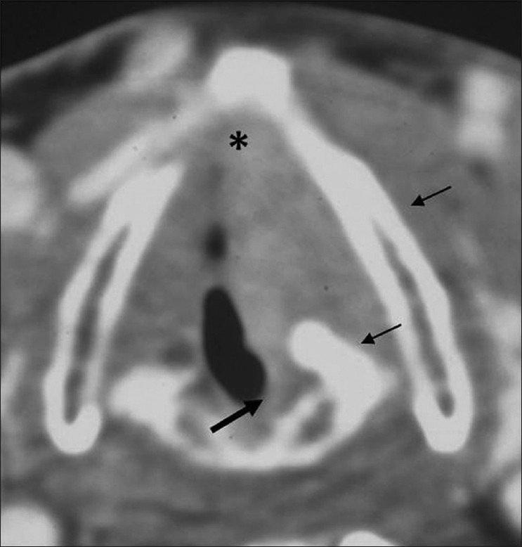
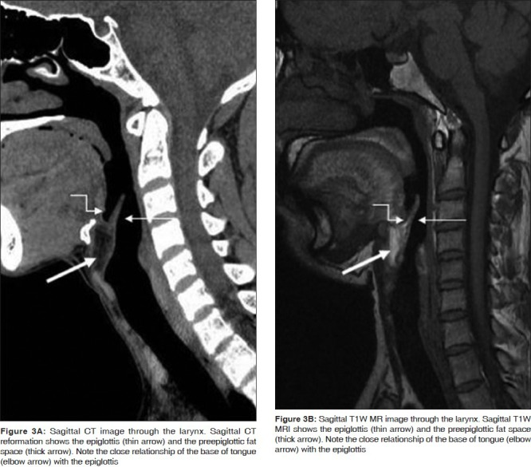
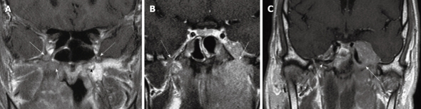

# Larynx, Pharynx & Head-Neck Malignancy Staging

Head and neck malignancy staging is one of the most cross-section-imaging-dependent areas of radiology, because clinical/endoscopic examination sees only the mucosal surface while CT and MRI define the deep, submucosal and cartilaginous spread that actually changes the T-stage. This topic is best learned as anatomy-first (knowing the spaces a tumour can spread into), then site-specific (larynx, hypopharynx, nasopharynx, oral cavity/oropharynx), then a unified view of nodal disease and the role of each modality.

## 1. Classification & anatomical framework (learn this first)

### Laryngeal subsites
The larynx is divided craniocaudally into three regions, and T-staging differs by region:

- **Supraglottis** — from the tip of the epiglottis down to (but not including) the laryngeal ventricle. Includes epiglottis, aryepiglottic folds, arytenoids and false (vestibular) cords. Rich lymphatic drainage, so nodal metastasis is common and often bilateral.
- **Glottis** — the true vocal cords plus the anterior and posterior commissures; conventionally taken as the plane of the true cords extending about 1 cm inferiorly (verify exact value). Sparse lymphatics, so early glottic cancer has a low rate of nodal spread.
- **Subglottis** — from the lower border of the glottis to the lower border of the cricoid cartilage. Tumours here are uncommon and present late.

### Deep laryngeal spaces (the key to spread)
- **Pre-epiglottic space (PES)** — fat-filled space anterior to the epiglottis, bounded by the hyoid/thyrohyoid membrane anteriorly and the epiglottis posteriorly. Invasion is well shown on sagittal MRI/CT.
- **Paraglottic space (PGS)** — fat-containing space deep to the true and false cords, lateral to the laryngeal ventricle, medial to the thyroid cartilage. It is the principal conduit for **transglottic** (supraglottic-to-glottic-to-subglottic) and submucosal spread. The PES and PGS communicate, which is why supraglottic tumours readily reach the paraglottic fat.

### Laryngeal cartilage framework
Thyroid, cricoid and arytenoid cartilages. Their ossification is variable and non-uniform, which is the central pitfall in assessing cartilage invasion. Cartilage invasion upstages tumour.

### Pharyngeal subdivisions
- **Nasopharynx** — from skull base/choana to the level of the soft palate; the fossa of Rosenmuller is the commonest origin of nasopharyngeal carcinoma (NPC).
- **Oropharynx** — soft palate, tonsillar region, base of tongue, posterior pharyngeal wall. Strong HPV association.
- **Hypopharynx** — pyriform (piriform) sinuses, postcricoid region, posterior hypopharyngeal wall. Pyriform sinus is the commonest hypopharyngeal subsite; tumours present late with poor prognosis.

### TNM logic (general, AJCC framework — verify edition-specific numbers)
- **T** reflects local extent: increasing size, fixation/impaired cord mobility, invasion of adjacent spaces, cartilage invasion, and extralaryngeal/extra-mucosal spread.
- **N** reflects nodal involvement: number, size, laterality and (in the current AJCC era) **extranodal extension (ENE)** for most non-NPC, non-HPV sites.
- **M** distant metastasis.
- HPV-positive (p16+) oropharyngeal cancer and NPC have their **own separate staging systems** distinct from conventional mucosal squamous cell carcinoma (SCC).

## 2. Modality-wise approach

For head and neck mucosal malignancy, **CT and MRI are the dominant staging modalities** and plain radiography and ultrasound have only niche roles. PET-CT is increasingly central for nodal/distant disease, unknown primary and post-treatment surveillance.

### Plain radiography (XR)
Essentially obsolete for staging. A lateral soft-tissue neck film may show a bulky supraglottic/epiglottic mass or airway narrowing, and a barium/contrast swallow can outline a hypopharyngeal/postcricoid lesion as a mucosal irregularity or filling defect, but neither defines deep extent. Mention only to say they are inadequate for T-staging.

### Ultrasound (US)
US has **no role in primary T-staging** of laryngeal/pharyngeal tumours (air and cartilage block the beam). Its real value is **nodal assessment and US-guided FNAC/core biopsy** of suspicious cervical nodes, and assessment of thyroid/extralaryngeal soft tissue. Suspicious nodal features on US include rounded shape (loss of normal oval/elliptical morphology), loss of the fatty echogenic hilum, peripheral/chaotic vascularity on Doppler, and intranodal necrosis.

### CT (workhorse for most sites)
Contrast-enhanced CT with thin sections (and often during quiet breathing and a phonation/Valsalva manoeuvre) is the first-line cross-sectional tool. CT is fast, less prone to motion/swallowing artefact than MRI, and excellent for:
- mapping mucosal and submucosal extent and obliteration of the paraglottic/pre-epiglottic fat (fat is low density and easy to lose);
- detecting **gross cartilage invasion**, extralaryngeal spread through the thyrohyoid membrane or cricothyroid space, and airway compromise;
- nodal mapping by level, with necrosis and irregular/spiculated margins indicating ENE.

CT limitation: distinguishing **non-ossified cartilage and tumour-adjacent inflammation/oedema from true cartilage invasion** is difficult, because non-ossified cartilage has soft-tissue density similar to tumour. CT tends to be specific for sclerosis but less so for early erosion; sclerosis of cartilage is sensitive but not specific (verify exact figures).

### MRI (problem-solving, cartilage and deep spread)
MRI gives superior soft-tissue contrast and is the better tool for **cartilage invasion, pre-epiglottic/paraglottic space involvement, tongue-base and perineural spread, and skull base/intracranial extension in NPC**. Standard protocol: T1 (fat is bright, good for marrow/fat-space infiltration), fat-suppressed T2 and post-gadolinium fat-suppressed T1.

The classic MRI rule for cartilage invasion: **non-ossified cartilage is low signal on T1 and T2; ossified (fatty marrow) cartilage is high T1.** Tumour invasion replaces these with intermediate T2 signal and enhancement matching the tumour. The pitfall is **peritumoural inflammation/oedema**, which is markedly high on T2 and also enhances, leading MRI to **over-call** cartilage invasion (high sensitivity, lower specificity). Some workers favour intermediate (not very high) T2 signal and similar low ADC to the tumour as more specific for true invasion (verify thresholds). MRI is more prone to swallowing/breathing motion degradation than CT.

For **NPC**, MRI is the modality of choice: it shows fossa of Rosenmuller origin, deep extension into the parapharyngeal space and masticator space, skull base marrow infiltration (loss of normal fatty T1 marrow signal at clivus/petrous apex), and spread through the **foramina** (foramen ovale/V3 perineural spread, foramen lacerum, jugular foramen) into the cavernous sinus and intracranial compartment.

### Nuclear medicine / PET-CT
FDG PET-CT is valuable for: nodal staging in clinically/CT-equivocal necks, detecting **distant metastases and synchronous second primaries**, evaluating the **unknown primary** presenting as a metastatic neck node, and **post-treatment surveillance**. After chemoradiotherapy, a PET-CT performed at an adequate interval (commonly around 12 weeks; verify exact value) has a high negative predictive value for residual nodal disease and helps avoid unnecessary neck dissection. Limitations: post-radiation inflammatory FDG uptake causes false positives if imaged too early; physiological uptake in muscles/lymphoid tissue; spatial resolution limits for small nodes.

## 3. Site-specific T-staging drivers (what changes the stage)

| Site | Imaging features that upstage T | Key spaces/structures |
|---|---|---|
| Supraglottic Ca | Pre-epiglottic / paraglottic fat invasion, tongue base/vallecula extension, cartilage invasion, extralaryngeal spread | PES, PGS, epiglottis |
| Glottic Ca | Impaired/fixed cord (paraglottic invasion), subglottic extension, cartilage invasion, extralaryngeal spread; anterior commissure involvement | PGS, anterior commissure, thyroid cartilage |
| Subglottic Ca | Cricoid invasion, extralaryngeal spread, thyroid gland invasion | Cricoid cartilage |
| Hypopharynx (pyriform) | Apex involvement, fixation of hemilarynx, thyroid/cricoid cartilage invasion, oesophageal/soft-tissue spread | Pyriform apex, post-cricoid, larynx |
| Nasopharynx (NPC) | Parapharyngeal extension, skull base/clivus marrow invasion, foraminal/perineural spread, intracranial/cavernous sinus | Fossa of Rosenmuller, foramina, clivus |
| Oral cavity / oropharynx | Depth of invasion, mandibular/maxillary cortical and marrow invasion, masticator space, extrinsic tongue muscle involvement | Mandible, tongue, tonsil/BOT |

**Transglottic tumour** = tumour crossing the laryngeal ventricle to involve both supraglottis and glottis (often via paraglottic space); associated with higher rate of cartilage invasion and nodal disease.

**HPV/p16-positive oropharyngeal SCC** classically arises in younger non-smokers, is often a small primary (sometimes occult, in tonsil or tongue base) with **cystic cervical nodes**, and carries a markedly better prognosis — hence its separate, downstaged TNM system.

## 4. Differentials & comparison tables

### Cartilage invasion: CT vs MRI
| Feature | CT | MRI |
|---|---|---|
| Gross invasion (extralaryngeal tumour through cartilage) | Reliable | Reliable |
| Early/sclerotic change | Sclerosis sensitive, not specific | Marrow signal change shown well |
| Main weakness | Cannot reliably separate non-ossified cartilage/oedema from tumour | Over-calls invasion due to peritumoural oedema (lower specificity) |
| Speed / motion | Fast, robust | Slower, motion-prone |
| Overall | Good first-line, gross disease | Problem-solving, soft-tissue/skull base |

### Benign vs malignant cervical node (imaging)
| Feature | Benign/reactive | Malignant |
|---|---|---|
| Shape | Oval/elliptical | Rounded |
| Hilum | Preserved fatty hilum | Lost |
| Internal architecture | Homogeneous | Necrosis/cystic change, heterogeneous |
| Margins | Smooth | Irregular = extranodal extension |
| Size threshold | Below site-specific cut-off | Above cut-off (commonly short-axis >1 cm, retropharyngeal/level II often lower; verify exact value) |
| Vascularity (US Doppler) | Central hilar | Peripheral/mixed chaotic |

## 5. Pearls & buzzwords
- **Paraglottic and pre-epiglottic fat** are the highways of laryngeal spread — always check the fat planes.
- **Anterior commissure**: normally only a thin soft-tissue stripe; any nodularity raises concern for tumour and possible cartilage invasion.
- CT cartilage rule: **sclerosis = sensitive but not specific; extralaryngeal soft tissue = specific for invasion.**
- MRI cartilage rule: **non-ossified cartilage low on T1/T2; tumour shows intermediate T2 + enhancement; high T2 oedema is the false-positive trap.**
- **Cystic neck node in a young adult = think HPV-positive oropharyngeal (tonsil/BOT) primary**, not branchial cleft cyst, until proven otherwise.
- **Fossa of Rosenmuller** asymmetry + skull base marrow loss on T1 = NPC.
- **Perineural spread** along V3 through foramen ovale: look for foraminal enlargement, loss of fat, and enhancement.
- Post-CRT PET-CT too early gives false-positive inflammatory uptake — respect the interval.
- Pyriform sinus apex tumours abut the larynx and frequently invade cartilage — examine the apex carefully.

## 6. What to draw
- A craniocaudal sagittal/coronal schematic of the larynx labelling supraglottis, glottis (true cords), subglottis, ventricle, epiglottis, with the **pre-epiglottic and paraglottic fat spaces** shaded and arrows showing transglottic spread.
- An axial diagram at the glottic level: thyroid cartilage, anterior commissure stripe, paraglottic space, with a tumour eroding/sclerosing the thyroid cartilage.
- A skull base diagram for NPC: fossa of Rosenmuller, parapharyngeal space, clivus, foramen ovale/lacerum/jugulare with arrows of perineural and foraminal spread.
- A neck-level nodal map (levels I-VII) annotated with one labelled malignant node showing necrosis and irregular ENE margin.

## 7. Further reading
- AJCC Cancer Staging Manual (current edition) — head and neck chapters (confirm the edition in use for your exam).
- Som & Curtin, Head and Neck Imaging (standard reference text).
- Standard radiology review texts/articles on laryngeal cartilage invasion (CT vs MRI) and on PET-CT in post-treatment head and neck surveillance.
