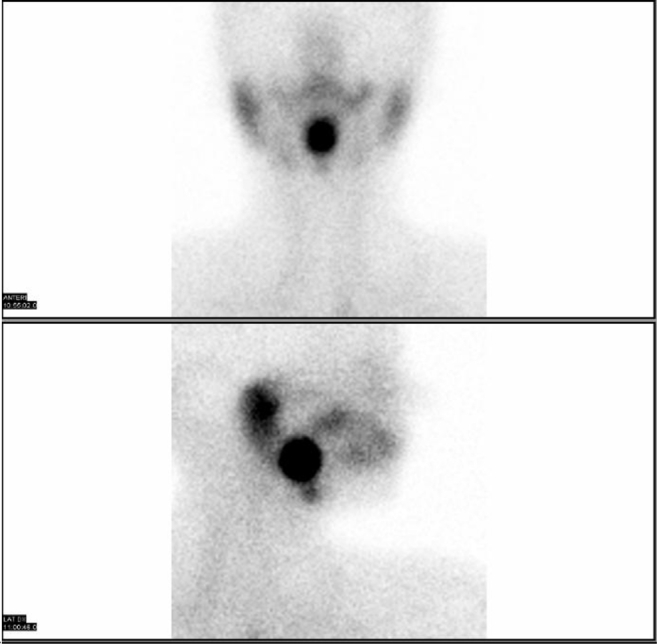
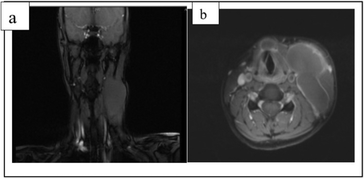
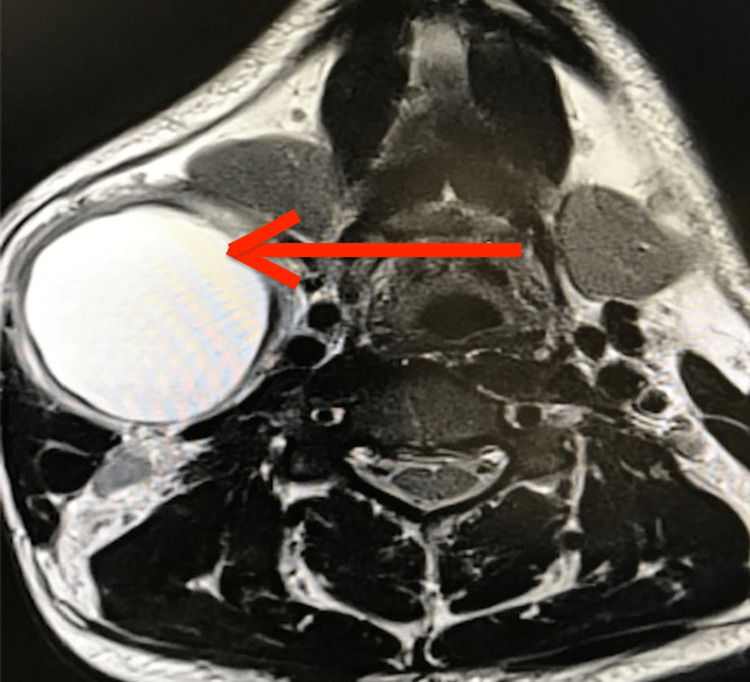

# Congenital Neck Masses (thyroglossal, branchial, etc.)

Congenital neck masses are best approached by **location** (midline vs lateral vs trans-spatial) and **patient age**, because the differential narrows dramatically once you fix the compartment and the typical decade of presentation. CT and MRI dominate characterisation in the head and neck; ultrasound is the first-line paediatric screen, and nuclear medicine has a narrow but decisive role for thyroid tissue.

## 1. Classification / enumeration framework

A practical way to enumerate congenital cystic and vascular neck lesions:

**By location:**
- **Midline** — thyroglossal duct cyst (commonest), dermoid/epidermoid, ectopic (lingual) thyroid, ranula (floor of mouth, may be paramedian).
- **Lateral** — branchial cleft cysts (2nd commonest congenital neck mass overall), most along the anterior border of sternocleidomastoid (SCM).
- **Posterior triangle / trans-spatial** — lymphatic malformation (cystic hygroma).
- **Anywhere, often trans-spatial** — vascular malformations (venous, arteriovenous, lymphatic, combined).

**By embryological origin:**
- Thyroglossal duct remnant (failed involution of the duct from foramen cecum to thyroid bed).
- Branchial apparatus remnants (1st, 2nd, 3rd, 4th cleft/pouch anomalies).
- Lymphatic/vascular dysgenesis (ISSVA framework).
- Inclusion / ectodermal rests (dermoid, epidermoid).

**ISSVA (vascular anomalies) — top-level split:**
- **Vascular tumours** (e.g. infantile haemangioma — proliferating then involuting).
- **Vascular malformations**, subdivided by flow:
  - *Low-flow*: capillary, venous, lymphatic (macrocystic / microcystic / mixed), and combined.
  - *High-flow*: arteriovenous malformation (AVM) and arteriovenous fistula.

## 2. Modality-wise findings (XR -> US -> CT -> MRI -> nuclear)

### Plain radiography (XR)
Limited and largely historical for these lesions. A soft-tissue neck radiograph may show a non-specific soft-tissue mass or airway displacement; phleboliths (rounded calcifications) within a soft-tissue mass on a plain film suggest a venous malformation. XR cannot characterise cyst contents and is not the modality of choice — proceed to cross-sectional imaging.

### Ultrasound (US)
First-line in children and for any palpable neck lump. It confirms the cystic nature, defines location relative to the hyoid and SCM, and uses **Doppler** to separate avascular cysts from flowing vascular malformations.
- **Thyroglossal duct cyst (TGDC):** well-defined midline (or near-midline) anechoic to hypoechoic cyst, often with internal echoes/septa if previously infected; intimately related to the hyoid. **Crucially, US must confirm a normal orthotopic thyroid gland in the thyroid bed** before any surgery, so that the cyst is not the patient's only functioning thyroid tissue.
- **Branchial cleft cyst:** anechoic/hypoechoic cyst at the angle of the mandible / anterior to SCM; internal debris and a thicker wall after infection.
- **Lymphatic malformation:** multiseptated cystic mass, macrocystic locules often show **fluid-fluid levels** (from prior haemorrhage); no significant internal arterial flow.
- **Venous malformation:** compressible, may show monophasic low-velocity flow and phleboliths.
- **AVM:** numerous flow voids/channels with high-velocity, low-resistance arterial waveforms and arterialised veins on Doppler.

### CT (contrast-enhanced)
Excellent for cyst location, wall enhancement, fistulous tracts and complications (infection, airway compromise). In an adult, a unilocular cystic neck mass should never be assumed benign — **cystic nodal metastasis (e.g. HPV-related oropharyngeal squamous cell carcinoma) is the key mimic of a branchial cleft cyst** and must be excluded.
- **TGDC:** thin-walled, low-attenuation midline cyst embedded in or abutting the hyoid/strap muscles; wall enhancement and higher attenuation suggest infection. A soft-tissue/enhancing nodule within the cyst raises concern for rare thyroglossal duct carcinoma (verify in suspicious cases).
- **Branchial cleft cyst:** smooth, low-attenuation cyst; classic 2nd-cleft location is posterolateral to the submandibular gland, lateral to the carotid space, anteromedial to SCM. A "beak" of tissue pointing between the internal and external carotid arteries is the described pointer toward the carotid bifurcation.
- **Lymphatic malformation:** low-attenuation multilocular trans-spatial mass insinuating between structures without mass effect proportional to size; fluid-fluid levels.
- **Vascular malformations:** venous lesions enhance gradually and may contain phleboliths; AVMs show enlarged feeding/draining vessels and avid enhancement; CTA can map flow.

### MRI (best soft-tissue characterisation)
The workhorse for mapping extent, trans-spatial spread and content (proteinaceous fluid, blood products, fat).
- **Cysts (TGDC, branchial, ranula):** T2 hyperintense; T1 signal varies with protein/haemorrhage (simple fluid low T1; proteinaceous/haemorrhagic fluid higher T1); thin wall with little enhancement unless infected.
- **Dermoid vs epidermoid:** an **epidermoid follows fluid on all sequences and shows characteristic restricted diffusion (bright on DWI)**; a **dermoid contains fat** (T1 hyperintense components, suppresses on fat-saturation) and may show heterogeneous "sack of marbles" fat globules.
- **Lymphatic malformation:** lobulated, very high T2 signal, fluid-fluid levels, thin septal enhancement only (the locule contents do not enhance).
- **Venous malformation:** lobulated, very high T2, gradual/heterogeneous enhancement, signal-void phleboliths.
- **AVM:** clustered **flow voids** with no discrete soft-tissue mass (a "bag of worms"); dynamic/MRA confirms high flow.
- **Ranula:** simple ranula is confined to the sublingual space; **plunging (diving) ranula** herniates through or around mylohyoid into the submandibular space, classically with a **"tail" sign** pointing back to the sublingual space.

### Nuclear medicine
Narrow but decisive role for thyroid tissue. **Tc-99m pertechnetate (or I-123) scintigraphy demonstrates functioning ectopic thyroid** — most importantly a **lingual thyroid** at the tongue base, and confirms whether normal thyroid tissue is present in the thyroid bed. This is the safeguard before excising a suspected TGDC, since the "cyst" or a base-of-tongue mass could be the only functioning thyroid tissue. No routine nuclear role for branchial, lymphatic or vascular lesions.

## 3. Differentials / comparison tables

### Midline vs lateral cystic neck mass

| Feature | Thyroglossal duct cyst | Branchial cleft cyst (2nd) |
|---|---|---|
| Location | Midline / paramedian, at or near hyoid | Lateral, angle of mandible / anterior SCM |
| Relation to hyoid | Embedded in or abutting hyoid; moves with swallowing/tongue protrusion | Unrelated to hyoid |
| Typical age | Children and young adults | Late childhood to young adult |
| Key safeguard | Confirm orthotopic thyroid present | Exclude cystic nodal metastasis in adults |
| Malignant mimic | Thyroglossal duct carcinoma (rare) | Cystic SCC node (HPV-related) |

### Branchial cleft anomalies by cleft (locations are characteristic, not absolute)

| Cleft | Typical location / course | Notes |
|---|---|---|
| 1st | Periauricular / parotid / external auditory canal region | May parallel the EAC; relation to facial nerve relevant surgically |
| 2nd | Angle of mandible, anterior to SCM, lateral to carotid space (commonest) | Bailey types I-IV by depth (verify exact type definitions) |
| 3rd | Posterior triangle / upper thyroid, sinus toward pyriform sinus | Recurrent neck infection in children |
| 4th | Left-sided lower neck / thyroid, tract to pyriform sinus apex | Recurrent left thyroid lobe abscess / suppurative thyroiditis |

### Cystic vs vascular trans-spatial lesions

| Feature | Lymphatic malformation | Venous malformation | AVM |
|---|---|---|---|
| Flow | None (low-flow) | Low-flow | High-flow |
| US/Doppler | Septated cysts, fluid-fluid levels, no arterial flow | Compressible, phleboliths, slow flow | Flow voids, arterialised waveforms |
| MRI | Very high T2, septal enhancement only | High T2, gradual enhancement, phleboliths | Flow voids, no soft-tissue mass |
| Classic site | Posterior triangle, trans-spatial | Anywhere | Anywhere |

## 4. Pearls & buzzwords

- **TGDC:** "midline, moves with tongue protrusion, embedded in the hyoid." Always **prove orthotopic thyroid** before excision (Sistrunk procedure removes the central hyoid).
- **Branchial cyst:** "angle of mandible, anterior to SCM"; the **carotid beak sign** pointing to the bifurcation. In adults, "**a cystic neck node is metastasis until proven otherwise**."
- **4th branchial anomaly:** "recurrent **left**-sided suppurative thyroiditis in a child."
- **Lymphatic malformation:** "trans-spatial, posterior triangle, **fluid-fluid levels**, insinuates without respecting fascial planes."
- **Epidermoid:** "**restricts diffusion**." **Dermoid:** "**contains fat / sack of marbles**."
- **Plunging ranula:** "**tail sign** back to the sublingual space, herniates around mylohyoid."
- **Venous malformation:** "**phleboliths**." **AVM:** "**bag of worms** of flow voids, no mass."
- **Lingual thyroid:** "tongue-base mass — scan before you cut; it may be the only thyroid."

## 5. What to draw

- A **compartment map** of the neck: midline (TGDC, dermoid, ectopic thyroid), lateral SCM line (2nd branchial cyst), and posterior triangle (lymphatic malformation), labelled with the typical lesion of each zone.
- A **sagittal midline sketch** of the thyroglossal tract from foramen cecum to thyroid bed, showing a cyst at the hyoid level.
- An **axial diagram** of the classic 2nd branchial cyst: anteromedial to SCM, posterolateral to submandibular gland, lateral to the carotid space, with the carotid "beak."
- A simple **ISSVA tree**: tumours vs malformations; low-flow (capillary/venous/lymphatic) vs high-flow (AVM).

## 6. Further reading

- Harnsberger, *Diagnostic Imaging: Head and Neck* (congenital cystic lesions chapters).
- Som & Curtin, *Head and Neck Imaging* (congenital and developmental lesions).
- ISSVA Classification of Vascular Anomalies (current revision) for malformation terminology.
- A standard radiology reference review on congenital neck cysts in children for the location-and-age approach.
