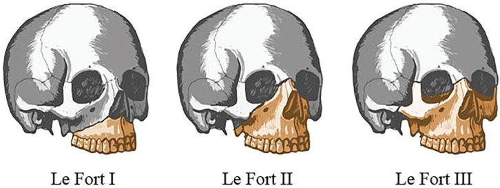
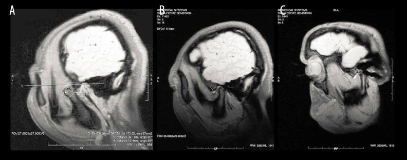
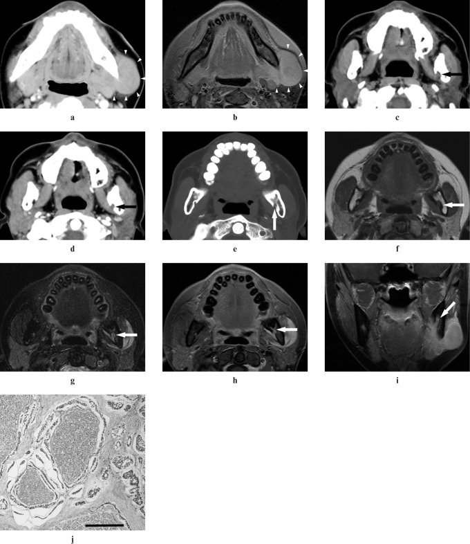

# Maxillofacial, Dental, TMJ & Salivary Glands

A broad regional topic where cross-sectional imaging dominates: facial trauma is mapped on multidetector CT with multiplanar and 3D reconstructions, odontogenic lesions are first seen on dental radiographs but characterised on CT/CBCT, and the temporomandibular joint and salivary glands are problems largely solved with MRI and ultrasound respectively. Plain film and conventional sialography retain niche roles. Always pair this prose with image plates; descriptions here are scaffolding, not a substitute for films.

## 1. Classification and enumeration frameworks (learn these first)

### Facial fracture patterns
- **Le Fort fractures** (require a fracture through the **pterygoid plates** in all three types — the unifying feature):
  - **Le Fort I** (Guerin / "floating palate") — horizontal fracture above the apices of the teeth through the maxillary antra and lower nasal septum, separating the alveolus and palate from the midface.
  - **Le Fort II** (pyramidal) — fracture through the nasal bones, frontal process of maxilla, medial and inferior orbital walls/rim and zygomaticomaxillary buttress; the central pyramid (nose + maxilla) becomes mobile.
  - **Le Fort III** (craniofacial disjunction / "floating face") — separation of the entire facial skeleton from the skull base through the nasofrontal suture, medial and lateral orbital walls and zygomatic arches.
  - In practice fractures are often **mixed/asymmetric** rather than pure; the constant clue is the pterygoid plate involvement.
- **Zygomaticomaxillary complex (ZMC) / "tripod" fracture** — fractures through (1) zygomaticofrontal suture, (2) zygomaticomaxillary buttress / inferior orbital rim and anterior maxillary sinus wall, and (3) zygomatic arch, plus the often-forgotten fourth limb at the **zygomaticosphenoid suture** in the lateral orbital wall (hence "tetrapod" is more accurate).
- **Naso-orbito-ethmoid (NOE) fracture** — comminution of the nasal bones, frontal processes of maxilla, ethmoid sinuses and medial orbital walls; key clinical concern is the **medial canthal tendon** and risk of traumatic telecanthus and lacrimal apparatus injury.
- **Mandibular fractures** — by anatomical site: symphysis/parasymphysis, body, angle, ramus, condylar neck/head, coronoid, alveolar. Because the mandible is a ring, fractures are commonly **two or more sites** ("guardsman's fracture" = bilateral parasymphyseal/condylar). Favourable vs unfavourable describes whether muscle pull distracts the fragments.

### Odontogenic cysts and tumours
- **Inflammatory cysts**: **radicular (periapical) cyst** — commonest jaw cyst; arises at the apex of a **non-vital** carious tooth.
- **Developmental cysts**: **dentigerous (follicular) cyst** — surrounds the crown of an **unerupted** tooth, attaching at the cemento-enamel junction; **odontogenic keratocyst (OKC)** — now classified by WHO as a (mostly) developmental cyst with aggressive behaviour and high recurrence; multiple OKCs suggest **naevoid basal cell carcinoma (Gorlin) syndrome**.
- **Benign odontogenic tumour**: **ameloblastoma** — locally aggressive, classically multilocular ("soap-bubble"/"honeycomb") in the **posterior mandible/ramus**.

### TMJ internal derangement
- Described by **disc position relative to the condyle**, assessed on MRI: normal, **anterior disc displacement with reduction** (disc reduces to normal position on opening), and **anterior disc displacement without reduction** ("closed lock"). Less common medial/lateral and posterior displacements occur. The posterior band normally sits at the **12 o'clock** position over the condyle in the closed mouth.

### Salivary gland disease
- **Inflammatory/obstructive**: sialolithiasis (calculi; ~80% submandibular/Wharton's duct), acute and chronic sialadenitis, autoimmune sialadenitis (**Sjogren syndrome**).
- **Benign tumours**: **pleomorphic adenoma** (commonest, usually parotid superficial lobe), **Warthin tumour** (papillary cystadenoma lymphomatosum — older male smokers, bilateral/multifocal).
- **Malignant tumours**: **mucoepidermoid carcinoma** (commonest salivary malignancy overall) and **adenoid cystic carcinoma** (notorious for **perineural spread**).
- Rule of thumb: the **larger** the gland of origin, the **lower** the proportion of tumours that are malignant (parotid mostly benign; sublingual/minor glands a high malignant fraction).

## 2. Modality-wise findings (XR -> US -> CT -> MRI -> nuclear)

### Plain radiography (XR)
For **facial trauma**, plain films (occipitomental "Waters", lateral, submentovertex) are now largely historical and insensitive; indirect signs include the **orbital "guttering"/teardrop sign** (herniated fat into the maxillary sinus from an orbital floor blowout), an **air-fluid level** in the maxillary antrum (haemosinus) and disruption of **McGrigor-Campbell lines**. They are superseded by CT.

For **dental/odontogenic lesions**, the **orthopantomogram (OPG/panoramic)** and intra-oral periapical films remain the genuine first-line tool and are very informative: a radicular cyst is a small well-corticated periapical lucency on a carious non-vital tooth; a dentigerous cyst is a unilocular pericoronal lucency around an unerupted (often third molar or canine) crown; an OKC is a uni- or multilocular lucency growing **along the marrow space** of the mandible with relatively little buccolingual expansion; ameloblastoma is an expansile multilocular "soap-bubble" lucency with **knife-edge root resorption** and cortical thinning.

For **mandibular fractures**, OPG plus a PA mandible gives a reasonable survey but the condyle and symphysis are blind spots — CT is preferred when available.

For **salivary glands**, a plain film or occlusal view may show a **radiopaque submandibular calculus**, but many stones (especially parotid) are radiolucent, so plain film has limited sensitivity.

### Ultrasound (US)
US is the **first-line cross-sectional tool for the superficial salivary glands** (parotid and submandibular), with no radiation and excellent soft-tissue contrast. It demonstrates ductal dilatation, stones (echogenic focus with posterior acoustic **shadowing**), and characterises masses: **pleomorphic adenoma** is well-defined, hypoechoic, lobulated with posterior enhancement; **Warthin tumour** is often hypoechoic with cystic/anechoic areas and may be bilateral; malignant lesions tend to be ill-defined with irregular margins and abnormal internal vascularity (a qualitative, not absolute, distinction). US guides FNAC/core biopsy. In **Sjogren**, the gland shows a heterogeneous, "leopard-skin"/honeycomb pattern of multiple small hypo-/anechoic foci. US does not assess the **deep parotid lobe or parapharyngeal extension** well — that needs CT/MRI. US has essentially no role in facial fracture or odontogenic lesion assessment.

### Computed tomography (CT) — the workhorse for trauma and bone lesions
**Facial trauma**: thin-section MDCT with **multiplanar (axial/coronal/sagittal) and 3D surface reconstructions** is the standard. It defines every Le Fort level (look specifically for pterygoid plate fractures), maps the ZMC tetrapod, demonstrates orbital floor/medial wall blowouts with herniated fat or extra-ocular muscle entrapment, comminution in NOE injuries, and mandibular fracture sites and displacement. Always assess for **haemosinus, orbital emphysema, globe injury, and intracranial extension/CSF leak** (especially Le Fort II/III and NOE).

**Odontogenic lesions**: **cone-beam CT (CBCT)** or MDCT shows lesion locularity, cortical expansion/perforation, relationship to the inferior alveolar canal, root resorption and tooth displacement. Ameloblastoma shows expansile multilocular lucency with cortical breach; OKC shows growth along the medulla; dentigerous cyst shows a corticated pericoronal lucency.

**Salivary glands**: CT (with contrast; an **unenhanced** phase helps detect calculi) shows stones, ductal dilatation, abscess and tumour extent, and is good for the deep lobe and nodal staging. Sialolithiasis and sialadenitis (enlarged enhancing gland, stranding, possible abscess) are well seen.

**CT/CBCT sialography** can be combined to map ductal anatomy when MR sialography is unavailable.

### Magnetic resonance imaging (MRI) — the workhorse for TMJ, soft tissue and perineural spread
**TMJ internal derangement**: dedicated **bilateral oblique-sagittal and oblique-coronal** sequences in **closed- and open-mouth** positions, using surface coils, are the reference standard. The normal disc is a low-signal biconcave "bow-tie" with the **posterior band at 12 o'clock**. Anterior displacement with reduction shows an anteriorly positioned disc in closed mouth that returns to a normal condyle-disc relationship on opening (often with a click); without reduction, the disc remains anterior on opening ("closed lock") and the disc may become deformed/folded. T2/STIR shows **joint effusion**; advanced disease shows condylar flattening, osteophytes and marrow oedema. Dynamic/cine sequences depict the click.

**Salivary tumours**: MRI characterises soft tissue best. **Pleomorphic adenoma** is typically very bright (high signal) on **T2** with a lobulated capsule; **Warthin tumour** tends to be lower on T2 with cystic components. Malignant lesions more often show **low T2 signal, ill-defined margins and infiltration**, though overlap exists. The critical role of MRI is detecting **perineural tumour spread** (especially **adenoid cystic carcinoma**) — look for nerve enlargement and enhancement, loss of fat in the foramen (e.g. foramen ovale for V3, the auriculotemporal-facial nerve communication), and denervation change. **MR sialography** (heavily T2-weighted) non-invasively maps the ductal tree without contrast or radiation.

**Odontogenic lesions**: MRI is a problem-solver for soft-tissue/marrow extent and for distinguishing a simple cyst from a solid tumour, but CT/CBCT remains primary for bone.

### Nuclear medicine
A limited, supporting role. **Salivary scintigraphy** (Tc-99m pertechnetate) assesses gland function/uptake and is occasionally used in Sjogren or to confirm a **Warthin tumour**, which characteristically concentrates pertechnetate (a pertinent buzzword). **Bone scintigraphy / SPECT** can show condylar activity in suspected condylar hyperplasia and is non-specific for fractures. **FDG PET-CT** is used for staging/restaging salivary malignancy and recurrence, with the caveat that benign Warthin and pleomorphic lesions and active sialadenitis can be FDG-avid (false positives).

## 3. Differentials and comparison tables

### Odontogenic cystic/lucent lesions
| Feature | Radicular cyst | Dentigerous cyst | Odontogenic keratocyst | Ameloblastoma |
|---|---|---|---|---|
| Nature | Inflammatory | Developmental | Developmental (aggressive) | Benign tumour |
| Tooth relation | Apex of non-vital tooth | Crown of unerupted tooth | Often around impacted tooth | Often unerupted molar region |
| Locularity | Unilocular, small | Unilocular | Uni- or multilocular | Multilocular "soap-bubble" |
| Growth pattern | Periapical | Pericoronal | Along marrow, little expansion | Expansile, cortical breach |
| Root resorption | Uncommon | Possible | Uncommon | Classic "knife-edge" |
| Recurrence | Low | Low | High | Moderate-high |
| Syndrome link | — | — | Gorlin syndrome (if multiple) | — |

### Salivary masses
| Feature | Pleomorphic adenoma | Warthin tumour | Mucoepidermoid ca | Adenoid cystic ca |
|---|---|---|---|---|
| Behaviour | Benign (commonest) | Benign | Malignant (commonest malignancy) | Malignant |
| Typical site | Parotid superficial lobe | Parotid, bilateral/multifocal | Parotid / minor glands | Minor glands, submandibular |
| Demographics | Middle-aged, F>M | Older male smokers | Variable | — |
| T2 signal (MRI) | Markedly high | Lower, cystic | Variable by grade | Often low (cellular) |
| Margins | Well-defined, lobulated | Well-defined, cystic | Variable | Often infiltrative |
| Signature | Risk of malignant transformation if long-standing | Pertechnetate uptake | Mucinous/cystic | Perineural spread |

### Facial fracture quick map
| Pattern | Defining feature | Key associated injury to seek |
|---|---|---|
| Le Fort I | Floating palate above tooth apices | Pterygoid plate fracture; haemosinus |
| Le Fort II | Pyramidal, central midface mobile | Orbital floor/rim, infraorbital nerve |
| Le Fort III | Craniofacial disjunction | Skull base, CSF leak |
| ZMC (tripod/tetrapod) | 4 articulations incl. zygomaticosphenoid | Orbital floor blowout, infraorbital nerve |
| NOE | Medial orbital/ethmoid comminution | Medial canthal tendon, lacrimal duct, telecanthus, CSF leak |
| Mandible | Usually 2+ sites (ring bone) | Condyle, inferior alveolar nerve, teeth in fracture line |

## 4. Pearls and buzzwords
- All three Le Fort fractures cross the **pterygoid plates** — that is the unifying diagnostic check.
- "Floating palate" = Le Fort I; "floating face"/craniofacial disjunction = Le Fort III.
- ZMC is really a **tetrapod** (don't forget the zygomaticosphenoid limb in the lateral orbital wall).
- Orbital floor blowout: "**teardrop**" sign and risk of inferior rectus **entrapment** (clinical-radiological correlation needed; consider a paediatric **trapdoor** fracture with minimal bone signs but marked entrapment).
- **Soap-bubble/honeycomb** multilocular lucency in the posterior mandible = think **ameloblastoma**.
- OKC grows **along the marrow** with little bullocular expansion; multiple OKCs -> **Gorlin syndrome**.
- Dentigerous cyst hugs the **crown** of an unerupted tooth; radicular cyst sits at the **apex** of a non-vital tooth.
- TMJ: normal disc posterior band at **12 o'clock**; "**closed lock**" = anterior displacement without reduction.
- Most submandibular stones are **radiopaque**; many parotid stones are radiolucent.
- **Warthin** tumour: older male smoker, bilateral, takes up **pertechnetate**.
- **Pleomorphic adenoma**: very **bright on T2**, can undergo malignant transformation if long-standing.
- **Adenoid cystic carcinoma** = **perineural spread**; hunt the named nerve on fat-suppressed post-contrast MRI.
- Bigger gland -> lower chance the tumour is malignant.

## 5. What to draw
- The three Le Fort lines on a frontal facial skeleton, all passing through the pterygoid plates, with I/II/III shaded differently.
- The ZMC "tetrapod" with its four articulations labelled.
- A mandible "ring" diagram marking the common fracture sites (symphysis, body, angle, condyle) and why fractures occur in pairs.
- A 2x2 of odontogenic lesions: radicular (apex), dentigerous (crown), OKC (marrow-spreading), ameloblastoma (multilocular soap-bubble).
- TMJ in closed vs open mouth: normal disc bow-tie at 12 o'clock vs anterior displacement with/without reduction.
- A salivary mass decision sketch: superficial (US-first) vs deep lobe/parapharyngeal (MRI), with the perineural pathway of adenoid cystic carcinoma.

## 6. Further reading
- Standard head and neck radiology reference texts (e.g. Som & Curtin, Head and Neck Imaging) for salivary, TMJ and maxillofacial chapters.
- Maxillofacial trauma chapters in emergency/trauma radiology texts for Le Fort, ZMC and NOE patterns.
- WHO Classification of Head and Neck Tumours for current odontogenic cyst/tumour terminology.
- Society/college head-and-neck imaging protocol guidance for TMJ MRI and MR sialography sequences.
