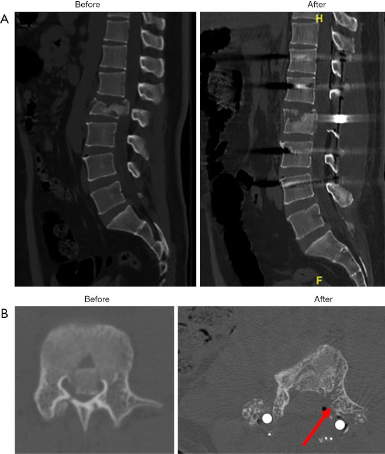
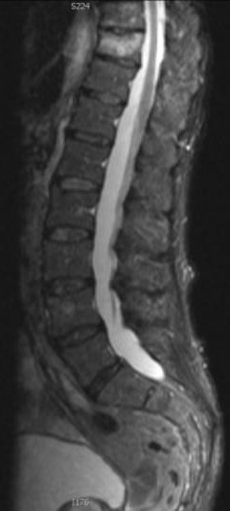

# Skeletal Trauma — Spine, Pelvis, Appendicular

> Frame every answer the same way: **mechanism → stability → classification → role of each modality → complications.** In skeletal trauma the marks live in the *classification framework* and in the *imaging algorithm* (which modality, in what order, looking for what). XR is the screening/first-line tool; **CT is the work-horse for bony detail, complex/comminuted fractures and surgical planning; MRI answers the soft-tissue questions** — cord, ligaments, marrow oedema, and the radiographically occult fracture. Always state explicitly where a modality's role is limited.

---

## 1. Classification frameworks (learn these first)

### Spine

**Cervical — upper cervical (eponymous):**
- **Jefferson fracture** — burst fracture of the C1 ring (classically a 4-part injury, but 2- and 3-part variants occur). Mechanism: axial load onto the vertex. Key sign: lateral displacement/overhang of the C1 lateral masses relative to the C2 superior articular surfaces on the open-mouth (peg) view; combined overhang suggests transverse ligament rupture (instability — verify the exact summed-overhang threshold against a current reference before quoting a number).
- **Hangman's fracture** — bilateral fracture through the C2 pars interarticularis (traumatic spondylolisthesis of the axis); mechanism is hyperextension with axial loading (distraction is added in the higher-grade Levine–Edwards types).
- **Odontoid (dens) fracture — Anderson & D'Alonzo I–III:** type I = avulsion of the dens tip (alar ligament; rare), **type II = fracture across the base of the dens (commonest, highest non-union risk** because of the watershed blood supply), type III = fracture extending into the C2 body (best healing, broad cancellous surface).

**Cervical — subaxial (C3–C7):** described with the **SLIC** system (Subaxial Cervical Spine Injury Classification): a composite of *injury morphology* + *disco-ligamentous complex integrity* + *neurological status*. Avoid quoting the exact point cut-off for operative management unless certain (verify exact value).

**Thoracolumbar — the two frameworks that earn marks:**
- **Denis three-column concept** — divides the vertebra into:
  - **Anterior column:** anterior longitudinal ligament + anterior two-thirds of the body/annulus.
  - **Middle column:** posterior third of the body + posterior annulus + posterior longitudinal ligament. *This is the critical column* — its integrity defines a burst fracture and largely determines stability.
  - **Posterior column:** the bony neural arch + posterior ligamentous complex (PLC: supraspinous, interspinous, ligamentum flavum, facet capsules).
  - **Rule of thumb: disruption of ≥2 columns = mechanically unstable.**
- **TLICS / AO Spine** — modern, management-oriented schemes scoring *fracture morphology* + *PLC integrity* + *neurological status*. The PLC is the pivotal element steering operative vs conservative care.

**Thoracolumbar fracture morphologies:**
| Type | Columns involved | Mechanism | Hallmark |
|---|---|---|---|
| Compression (wedge) | Anterior only | Flexion / axial load | Anterior height loss, *intact* middle column, no retropulsion |
| Burst | Anterior + middle | Axial load | Retropulsion of the posterosuperior fragment into the canal; widened interpedicular distance |
| Chance (flexion-distraction) | All three, *horizontally* | Flexion over a fulcrum (lap seat-belt) | Horizontal split through body + posterior elements; associated bowel/mesenteric injury |
| Fracture-dislocation | All three | Shear / rotation / flexion-distraction | Translation/rotation, facet disruption — grossly unstable, high cord-injury rate |

### Pelvis

**Young–Burgess (mechanistic — the one to quote for the trauma bay):**
- **Anteroposterior compression (APC I–III)** — the "open-book." Increasing symphyseal diastasis and progressive disruption of the sacrotuberous/sacrospinous and posterior SI ligaments (APC-III = complete posterior disruption, hemipelvis fully unstable).
- **Lateral compression (LC I–III)** — sacral impaction/pubic rami fractures; LC-III is the "windswept" rollover (ipsilateral LC + contralateral APC pattern).
- **Vertical shear (VS)** — Malgaigne-type vertical displacement of the hemipelvis (fall from height).
- **Combined mechanical (CM).**
- **Haemorrhage risk:** APC-III and VS carry the highest risk (the volume-expanding "open-book" loses tamponade); LC patterns are more often associated with closed-volume bleeding/head injury.

**Tile A/B/C (stability-based):** A = stable; B = rotationally unstable, vertically stable; C = rotationally *and* vertically unstable.

**Acetabulum — Judet & Letournel:** built on the **two-column (anterior + posterior), two-wall** concept; 5 elementary + 5 associated patterns. CT with 3D reconstruction is essential for surgical planning.

### Appendicular & paediatric

**Salter–Harris (physeal/growth-plate injuries) — mnemonic SALTR:**
| Type | SALTR | Plane of injury | Prognosis |
|---|---|---|---|
| I | **S**lipped | Through physis only | Generally good |
| II | **A**bove | Physis + metaphysis (Thurston-Holland fragment) — **commonest** | Good |
| III | **L**ower | Physis + epiphysis (intra-articular) | Needs anatomical reduction |
| IV | **T**hrough | Metaphysis + physis + epiphysis (intra-articular) | Risk of growth arrest/bar |
| V | **R**ammed | Crush of physis | **Worst** — growth arrest, often diagnosed retrospectively |

**Stress fractures:** **fatigue** (abnormal/repetitive stress on *normal* bone — athletes, recruits) vs **insufficiency** (normal stress on *abnormal/weak* bone — osteoporosis, post-radiation, the sacrum in the elderly).

**Common eponyms to be able to define in one line:** Colles (dorsally-angulated distal radius) / Smith (volar) / Barton (intra-articular rim); Monteggia (proximal ulna fracture + radial-head dislocation) vs Galeazzi (distal radius fracture + DRUJ disruption); Bennett/Rolando (thumb base); Lisfranc (tarsometatarsal); Maisonneuve (proximal fibula + ankle/syndesmosis); Segond (lateral tibial rim avulsion → ACL); Bosworth, Pilon, Pott.

---

## 2. Modality-wise imaging

### Radiography (XR) — first line / screening
Plain films remain the entry point. Obtain the standard **two orthogonal views plus joint-specific views** (e.g. scaphoid/navicular views with ulnar deviation for the wrist; open-mouth peg + lateral C-spine + swimmer's view for the upper cervical spine; AP + inlet/outlet for the pelvis; Judet 45° oblique views for the acetabulum). A **horizontal-beam (cross-table) lateral** is essential to detect a **fat–fluid level (lipohaemarthrosis)** — the radiographic surrogate for an intra-articular fracture.

On every film comment systematically on **alignment, cortical break/lucent line, joint congruity, soft tissues (effusion, fat pads), and look for a second/associated injury** — spinal fractures are frequently multiple, and a calcaneal fracture from a fall mandates a look at the spine. *Limitation:* XR is insensitive for non-displaced fractures (scaphoid, hip, sacrum), for the posterior elements/cervicothoracic junction, and for any soft-tissue or marrow injury — a normal radiograph never excludes these.

### Ultrasound (US) — limited but useful in niches
US has **no role in assessing the bony spine or pelvic ring** and cannot see through cortex. Its trauma utility is in **soft-tissue and surface injuries**: detecting cortical step/periosteal elevation in superficial bones, paediatric "toddler" injuries, tendon avulsions, and characterising haematomas. In the polytrauma setting it is the basis of the **FAST/E-FAST** examination for free intraperitoneal fluid and pneumothorax (an adjunct to pelvic injury, not an assessment of the fracture itself). It is operator-dependent and not a primary fracture-classification tool.

### Computed tomography (CT) — bony gold standard
CT is the **reference standard for bony detail** and the work-horse of major trauma. Thin-section multidetector acquisition with **multiplanar (sagittal/coronal) and 3D/volume-rendered reconstructions** depicts fracture-line orientation, comminution, displacement, and articular step-off far better than radiography.

- **Spine:** quantifies **canal compromise and retropulsion** in burst fractures, demonstrates posterior-element and facet injury (perched/locked facets, interspinous/facet widening), and is the test of choice to clear the cervical spine in the obtunded patient.
- **Pelvis/acetabulum:** defines the column/wall pattern (Judet-Letournel), free fragments and articular incongruity. **CT angiography** identifies a **contrast "blush"/active arterial extravasation**, directing the patient toward catheter angiography and embolisation.
- **General:** detects radiographically occult fractures (hip, sacrum, complex feet/wrist) and is fast enough for the unstable patient. *Limitation:* CT is relatively insensitive to **non-displaced, marrow-only fractures**, to **ligamentous/PLC injury**, and to **cord injury** — those are MRI questions; it also carries an ionising-radiation cost.

### Magnetic resonance imaging (MRI) — soft tissue, cord, marrow, occult fracture
MRI answers what CT cannot. It is **the most sensitive test for the radiographically occult fracture**, because acute marrow oedema is conspicuous: a low-signal fracture line on T1 with surrounding high signal on **T2 fat-saturated/STIR** sequences. Specific roles:

- **Spinal cord and soft tissue:** the only modality to directly show cord contusion/oedema/transection, epidural haematoma, traumatic disc herniation and — critically for management — **disruption of the posterior ligamentous complex** (high STIR signal/discontinuity), which upgrades instability in TLICS/SLIC.
- **Occult fractures:** scaphoid and femoral-neck/hip fractures with normal radiographs are confirmed within hours by marrow oedema, avoiding both missed fractures and unnecessary immobilisation.
- **Sacral insufficiency fractures:** band-like marrow oedema, often in an **H/butterfly distribution.**
- **Physeal injuries:** best depicts cartilaginous physeal involvement and early bony-bridge (growth-arrest bar) formation in children.

*Limitations:* slower, less available, harder in the unstable patient, and poorer than CT for fine cortical bony detail.

### Nuclear medicine
A **bone scan (Tc-99m MDP)** is sensitive but non-specific and now largely superseded by MRI for occult fracture. It retains value when MRI is contraindicated or for whole-body survey of multiple/insufficiency fractures. The classic sign is the **"Honda"/"H" sign of bilateral sacral-ala plus transverse uptake in sacral insufficiency fracture.** SPECT/CT improves anatomical localisation (e.g. pars/spondylolysis). It does not characterise soft tissue or the cord.

---

## 3. Differentials / comparison tables

**Stress fracture: fatigue vs insufficiency**
| Feature | Fatigue | Insufficiency |
|---|---|---|
| Bone | Normal | Abnormal/weak (osteoporosis, radiation) |
| Stress | Abnormal/excessive | Normal/physiological |
| Typical patient | Young athlete, recruit | Elderly, post-RT, steroid use |
| Common site | Tibia, metatarsals (march) | Sacrum, pubic rami, femoral neck |
| Key imaging | Periosteal reaction, oedema on MRI | H/Honda sign on scan; band oedema on MRI |

**Forearm injury pairs**
| Eponym | Fracture | Associated dislocation |
|---|---|---|
| Monteggia | Proximal ulna | Radial head |
| Galeazzi | Distal radius | Distal radio-ulnar joint (DRUJ) |

**Lytic line: fracture vs mimics** — a fracture line is sharp, non-sclerotic acutely, and respects no bone-marrow "rules"; consider **accessory ossicles, normal physes/apophyses (paired, corticated), nutrient channels, and pathological fracture through a lesion** (look for underlying matrix, cortical destruction, soft-tissue mass) before calling a simple fracture.

---

## 4. Pearls & buzzwords
- **Fat–fluid level (lipohaemarthrosis)** on a horizontal-beam film = intra-articular fracture releasing marrow fat — find the fracture even if not obvious.
- **Segond fracture** (lateral tibial rim avulsion) → strong association with **ACL tear** (and **reverse Segond** → PCL/medial-side).
- **Elbow fat-pad signs:** a **posterior fat pad** is always abnormal; an elevated **anterior "sail" sign** suggests an effusion → occult fracture (radial head in adults, supracondylar in children).
- **Maisonneuve:** any medial malleolar/deltoid injury with a high fibular fracture — palpate and image the *whole* fibula.
- **The middle column (Denis)** is the linchpin of thoracolumbar stability — retropulsion = burst.
- **PLC integrity** is the single most management-changing soft-tissue finding — name it in spine answers.
- **"Honda/H sign"** = sacral insufficiency fracture.
- Always state: *comment on **alignment, joint, soft tissues, and a second injury*** — a calcaneal fracture mandates looking at the spine; spine fractures are often non-contiguous and multiple.

---

## 5. What to draw
- **Denis three-column diagram** — sagittal vertebra split into anterior / middle / posterior columns, labelling ALL, PLL and PLC.
- **Salter–Harris I–V** — five line diagrams of the growth plate showing the plane of each fracture.
- **Pelvic ring with Young–Burgess vectors** — arrows for AP compression (open-book), lateral compression, and vertical shear on a simple ring.
- **Burst fracture cross-section** — axial vertebra with the posterosuperior fragment retropulsed into the canal and widened interpedicular distance.

---

## 6. Further reading
- Grainger & Allison's *Diagnostic Radiology* — musculoskeletal trauma chapters.
- Helms, *Fundamentals of Skeletal Radiology*.
- Sutton, *Textbook of Radiology and Imaging*.
- Denis F. (three-column concept); Anderson & D'Alonzo (odontoid); Young & Burgess and Tile (pelvis); Judet & Letournel (acetabulum) — original classification descriptions.
