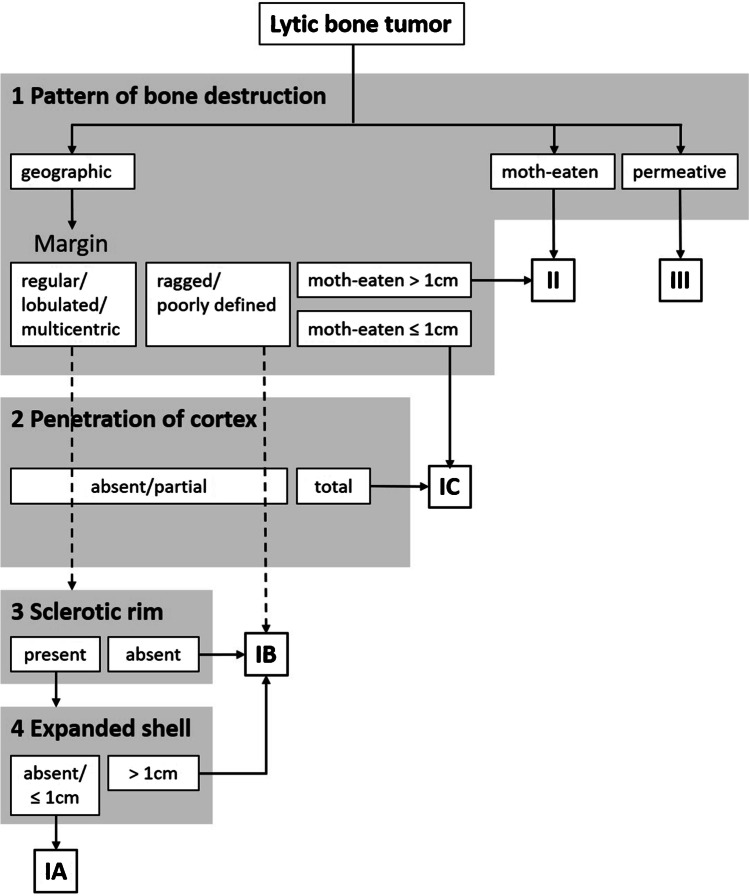
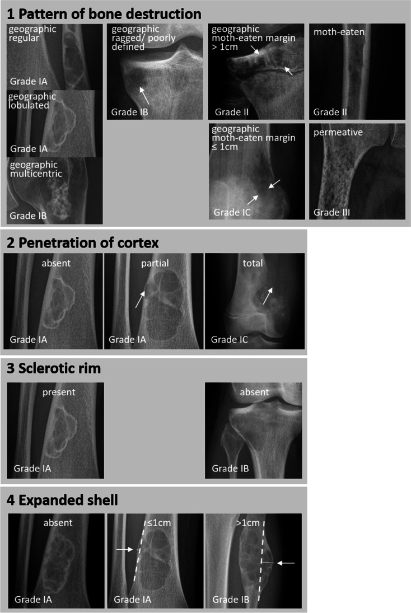
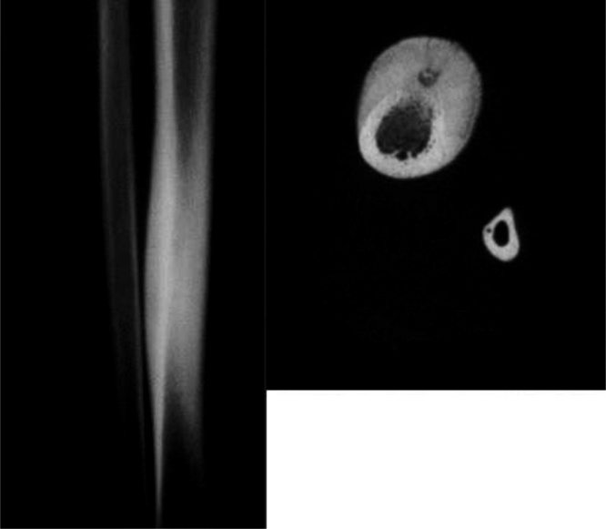
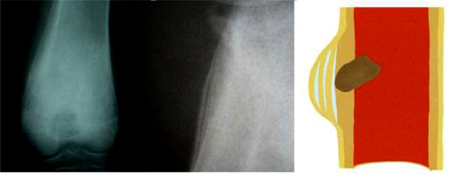
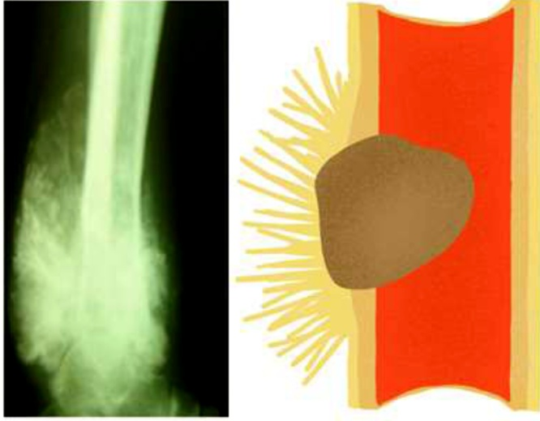
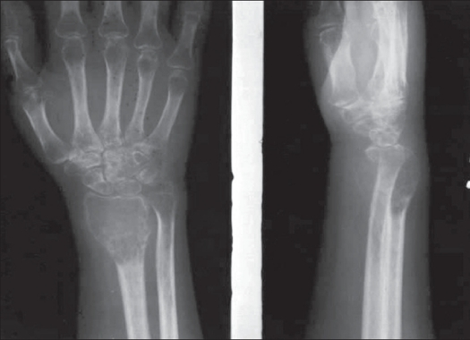
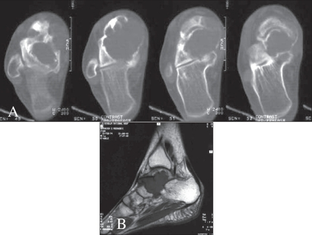
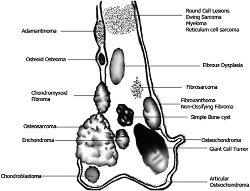

# Bone Tumours — The Systematic Approach to a Solitary Bone Lesion

> This "approach to a bone lesion" question is one of the most repeated MSK themes in the DNB theory paper, and it is examiner-friendly because it rewards a *reproducible system* rather than a lucky spot diagnosis. The marks are in the framework: a candidate who methodically walks through age, site, transition zone, margin, periosteal reaction, matrix and soft-tissue component will score even when the final diagnosis is uncertain. Write the framework first, then apply it, then offer a short differential. Almost every solitary lesion can be confidently triaged into "leave alone / image-follow", "biopsy", or "refer to tumour board" using these seven steps, and that triage is what the examiner is really testing.

## 1. The seven-step systematic approach (write this framework FIRST)

The single most important habit is to verbalise a system before describing findings. The classical sequence is summarised by Helms as a small set of "predictor variables", and the following seven steps are a comprehensive, exam-ready version of that idea. Answer every long question on bone lesions by enumerating these and then applying them to the given film.

**Step 1 — Age of the patient.** Age is the single best discriminator and should always be stated first. As a working rule, under roughly 30 years the field is dominated by benign lesions plus the two aggressive small-round-blue-cell/osteoid tumours of youth (Ewing sarcoma and conventional osteosarcoma, both peaking in the second decade); Langerhans cell histiocytosis and simple/aneurysmal bone cysts cluster in the first two decades. Over 40 years the probabilities shift decisively toward **metastasis, multiple myeloma and chondrosarcoma**, and a destructive lesion in this age group is malignant until proven otherwise. A useful aphorism is that a permeative diaphyseal lesion in a child is Ewing, lymphoma or infection, whereas the same pattern over 40 is metastasis, myeloma or lymphoma.

**Step 2 — Bone involved and precise site within the bone.** Determine first whether the lesion is in a long bone, flat bone (pelvis, scapula, ribs), or the axial skeleton, because some tumours have strong predilections (adamantinoma for the tibial diaphysis, chordoma for the sacrum and clivus). Within a long bone, localise it longitudinally to the **epiphysis, metaphysis or diaphysis**, and in cross-section as **central, eccentric, cortical (intracortical) or juxtacortical (surface)**. This single descriptor narrows the differential enormously and is detailed in the location section below.

**Step 3 — Zone of transition.** This is the conceptual heart of the approach and the best plain-film predictor of biological aggressiveness. The zone of transition is the border between abnormal lesion and normal bone. A **narrow zone** — a sharp, "drawn-with-a-pencil" or sclerotic-rimmed edge — implies slow growth and favours a benign process. A **wide, imperceptible zone**, where you cannot confidently draw the edge of the lesion, implies rapid growth and favours an aggressive/malignant process. Assess the zone of transition on the radiograph, not on CT or MRI, because those modalities can make even benign lesions look alarming.

**Step 4 — Margin and pattern of bone destruction (Lodwick grading).** Lodwick formalised the transition-zone concept into a graded scale of destruction that correlates with growth rate: **IA** geographic with a sclerotic rim; **IB** geographic, well-defined but without a sclerotic rim; **IC** geographic with an ill-defined margin; **II** moth-eaten (multiple medium-sized lucencies coalescing); and **III** permeative (innumerable tiny ill-defined lucencies infiltrating through the cortex), which is the most aggressive pattern. Moving from IA toward III is moving from indolent toward highly aggressive. The grade is derived from four descriptors applied in sequence — pattern of destruction (and, for geographic lesions, the margin), penetration of the cortex, presence of a sclerotic rim, and an expanded shell — as in the decision tree below.

**Step 5 — Periosteal reaction.** Periosteum responds to the *rate* of the underlying process. A slow process allows the periosteum to lay down mature new bone, giving **non-aggressive** patterns: a solid (single dense layer) or thick buttress reaction. A rapid process outpaces the periosteum, giving **aggressive, interrupted** patterns: lamellated/"onion-skin" multilayering (classically Ewing sarcoma), spiculated "sunburst" or "hair-on-end" perpendicular spicules (osteosarcoma), and the **Codman triangle**, where periosteum is elevated and ossifies only at its margin while the central tumour breaks through. The pattern reflects velocity, not a specific histology.

| Solid (non-aggressive) | Onion-skin (aggressive) | Sunburst (aggressive) |
|---|---|---|
|  |  |  |

**Step 6 — Matrix (tumour mineralisation).** If the lesion produces visible internal mineral, classify it. **Osteoid (bone) matrix** appears as fluffy, cloud-like or solid ivory-dense amorphous density (osteosarcoma, osteoblastoma). **Chondroid (cartilage) matrix** appears as arcs, rings-and-arcs, commas, stippled or "popcorn" calcification (enchondroma, chondrosarcoma, chondroblastoma). A purely lytic lesion has no visible matrix. Recognising matrix type points to the tissue of origin and is heavily examined.

**Step 7 — Soft-tissue component and cortical integrity.** Finally, assess whether the lesion has broken through the cortex into the soft tissues. A soft-tissue mass strongly favours malignancy and is best demonstrated on MRI, though cortical breach with a bulging mass may already be visible on radiograph or CT. Expansion with an intact (even if thinned) cortical shell favours a slow benign process; frank cortical destruction with an associated mass favours malignancy.

## 2. Differentiating benign from malignant

No single feature is absolute; aggressiveness is judged on the *constellation*. The questions to answer are: Is the margin sharp or infiltrative? Is the cortex intact or destroyed? Is the periosteal reaction continuous or interrupted? Is there a soft-tissue mass? The more features that fall into the aggressive column, the higher the suspicion. Importantly, "aggressive imaging" is not synonymous with "malignant histology" — osteomyelitis, Langerhans cell histiocytosis and an aneurysmal bone cyst can all look aggressive — so the approach guides the *level of concern* and the decision to biopsy rather than delivering a tissue diagnosis on its own.

| Feature | Non-aggressive (benign-leaning) | Aggressive (malignant-leaning) |
|---|---|---|
| Margin / Lodwick | Geographic, sclerotic rim (IA–IB) | Moth-eaten (II) / permeative (III) |
| Zone of transition | Narrow, sharp | Wide, imperceptible |
| Periosteal reaction | Solid, buttress, or none | Lamellated, spiculated, Codman triangle |
| Cortex | Intact or expanded with thin shell | Destroyed / breached |
| Soft-tissue mass | Absent | Present |
| Rate of change on follow-up | Slow / stable | Rapid growth |

A practical caveat for the answer sheet: lesions that may mimic malignancy despite being benign or non-neoplastic include **osteomyelitis, Langerhans cell histiocytosis, aneurysmal bone cyst, and the healing phase of some lesions**; conversely, low-grade chondrosarcoma can look deceptively bland. Always correlate with age, clinical history and the whole skeleton.

## 3. Modality-wise roles and findings

**Radiograph (XR) — the cornerstone and the starting point.** Despite all advances, the conventional radiograph remains the most important single modality for *characterising* a bone lesion, because it best demonstrates the zone of transition, the Lodwick margin, matrix mineralisation and periosteal reaction — precisely the features the approach depends on. Two orthogonal views are standard. The radiograph is, however, insensitive: in flat and trabecular bone, a purely lytic lesion may not be visible until a substantial fraction of trabecular bone is lost (classically quoted as needing on the order of 30–50% trabecular loss before a metastasis becomes radiographically conspicuous — verify exact value). Thus a normal radiograph does not exclude disease, especially metastasis or myeloma.

**Ultrasound (US) — a limited, adjunctive role.** US does not assess intramedullary disease or the matrix, so its role in primary bone tumour characterisation is minor. Its genuine uses are in the **soft-tissue component** of a lesion that has broken out of the bone, in assessing vascularity with Doppler, and most practically in **guiding biopsy** of a palpable or superficial extraosseous mass. It is also useful in children for evaluating an associated joint effusion or for guiding aspiration. Do not overstate its role in the answer.

**Computed tomography (CT) — for subtle mineral, cortex and complex anatomy.** CT excels where the radiograph is ambiguous. It is superior for detecting and characterising **subtle matrix mineralisation**, for defining **cortical integrity and breakthrough**, and for evaluating anatomically complex regions where overlap defeats radiographs (spine, pelvis, sacrum, ribs, skull base). It demonstrates the lucent nidus of an osteoid osteoma and its reactive sclerosis exquisitely, characterises a fat-containing lesion by density, and is the workhorse for **CT-guided biopsy** and for **staging the chest** for pulmonary metastases. It is less sensitive than MRI for marrow infiltration.

**Magnetic resonance imaging (MRI) — for marrow extent, soft tissue and local staging.** MRI is the modality of choice for **local staging**: it best shows the true intramedullary extent, the presence and size of any **soft-tissue mass**, **skip lesions**, and involvement of the physis, joint, neurovascular bundle and adjacent compartments — all critical for surgical planning. Marrow-replacing disease is low on T1 against the high signal of normal fatty marrow, making T1 the key sequence for marrow assessment, with fluid-sensitive (T2/STIR) sequences showing oedema and the soft-tissue component, and post-gadolinium imaging clarifying solid versus cystic/necrotic tissue and guiding the biopsy to viable tumour. MRI is generally poor at displaying matrix mineralisation, so it complements rather than replaces the radiograph.

**Bone scintigraphy and PET — whole-skeleton survey and metabolic activity.** Technetium-99m MDP **bone scintigraphy** is a sensitive whole-body screen for osteoblastic activity and is the classic tool for detecting **multifocal disease and skeletal metastases**. Diffuse intense skeletal uptake with faint or absent renal/bladder activity is the **"superscan"** of widespread blastic metastasis (or metabolic bone disease). A paradoxical increase in uptake on early follow-up of responding metastases is the **"flare phenomenon"**, which must not be mistaken for progression. The crucial pitfall to state in any answer is that **multiple myeloma and some purely lytic metastases may be photopenic (false-negative) on bone scan** because they incite little osteoblastic response — these are better surveyed with skeletal survey, whole-body MRI or FDG-PET. **FDG-PET/PET-CT** assesses metabolic activity, is valuable for detecting lytic and marrow disease, for staging, and for assessing **treatment response**.

## 4. Location-based differentials

Where a lesion sits within the bone is one of the most powerful discriminators and is frequently the basis of a short-note or enumeration question. Localise both longitudinally (epiphysis / metaphysis / diaphysis) and in cross-section (central / eccentric / cortical / surface).

| Longitudinal site | Typical lesions | Useful clue |
|---|---|---|
| **Epiphysis** (or apophysis/subarticular) | Chondroblastoma (immature skeleton), **giant cell tumour** (mature skeleton), clear-cell chondrosarcoma, infection, subchondral geode | Epiphyseal lytic lesion = short list; age splits chondroblastoma (young) from GCT (fused physis) |
| **Metaphysis** | Osteosarcoma, non-ossifying fibroma (NOF), simple/unicameral bone cyst (SBC), aneurysmal bone cyst (ABC), chondromyxoid fibroma, enchondroma | Metaphysis is the most metabolically active site, hence many lesions arise here |
| **Diaphysis** | Ewing sarcoma, lymphoma, fibrous dysplasia, adamantinoma (tibia), osteoid osteoma, osteofibrous dysplasia | Permeative diaphyseal lesion in a child = Ewing / lymphoma / infection ("round cell" triad) |

In cross-section, an **eccentric, expansile, subarticular** lytic lesion in a patient with a fused growth plate is the classic giant cell tumour. A **central** lucent lesion that fills the medulla suggests SBC or enchondroma; a **cortical** lucency with sclerotic margin suggests NOF or osteoid osteoma; a **surface (juxtacortical)** lesion suggests osteochondroma, periosteal/parosteal osteosarcoma, or periosteal chondroma.

## 5. Skeletal metastases (the commonest malignant bone lesion in adults)

Beyond about 40 years, metastasis and myeloma far outnumber primary bone malignancy, so a destructive lesion in an older patient should be approached as metastatic until proven otherwise. Metastases are characteristically **multiple** and distributed in the **red (haematopoietic) marrow** of the axial skeleton and proximal long bones — vertebrae, pelvis, ribs, skull and proximal femur/humerus. They are usefully classified by their radiographic appearance: **lytic** (lung, kidney/renal cell, thyroid, gastrointestinal, and most breast), **blastic/sclerotic** (prostate, treated breast, carcinoid, some lymphomas), and **mixed**. A solitary expansile, "blow-out" vascular metastasis classically points to **renal or thyroid** primary.

The imaging work-up combines screening and characterisation. The radiograph characterises an individual lesion but is insensitive. **Bone scintigraphy** is the traditional whole-skeleton screen, detecting osteoblastic response (with the superscan and flare caveats above). **CT** confirms cortical involvement, fracture risk and complications and stages the viscera. **Whole-body MRI** is highly sensitive for marrow disease and detects lesions before they are visible on bone scan or radiograph, while **FDG-PET/CT** adds metabolic and lytic-lesion detection plus response assessment. The decisive exam point remains that **myeloma and aggressive lytic metastases can be cold on bone scan**, so a negative scan in a high-risk patient mandates MRI, skeletal survey or PET.

## 6. Pearls and buzzwords

- **"Fallen fragment sign"** → a fractured cortical fragment falling to the dependent part of a fluid-filled cavity, indicating a **simple (unicameral) bone cyst** with pathological fracture.
- **"Fluid–fluid levels"** (on CT/MRI) → classically an **aneurysmal bone cyst** (also seen in telangiectatic osteosarcoma and others — not specific).
- **"Ground-glass matrix"** → **fibrous dysplasia**.
- **"Rings-and-arcs / popcorn / comma" calcification** → **chondroid matrix** (enchondroma, chondrosarcoma).
- **"Cloud-like / ivory / fluffy" density** → **osteoid matrix** (osteosarcoma).
- **"Onion-skin / lamellated" periosteal reaction** → classically **Ewing sarcoma** (any rapid process).
- **"Sunburst / hair-on-end" spiculation and Codman triangle** → **osteosarcoma** (aggressive, interrupted).
- **"Soap-bubble", eccentric, subarticular lytic lesion in a fused skeleton** → **giant cell tumour**.
- **Punched-out lytic lesions, diffuse osteopenia, "raindrop" skull, and photopenia on bone scan** → **multiple myeloma**.
- **"Superscan"** → diffuse skeletal uptake with absent renal/bladder activity (widespread blastic metastasis or metabolic disease).
- **"Flare phenomenon"** → transient increased scintigraphic uptake in *responding* metastases — do not call it progression.

## 7. What to draw

- The **Lodwick grades IA → III** as a row of small bone-edge cartoons showing the progression from sclerotic-rimmed geographic to moth-eaten to permeative.
- The **periosteal reaction types**: solid, buttress, lamellated/onion-skin, spiculated/sunburst, and the Codman triangle.
- The **epiphysis / metaphysis / diaphysis location map** of a long bone with the key differential written against each segment, plus a cross-section showing central / eccentric / cortical / surface positions.
- A simple **benign-vs-aggressive comparison box** (margin, cortex, periosteum, soft-tissue mass).

## 8. Further reading

- Helms, *Fundamentals of Skeletal Radiology* — the approach to bone lesions and Lodwick concepts.
- Grainger & Allison's *Diagnostic Radiology* — bone tumour chapters.
- Resnick & Kransdorf, *Bone and Joint Imaging* — for detailed tumour characterisation and staging (Enneking surgical staging system for reference).
