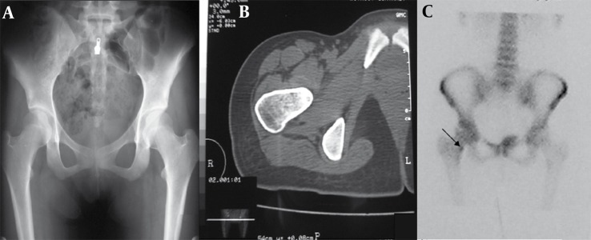
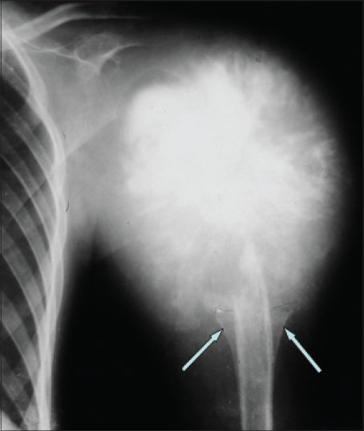
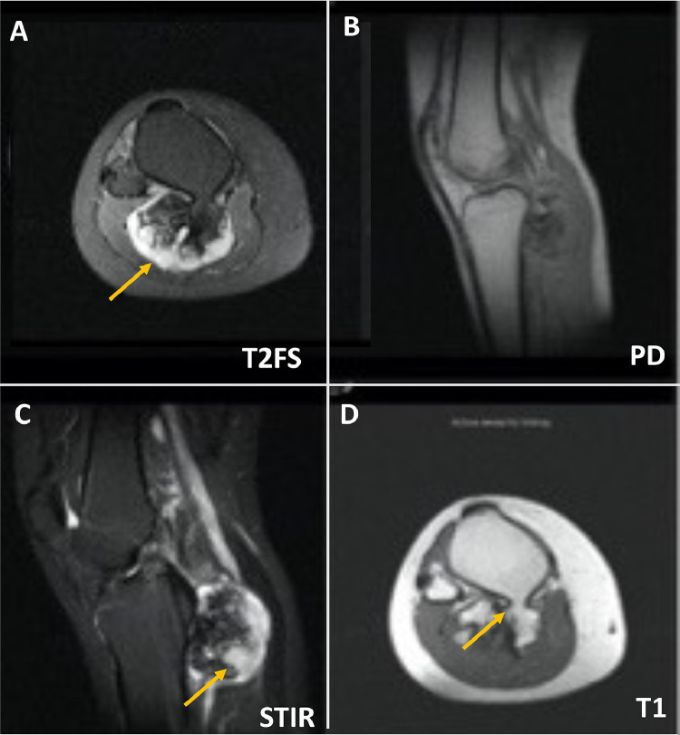
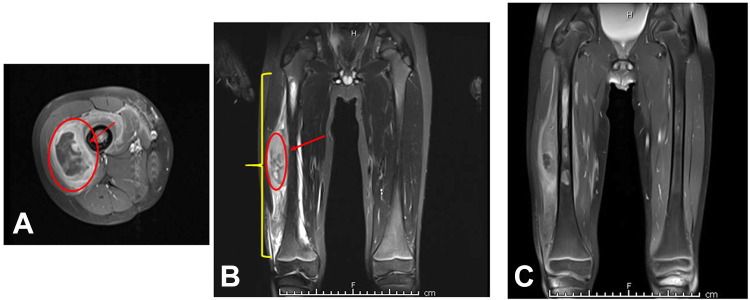

I have the exact citations and the established style. The "Previously asked (NBE)" items to preserve verbatim are the two in questions.md. Now I'll write the full reading.md prose. Returning ONLY the markdown.

# Bone-forming & Cartilage Tumours

> Osteosarcoma, Ewing sarcoma and the cartilage tumours are recurrent named-entity questions in MSK. The examiner wants a confident enumeration framework first, then a disciplined modality-wise description with the correct buzzwords, and a clear rule for separating benign from malignant cartilage lesions. This is scaffolding to study alongside the actual films — confirm every plate against a textbook atlas.

---

## 1. Classification / enumeration framework (learn this first)

Marks live in the framework. Open every answer by classifying the lesion by the matrix it produces, because that is what radiology actually sees.

**A. Bone-forming (osteogenic) tumours** — produce osteoid / bone matrix ("cloud-like", "fluffy", "ivory" mineralisation):

- *Benign:* **osteoma**, **osteoid osteoma**, **osteoblastoma**.
- *Intermediate / locally aggressive:* aggressive osteoblastoma.
- *Malignant:* **osteosarcoma** and its subtypes (see below).

**B. Cartilage-forming (chondrogenic) tumours** — produce chondroid matrix ("rings-and-arcs", "popcorn", "stippled" mineralisation):

- *Benign:* **enchondroma**, **osteochondroma (osteocartilaginous exostosis)**, **periosteal (juxtacortical) chondroma**, **chondroblastoma**, **chondromyxoid fibroma**.
- *Malignant:* **chondrosarcoma** (conventional central/peripheral, plus dedifferentiated, mesenchymal, clear-cell variants).

**C. Osteosarcoma subtypes (enumerate — high-yield):**

- **Conventional (intramedullary, high-grade)** — ~80%; osteoblastic / chondroblastic / fibroblastic histological subtypes.
- **Telangiectatic** — lytic, expansile, fluid-fluid levels; ABC mimic.
- **Small-cell** — Ewing mimic histologically.
- **Surface (juxtacortical) osteosarcomas:** **parosteal** (low-grade, surface, posterior distal femur), **periosteal** (intermediate-grade, surface, diaphyseal, chondroblastic), **high-grade surface**.
- **Secondary** — on **Paget disease** and **post-radiation** bone (older age group); also rare in retinoblastoma survivors / fibrous dysplasia.

**D. Ewing sarcoma** — the prototypic "small round blue cell" tumour of bone (Ewing/PNET family). Not bone-forming, but always discussed alongside osteosarcoma as the second great paediatric malignant bone tumour, so it belongs in this section.

**Where age and site point you (quick triage):**

| Clue | Favoured lesion |
|---|---|
| Epiphysis, skeletally immature | Chondroblastoma (also giant cell tumour once physis fused) |
| Metaphysis, 10–25 yr, aggressive matrix | Conventional osteosarcoma |
| Diaphysis, child, permeative + large soft-tissue mass | Ewing sarcoma |
| Short tubular bones of hand | Enchondroma |
| Surface of bone with cortico-medullary continuity | Osteochondroma |
| Axial / proximal limb, older adult, chondroid matrix | Chondrosarcoma |

---

## 2. Modality-wise findings

### 2.1 Bone-forming tumours

#### Osteoid osteoma
A small benign osteoblastic lesion of the young (typically second–third decade), classically causing **night pain dramatically relieved by NSAIDs/aspirin** owing to prostaglandin production.

- **XR:** a **small radiolucent nidus (usually <1.5 cm)** surrounded by dense **fusiform reactive cortical sclerosis**; cortical (diaphyseal long bone, e.g. femur/tibia) location is typical. A purely intra-articular nidus may incite only a joint effusion/synovitis with little sclerosis and is easily missed.
- **CT (investigation of choice):** depicts the nidus precisely, often with a central calcified dot; defines its position for **radiofrequency ablation (RFA)**, the standard treatment.
- **MRI:** can be misleading — exuberant marrow and soft-tissue oedema may overshadow the small nidus and overcall malignancy; the nidus enhances avidly. Always correlate with CT.
- **Nuclear (bone scan):** intense focal uptake; classic **"double-density"** sign (hotter central nidus within surrounding reactive uptake). Sensitive screening tool when XR is equivocal.

#### Osteoblastoma
Histologically resembles osteoid osteoma but is **larger (>2 cm)** and behaves more aggressively; pain is less NSAID-responsive. Predilection for the **posterior elements of the spine** (pedicle/lamina) and long bones. Expansile, well-defined, variably mineralised ± a sclerotic rim; may incite a secondary aneurysmal bone cyst. CT shows extent and matrix; MRI assesses soft-tissue/canal involvement.

#### Osteosarcoma (conventional, high-grade)
The commonest primary malignant bone tumour of the young; **metaphysis of long bones — distal femur > proximal tibia > proximal humerus**, peak 10–25 yr (second peak in elderly = secondary).

- **XR (the anchor):** a **metaphyseal lesion with aggressive features** — **osteoid (cloud-like / fluffy) matrix mineralisation**, mixed lytic-sclerotic destruction, **permeative / moth-eaten margins (wide zone of transition)**, **aggressive periosteal reaction** — **Codman triangle**, **"sunburst/sunray" spiculation**, and a **soft-tissue mass**. Describe it as a Lodwick aggressive pattern.
- **US:** limited role in the bone itself; can confirm a soft-tissue mass and guide biopsy along an appropriate (resectable) tract planned with the surgeon.
- **CT:** best for **subtle matrix mineralisation** and cortical breach; **CT chest is mandatory for pulmonary metastases** (the commonest site of spread). May show calcified "cannonball" lung deposits.
- **MRI (the staging workhorse):** local staging the whole compartment — **intramedullary tumour extent** (T1 marrow replacement), **skip metastases** (separate intramedullary foci — image the entire bone including the joint above and below), **physeal and joint involvement**, and the relationship of the soft-tissue mass to the **neurovascular bundle**. Also assesses **response to neoadjuvant chemotherapy** (necrosis, decreasing mass/oedema).
- **Nuclear:** bone scan shows intense uptake and screens the skeleton; FDG-PET is increasingly used for staging and chemo-response, where available.

**Surface subtypes worth a sentence each:** **parosteal** — a dense, lobulated, "stuck-on" ossific mass on the **posterior distal femur**, low grade, look for the lucent cleavage line between mass and cortex and for medullary invasion (worse prognosis); **periosteal** — diaphyseal surface, intermediate grade, chondroid, with perpendicular spiculation; **telangiectatic** — lytic, expansile, with **fluid-fluid levels** mimicking an ABC, but with aggressive margins/soft-tissue mass and nodular enhancing septa.

### 2.2 Cartilage tumours

#### Enchondroma
Benign intramedullary cartilage rest; commonest in the **short tubular bones of the hand**, also proximal humerus/femur.

- **XR:** central, well-defined **lucent lesion with chondroid "rings-and-arcs / stippled" matrix**; **endosteal scalloping is shallow** (<2/3 cortical thickness) and there is **no cortical breach, no periosteal reaction, no soft-tissue mass**. Often an incidental finding; in the hand it may be expansile.
- **MRI:** lobulated **markedly T2-hyperintense** chondroid lobules with **peripheral/septal ("rings-and-arcs") enhancement**; no associated soft-tissue mass or marrow oedema in a benign lesion.
- Multiple enchondromas = **Ollier disease**; with soft-tissue **haemangiomas = Maffucci syndrome** — both carry a real risk of malignant transformation, so new pain/growth must be imaged.

#### Osteochondroma (osteocartilaginous exostosis)
The **commonest benign bone tumour**; a metaphyseal bony outgrowth capped by cartilage, **pointing away from the adjacent joint**, sessile or pedunculated.

- **XR (diagnostic):** **continuity of both the cortex AND the medullary cavity of the lesion with the parent bone** — this corticomedullary continuity is the defining feature and clinches the diagnosis.
- **MRI / CT:** confirm continuity and **measure the cartilage cap**. Multiple lesions = **hereditary multiple exostoses**.

#### Chondroblastoma
Lesion of the **epiphysis/apophysis of the skeletally immature** (closely related to GCT but younger). XR: small, well-defined **lytic epiphyseal lesion with a thin sclerotic rim**, ± chondroid matrix; MRI characteristically shows **disproportionate surrounding marrow oedema** and may have a secondary ABC component.

#### Chondromyxoid fibroma
Rare; **eccentric metaphyseal** lytic lesion (proximal tibia classic) with a **lobulated, scalloped sclerotic margin** and bony ridges; benign but can look aggressive.

#### Chondrosarcoma
Malignant cartilage tumour of **older adults**, favouring the **axial skeleton and proximal limbs (pelvis, proximal femur/humerus, ribs, scapula)**.

- **XR/CT:** **deep endosteal scalloping (>2/3 of cortical thickness), cortical thickening/expansion ± destruction**, and **rings-and-arcs chondroid matrix**; CT best demonstrates cortical involvement and matrix.
- **MRI:** lobulated T2-bright cartilage with rings-and-arcs enhancement; defines **marrow and soft-tissue extent** and any soft-tissue mass — the features that separate it from a benign enchondroma (see comparison table).
- High-grade behaviour and a soft-tissue mass suggest **dedifferentiated** chondrosarcoma (a high-grade non-cartilaginous component superimposed on a low-grade lesion — bimorphic appearance).

### 2.3 Ewing sarcoma
A small-round-cell malignancy of children/adolescents (peak ~5–15 yr), classically of the **diaphysis of long bones and the flat bones (pelvis, scapula, ribs)**; often presents with pain, fever and raised inflammatory markers — an **osteomyelitis mimic**.

- **XR:** an ill-defined **permeative / moth-eaten lytic lesion** with a **lamellated "onion-skin" periosteal reaction** (and sometimes a sunburst/Codman), but the hallmark is a **disproportionately large soft-tissue mass** relative to the bone destruction.
- **MRI:** best demonstrates the **large soft-tissue component**, marrow extent and compartmental relations for staging; CT chest and whole-body bone scan/PET for metastases (lung, bone, marrow).

---

## 3. Differentials & comparison tables

**Enchondroma vs low-grade central chondrosarcoma** (a classic exam problem — favour malignancy when several features coexist, not on one alone):

| Feature | Enchondroma (benign) | Low-grade chondrosarcoma |
|---|---|---|
| Pain (mechanical-unexplained, persistent) | Usually absent | Often present |
| Size | Smaller | Larger (often >5 cm) *(verify exact value)* |
| Endosteal scalloping | Shallow (<2/3 cortex) | **Deep (>2/3 cortex)**, extensive |
| Cortex | Intact | Thickening / expansion / breach |
| Soft-tissue mass | Absent | May be present |
| Marrow / peritumoral oedema on MRI | Absent | May be present |
| Common site | Hand short tubular bones | Axial / proximal long bones |

*Hand location strongly favours enchondroma; an aggressive-looking "enchondroma" in the pelvis or proximal femur should be regarded as chondrosarcoma until proven otherwise.*

**Aggressive paediatric metaphyseal/diaphyseal malignant lesions:**

| Feature | Osteosarcoma | Ewing sarcoma |
|---|---|---|
| Typical site | Metaphysis, long bones | Diaphysis / flat bones |
| Matrix | Osteoid (cloud-like) | None (lytic, permeative) |
| Periosteum | Sunburst, Codman | Onion-skin (lamellated), Codman |
| Soft-tissue mass | Present | **Large, often disproportionate** |
| Systemic mimic | — | Osteomyelitis (fever, raised markers) |

**Fluid-fluid levels DDx:** aneurysmal bone cyst (primary), **telangiectatic osteosarcoma**, secondary ABC within GCT/chondroblastoma/osteoblastoma — so fluid-fluid levels are *not* benign by themselves; judge by the solid/aggressive components.

**Ewing DDx (for the named question):** osteomyelitis, **Langerhans cell histiocytosis**, lymphoma of bone, and **metastatic neuroblastoma** (in the very young).

---

## 4. Pearls & buzzwords

- **"Cloud-like / fluffy / ivory"** osteoid matrix → osteoblastic. **"Rings-and-arcs / popcorn / stippled"** → chondroid matrix.
- **Codman triangle, sunburst/sunray** → aggressive periosteal reaction; **onion-skin (lamellated)** → classically Ewing (but not specific).
- **Double-density sign** on bone scan → osteoid osteoma; night pain relieved by NSAIDs is the clinical clincher; **CT** finds the nidus, **RFA** treats it.
- **Corticomedullary continuity** is the single diagnostic feature of osteochondroma.
- **Cartilage cap thickness on MRI** is the key to malignant transformation of an osteochondroma — a thick cap (commonly cited threshold ~1.5–2 cm in adults; *verify exact value*), continued growth after skeletal maturity, new pain, or a soft-tissue mass are the warning signs.
- **CT chest is mandatory** in osteosarcoma and Ewing — lungs are the commonest metastatic site.
- **MRI must cover the whole bone and the adjacent joints** in osteosarcoma to catch **skip lesions**.
- Telangiectatic osteosarcoma and ABC both show fluid-fluid levels — look for aggressive margins, nodular enhancing septa and a soft-tissue mass to call malignancy.
- A painful "enchondroma" in the axial skeleton/proximal limb → think chondrosarcoma.

---

## 5. What to draw

- **Osteosarcoma of the distal femur:** metaphyseal lesion with cloud-like osteoid matrix, **sunburst spiculation**, a **Codman triangle** at the periosteal margin, cortical breach and an adjacent **soft-tissue mass**.
- **Osteochondroma:** parent bone with a pedunculated outgrowth showing **cortex and medulla continuous** with the host bone, capped by cartilage, **pointing away from the joint**.
- **Ewing sarcoma diaphysis:** permeative bone destruction with **lamellated onion-skin periosteum** and a **large surrounding soft-tissue mass**.
- **Enchondroma vs chondrosarcoma cross-section:** shallow vs deep (>2/3) endosteal scalloping with cortical breach — a quick two-panel sketch that earns differentiation marks.

---

## 6. Further reading

- **WHO Classification of Tumours: Soft Tissue and Bone** (current edition) — for the authoritative tumour list and grading framework.
- **Helms, *Fundamentals of Skeletal Radiology*** — pattern-based approach to bone lesions.
- **Greenspan, *Orthopedic Imaging*** — tumour matrix, periosteal reactions, staging.
- **Grainger & Allison's Diagnostic Radiology** — MSK oncology chapter (staging and MRI protocols).
- **Resnick / STIR (Stoller) MRI references** for MRI staging of osteosarcoma and cartilage tumours.
