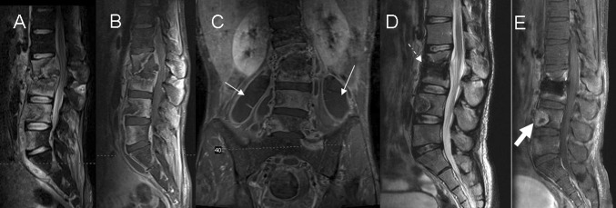

# Osteomyelitis & Septic/Granulomatous Arthritis — Questions

## Previously asked (NBE)

*(None recorded for this topic. Do not infer past-paper status from the practice questions below — they are uncited practice items.)*

---

## Practice questions

**Q1.** Discuss the role of imaging in the diagnosis of acute osteomyelitis, emphasising why early radiographs may be normal. **[6+4]**

**Q2.** Describe the imaging features of spinal tuberculosis (Pott's disease) and the role of MRI. **[6+4]**

**Q3.** Define and illustrate the terms sequestrum, involucrum, cloaca and Brodie abscess. **[10]**

**Q4.** How will you differentiate osteomyelitis from a Charcot (neuropathic) joint in a diabetic foot on MRI? **[10]**

**Q5.** Short notes: (a) Phemister triad **[5]** (b) Septic arthritis of the hip in a child — imaging approach **[5]**

---

## Complete answers

### Q1. Role of imaging in acute osteomyelitis; why early radiographs may be normal [6+4]

**Role of imaging (6 marks).** Imaging in suspected acute osteomyelitis is built on a deliberate modality sequence, because the most sensitive test is not the first-line test.

- **Radiograph (first-line):** always obtained, mainly to exclude alternatives (fracture, tumour) and to provide a baseline; it is insensitive early (see below). When positive it shows, in sequence, deep soft-tissue swelling with loss of fat planes, periosteal reaction, ill-defined metaphyseal permeative/moth-eaten lucency, and later sclerosis.
- **Ultrasound:** a useful radiation-free adjunct, especially in children; it cannot show marrow but detects secondary signs early — subperiosteal collection (periosteal elevation by hypoechoic fluid), deep soft-tissue fluid, adjacent joint effusion — and guides aspiration.
- **MRI (investigation of choice):** most sensitive and specific for early disease and for mapping extent. Marrow shows low T1 signal, high T2/STIR signal and post-contrast enhancement; confluent low-T1 marrow replacement is the more specific sign. MRI also depicts rim-enhancing intraosseous/subperiosteal/soft-tissue abscess, sinus tracts and surrounding cellulitis.
- **CT:** problem-solver for cortical detail, sequestrum, cloaca and intraosseous gas; used when MRI is contraindicated.
- **Nuclear medicine:** three-phase Tc-99m MDP bone scan (positive on all three phases) is sensitive but non-specific; labelled-WBC scintigraphy (with marrow subtraction) improves specificity, especially in the peripheral skeleton and around metalwork. FDG-PET is valuable for spinal and chronic infection.

**Why early radiographs may be normal (4 marks).** Plain films are typically normal for roughly the first 1–2 weeks. Radiographic lucency only becomes perceptible once a substantial proportion of bone mineral — on the order of 30–50% (verify exact value) — has been resorbed, which takes time. The earliest detectable change is soft-tissue swelling rather than bone change, and it is easily overlooked. Consequently a **normal radiograph never excludes early osteomyelitis**; when clinical suspicion is high, proceed directly to MRI.

### Q2. Imaging features of spinal tuberculosis (Pott's disease) and the role of MRI [6+4]

**Imaging features (6 marks).** Spinal TB is the commonest site of skeletal tuberculosis, usually thoracolumbar.

- **Site of onset:** typically the anterior part of the vertebral body (paradiscal/anterior subchondral), with **relative preservation of the intervertebral disc until late** — a key contrast with pyogenic spondylodiscitis, where the disc is destroyed early.
- **Pattern of spread:** **subligamentous spread** beneath the anterior longitudinal ligament to involve **multiple contiguous levels and skip lesions**.
- **Cold abscess:** a large, often **calcified paravertebral or psoas "cold" abscess** with a thin, smooth enhancing wall; may track far from the spinal focus.
- **Destruction and deformity:** progressive vertebral collapse producing **gibbus** deformity and, sometimes, **vertebra plana**.
- **Neural compromise:** epidural disease and/or retropulsed bone causing cord compression and myelopathy.
- On **CT**, bony destruction and the calcified abscess are well shown; radiographs show paradiscal destruction, paravertebral soft-tissue widening and deformity.

**Role of MRI (4 marks).** MRI is the **investigation of choice**. It is the most sensitive modality for early marrow involvement (low T1, high T2/STIR, enhancement), accurately demonstrates the **status of the disc** (preserved early in TB), and best defines the **size and extent of paravertebral/psoas abscesses** and their subligamentous and skip spread. Critically, MRI evaluates the **epidural space, degree of canal compromise and cord signal/compression**, directly guiding the need for surgical decompression. Post-contrast and whole-spine imaging detect non-contiguous skip lesions and differentiate solid granulation tissue from drainable abscess, informing management.

### Q3. Define and illustrate sequestrum, involucrum, cloaca and Brodie abscess [10]

These terms describe the morphology of chronic osteomyelitis and are best supported by a single labelled diagram of a long-bone diaphysis.

- **Sequestrum.** A fragment of **devitalised (dead) bone** that has become separated from viable bone. Being avascular it appears **sclerotic/dense** and is surrounded by a lucent zone of granulation tissue/pus. On CT/MRI it is characteristically **non-enhancing** (confirming it is dead) within enhancing granulation tissue. It harbours organisms and perpetuates infection, acting as a persistent nidus.
- **Involucrum.** The sheath of **living periosteal new bone** laid down by the elevated periosteum **around** the sequestrum and devitalised cortex. It represents the host's attempt to wall off and contain the infection.
- **Cloaca.** A **defect or opening in the involucrum (or cortex)** through which pus and small sequestral fragments are discharged from the medullary cavity to the surrounding soft tissues.
- **Sinus tract.** The channel extending from a cloaca to the **skin surface**. A chronically discharging sinus carries a long-term risk of **Marjolin ulcer (squamous cell carcinoma)** — a new soft-tissue mass or fresh cortical destruction at a long-standing sinus should prompt re-imaging.
- **Brodie abscess.** A form of **subacute** osteomyelitis: a walled-off intraosseous abscess, classically **metaphyseal** in a child or young adult. On radiographs it is a well-defined **lucency with a sclerotic rim**. On MRI it may show the **"penumbra sign"** — a T1-hyperintense rim of granulation tissue lining the cavity — a relatively specific feature.

### Q4. Osteomyelitis vs Charcot (neuropathic) joint in the diabetic foot on MRI [10]

This is a practical discrimination because both show marrow oedema. The key is to read the **secondary soft-tissue clues** and the **distribution**, then to characterise the marrow signal.

**Pointers to osteomyelitis.** Osteomyelitis in the diabetic foot is usually **contiguous** from a skin focus, so it is signalled by an overlying **skin ulcer**, a **sinus tract**, and an adjacent **soft-tissue abscess/cellulitis**. The bone shows **confluent low-T1 marrow replacement** (not just oedema) with enhancement, and the **"ghost sign"** — a bone poorly defined on T1 that reappears on T2/after contrast — indicates active infection. The distribution is **bone-centred** and favours **pressure points / forefoot** (metatarsal heads, toes, calcaneal tuberosity beneath an ulcer).

**Pointers to Charcot (neuropathic) joint.** Charcot is **joint-centred** and multi-bone, classically in the **midfoot (Lisfranc/tarsometatarsal, Chopart)**. It typically **lacks a sinus or abscess**, shows **preserved subchondral marrow fat islands**, and is dominated by **deformity** (rocker-bottom foot), **fragmentation, subluxation and subchondral cysts**.

| Feature | Osteomyelitis | Charcot / neuropathic |
|---|---|---|
| Typical site | Pressure points / forefoot, beneath ulcer | Midfoot (Lisfranc, Chopart) |
| Distribution | Bone-centred, contiguous to ulcer | Joint-centred, multi-bone |
| Skin ulcer / sinus / abscess | Present, contiguous | Usually absent |
| "Ghost sign" | Present (active infection) | Absent |
| T1 marrow | Confluent low-T1 replacement | Preserved fat islands, subchondral |
| Deformity / fragmentation | Less prominent | Marked (rocker-bottom, subluxation) |
| Subchondral cysts | Uncommon | Common |

**Caveat.** The two coexist — Charcot joints can become secondarily infected; a contiguous ulcer/sinus, soft-tissue abscess, ghost sign and a sinus tract tracking to bone tilt the diagnosis towards superimposed osteomyelitis.

### Q5. Short notes [5+5]

**(a) Phemister triad [5].** The Phemister triad is the classic radiographic triad of **tuberculous arthritis**:

1. **Juxta-articular osteoporosis** (marked, reflecting the indolent hyperaemic process).
2. **Peripherally located (marginal) erosions.**
3. **Gradual / late joint-space narrowing**, because cartilage destruction in TB is slow.

The slow joint-space loss is the headline discriminator from **pyogenic septic arthritis**, where cartilage is destroyed within days. Tuberculous arthritis affects large weight-bearing joints (hip, knee), is indolent, shows little reactive sclerosis or periosteal reaction, and may show **"kissing sequestra"** on apposing articular surfaces.

**(b) Septic arthritis of the hip in a child — imaging approach [5].** Septic arthritis is a **surgical emergency** — articular cartilage is destroyed within days — presenting with a hot painful hip, refusal to weight-bear, fever and raised CRP/ESR/WBC.

- **Radiograph:** may show capsular distension/effusion or apparent joint-space widening; in infants, possible subluxation/dislocation; later, destruction. Often normal early.
- **Ultrasound (front-line):** detects **joint effusion**, capsular distension and synovial thickening, and **guides diagnostic/therapeutic aspiration** — aspiration with Gram stain and culture is definitive.
- **MRI:** confirms effusion, **synovial thickening and enhancement**, periarticular soft-tissue oedema, and adjacent **marrow oedema/enhancement** if there is coexistent osteomyelitis.

The main differential is **transient synovitis**, a self-limiting diagnosis of exclusion showing an effusion without systemic inflammatory markers. Clinical prediction tools (e.g. Kocher criteria — fever, non-weight-bearing, raised ESR, raised WBC) raise the probability of sepsis but **do not replace aspiration** when sepsis is suspected.
