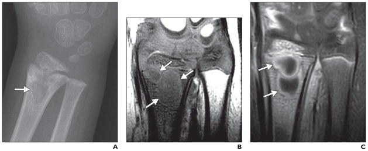
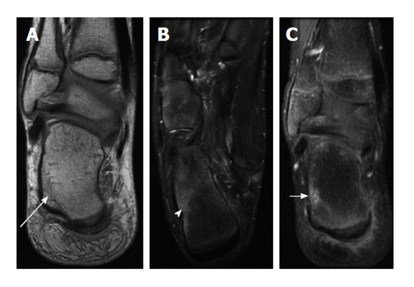

The existing files contain no "Previously asked (NBE)" citations — only practice questions. The task gives me no real citations either, so I must not fabricate any. The existing reading.md is terse; my task is to write the FULL readable prose version. Here is the complete reading.md content.

# Osteomyelitis & Septic / Granulomatous Arthritis

Bone and joint infection is a high-yield MSK topic because it tests a candidate's grasp of *modality sequencing* (why the radiograph is normal early and what to do about it), the descriptive vocabulary of chronic infection (sequestrum/involucrum/cloaca), and several classic discriminations (osteomyelitis vs neuropathic foot, spinal TB vs pyogenic spondylodiscitis, septic arthritis vs transient synovitis). The marks live in a clean framework followed by ordered, modality-wise findings — so build the scaffold first, then hang the imaging on it.

---

## 1. Classification / enumeration framework

**A. By route of infection**
- **Haematogenous** — seeding via blood; the dominant mechanism in children and in the spine in adults.
- **Contiguous spread** — from an adjacent soft-tissue focus (diabetic foot ulcer, pressure sore, dental sepsis, sinus disease).
- **Direct inoculation** — penetrating trauma, open fracture, surgery/implant, injection.

**B. By tempo (clinico-radiological)**
- **Acute** — symptoms over days; pyogenic, usually *Staphylococcus aureus*.
- **Subacute** — indolent, walled-off (e.g. **Brodie abscess**).
- **Chronic** — established necrotic bone with the classic morphology (sequestrum, involucrum, cloaca, sinus tract); includes **sclerosing osteomyelitis of Garré** and **chronic recurrent multifocal osteomyelitis (CRMO)**.

**C. By organism / host**
- **Pyogenic** — *S. aureus* most common; *Salmonella* and *S. aureus* in sickle-cell disease; gram-negatives in diabetics, IV drug users (consider spine/SI joint, sternoclavicular), neonates.
- **Granulomatous** — tuberculous (most important), atypical mycobacteria, fungal, brucellar.

**D. Age-determined anatomy of haematogenous osteomyelitis** (driven by the vascular pattern at the growth plate — *verify exact age cut-offs against a standard text*):
- **Infants (< ~1 yr):** transphyseal vessels cross the physis → metaphyseal infection can reach the **epiphysis and joint** → higher risk of septic arthritis and growth-plate damage.
- **Children:** metaphyseal sinusoidal slow flow seeds the **metaphysis**; the physis acts as a barrier, so the joint is relatively protected *unless* the metaphysis is **intra-articular** (proximal femur, proximal humerus, radial neck, distal lateral tibia) — here osteomyelitis can decompress into the joint causing secondary septic arthritis.
- **Adults:** physis closed → infection spreads from **metaphysis to epiphysis/subchondral bone**, and the **spine** becomes the commonest haematogenous site.

**E. Septic arthritis — routes:** haematogenous synovial seeding (commonest), direct extension from adjacent osteomyelitis, penetrating inoculation/iatrogenic.

---

## 2. Modality-wise imaging — ACUTE PYOGENIC OSTEOMYELITIS

### Radiograph (XR) — first-line but *lags behind disease*
The cardinal teaching point: **plain films are typically normal for the first ~7–14 days** because radiographic lucency only appears once roughly **30–50% of bone mineral has been lost (verify exact value)**. A normal radiograph therefore **never excludes** early osteomyelitis. When changes do appear they follow a predictable sequence:
1. **Deep soft-tissue swelling** with loss/displacement of fat planes (earliest, often overlooked).
2. **Periosteal reaction** (single lamellar/solid, becoming layered).
3. **Ill-defined metaphyseal lucency / permeative or moth-eaten destruction.**
4. Later, **sclerosis, sequestrum and involucrum** of chronicity.

### Ultrasound (US) — useful adjunct, especially in children
US has **no role in showing marrow** but detects the *secondary* extraosseous signs early: **subperiosteal collection/abscess** (elevation of periosteum by hypoechoic fluid), deep soft-tissue fluid, and an adjacent **joint effusion**. It guides aspiration and is radiation-free for paediatric and serial use. Limited by overlying gas/bone and operator dependence.

### CT — problem-solver, not primary
CT is **superseded by MRI** for marrow but excels at **cortical detail and detecting/characterising a sequestrum** (sclerotic dead fragment), **cloacae**, intraosseous gas, and tiny foreign bodies; it guides biopsy and is valuable when MRI is contraindicated or obscured by metalwork.

### MRI — most sensitive and specific for early disease and extent
**MRI is the investigation of choice for early osteomyelitis and for mapping extent.** Findings:
- **Marrow oedema/replacement:** **low signal on T1, high on T2/STIR, with post-contrast enhancement.** Confluent **low-T1 marrow replacement** is the more specific sign; T2/STIR oedema alone is sensitive but non-specific.
- **Rim-enhancing intraosseous, subperiosteal or soft-tissue abscess**; **sinus tract** (linear fluid-signal, enhancing wall, may show the *"tram-track"* appearance) tracking to the skin.
- **Cellulitis / myositis / fasciitis** in surrounding tissues.
- The **"penumbra sign"** of a subacute abscess (below).

### Nuclear medicine — when MRI is limited (metalwork, multifocal, whole-body)
- **Three-phase Tc-99m MDP bone scan:** osteomyelitis is positive on **all three phases** (flow, blood-pool, delayed) with focal uptake; highly **sensitive** but poorly specific (positive in fracture, surgery, neuropathic joint, tumour).
- **Labelled-WBC (Tc-99m HMPAO / In-111) scintigraphy**, often with **sulphur-colloid marrow subtraction**, improves specificity in the **peripheral skeleton** and around prostheses — labelled WBCs accumulate at infection but are *absent/reduced* where marrow is displaced.
- **FDG-PET / PET-CT:** high sensitivity, excellent for **spinal infection**, chronic osteomyelitis and around metalwork; emerging role.

---

## 3. CHRONIC OSTEOMYELITIS — the vocabulary (high-yield, examiners love definitions + a diagram)

- **Sequestrum** — a fragment of **devitalised (dead) bone**, avascular, appears **sclerotic/dense** and is surrounded by a lucent zone of granulation/pus; **non-enhancing** on MRI/CT (helps confirm it is dead). It acts as a nidus harbouring organisms and perpetuating infection.
- **Involucrum** — the sheath of **living periosteal new bone** laid down *around* the sequestrum.
- **Cloaca** — a defect/opening in the involucrum (or cortex) through which pus and sequestral fragments discharge.
- **Sinus tract** — the channel from the cloaca to the **skin surface**; chronically discharging sinuses carry a risk of **Marjolin ulcer (squamous cell carcinoma)** — look for new soft-tissue mass or cortical destruction at a long-standing sinus.
- **Brodie abscess** — a **subacute** walled intraosseous abscess, classically metaphyseal in a child/young adult: a well-defined **lucency with a sclerotic rim**; on MRI may show the **"penumbra sign"** — a **T1-hyperintense rim of granulation tissue** lining the abscess cavity (relatively specific).
- **Sclerosing osteomyelitis of Garré** — chronic, low-grade, **densely sclerotic, expanded bone with little/no lucency or pus**; mandible and long-bone diaphyses; mimics osteoid osteoma/Ewing — needs correlation.

---

## 4. DIABETIC FOOT / PRESSURE SORES — osteomyelitis vs neuropathic (Charcot) joint

This is one of the hardest practical discriminations and a favourite question. **Contiguous** osteomyelitis in the diabetic foot is suggested by **secondary "soft-tissue" clues** that point a focus of marrow signal towards infection: an overlying **skin ulcer**, a **sinus tract**, an adjacent **soft-tissue abscess/cellulitis**, and the **"ghost sign"** (a bone that is poorly defined on T1 but reappears after contrast/on T2, indicating active infection). Osteomyelitis favours **pressure points / forefoot** (metatarsal heads, toes, calcaneal tuberosity under an ulcer). Charcot favours the **midfoot (tarsometatarsal/Lisfranc, Chopart)**, is **joint-centred** with deformity, subchondral cysts, fragmentation, subluxation and **preserved marrow fat islands**; it usually lacks a sinus or abscess. See the comparison table below.

---

## 5. GRANULOMATOUS (TUBERCULOUS) DISEASE

### Spinal TB — Pott disease (commonest site of skeletal TB)
- Typically begins in the **anterior part of the vertebral body** (paradiscal), with **relative preservation of the disc until late** — a key contrast with pyogenic disease.
- **Subligamentous spread** beneath the anterior longitudinal ligament to involve **multiple contiguous (and skip) levels**.
- **Large, often calcified, paravertebral / psoas "cold" abscess** (thin, smooth enhancing wall on MRI/CT).
- Vertebral collapse → **gibbus deformity** and **vertebra plana**; epidural disease causing **cord compression**.
- **MRI is the investigation of choice** — defines marrow involvement, disc status, abscess size/extent, epidural disease and cord compression; CT best shows bony destruction and calcified abscess.

### Tuberculous arthritis — **Phemister triad**
1. **Juxta-articular osteoporosis**
2. **Peripherally located (marginal) erosions**
3. **Gradual / late joint-space narrowing** (cartilage destruction is slow — unlike the rapid loss in pyogenic septic arthritis).

Large weight-bearing joints (hip, knee); indolent; **"kissing sequestra"** on apposing surfaces; minimal sclerosis/periosteal reaction. The slow joint-space loss is the headline discriminator from pyogenic septic arthritis.

---

## 6. SEPTIC ARTHRITIS vs TRANSIENT SYNOVITIS (the irritable paediatric hip)

**Septic arthritis is a surgical emergency** — articular cartilage is destroyed within days. Presentation: hot painful joint, refusal to weight-bear, fever, raised CRP/ESR/WBC. Imaging:
- **XR:** early effusion/joint-space *widening* or capsular distension; later destruction; in infants, possible subluxation/dislocation.
- **US** is the front-line: detects **effusion**, capsular distension and synovial thickening, and **guides diagnostic/therapeutic aspiration** — *aspiration with Gram stain/culture is definitive.*
- **MRI:** joint effusion, **synovial thickening and enhancement**, periarticular soft-tissue oedema, and **adjacent marrow oedema/enhancement** if there is coexistent osteomyelitis.

**Transient synovitis** is a **self-limiting diagnosis of exclusion** — US shows an effusion *without* the systemic inflammatory markers of sepsis; clinical prediction tools (e.g. **Kocher criteria** — fever, non-weight-bearing, raised ESR, raised WBC) raise the probability of sepsis but **do not replace aspiration** when sepsis is suspected.

---

## 7. Differentials / comparison tables

**Osteomyelitis vs Charcot (neuropathic) joint — diabetic foot MRI**

| Feature | Osteomyelitis | Charcot / neuropathic |
|---|---|---|
| Typical site | Pressure points / forefoot, beneath ulcer | **Midfoot** (Lisfranc, Chopart) |
| Distribution | Bone-centred, contiguous to ulcer | **Joint-centred**, multi-bone |
| Skin ulcer / sinus / abscess | **Present**, contiguous | Usually absent |
| "Ghost sign" | Present (active infection) | Absent |
| T1 marrow | Confluent **low-T1 replacement** | **Preserved fat islands**, subchondral |
| Deformity / fragmentation | Less prominent | **Marked** (rocker-bottom, subluxation) |
| Subchondral cysts | Uncommon | Common |

**Pyogenic spondylodiscitis vs tuberculous spondylitis (Pott)**

| Feature | Pyogenic | Tuberculous |
|---|---|---|
| Disc | **Early destruction** | **Relatively preserved early** |
| Spread | Single level / two adjacent endplates | **Subligamentous, multiple levels, skip lesions** |
| Paravertebral abscess | Smaller, ill-defined, thick wall | **Large, calcified, thin smooth wall, psoas tracking** |
| Onset | Acute/subacute | Insidious, chronic |
| Deformity | Less | **Gibbus, vertebra plana** |

**Pyogenic vs tuberculous arthritis**

| Feature | Pyogenic septic arthritis | Tuberculous arthritis |
|---|---|---|
| Joint-space loss | **Rapid** (days) | **Slow / late** |
| Erosions | Central + marginal | **Marginal/peripheral** |
| Osteoporosis | Less marked | **Marked juxta-articular** |
| Bone density / reaction | Reactive sclerosis | Little sclerosis; "kissing sequestra" |
| Triad | – | **Phemister triad** |

---

## 8. Pearls & buzzwords

- **"Normal radiograph does not exclude early osteomyelitis"** — XR lags ~1–2 weeks; if suspicion is high, **go to MRI**.
- **Low-T1 confluent marrow replacement** is the more *specific* MRI sign; STIR/T2 oedema alone is sensitive but non-specific.
- **"Penumbra sign"** (T1-hyperintense granulation rim) → **Brodie abscess**.
- **Non-enhancing sclerotic fragment within enhancing granulation** → **sequestrum** (dead bone).
- **"Ghost sign"** and a contiguous **ulcer/sinus/abscess** → favour **osteomyelitis** over Charcot.
- **"Relative disc preservation + subligamentous multilevel spread + large calcified cold abscess + gibbus"** → **spinal TB**, in contrast to early disc destruction in pyogenic disease.
- **Phemister triad** → tuberculous arthritis; **slow** joint-space loss distinguishes it from pyogenic.
- **Sickle-cell disease:** consider **Salmonella** (and *S. aureus*) and beware overlap of **bone infarct vs osteomyelitis** (both oedema; look for sequestrum, soft-tissue abscess, periosteal reaction and serial change to call infection).
- **Irritable hip:** US effusion + **aspiration** is the definitive step; do not over-rely on prediction rules.
- **Chronic discharging sinus → Marjolin ulcer (SCC)** — re-image for a new mass/cortical destruction.

---

## 9. What to draw

1. **Chronic osteomyelitis schematic** — long-bone diaphysis labelling **sequestrum** (central dense dead fragment), **involucrum** (surrounding periosteal new-bone sheath), **cloaca** (opening), and a **sinus tract** to skin. (This single labelled diagram answers the definitions question.)
2. **Age-related haematogenous spread diagram** — three small long-bone ends (infant / child / adult) showing transphyseal vessels in the infant reaching the epiphysis/joint, metaphyseal localisation in the child with the physis as a barrier, and metaphysis→epiphysis spread in the adult.
3. **Pott spine sagittal** — anterior body destruction with relative disc sparing, subligamentous multilevel involvement, gibbus, and a tracking psoas cold abscess.
4. **Brodie abscess** — round metaphyseal lucency with sclerotic rim; annotate the **penumbra sign**.

---

## 10. Further reading

- Resnick & Kransdorf, *Bone and Joint Imaging* — chapters on osteomyelitis, septic arthritis and tuberculous infection.
- Grainger & Allison's *Diagnostic Radiology* — musculoskeletal infection.
- Pope/Bloem, *Musculoskeletal Imaging* (Expert Radiology series) — diabetic foot and spinal infection.
- Review articles on **MRI of the diabetic foot** (osteomyelitis vs Charcot) and **imaging of spinal tuberculosis** for current consensus on signs and pitfalls.
