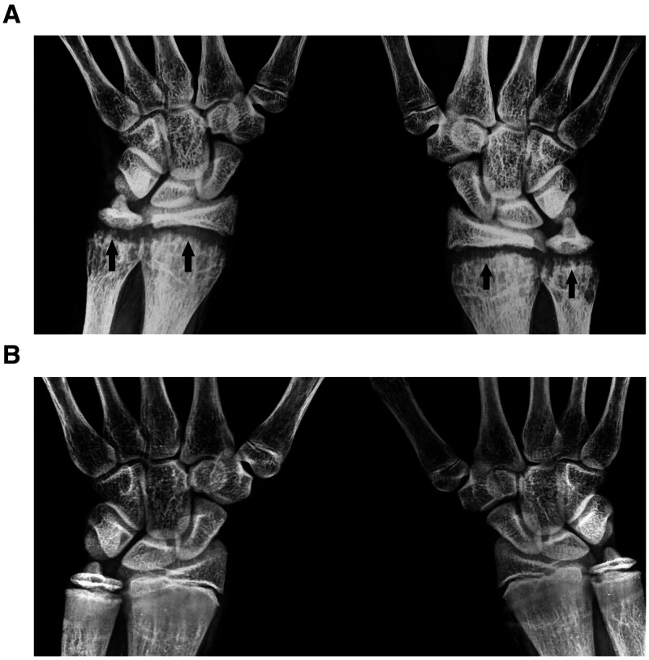
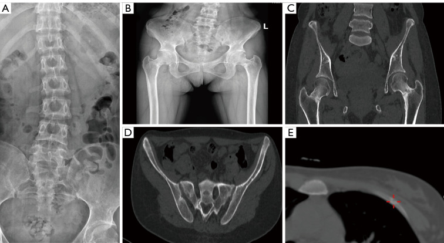
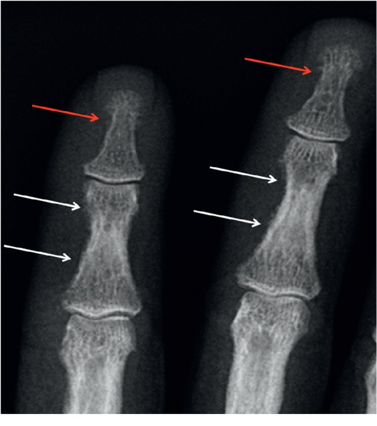
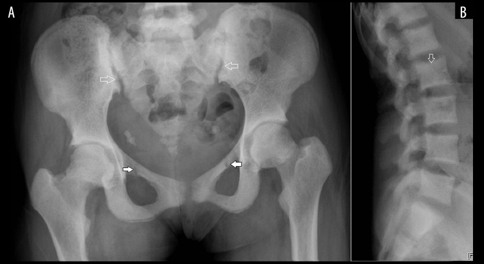
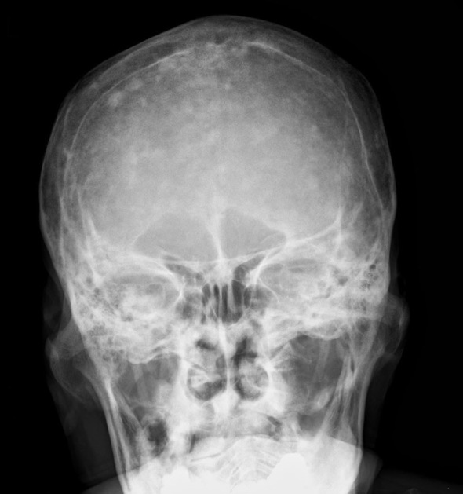

# Metabolic and Endocrine Bone Disease, Rickets and Bone Densitometry

> Metabolic bone disease is the most reliably examined non-tumour MSK theme in the DNB theory paper, and it rewards a candidate who can separate the four core processes — too little mineral (rickets/osteomalacia), too much bone turnover driven by parathyroid hormone (hyperparathyroidism), the composite of renal osteodystrophy, and the quantitative assessment of bone mass (densitometry). Examiners reuse the same handful of questions ("findings in rickets and osteomalacia", "manifestations of hyperparathyroidism, which sign is most specific", "DEXA and WHO criteria"), so the marks lie in a clean enumeration framework first, then a modality-wise description anchored to the radiograph. Throughout, remember the unifying biochemistry: rickets and osteomalacia are the *same* disease of defective mineralisation, separated only by whether the growth plate is still open.

## 1. Classification framework (write this first)

It is worth opening any long answer by classifying metabolic bone disease, because it shows the examiner you understand the underlying physiology rather than reciting isolated signs. A practical, exam-ready scheme is to group the disorders by the dominant abnormality of bone mineral or turnover:

1. **Disorders of defective mineralisation (too little mineral on a normal or increased matrix)**
   - *Rickets* — the growing skeleton, growth plate open; abnormality centred on the physis and metaphysis.
   - *Osteomalacia* — the mature skeleton, growth plate fused; abnormality is generalised softening with pseudofractures.
   - Causes of both: vitamin D deficiency/resistance, hypophosphataemic (renal phosphate wasting, oncogenic osteomalacia), renal tubular disorders, and chronic kidney disease.

2. **Disorders of increased bone resorption (parathyroid-driven)**
   - *Primary hyperparathyroidism* — autonomous secretion, usually a parathyroid adenoma; hypercalcaemia.
   - *Secondary hyperparathyroidism* — compensatory PTH rise, usually chronic kidney disease (phosphate retention, low calcitriol, hypocalcaemia).
   - *Tertiary hyperparathyroidism* — autonomous gland after long-standing secondary stimulation.

3. **Composite / multifactorial disorders**
   - *Renal osteodystrophy* — the skeletal expression of chronic kidney disease, blending osteomalacia, secondary hyperparathyroidism, osteosclerosis and soft-tissue calcification.

4. **Disorders of reduced bone mass / quantity (normally mineralised bone, but too little of it)**
   - *Osteoporosis* — the domain of bone densitometry (DEXA, QCT).

5. **Disorder of disordered remodelling**
   - *Paget disease of bone* — abnormal osteoclast-driven turnover producing lytic, mixed and sclerotic phases.

6. **Vitamin/endocrine deficiency or excess affecting bone**
   - *Scurvy* (vitamin C deficiency), *acromegaly* (growth-hormone excess), and *hypervitaminosis D/A*.

A second, frequently-asked enumeration is **osteopenia vs osteomalacia vs osteoporosis as radiographic concepts**: "osteopenia" is the purely descriptive term for reduced radiographic bone density (the radiograph cannot tell you the cause), whereas "osteoporosis" (too little normally-mineralised bone) and "osteomalacia" (normal quantity, defective mineralisation) are specific pathological diagnoses that often look similar on plain film — hence the value of the specific signs below.

## 2. Rickets and osteomalacia

**Framing.** Rickets and osteomalacia share identical biochemistry (defective mineralisation of osteoid and, in children, of the growth-plate cartilage). The skeleton expresses this differently depending on whether the physis is open. The most examinable point is that **rickets is a disease of the growth plate and metaphysis**, so the wrist (distal radius/ulna), knee and costochondral junctions — the most rapidly growing physes — show the earliest and most florid changes.

### 2a. Rickets — modality-wise

**Radiograph (the cornerstone — draw the wrist).** Changes are concentrated at the zone of provisional calcification of the metaphysis. The classic triad is **cupping, fraying and splaying** of the metaphysis. The **physis (growth plate) is widened and lucent** because the cartilage cannot mineralise, and the metaphyseal margin loses its sharp white line, becoming frayed and irregular. Generalised changes include **bowing of weight-bearing long bones** (genu varum/valgum once the child walks), **coarse trabeculae and generalised osteopenia**, and insufficiency/greenstick fractures. Characteristic regional signs include the **rachitic rosary** (expansion of the anterior costochondral junctions), **frontal bossing** with delayed fontanelle closure, the **Harrison sulcus** (groove from diaphragmatic pull on softened ribs), and bowing deformities such as coxa vara. With treatment, a dense line of provisional calcification reappears (healing rickets).

**Ultrasound, CT and MRI — limited role.** Rickets is diagnosed clinically, biochemically and radiographically; cross-sectional imaging is rarely needed. US has no primary role. MRI may incidentally show physeal widening and metaphyseal signal change but is not used for diagnosis. State explicitly in an answer that the **plain radiograph is sufficient** and that advanced imaging is not routinely indicated.

**Nuclear medicine.** A bone scan in florid rickets/osteomalacia may show increased metaphyseal and costochondral uptake, but scintigraphy is not part of the standard work-up.

### 2b. Osteomalacia — modality-wise

**Radiograph.** In the adult, the physis is fused, so changes are those of generalised softening rather than growth-plate disruption. The film shows **generalised osteopenia with a coarsened, "smudgy" or indistinct trabecular pattern** and cortical thinning. The single most important and examinable sign is the **Looser zone (pseudofracture, Milkman line / Looser–Milkman zone)** — a transverse lucent band, perpendicular to the cortex, with sclerotic margins, representing a stress-related zone of unmineralised osteoid. They are characteristically **bilateral and symmetrical** and occur at typical sites: the **medial femoral neck, the pubic and ischial rami, the medial border of the scapula, the proximal ulna, and the ribs**. Bone softening can produce secondary deformities such as **protrusio acetabuli**, **bell-shaped/triradiate pelvis**, and biconcave ("codfish") vertebrae.

**Other modalities.** As with rickets, US has no role; CT and MRI are not needed for diagnosis although a Looser zone may be encountered incidentally and should not be mistaken for a complete fracture or an aggressive lesion. Bone scintigraphy may show multiple symmetrical foci at pseudofracture sites and, in severe disease, a **"superscan"** pattern.

## 3. Hyperparathyroidism

**Framing and enumeration.** The unifying mechanism is excess parathyroid hormone driving **osteoclastic bone resorption**. The most efficient way to score is to enumerate the resorption sites and the secondary signs, then name the single most specific finding. The cardinal abnormality across all sites is **bone resorption**, which the examiner expects you to subclassify.

**Patterns of resorption (enumerate):**
- **Subperiosteal resorption** — the most specific sign; classically along the **radial (lateral) aspect of the middle phalanges of the index and middle fingers**, and also at the phalangeal tufts.
- **Acro-osteolysis** — resorption of the terminal phalangeal tufts.
- **Subchondral resorption** — at the sacroiliac and acromioclavicular joints, symphysis pubis, and producing the **"rugger-jersey spine"** appearance via subchondral resorption beneath the endplates with reactive sclerosis.
- **Intracortical / endosteal / trabecular resorption** — producing cortical tunnelling and the **"salt-and-pepper" granular skull**.

**Other manifestations:**
- **Brown tumours (osteitis fibrosa cystica)** — lytic, sometimes expansile lesions from osteoclastic activity and haemorrhage; more associated with primary hyperparathyroidism. They are "brown" from haemosiderin and may be solitary or multiple, and can be mistaken for metastases or a primary bone tumour.
- **Chondrocalcinosis** (calcium pyrophosphate deposition), **soft-tissue and vascular calcification**, and **periarticular calcification**.
- **Loss of the lamina dura** around the teeth.
- Generalised osteopenia and insufficiency fractures.

**Primary vs secondary vs tertiary.** *Primary* (usually a parathyroid adenoma) presents with hypercalcaemia and is the classic setting for brown tumours. *Secondary* arises from chronic kidney disease and is dominated by resorption plus osteosclerosis (rugger-jersey spine is particularly associated with the secondary/renal form). *Tertiary* is autonomous PTH secretion supervening on long-standing secondary disease.

**Modality roles.** The **radiograph** is the primary tool and the high-resolution magnified hand film is the most rewarding view for subperiosteal resorption. **CT and ultrasound/nuclear (sestamibi) imaging** are directed at *localising the parathyroid lesion* (neck US, Tc-99m sestamibi scintigraphy, 4D-CT) rather than at the skeleton. **MRI** may characterise a brown tumour but cannot reliably distinguish it from other lytic lesions, so correlation with biochemistry is essential.

## 4. Renal osteodystrophy

**Framing.** Renal osteodystrophy is the composite skeletal manifestation of chronic kidney disease and is best answered as a *combination* of processes rather than a single appearance. The marks come from listing the four contributing components and giving the signs of each.

**Components (enumerate):**
1. **Secondary hyperparathyroidism** — subperiosteal and subchondral resorption, brown tumours, salt-and-pepper skull, acro-osteolysis (as above).
2. **Osteomalacia** — generalised osteopenia, coarse trabeculae, Looser zones (in adults), and rachitic changes (renal rickets) in children.
3. **Osteosclerosis** — the **"rugger-jersey spine"** (alternating sclerotic bands at the superior and inferior vertebral endplates with a lucent mid-body, resembling a striped rugby shirt) is the signature and is more characteristic of the renal/secondary setting than of primary hyperparathyroidism.
4. **Soft-tissue, vascular and periarticular calcification** — from a raised calcium-phosphate product; includes vascular wall calcification, periarticular tumoral calcinosis and chondrocalcinosis.

**Dialysis-related additions.** Long-term dialysis adds **amyloid (beta-2-microglobulin) deposition** with subchondral cysts and erosions (notably the shoulder, hip, wrist/carpus), and **destructive spondyloarthropathy**. Aluminium-related and adynamic bone disease alter the balance between osteomalacia and high-turnover changes.

**Modality roles.** Radiographs (hands, lateral spine, pelvis) remain the principal survey. CT confirms vascular and visceral calcification and brown tumours. MRI characterises amyloid deposits and complications. Nuclear imaging may show a superscan.

## 5. Bone densitometry (DEXA) and osteoporosis

**Framing.** Osteoporosis is reduced bone *quantity* with normal mineralisation, and unlike the disorders above it is defined quantitatively rather than by morphology. The standard reference question asks for the principle of DEXA, the WHO T-score criteria and the pitfalls.

**Principle of DEXA (dual-energy X-ray absorptiometry).** Two X-ray beams of different energies are passed through the region of interest; because soft tissue and bone attenuate the two energies differently, subtraction allows the bone mineral content to be isolated and expressed as an **areal bone mineral density (BMD) in g/cm²**. It is a projectional (2D, "areal") measurement, low in radiation dose and highly reproducible, which is why it is the gold-standard for diagnosis and for monitoring. Standard measurement sites are the **lumbar spine (L1–L4) and the proximal femur (femoral neck and total hip)**; the distal radius is used when these are unevaluable.

**Reporting — T-score and Z-score.**
- The **T-score** compares the patient's BMD to the mean of a young healthy adult reference population, expressed in standard deviations.
- The **Z-score** compares the patient to an *age- and sex-matched* reference population.

**WHO diagnostic criteria** (apply the T-score to postmenopausal women and men aged 50 and over):

| Category | T-score |
|---|---|
| Normal | T-score ≥ −1.0 |
| Osteopenia (low bone mass) | T-score between −1.0 and −2.5 |
| Osteoporosis | T-score ≤ −2.5 |
| Severe (established) osteoporosis | T-score ≤ −2.5 with a fragility fracture |

For **premenopausal women, men under 50, and children**, the WHO T-score criteria do *not* apply; the **Z-score** is used instead, and a Z-score of **≤ −2.0** is reported as "below the expected range for age" (verify exact value against current ISCD guidance).

**Pitfalls (frequently the extra-mark component):**
- **Falsely raised spinal BMD** from **degenerative osteophytes and facet sclerosis, aortic calcification, vertebral compression fractures, prior surgery/instrumentation and overlying contrast or calcified nodes** — all add attenuation that DEXA cannot distinguish from true bone. The **hip** is therefore often more reliable in older patients.
- **Areal (not volumetric) measurement** — DEXA does not correct for bone size, so it can underestimate BMD in small-framed patients and overestimate in large bones.
- **Positioning and patient-related errors**, and the need to use the **same scanner and software** for serial monitoring.
- **QCT (quantitative computed tomography)** is the principal alternative: it gives a *true volumetric* BMD (mg/cm³), can isolate trabecular bone, and is **not affected by osteophytes or aortic calcification**, at the cost of higher dose and the lack of a WHO T-score definition.

## 6. Other examinable entities

**Paget disease of bone.** A disorder of disordered remodelling progressing through three phases: an early **lytic** phase (in the skull, the well-defined lucency of **osteoporosis circumscripta**; in long bones, a **"blade-of-grass" or flame-shaped** advancing lytic front), a **mixed** phase, and a late **sclerotic** phase. The signature features are **cortical thickening, coarsened/thickened trabeculae and bone expansion (enlargement)** — bone that is bigger *and* denser is the key discriminator from sclerotic metastasis. Classic regional signs are the **"picture-frame" vertebra** (thickened cortical margins around a square body), the **"cotton-wool" skull** (mixed lytic-sclerotic patches), basilar invagination, and bowing of weight-bearing bones. Complications to mention are insufficiency fractures, high-output cardiac failure, and **sarcomatous transformation** (osteosarcoma) signalled by a new soft-tissue mass or aggressive lysis. The bone scan shows intense uptake and is the best tool for mapping disease extent.

**Scurvy (vitamin C deficiency).** A disease of the growing metaphysis from defective collagen and capillary fragility. Signs (draw the knee): the **Frankel line** (dense white metaphyseal line of provisional calcification), the **Trümmerfeld / scurvy zone** (lucent band beneath it), the **Wimberger ring sign** (sclerotic rim around an osteopenic epiphysis), **Pelkan spurs** (lateral metaphyseal spur formation), and **subperiosteal haemorrhage** that calcifies on healing. The background is generalised osteopenia with a "ground-glass" or "pencil-thin" cortex.

**Acromegaly (growth-hormone excess).** **Heel-pad thickening**, enlargement of the sella turcica, frontal sinus enlargement and prognathism, **spade-like (arrowhead) terminal phalangeal tufts**, increased joint spaces from cartilage hypertrophy, and a generalised increase in soft-tissue bulk.

## 7. Differentials and comparison tables

**Rickets vs osteomalacia**

| Feature | Rickets | Osteomalacia |
|---|---|---|
| Skeletal maturity | Growth plate open (child) | Growth plate fused (adult) |
| Site of changes | Physis & metaphysis | Generalised bone |
| Hallmark sign | Cupping/fraying/splaying, widened lucent physis | Looser zones (pseudofractures) |
| Deformities | Bowing, rosary, Harrison sulcus | Protrusio, codfish vertebrae, triradiate pelvis |

**Osteoporosis vs osteomalacia (the classic distinction)**

| Feature | Osteoporosis | Osteomalacia |
|---|---|---|
| Defect | Reduced quantity of normal bone | Normal quantity, defective mineralisation |
| Trabeculae | Thinned but sharply defined | Coarse, indistinct/"smudgy" |
| Specific sign | None specific; fragility fractures | Looser zones |
| Biochemistry | Usually normal Ca/PO₄/ALP | Low/low-normal Ca, low PO₄, raised ALP (verify per cause) |

**Primary vs secondary hyperparathyroidism**

| Feature | Primary | Secondary (renal) |
|---|---|---|
| Mechanism | Autonomous PTH (adenoma) | Compensatory PTH (CKD) |
| Calcium | High | Low/normal |
| Brown tumours | More common | Less common |
| Osteosclerosis / rugger-jersey | Uncommon | Characteristic |

## 8. Pearls and buzzwords

- **"Subperiosteal resorption, radial aspect of the middle phalanx"** → hyperparathyroidism — the **most specific** sign (state this explicitly when asked).
- **"Looser zone / pseudofracture"** → osteomalacia; bilateral, symmetrical, perpendicular to cortex, sclerotic margins.
- **"Rugger-jersey spine"** → secondary hyperparathyroidism / renal osteodystrophy.
- **"Rachitic rosary, cupping–fraying–splaying, widened lucent physis"** → rickets (the wrist film).
- **"Salt-and-pepper skull"** → hyperparathyroidism; **"cotton-wool skull"** → Paget; **"osteoporosis circumscripta"** → lytic-phase Paget of the skull.
- **"Brown tumour"** → osteoclastic lytic lesion of hyperparathyroidism; correlate with calcium to avoid calling it a metastasis.
- **"Picture-frame vertebra" / "blade-of-grass" lysis** → Paget.
- **"Wimberger ring + Frankel line + Pelkan spur"** → scurvy.
- DEXA: **T ≤ −2.5 = osteoporosis**; use **Z-score** in children/premenopausal women/men < 50; spine BMD is **falsely raised** by degenerative sclerosis and aortic calcification → **QCT** is unaffected.

## 9. What to draw

- **Rachitic wrist:** distal radius/ulna with metaphyseal cupping, fraying and splaying and a widened lucent physis (the single highest-yield drawing for this topic).
- **Hand in hyperparathyroidism:** middle phalanges with subperiosteal resorption on the radial border and tuft acro-osteolysis; mark the most-specific site with an arrow.
- **Looser zone:** transverse lucent band with sclerotic margins on the medial femoral neck.
- **Rugger-jersey spine:** sagittal vertebral bodies with dense superior and inferior endplate bands and a lucent centre.
- **Scurvy knee** (optional): label Frankel line, scurvy/Trümmerfeld zone, Wimberger ring and Pelkan spur.

## 10. Further reading

- Resnick, *Diagnosis of Bone and Joint Disorders* — metabolic and endocrine disorders of the skeleton.
- Grainger & Allison's *Diagnostic Radiology* — metabolic bone disease chapter.
- ISCD Official Positions — DEXA acquisition, T-/Z-score reporting and densitometry pitfalls.
- Helms, *Fundamentals of Skeletal Radiology* — rickets, osteomalacia and hyperparathyroidism overview.
