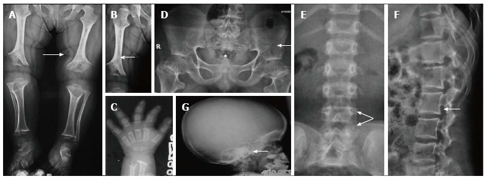
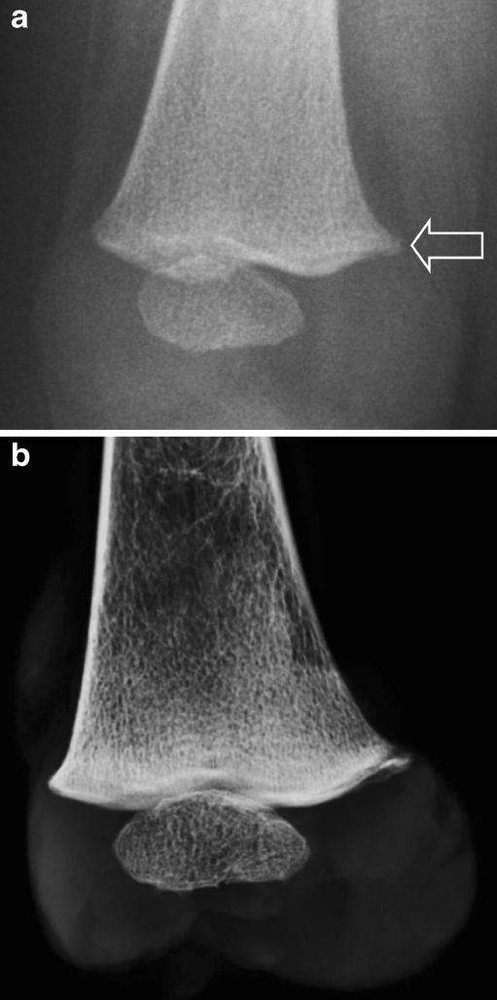
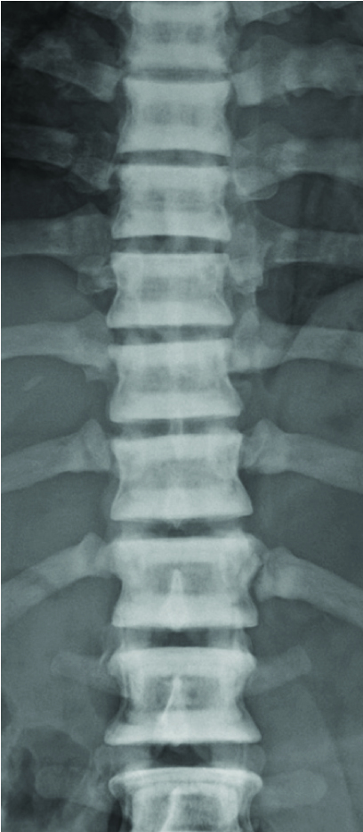
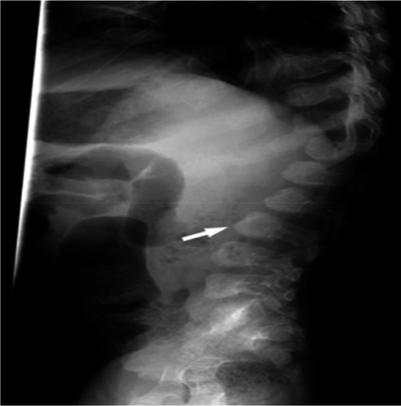
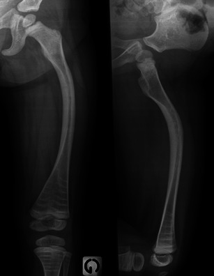

# Skeletal Dysplasias & Non-Accidental Injury

A skeletal dysplasia is a generalised, intrinsic disorder of bone and/or cartilage growth, modelling and mineralisation — so the abnormality is *bilateral, symmetric and affects the whole skeleton* rather than a single bone. The radiologist's job at the exam table is rarely to name the precise syndrome blind; it is to (1) describe the abnormality in a disciplined anatomical language, (2) narrow to a short, defensible differential, and (3) recognise the handful of "aunt-Minnie" patterns that examiners love. Non-accidental injury (NAI) sits in the same paper because it is the great mimic and great differential of the brittle/fragile-bone dysplasias, and because its recognition carries medico-legal weight. Treat all of this as scaffolding to read *with* films and plates — the diagnosis lives in the images.

---

## 1. Classification & descriptive framework (do this FIRST, every time)

Before naming anything, localise the lesion within the bone and describe the pattern of limb shortening. This vocabulary is what earns marks and what a good film report demonstrates.

**(a) Which part of the bone is predominantly affected?** This is the single most useful axis.
- **Epiphyseal** — e.g. multiple epiphyseal dysplasia, spondyloepiphyseal dysplasia.
- **Physeal (growth-plate)** — e.g. metaphyseal chondrodysplasias affect the adjacent physis.
- **Metaphyseal** — flaring, fraying, cupping; e.g. metaphyseal dysplasias, achondroplasia (also).
- **Diaphyseal** — cortical thickening/hyperostosis; e.g. Camurati-Engelmann (progressive diaphyseal dysplasia).
- **Spondylo- (vertebral)** — involvement of the spine, prefixed onto the above (spondylo-epiphyseal, spondylo-metaphyseal, spondylo-epi-metaphyseal).

**(b) Pattern of limb shortening (the "-melic" terms).** Describe which segment of the limb is disproportionately short:
- **Rhizomelic** — proximal segment (humerus/femur) — e.g. **achondroplasia**.
- **Mesomelic** — middle segment (radius-ulna/tibia-fibula) — e.g. dyschondrosteosis.
- **Acromelic** — distal segment (hands/feet).
- **Micromelic** — the whole limb is short — e.g. severe lethal dysplasias such as thanatophoric dysplasia, achondrogenesis.

**(c) Lethal vs non-lethal at birth.** A practical neonatal-radiology split. Features suggesting a *lethal* dysplasia include a markedly small thorax (thoracic-to-abdominal circumference disproportion → pulmonary hypoplasia), severe micromelia, and poor mineralisation. Classic lethal group: **thanatophoric dysplasia** ("telephone-receiver" femora, H- or U-shaped flattened vertebrae), **achondrogenesis** (severe under-mineralisation of spine), **osteogenesis imperfecta type II** (crumpled/beaded ribs, multiple fractures), **campomelic dysplasia** (bowed long bones).

**(d) Modelling abnormalities to name explicitly.** "Undermodelling" gives an **Erlenmeyer-flask** metaphysis (widened, under-tubulated metaphysis with a narrow shaft) — seen in osteopetrosis, Pyle disease/metaphyseal dysplasia, Gaucher, thalassaemia, and others (a recurring enumeration question).

**Must-know non-lethal dysplasias (one-line anchor each):**

| Dysplasia | Signature radiological features |
|---|---|
| **Achondroplasia** | Rhizomelic shortening; **interpedicular distance narrows caudally (L1→L5)**; short pedicles → canal stenosis; **"champagne-glass" / square pelvis** with horizontal acetabular roofs; squared iliac wings; frontal bossing, large calvarium with small skull base; **"trident" hand**; "chevron/inverted-V" distal femoral physis |
| **Osteogenesis imperfecta** | Multiple fractures of differing age; **gracile, thin (osteopenic) bones**; bowing; **wormian bones**; vertebral compression/biconcavity; (clinically blue sclerae, dentinogenesis, hearing loss) |
| **Osteopetrosis** ("marble bone") | Diffusely dense, brittle bone; **"bone-in-bone" appearance**; **"sandwich"/"rugger-jersey" vertebra** (dense endplate bands); **Erlenmeyer-flask** metaphyseal undermodelling; cranial nerve foraminal narrowing |
| **Mucopolysaccharidoses (dysostosis multiplex)** | **J-shaped sella**, thick calvarium; **oar-shaped ribs** (narrow posteriorly, wide anteriorly); **anteroinferior beaked/hook vertebra** with thoracolumbar gibbus; **V-shaped (proximally pointed) metacarpals**; flared iliac wings, coxa valga |
| **Cleidocranial dysplasia** | Absent/hypoplastic **clavicles** (can appose shoulders); delayed cranial ossification with **wide fontanelles & wormian bones**; **wide/unfused pubic symphysis**; supernumerary/unerupted teeth; coned thorax |
| **Camurati-Engelmann** (progressive diaphyseal dysplasia) | **Symmetric, bilateral diaphyseal cortical thickening** (endosteal + periosteal) of long bones, sparing epiphyses/metaphyses |

---

## 2. Modality-wise approach

### Radiography (the workhorse — almost the entire diagnosis)
Plain films remain the primary and usually sufficient modality for dysplasias. For a *suspected dysplasia*, obtain a **dedicated skeletal survey**, not a single film: AP skull and lateral skull, AP spine and lateral spine (including a coned lateral lumbar spine to assess interpedicular distance and vertebral shape), chest, AP pelvis, and AP views of the long bones and one hand. Systematically assess each region against the framework above — skull (calvarial thickness, sella shape, wormian bones, base), spine (vertebral body shape, interpedicular distance, posterior elements), thorax (rib shape, clavicles), pelvis (iliac wing shape, acetabular angle, "champagne-glass" inlet), long bones (which segment short, metaphyseal modelling, epiphyseal ossification) and hands (metacarpal shape, trident configuration). Most of the named buzzwords are radiographic.

### Ultrasound (prenatal, and the gateway for many)
The first "imaging" of a dysplasia is frequently **antenatal US**. It detects short/bowed long bones (femur length below expected for gestation), a small thorax predicting pulmonary hypoplasia, poor mineralisation (abnormally clear visualisation of intracranial structures suggests undermineralisation), fractures (OI), polyhydramnios, and frontal bossing. US cannot mineralisation-map the whole skeleton the way radiographs do, so prenatal suspicion is usually confirmed by postnatal babygram/survey and, increasingly, genetic testing.

### CT
Generally a **problem-solver, not a primary tool**, and used sparingly in children given dose. Roles: characterising **craniocervical junction and foramen magnum stenosis** in achondroplasia (a major source of morbidity — cord/brainstem compression), assessing **spinal canal stenosis**, delineating complex pelvic/acetabular anatomy before surgery, and CT angiography/bone detail where surgical planning is needed. In NAI, CT head is essential for intracranial injury and may incidentally show fractures; chest CT is not routine for skeletal survey.

### MRI
The modality of choice for the **neural consequences** of dysplasias rather than for the bone diagnosis itself: cervicomedullary/foramen-magnum compression and myelopathy in achondroplasia, lumbar **spinal/canal stenosis** and thecal sac compression, cord signal change, and syringomyelia. MRI also assesses marrow (e.g. in storage/haematological mimics) and is the best modality for ligamentous and cord injury in NAI of the spine.

### Nuclear medicine
**Limited role** in dysplasias. A bone scan is non-specific for the diagnosis. Its main paediatric MSK value is in **NAI**, where skeletal scintigraphy is more sensitive than radiographs for **rib fractures and subtle/early diaphyseal fractures**, but it is *less sensitive for classic metaphyseal lesions (CMLs) and skull fractures*, and it cannot date or characterise fractures the way films do — hence it complements, but does not replace, the radiographic skeletal survey.

---

## 3. Non-accidental injury (NAI / abusive skeletal trauma)

NAI is frequently its own question, often paired with OI as the differential. The radiologist must know which fractures carry **high specificity** for abuse, the **skeletal survey protocol**, the principles of **dating**, and the **differentials to exclude** before the diagnosis is alleged.

**Specificity of fractures for abuse** (a classic enumeration):

| Specificity | Fractures |
|---|---|
| **High specificity** | **Classic metaphyseal lesions (CML)** — the "**corner**" / "**bucket-handle**" metaphyseal fracture; **posterior rib fractures** (especially near costovertebral junction); **scapular**, **sternal**, and **spinous-process** fractures |
| **Moderate specificity** | Multiple fractures, especially **bilateral**; fractures of **different ages**; **complex / diastatic / multiple skull fractures**; vertebral body fractures/subluxation; digital fractures |
| **Low specificity / common** | Clavicular shaft fracture, isolated long-bone shaft fracture, linear parietal skull fracture, subperiosteal new bone |

Specificity is also raised by **any fracture in a non-ambulant infant** and by an **explanation that does not fit** the injury or the developmental stage.

**Skeletal survey protocol.** Use a **dedicated, multi-view survey — not a single whole-body "babygram"** (a babygram has unacceptable geometry/penumbra and misses subtle injuries). The survey comprises individually coned, correctly exposed views: AP skull and lateral skull; AP and lateral spine; AP chest with **oblique views of the ribs** (obliques markedly improve rib-fracture detection); AP abdomen/pelvis; and **AP views of each long bone separately**, plus AP hands and feet. A **follow-up (repeat) skeletal survey at approximately 2 weeks** substantially increases yield, because periosteal reaction and healing CMLs become visible that were occult acutely. Correlate with CT head for intracranial injury and consider scintigraphy as an adjunct for ribs.

**Dating of fractures (describe qualitatively).** Fracture age is estimated from the healing sequence, but ranges overlap widely, so give *ranges, not single days*: **soft-tissue swelling resolves early; periosteal new bone appears within roughly the first 1–2 weeks; soft callus and then hard callus form over the following weeks; remodelling takes months.** The presence of fractures at clearly **different stages of healing** is itself a moderate-specificity indicator of repeated injury. (Exact day-ranges are commonly quoted but variable — *verify exact values* against your reference before quoting a number.)

**Differentials to exclude before alleging abuse:**
- **Osteogenesis imperfecta** — fragile/gracile bones, wormian bones, blue sclerae, family history; can produce multiple fractures of differing age.
- **Rickets / metabolic bone disease** — metaphyseal fraying/cupping and osteopenia can mimic CMLs and predispose to fracture.
- **Physiological periostitis of infancy** — symmetric, smooth diaphyseal periosteal new bone, typically 1–4 months, *no fracture*.
- **Menkes disease** (copper deficiency) — metaphyseal changes, wormian bones, fractures.
- **Birth trauma** (clavicle, humerus) and prematurity/iatrogenic.

---

## 4. Differentials & comparison tables

**NAI vs Osteogenesis imperfecta (the exam favourite):**

| Feature | NAI | Osteogenesis imperfecta |
|---|---|---|
| Bone density | Usually normal | Diffusely osteopenic / gracile bones |
| Fracture pattern | CML, posterior ribs, multiple ages, *high-specificity* sites | Long-bone shaft fractures, bowing, vertebral compression |
| Wormian bones | Absent | Present (numerous) |
| Sclerae / dentition | Normal | Blue sclerae, dentinogenesis imperfecta |
| Family history | Negative | Often positive (autosomal dominant common) |
| CMLs / posterior ribs | Characteristic | Uncommon |

**Differential by buzzword/pattern:**

| Pattern / buzzword | Think of |
|---|---|
| Interpedicular distance narrowing caudally | **Achondroplasia** |
| Wormian bones | OI, **C**leidocranial dysplasia, **P**yknodysostosis, **H**ypothyroidism/hypophosphatasia, Menkes, Down, (mnemonic **PORKCHOPS**) |
| Erlenmeyer-flask metaphysis | Osteopetrosis, Pyle metaphyseal dysplasia, Gaucher, thalassaemia |
| Bone-in-bone vertebra / sandwich vertebra | **Osteopetrosis** |
| Diffusely dense skeleton in a child | Osteopetrosis, **pyknodysostosis**, sclerosing diaphyseal dysplasias, fluorosis, renal osteodystrophy, (myelosclerosis/metastatic — rare in child) |
| J-shaped sella + beaked vertebra + oar ribs | **Mucopolysaccharidoses / dysostosis multiplex** |
| Absent clavicles + wide pubic symphysis | **Cleidocranial dysplasia** |
| Corner / bucket-handle metaphyseal fracture | **NAI until proven otherwise** |

---

## 5. Pearls & buzzwords

- **"Interpedicular distance decreasing caudally (L1→L5)"** → achondroplasia (normally it *widens* caudally). Short pedicles → spinal stenosis is the clinical consequence.
- **"Champagne-glass" pelvis, "trident" hand, frontal bossing with rhizomelia** → achondroplasia.
- **"Wormian bones"** → think the PORKCHOPS group; OI and cleidocranial dysplasia are the two you must always name.
- **"Bone-in-bone," "sandwich/rugger-jersey vertebra," Erlenmeyer flask, brittle dense bone"** → osteopetrosis.
- **"J-shaped sella, oar ribs, beaked vertebra with gibbus, V-shaped metacarpals"** → mucopolysaccharidoses.
- **Absent/hypoplastic clavicles + delayed cranial ossification + wide pubic symphysis + dental anomalies** → cleidocranial dysplasia.
- **"Corner / bucket-handle metaphyseal lesion" and "posterior rib fractures"** → highly specific for NAI.
- A **single AP babygram is inadequate** for either a dysplasia survey or an NAI survey — always describe the *dedicated, coned, multi-view* protocol.
- Always **exclude OI, rickets and other metabolic disease before alleging abuse.**

---

## 6. What to draw

- **Achondroplasia lumbar spine** (AP): show the interpedicular distance *narrowing from L1 to L5* with short, thick pedicles — the reverse of normal.
- **Achondroplasia pelvis**: "champagne-glass" pelvic inlet with squared iliac wings and horizontal acetabular roofs.
- **Metaphyseal CML**: the **corner fracture** and the **bucket-handle** fracture at a long-bone metaphysis (label both as the same lesion seen at different angles).
- **MPS vertebra**: lateral lumbar spine with an **anteroinferiorly beaked vertebral body** and thoracolumbar gibbus.

---

## 7. Image plates

---

## 8. Further reading

- Swischuk — *Imaging of the Newborn, Infant and Young Child*.
- Grainger & Allison's *Diagnostic Radiology* — paediatric musculoskeletal / skeletal dysplasias chapters.
- Resnick — *Diagnosis of Bone and Joint Disorders* (dysplasias; metabolic mimics).
- Kleinman — *Diagnostic Imaging of Child Abuse* (reference text for NAI fracture specificity, survey protocol and dating).
