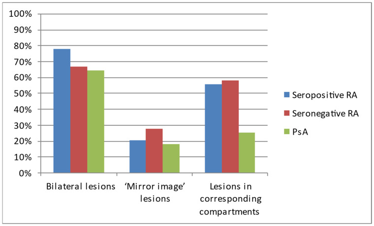
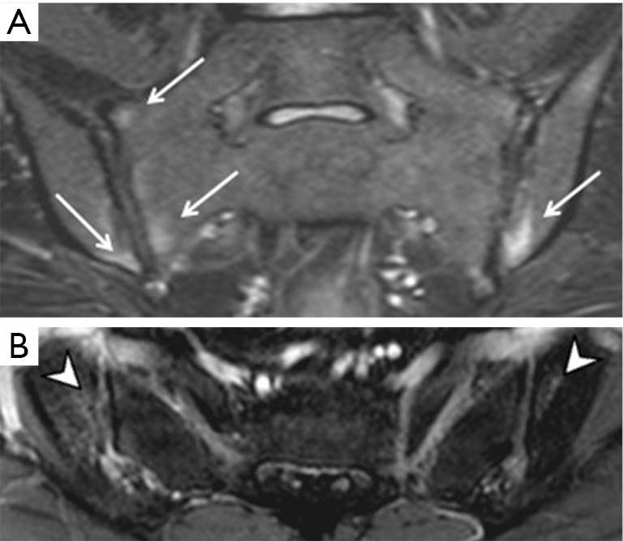
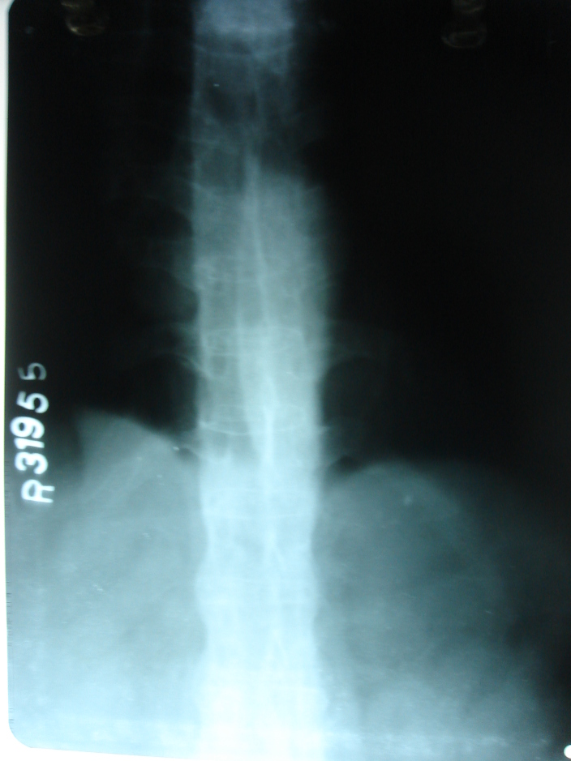
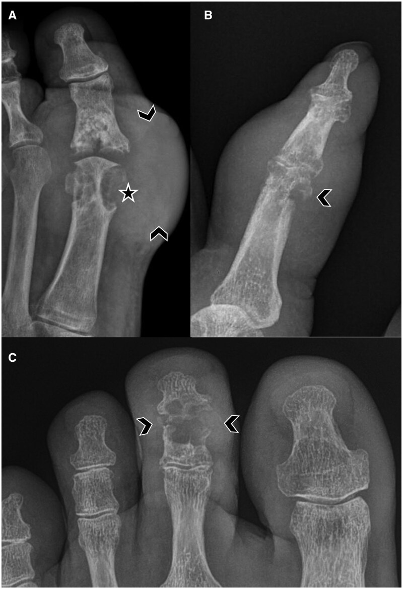

# Arthropathies (Inflammatory, Crystal, Degenerative)

The whole game in arthritis radiology is to read a film as a **pattern**, not a list of joints. Before you name a disease, answer four questions about the radiograph in front of you: *What is the **distribution**?* (which joints, symmetric vs asymmetric, proximal vs distal), *What is the **bone density**?* (normal vs periarticular osteopenia), *Is there an **erosion**, and what **type**?* (marginal, central, "punched-out", "pencil-in-cup"), and *Is the joint **productive** (new bone, osteophytes, periostitis) or **erosive/destructive**?* If you build the answer around those four axes you will differentiate the major arthropathies even on an imperfect plate. This topic is examined almost entirely as comparison and differentiation, so the marks live in the framework.

---

## 1) Classification framework (learn this first)

A workable working classification for the exam:

1. **Degenerative**
   - Primary osteoarthritis (OA)
   - Secondary OA (post-traumatic, post-inflammatory, metabolic e.g. CPPD-related, AVN, dysplasia)
   - Erosive (inflammatory) OA — a distinct hand subset
2. **Inflammatory — synovial / autoimmune**
   - Rheumatoid arthritis (RA) and juvenile idiopathic arthritis (JIA)
   - **Seronegative spondyloarthropathies (SpA):** ankylosing spondylitis (AS), psoriatic arthritis, reactive arthritis (Reiter), enteropathic arthritis (IBD-associated)
3. **Crystal-deposition arthropathies**
   - **Gout** (monosodium urate)
   - **CPPD** (calcium pyrophosphate dihydrate — "pseudogout"/chondrocalcinosis)
   - **HADD** (hydroxyapatite / basic calcium phosphate — calcific peri-arthritis/tendinitis)
4. **Infective / septic arthritis** (covered in the osteomyelitis–arthritis topic; always the differential for a monoarthritis)

**The four-axis reading checklist** — apply to *every* arthritis radiograph:
- **Distribution & symmetry** (target joints; bilateral symmetric vs asymmetric/random)
- **Bone density** (periarticular osteopenia is the hallmark of active synovial inflammation; preserved density argues for OA, gout or psoriatic)
- **Soft tissues** (fusiform periarticular swelling = synovitis; lumpy eccentric mass = tophus; "sausage digit" = dactylitis)
- **Erosions / joint surface** (none, marginal, central, punched-out with overhanging edge, pencil-in-cup) and **joint-space** behaviour (uniform vs non-uniform/asymmetric narrowing) and any **new bone** (osteophyte, periostitis, ankylosis).

A classic teaching shorthand contrasts the **"hypertrophic/productive"** arthritides (OA, psoriatic, neuropathic — new bone, normal density) with the **"atrophic/erosive"** ones (RA — osteopenia, no productive bone).

---

## 2) Modality-wise approach

### Radiography (XR) — the workhorse
The **plain radiograph remains the primary and most examinable modality** for arthritis. The four-axis checklist above is fundamentally a radiographic exercise. Standard views: dedicated **PA hands and wrists**, **feet** (the forefoot/MTPs are an early, high-yield site in both RA and gout and are frequently abnormal when hands look normal), weight-bearing knees, and an **AP pelvis / dedicated SI joint views** for suspected spondyloarthropathy. Radiographs define the *pattern* (distribution, density, erosion type, productive vs erosive) that lets you name the disease. Their weakness is **lag**: bone changes (erosions) appear late, after synovitis is established, so a normal radiograph never excludes early inflammatory disease.

### Ultrasound (US)
US has become central to **early inflammatory arthritis**, where it is far more sensitive than radiography. It demonstrates **joint effusion and synovial hypertrophy (hypoechoic pannus)**, and crucially **active synovitis on power/colour Doppler** (hyperaemia of the inflamed synovium). High-frequency probes detect **cortical erosions earlier than radiographs**, and visualise **enthesitis** (hypoechoic, thickened, hyperaemic tendon insertions with cortical irregularity), tenosynovitis and bursitis. In **crystal disease** US shows characteristic signs: the **"double-contour sign"** (a hyperechoic band of urate coating the hyaline cartilage surface) in gout, hyperechoic tophi with acoustic shadowing, and intrasubstance hyperechoic foci in cartilage/fibrocartilage in CPPD. US guides aspiration for crystal analysis and culture. Limitations: operator-dependent, limited penetration of deep/axial joints (poor for SI joints and spine).

### CT
CT is the best modality for **cortical bone detail and erosion morphology** and for **deep/complex joints** that US and radiographs assess poorly — particularly the **sacroiliac joints** (erosions, sclerosis, joint-space change, ankylosis) and the spine. **Dual-energy CT (DECT)** is the standout application in **gout**: it colour-codes and quantifies **monosodium urate deposits** non-invasively, mapping tophi and detecting urate in joints/tendons even when clinically occult. CT also assesses **atlanto-axial/cervical involvement and complications in RA**. Limitation: ionising radiation, and it shows established structural change rather than active inflammation (no marrow oedema).

### MRI — earliest and most sensitive for inflammation
MRI is the most sensitive modality for **early/pre-radiographic disease** and the reference standard for **active inflammation**. Findings:
- **Synovitis / pannus:** synovial thickening that enhances after gadolinium; effusion.
- **Bone marrow oedema (osteitis):** subchondral high T2/STIR signal — an early predictor of subsequent erosion and structural damage in RA, and a key marker of active sacroiliitis.
- **Erosions:** marrow-signal defects breaching the cortex, seen before they are radiographically visible.
- **Enthesitis & tenosynovitis** in spondyloarthropathy.
- In **axial SpA**, MRI of the SI joints (active inflammation = subchondral bone marrow oedema; structural = erosion, sclerosis, fat metaplasia, ankylosis) is the cornerstone of early diagnosis when radiographs are normal — the basis of "non-radiographic axial SpA."

### Nuclear medicine
**Three-phase bone scintigraphy (Tc-99m MDP)** is sensitive but **non-specific**: it shows increased uptake at sites of synovitis/increased bone turnover and is useful as a **whole-body survey** to map distribution (e.g. polyarticular pattern) or to detect occult/multifocal involvement, but it cannot characterise the lesion. Its role is largely supplanted by MRI and US for arthritis. (Labelled-WBC and FDG-PET have a role mainly in distinguishing infection/inflammation in problem cases.)

---

## 3) Disease-specific features

### Osteoarthritis (degenerative)
A **productive, "hypertrophic"** arthropathy with **normal bone density and no true synovial erosions**. The radiographic tetrad:
1. **Non-uniform / asymmetric joint-space narrowing** (loss is greatest where load is greatest — e.g. medial compartment of the knee, superior pole of the hip).
2. **Osteophytes** (marginal new bone).
3. **Subchondral sclerosis** (eburnation).
4. **Subchondral cysts (geodes).**

**Distribution:** DIP joints (**Heberden nodes**), PIP joints (**Bouchard nodes**), first carpometacarpal/trapezio-scaphoid joint of the thumb base, hips, knees, and the spine (facet OA, disc-space narrowing, vertebral osteophytes). **Erosive (inflammatory) OA** is a hand subset with **central erosions** producing the **"gull-wing"** deformity of the IP joints, with surrounding productive change — it overlaps clinically with inflammatory arthritis but lacks periarticular osteopenia and has a central (not marginal) erosion.

### Rheumatoid arthritis
The prototype **symmetric, erosive, "atrophic" synovial** arthritis. Radiographic hallmarks:
- **Symmetric, bilateral** involvement of **MCP, PIP and wrist (especially ulnar styloid, radiocarpal)** joints; **DIP joints are characteristically spared**. The forefoot (MTP joints, classically the 5th metatarsal head) is an early site.
- **Periarticular (juxta-articular) osteopenia** — early and characteristic.
- **Fusiform soft-tissue swelling** (synovitis).
- **Uniform (concentric) joint-space narrowing** — the whole synovial joint is affected, unlike the focal loss of OA.
- **Marginal erosions** beginning at the **"bare areas"** (intracapsular bone not covered by cartilage).
- Late deformities: **ulnar deviation** at the MCPs, subluxation, **swan-neck and boutonnière** deformities, **carpal crowding/ankylosis**, **"arthritis mutilans"** in severe cases.
- **Cervical spine:** **atlanto-axial subluxation** from erosion of the transverse ligament/dens — widened anterior **atlanto-dental interval (> 3 mm in adults)**; risk of cord compression; assess on flexion lateral view and MRI for cord/pannus.

### Seronegative spondyloarthropathies
A family unified by **enthesitis, sacroiliitis/spondylitis, productive new bone, normal bone density (no periarticular osteopenia), DIP/asymmetric peripheral involvement and HLA-B27 association.**

- **Ankylosing spondylitis (AS):** axial-predominant. **Bilateral, symmetric sacroiliitis** is the hallmark and earliest finding (erosions/"pseudo-widening" → sclerosis → ankylosis). Spine: **shiny corners (Romanus lesions)**, **vertebral body squaring**, **thin, vertical marginal syndesmophytes** that bridge to produce the **"bamboo spine"**, ossification of spinal ligaments, and **Andersson lesions** (inflammatory discovertebral lesions). Enthesitis elsewhere (calcaneus, ischial tuberosity). Ankylosed spine is brittle → high risk of unstable fractures.
- **Psoriatic arthritis:** asymmetric, **DIP / "ray" (whole-digit) distribution**, **normal bone density**, **"sausage digit" (dactylitis)**. Erosions are accompanied by **fluffy/"whiskery" periostitis and bone proliferation**; the classic deformity is the **"pencil-in-cup"** (erosion of the proximal phalanx head with cupping of the base of the distal phalanx) and, in severe cases, **arthritis mutilans** with telescoping ("opera-glass hand"). Sacroiliitis is typically **asymmetric**; paravertebral, **coarse/non-marginal syndesmophytes**.
- **Reactive arthritis (Reiter):** asymmetric **lower-limb** predominance, prominent **calcaneal enthesopathy** (fluffy plantar/retrocalcaneal spurs), asymmetric sacroiliitis.

### Gout (monosodium urate)
The classic **chronic tophaceous** radiographic picture (which lags acute attacks by years):
- **Asymmetric** distribution; classic target is the **first MTP joint (podagra)**; also tarsus, hands, elbows (olecranon bursa).
- **Punched-out "para-articular" erosions** with **sclerotic margins** and a characteristic **overhanging edge ("rat-bite", Martel's hook)** of cortex.
- **Preserved joint space and normal bone density until late** (no diffuse osteopenia — a key contrast with RA).
- **Eccentric soft-tissue masses = tophi**, which may calcify (especially in renal impairment).
- **DECT** maps urate non-invasively; **US** shows the **double-contour sign** and tophi.

### CPPD / chondrocalcinosis (pseudogout)
- **Chondrocalcinosis** = calcification of **cartilage**: linear/punctate calcium in **hyaline cartilage** and **fibrocartilage** — classic sites are the **knee menisci**, the **triangular fibrocartilage (TFCC) of the wrist**, and the **symphysis pubis**.
- **Pyrophosphate arthropathy:** a degenerative-type arthropathy that occurs in an **OA-like picture but in unusual joints** — the **radiocarpal compartment** (producing a **SLAC-like** scapholunate advanced collapse pattern), the **patellofemoral** compartment, the elbow and shoulder — with prominent **subchondral cysts** and structural change out of proportion to typical OA.
- Search for an underlying cause when young/florid (see table below).

### HADD (hydroxyapatite deposition disease)
Deposition of basic calcium phosphate in **tendons/periarticular soft tissue** → **calcific tendinitis**, classically the **supraspinatus tendon** of the shoulder; amorphous, cloud-like periarticular calcification that can resorb. (Milwaukee shoulder = destructive HADD arthropathy of the shoulder, mainly elderly women.)

---

## 4) Differentials / comparison tables

**Core four-axis comparison of the major hand arthropathies:**

| Feature | Osteoarthritis | Rheumatoid arthritis | Psoriatic arthritis | Gout |
|---|---|---|---|---|
| Symmetry | Asymmetric | **Symmetric, bilateral** | Asymmetric | Asymmetric |
| Target joints | DIP, PIP, 1st CMC | **MCP, PIP, wrist** (DIP spared) | **DIP / whole "ray"** | **1st MTP**, then hands |
| Bone density | Normal | **Periarticular osteopenia** | Normal | Normal |
| Joint space | Non-uniform/asymmetric narrowing | **Uniform** narrowing | Variable | Preserved until late |
| Erosions | None (central in erosive OA) | **Marginal** (bare-area) | "Pencil-in-cup" | **Punched-out, overhanging edge** |
| New bone | **Osteophytes** | None (atrophic) | **Fluffy periostitis** | None |
| Soft tissue | Minimal | Fusiform synovitis | **Sausage digit (dactylitis)** | **Eccentric tophus** |

**Sacroiliitis pattern — a high-yield discriminator:**

| | Symmetry | Typical disease |
|---|---|---|
| **Bilateral, symmetric** | Both joints, equal | **Ankylosing spondylitis**, enteropathic (IBD) |
| **Bilateral, asymmetric** | Both, unequal | **Psoriatic**, reactive arthritis |
| **Unilateral** | One joint | **Infection**, early SpA |

**Calcification by tissue of deposition:**

| Crystal / disease | Tissue calcified | Buzzword |
|---|---|---|
| **CPPD** | Cartilage (hyaline + fibrocartilage) | Chondrocalcinosis (menisci, TFCC) |
| **HADD** | Tendon / periarticular soft tissue | Calcific tendinitis (supraspinatus) |
| **Gout (chronic)** | Tophus (urate, may calcify late) | Overhanging-edge erosion + tophus |

**Common causes of chondrocalcinosis** (the classic enumeration — "the 4 H's plus age"): **idiopathic/ageing** (commonest), **Hyperparathyroidism**, **Haemochromatosis**, **Hypophosphatasia/Hypomagnesaemia**, and association with **gout** and **Wilson disease**.

**Productive ("hypertrophic") vs atrophic arthritides:**

| Productive (new bone, normal density) | Atrophic (osteopenia, no new bone) |
|---|---|
| OA, psoriatic, reactive, neuropathic (Charcot) | Rheumatoid arthritis |

---

## 5) Pearls & buzzwords

- **"Punched-out erosion with an overhanging edge + preserved joint space + normal bone density + eccentric soft-tissue mass"** → **gout**.
- **"Pencil-in-cup deformity + fluffy periostitis + sausage digit + normal density"** → **psoriatic arthritis**.
- **"Symmetric, MCP/PIP/wrist, periarticular osteopenia, marginal erosions, uniform narrowing, DIP spared"** → **rheumatoid arthritis**.
- **"DIP nodes (Heberden), osteophytes, sclerosis, non-uniform narrowing, normal density"** → **osteoarthritis**.
- **"Chondrocalcinosis"** (meniscus / TFCC / symphysis) → **CPPD**; if OA in **radiocarpal or patellofemoral** joint, think pyrophosphate arthropathy.
- **"Bamboo spine + symmetric sacroiliitis"** → **ankylosing spondylitis**; **asymmetric** sacroiliitis → psoriatic/reactive.
- **"Double-contour sign"** on US and **colour-coded urate on DECT** → **gout** (non-invasive crystal proof).
- **"Bone marrow oedema on STIR"** = the earliest sign of **active inflammation** — predicts erosion in RA, defines active sacroiliitis in axial SpA.
- A productive arthropathy with **normal/dense bone but gross destruction and debris in a sensory-impaired joint** → think **neuropathic (Charcot)** as a differential.
- **Always comment on soft tissues, distribution, bone density and erosion type** in any arthritis answer — examiners reward the systematic four-axis read.
- Subperiosteal resorption (HPT) can coexist with chondrocalcinosis — remember metabolic disease as a *cause* of crystal arthropathy.

---

## 6) What to draw

- **Comparative hand diagram:** four hand outlines side-by-side with shaded target joints — **RA** (MCP/PIP/wrist, symmetric), **OA** (DIP/PIP/1st CMC), **psoriatic** (whole rays/DIP, sausage digit), **gout** (1st MTP on a foot outline + eccentric tophus). This single labelled figure answers most "differentiate X from Y" questions.
- **Erosion-type sketches:** marginal bare-area erosion (RA) vs punched-out overhanging-edge erosion (gout) vs central gull-wing (erosive OA) vs pencil-in-cup (psoriatic).
- **Sacroiliac joint grading / symmetry diagram:** bilateral symmetric vs bilateral asymmetric vs unilateral, mapped to disease.
- **Bamboo spine:** vertebral bodies with thin bridging marginal syndesmophytes and squared corners.

---

## 7) Further reading

- Resnick & Niwayama, *Diagnosis of Bone and Joint Disorders* (arthritis chapters) — the standard reference for the four-axis approach and erosion morphology.
- Grainger & Allison's *Diagnostic Radiology* — arthritis section.
- **Modified New York criteria** for ankylosing spondylitis; **ASAS** criteria and the role of SI-joint MRI in axial spondyloarthritis.
- ACR/EULAR resources on US and MRI scoring of synovitis and bone marrow oedema (e.g. RAMRIS concept) — for the modality-role discussion.
- Reviews on **dual-energy CT in gout** for the crystal-arthropathy answer.
