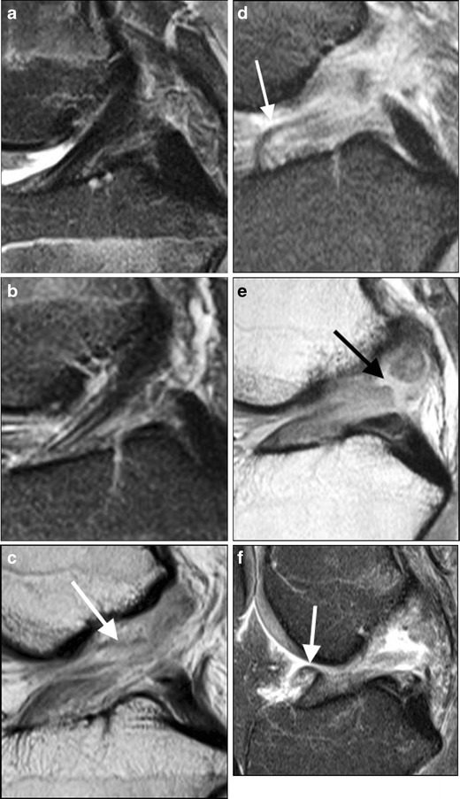
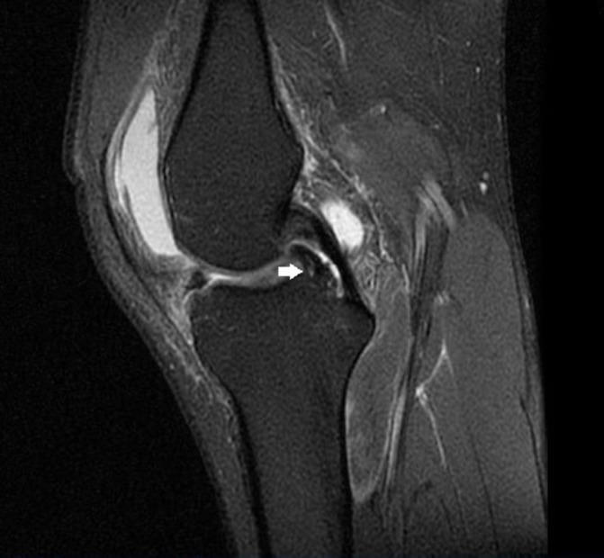
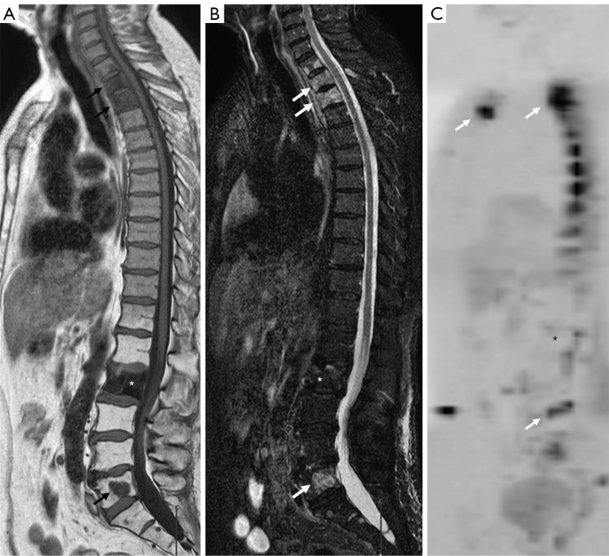
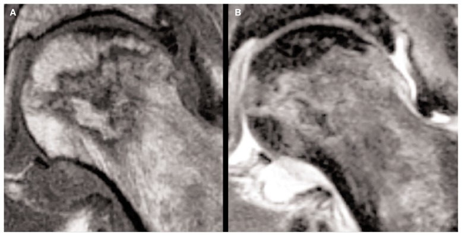

# MSK MRI — Internal Derangement, Marrow and Joints

> MSK MRI questions in the DNB theory paper cluster tightly around a few high-yield themes: the knee internal-derangement work-up (protocol, ACL and meniscal tears), the shoulder (rotator cuff and labrum), the *normal* and *abnormal* bone marrow signal (because marrow infiltration is examined repeatedly), and avascular necrosis with its classic signs and staging. The marks reward a candidate who first states an organised framework — an enumeration of tear types, a protocol, the primary-versus-secondary sign structure — and only then describes findings. MRI is overwhelmingly the dominant modality here; radiograph, ultrasound, CT and nuclear medicine play limited, defined adjunctive roles, and you should say explicitly *where* each is limited rather than padding the answer. Remember throughout that signal description must be tied to the sequence (T1 / PD / T2 / fat-saturated / STIR), because an unqualified "high signal" earns nothing.

## 1. Classification and enumeration frameworks (write these FIRST)

### 1a. Internal derangement of the knee — the causes
"Internal derangement of the knee" (IDK) is an umbrella clinical term for an intra-articular mechanical disorder producing pain, locking, catching, giving-way or effusion. Enumerate the structural causes as a system:

- **Meniscal** — tears (degenerative or traumatic), meniscal cysts, discoid meniscus.
- **Ligamentous** — anterior cruciate ligament (ACL), posterior cruciate ligament (PCL), medial and lateral collateral ligaments, posterolateral corner.
- **Chondral / osteochondral** — chondral fissures and defects, osteochondritis dissecans, osteochondral fractures.
- **Synovial** — plicae, pigmented villonodular synovitis, synovial chondromatosis, loose bodies.
- **Extensor mechanism** — patellar maltracking/instability, patellar and quadriceps tendon disease.
- **Marrow / osseous** — bone bruises (contusion patterns reflecting mechanism), subchondral insufficiency fracture, occult fractures.

### 1b. Meniscal tears — morphological classification
- **Horizontal (cleavage)** — degenerative; parallel to the tibial plateau; associated with parameniscal cysts.
- **Vertical** — subdivided into **longitudinal** (which may extend into a **bucket-handle** tear) and **radial** (perpendicular to the free edge; gives the "truncated triangle" and "ghost meniscus" appearances).
- **Complex** — combination of planes (typically degenerate).
- **Displaced** — bucket-handle (longitudinal displaced fragment) and flap tears.
- **Root tears** — avulsion of the meniscal root from its tibial attachment, functionally equivalent to total meniscectomy.

### 1c. ACL tear — primary versus secondary signs (the marks live in this split)
Structure every ACL answer as **primary (direct) signs** of the torn ligament itself versus **secondary (indirect) signs** that imply the tear from associated derangement.

### 1d. AVN staging systems
The two named systems to enumerate are **Ficat and Arlet** (stages 0–IV, classically based on radiograph/clinical with MRI added) and the more quantitative **ARCO** (Association Research Circulation Osseous) classification. State the conceptual progression — normal imaging → marrow signal change before radiographic change → crescent sign/subchondral fracture → articular collapse → secondary osteoarthritis — rather than memorising every numeric sub-grade (verify exact grade boundaries).

## 2. Modality-wise roles and findings

### Radiograph (XR) — the starting point, but blind to soft tissue
The radiograph remains the first investigation in knee, shoulder or hip pain to exclude fracture, assess joint space, alignment, effusion and to detect *late* osteoarthritic or AVN change. Its fundamental limitation in internal derangement is that it does not image menisci, cruciates, labrum, cartilage or early marrow disease. Specific positive clues worth naming: the **Segond fracture** (a thin vertical avulsion fragment off the lateral tibial margin) is radiographically subtle but is a strong marker of underlying ACL rupture; a **deep lateral femoral notch** may be visible on a lateral view; in AVN the radiograph shows mottled sclerosis/lucency and the **crescent sign** only once the disease is established, by which time MRI would have been positive far earlier.

### Ultrasound (US) — superficial structures and dynamic assessment
US is operator-dependent and cannot see intra-articular menisci or cruciates, so its role in internal derangement is genuinely limited and should not be overstated. Where it excels is in **superficial soft tissue**: it characterises the rotator cuff (dynamic full- and partial-thickness tear assessment), the long head of biceps tendon, the quadriceps and patellar tendons, Baker's cysts and parameniscal cysts, and joint effusion. It is excellent for **guiding aspiration and injection** and for assessing vascularity with Doppler. It is a reasonable first-line cuff test in many centres but does not assess the labrum or marrow.

### Computed tomography (CT) — bone, and a problem-solver when MRI is contraindicated
CT is superior to MRI for cortical and trabecular bone detail, and is used for complex articular fractures, fragment characterisation, loose-body detection and pre-operative planning. **CT arthrography** is the principal alternative when MRI is contraindicated (pacemaker, certain implants) and is excellent for cartilage surface, loose bodies, and for the **post-operative meniscus**. CT does not reliably show marrow infiltration, ligament substance or early AVN, so it complements rather than replaces MRI for internal derangement.

### Magnetic resonance imaging (MRI) — the modality of choice
MRI is the workhorse for all the topics in this chapter. The general principle is that **fluid-sensitive sequences (fat-saturated PD/T2 and STIR)** make pathology conspicuous — a tear or marrow oedema becomes bright fluid signal against suppressed fat — while **T1** is the key sequence for marrow assessment and anatomy.

**Knee protocol.** A standard knee protocol uses **proton-density and T2 fat-saturated sequences in all three planes**, with T1 for marrow and anatomy. Sagittal and coronal planes are best for the menisci and cruciates; the axial plane assesses the patellofemoral joint, retinacula and the cruciate origins. Slice thickness is kept thin (on the order of 3–4 mm; verify against local protocol) to avoid volume-averaging a small meniscal tear.

**ACL tear — findings.**
- *Primary signs:* complete fibre discontinuity or non-visualisation of the ligament; abnormal increased intrasubstance T2 signal (oedema/haemorrhage); an abnormal **flat or horizontal slope** of the ACL (it should parallel the roof of the intercondylar notch — Blumensaat's line); a wavy/mass-like appearance of the torn stump.
- *Secondary signs (enumerate — examiners reward these):* **anterior tibial translation** relative to the femur; the **deep lateral femoral notch sign**; the characteristic **"kissing" bone bruise pattern** at the lateral femoral condyle (sulcus terminalis region) and the posterolateral tibial plateau, reflecting the **pivot-shift** mechanism; buckling of the PCL (the **"PCL line/angle" sign**); uncovering of the posterior horn of the lateral meniscus; and the **Segond fracture** (lateral capsular avulsion, highly associated with ACL tear).

**Meniscal tear — MRI signs.** The diagnostic criterion is **intrameniscal signal that unequivocally contacts the articular (superior or inferior) surface** of the meniscus on at least the standard cut(s). Intrasubstance signal that does not reach a surface is mucoid/degenerative (Grade 1–2), not a tear. Morphological distortion (truncated or absent triangle) is also diagnostic. For the **bucket-handle tear**, name the specific signs:

- **Double-PCL sign** — the displaced inner fragment lies in the intercondylar notch anteroinferior to the true PCL on the sagittal image.
- **Flipped-meniscus / fragment-in-notch sign** — a displaced fragment giving an abnormally large or duplicated anterior horn, or fragment seen within the notch.
- **Absent bow-tie sign** — the normal "bow-tie" of the meniscal body fails to appear on the expected number of sagittal slices because the body has displaced.
- A small/truncated peripheral remnant where the meniscus should be.

**MR arthrography.** Direct MR arthrography (intra-articular dilute gadolinium) distends the joint and outlines structures. Its highest-yield indication is the **post-operative meniscus**: after partial meniscectomy or repair, intrasubstance signal persists and ordinary criteria fail, so the demonstration of **contrast imbibing into the substance of a tear** is the reliable sign of a re-tear. It also improves detection of subtle inner-margin and undersurface tears, and is the technique of choice for the **shoulder labrum** and for chondral assessment. Indirect (intravenous) arthrography is an alternative when joint puncture is undesirable.

**Shoulder.** The **rotator cuff** is graded as tendinosis → partial-thickness (articular- or bursal-surface) → full-thickness tear; describe the gap, the size/retraction of the torn tendon edge, and chronic **muscle atrophy and fatty infiltration**, graded by the **Goutallier** system (fat content of the muscle belly; higher grades predict poorer repair). The **labrum** is best assessed on MR arthrography: enumerate the **Bankart** lesion (antero-inferior labral tear, often with a bony Bankart), the **SLAP** lesion (Superior Labrum Anterior to Posterior), and the **Hill–Sachs** impaction defect of the posterolateral humeral head — the lesions of anterior shoulder instability.

**Bone marrow.** Knowledge of *normal* marrow is examined as often as pathology. At birth marrow is almost entirely red (haematopoietic); with age it undergoes **red-to-yellow (fatty) conversion** that proceeds in an orderly fashion — epiphyses/apophyses convert first (they are fatty soon after ossification), then the conversion sweeps from the **periphery toward the axial skeleton** and within a long bone from **diaphysis outward to the metaphyses**, so the **proximal metaphyses of the femur and humerus retain red marrow longest** into adulthood. The key signal rule: on **T1**, normal **red marrow is brighter than skeletal muscle and intervertebral disc** because even red marrow contains fat. Therefore **marrow that is darker than (or isointense to) muscle/disc on T1 indicates pathological infiltration or replacement** — metastasis, myeloma, lymphoma, leukaemia. Chemical-shift (in/opposed-phase) imaging helps confirm normal marrow fat (signal drop on opposed-phase) versus replacing tumour (no drop). **Reconversion** (yellow → red) occurs under haematopoietic stress — chronic anaemia, marrow-stimulating drugs, heavy smoking, obesity, high-altitude/endurance athletes — and proceeds in the reverse order. The general **marrow-oedema pattern** (low on T1, high on STIR/fat-sat T2) is non-specific and is the common final pathway of trauma/bone bruise, infection, AVN, transient osteoporosis of the hip, stress reaction and tumour — interpret it by context.

**Avascular necrosis (AVN).** MRI is the **most sensitive and specific** modality and turns positive before radiographs. The hallmark is the **double-line sign** on T2-weighted images — an inner bright line of hypervascular granulation/repair tissue and an outer dark line of reactive sclerosis at the margin of the necrotic segment — surrounding a **serpentine/geographic** subchondral lesion that often retains fatty (preserved) signal centrally early on. The **crescent sign** (a subchondral fluid/fracture cleft) heralds **subchondral collapse** and articular incongruity. Stage with **Ficat–Arlet** or **ARCO** (as above). The named **causes** to list: corticosteroids, alcohol, sickle-cell disease, trauma (femoral neck fracture, dislocation), systemic lupus erythematosus, Gaucher disease, caisson (dysbaric) disease, radiation and pancreatitis.

**Cartilage imaging.** Morphological cartilage assessment uses fat-saturated PD/T2 and **3D gradient-echo (e.g. DESS)** sequences; compositional/advanced techniques such as **T2 mapping** and **dGEMRIC** detect biochemical change before morphological loss (verify availability/role locally). Grade chondral loss with **Outerbridge or ICRS**.

### Nuclear medicine — limited, screening and equivocal-case roles
In internal derangement, scintigraphy has essentially no role for menisci or ligaments. Its defined uses are as a **whole-skeleton screen** — Tc-99m MDP bone scan or **SPECT/CT** to localise an occult stress injury, a painful arthroplasty or unexplained joint pain — and in early AVN, where the classic pattern is a photopenic (cold) necrotic centre with a surrounding ring of increased uptake ("doughnut"), though MRI has largely superseded it. State plainly that for soft-tissue internal derangement MRI is far superior.

## 3. Differential and comparison tables

| Sequence | Best for | Normal marrow appearance |
|---|---|---|
| **T1** | Anatomy; marrow assessment | Fatty/yellow marrow bright; red marrow brighter than muscle |
| **PD / T2 fat-sat** | Menisci, cartilage, ligaments, oedema | Fluid/tear/oedema bright against suppressed fat |
| **STIR** | Marrow oedema, occult fracture | Reliable fat suppression; oedema very bright |
| **Gradient-echo (3D)** | Cartilage morphology, loose bodies | — |
| **Post-Gd / MR arthrogram** | Post-op meniscus, labrum, synovium | Contrast fills a re-tear / outlines labrum |

| ACL tear — sign type | Examples |
|---|---|
| **Primary (direct)** | Fibre discontinuity / non-visualisation, abnormal T2 signal, flat horizontal slope, mass-like stump |
| **Secondary (indirect)** | Anterior tibial translation, deep lateral femoral notch, kissing bone bruise (pivot-shift), PCL buckling, uncovered posterior horn lateral meniscus, Segond fracture |

| Bucket-handle tear sign | What you see |
|---|---|
| Double-PCL sign | Displaced fragment in notch beneath the PCL (sagittal) |
| Absent bow-tie sign | Fewer-than-expected meniscal-body "bow-tie" slices |
| Flipped/fragment-in-notch | Enlarged/duplicated anterior horn; fragment in notch |

| Feature | Normal marrow | Infiltration (tumour/myeloma) |
|---|---|---|
| T1 vs muscle/disc | Brighter than muscle | Isointense or darker than muscle |
| Opposed-phase (chemical shift) | Signal drops (contains fat) | No significant drop |
| Distribution | Symmetric, age-appropriate | Focal/patchy or diffuse, asymmetric |

## 4. Pearls and buzzwords

- **"Double-PCL sign"** → displaced **bucket-handle** (usually medial) meniscal tear.
- **"Absent bow-tie sign"** → displaced bucket-handle tear (body has migrated).
- **"Deep lateral femoral notch + kissing bone bruise"** (lateral femoral condyle and posterolateral tibial plateau) → **ACL tear** (pivot-shift mechanism).
- **"Segond fracture"** → lateral capsular avulsion, strongly associated with ACL rupture (and "reverse Segond" with PCL/medial injury).
- **"Double-line sign"** on T2 → **avascular necrosis**.
- **"Crescent sign"** → subchondral collapse in AVN.
- **T1 marrow darker than muscle/disc** → think **infiltration / replacement** (myeloma, metastasis, leukaemia).
- **"Ghost meniscus / truncated triangle"** → **radial** meniscal tear.
- **Goutallier grade** → fatty muscle atrophy in chronic rotator cuff tear (predicts repairability).
- **Contrast entering the meniscal substance on MR arthrogram** → post-operative **re-tear**.

## 5. What to draw

- A **sagittal knee** cartoon with the normal ACL paralleling Blumensaat's line, plus the **bone-bruise locations** (lateral femoral condyle and posterolateral tibial plateau) and the deep lateral notch.
- The **double-PCL sign** schematic: true PCL with a second curvilinear band (displaced bucket-handle fragment) below it in the notch.
- A **meniscal-tear type panel**: horizontal, vertical longitudinal, radial, bucket-handle (displaced), complex — small cross-sections.
- A **marrow-conversion diagram** of a long bone showing the periphery-to-axial / diaphysis-to-metaphysis sweep, with the proximal metaphysis labelled as the last red-marrow reservoir, and a T1 signal scale (fat > red marrow > muscle).
- The **AVN double-line sign** as a femoral head with the inner bright and outer dark lines bounding the serpentine necrotic segment.

## 6. Further reading

- Stoller, *Magnetic Resonance Imaging in Orthopaedics and Sports Medicine* — knee, shoulder and marrow chapters.
- Grainger & Allison's *Diagnostic Radiology* — MSK MRI sections.
- Resnick & Kransdorf, *Bone and Joint Imaging* — internal derangement, marrow, and osteonecrosis.
- Helms, *Fundamentals of Skeletal Radiology* — for correlation of radiographic and MRI findings.
