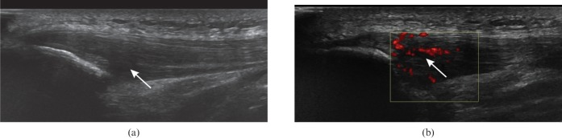
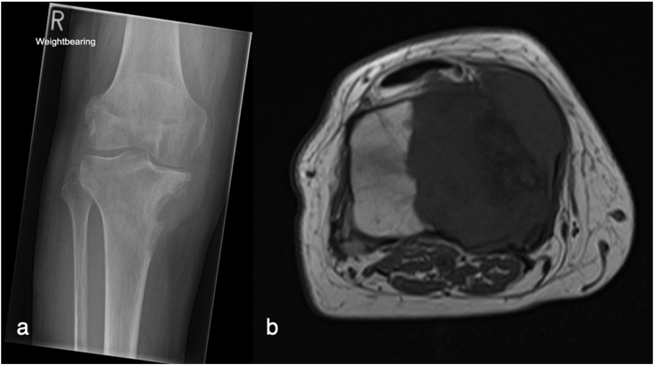
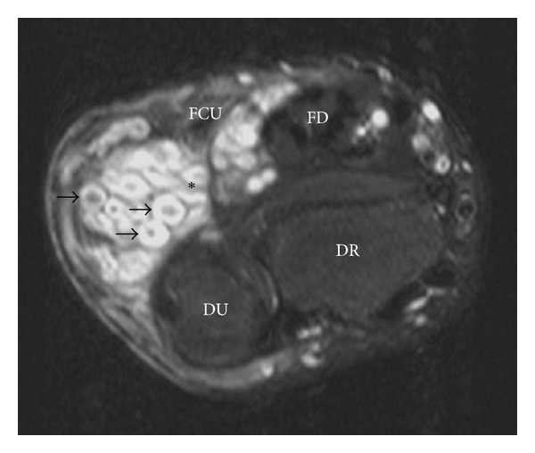

# MSK Ultrasound & Soft-Tissue / Nerve-Sheath Lesions

A high-yield, image-paired topic. Two themes recur in the DNB: (1) **what ultrasound can and cannot do in the musculoskeletal system**, and (2) **how to characterise a soft-tissue mass on MRI**, with **peripheral nerve-sheath tumours** as the favourite named lesion (the only confirmed past question on this topic asks exactly that). Throughout, remember the governing principle: most soft-tissue masses are **non-specific on imaging**, imaging **cannot reliably exclude sarcoma**, and the radiologist's job is to characterise, stage, and guide a correctly-planned biopsy rather than to make a confident benign call.

---

## 1. Frameworks to enumerate first

Marks live in the system, so open every answer with a classification skeleton.

**A. Roles of MSK ultrasound (mnemonic: Tendon, Muscle, Joint, Mass, Nerve, Guide, Paediatric)**
1. **Tendons & ligaments** — tendinosis, partial/full tears, dynamic manoeuvres.
2. **Muscle** — injury grading, haematoma, hernia.
3. **Joint & bursa** — effusion, synovitis (power Doppler), bursitis.
4. **Soft-tissue mass** — cystic vs solid, vascularity, depth.
5. **Nerve** — entrapment, neuromas, nerve-sheath tumours.
6. **Foreign body** — detection and guided retrieval.
7. **Interventional guidance** — aspiration, injection, biopsy.
8. **Paediatric** — DDH (Graf), septic hip effusion, cartilaginous structures.

**B. Soft-tissue mass — diagnostic algorithm**
1. Is it a **mass** or a pseudotumour (haematoma, abscess, myositis ossificans)?
2. Is it **cystic or solid** (US/MRI)?
3. Does it have a **specific diagnosis** (lipoma, haemangioma, simple cyst, PVNS) — the minority?
4. If non-specific → assume **indeterminate / potentially malignant** → MRI stage → **planned biopsy**.

**C. Features suggesting malignancy in a soft-tissue mass**
- Size **> 5 cm**
- **Deep** to the deep fascia
- **Heterogeneous** signal, **necrosis**, ill-defined margins
- **Rapid growth**, peritumoral oedema, neurovascular/bone involvement
(No single feature is diagnostic; benign lesions can be large and deep, and some sarcomas are small — *use the constellation*.)

**D. Peripheral nerve-sheath tumours**
- **Benign:** schwannoma (neurilemmoma), neurofibroma (localised / diffuse / **plexiform**).
- **Malignant:** **MPNST** (malignant peripheral nerve-sheath tumour), often arising in NF1.
- Syndromic associations: **NF1** (neurofibromas, plexiform, MPNST risk), **NF2 / schwannomatosis** (multiple schwannomas).

---

## 2. Modality-wise findings (XR → US → CT → MRI → nuclear)

### Radiographs (XR)
First-line but **limited** for soft tissue. Look for:
- **Calcification / ossification** patterns — peripheral, zonal ossification → **myositis ossificans** (mature rim); **phleboliths** (rounded with lucent centre) → **haemangioma**; amorphous/dystrophic calcification → **synovial sarcoma** or treated lesion.
- **Fat lucency** of a lipoma.
- **Bone involvement** — pressure erosion (benign, slow) vs aggressive cortical destruction/periosteal reaction (malignant).
- A normal radiograph **never excludes** a soft-tissue tumour.

### Ultrasound (US) — the workhorse for superficial structures

- **Tendons:** normal **fibrillar** pattern in long axis; tendinosis = **hypoechoic fusiform thickening** with **neovascularity on power Doppler**; tears = hypo/anechoic gap, retraction, dynamic gapping; **anisotropy** (artefactual hypoechogenicity when the probe is off-perpendicular) is the classic pitfall mimicking a tear — tilt the probe to confirm.
- **Muscle injury grading (qualitative — verify exact percentages locally):** Grade I strain (oedema, "feathery" hyperechogenicity, minimal architectural disruption), Grade II partial tear (discrete fibre disruption ± haematoma), Grade III complete tear (full discontinuity, retracted "bell-clapper" stump, the "notch" sign).
- **Joints/bursa:** anechoic **effusion** (compressible, displaceable) vs hypoechoic **synovial hypertrophy** (non-compressible); **power Doppler signal within synovium = active inflammation** — a key disease-activity marker in inflammatory arthritis.
- **Mass:** distinguishes **cystic** (anechoic, through-transmission, no internal Doppler — e.g. ganglion, Baker cyst) from **solid** (internal echoes, vascularity). A **ganglion** is anechoic, lobulated, near a joint/tendon; PVNS/GCT-tendon-sheath is a solid hypoechoic vascular nodule.
- **Foreign body:** **echogenic focus**, ± posterior **acoustic shadowing** (wood, metal) or **comet-tail/reverberation** (glass, metal), with surrounding hypoechoic granulation/oedema; US detects radiolucent wood that XR misses.
- **Nerve:** "honeycomb" fascicular pattern; nerve-sheath tumours appear as **hypoechoic fusiform masses continuous with a nerve**, often with **posterior enhancement** (mimicking a cyst) and **entering/exiting nerve** at the poles.
- **Advantages:** no radiation, **dynamic** real-time imaging, very high spatial resolution for superficial structures, contralateral comparison, cheap, **real-time guidance**. **Limits:** highly **operator-dependent**, poor penetration of deep/large lesions, cannot see through bone/gas, limited global staging — so US is excellent for triage and superficial work but MRI remains the staging tool.

### Computed tomography (CT)
Secondary role for soft tissue. Best for:
- **Calcification/ossification** characterisation and **subtle cortical bone** involvement.
- **Chest CT for pulmonary metastases** in confirmed/suspected sarcoma (lung is the dominant metastatic site).
- CT-guided biopsy of deep lesions; problem-solving where MRI is contraindicated.
- Poor intrinsic **soft-tissue contrast** compared with MRI; fat (low attenuation) and fluid can be recognised but characterisation is inferior.

### Magnetic resonance imaging (MRI) — the primary characterisation and staging modality

- **Protocol logic:** **T1** for anatomy and fat; **fluid-sensitive fat-suppressed** (T2 FS / STIR) for lesion conspicuity and oedema; **gradient-echo (GRE)** for haemosiderin/calcium **blooming**; **post-gadolinium** for enhancement and necrosis.
- **Tissue-specific clues:**
  - **Fat** — high T1 and T2, **suppresses** on fat-sat → lipoma.
  - **Fluid** — low T1, very high T2, no solid enhancement → cyst/ganglion.
  - **Haemosiderin** — low T1/T2 with **GRE blooming** → PVNS / GCT tendon sheath, chronic haematoma.
  - **Flow voids / serpentine vessels + fat** → haemangioma/vascular malformation.
  - **Very high T2 with low T1, faint enhancement** → myxoma/myxoid tumour.
- **Staging information MRI must report:** size, depth (relative to **deep fascia**), **compartment** of origin, relationship to **neurovascular bundle**, bone/joint involvement, peritumoral oedema, and an enhancing component to target at biopsy. Local staging concepts map to the **Enneking** musculoskeletal system and **AJCC TNM** with **histologic grade** (cite frameworks by name; quote exact grade/stage cut-offs only from the chart in front of you — *verify exact value*).
- **Caveat:** despite all of the above, MRI **cannot reliably distinguish benign from malignant** in the indeterminate group — hence biopsy.

### Nuclear medicine / PET
- **FDG-PET / PET-CT:** grading correlate (high-grade sarcomas are FDG-avid), whole-body staging, distinguishing recurrence from post-treatment change, and **identifying MPNST transformation within a plexiform neurofibroma** in NF1 (a focally hypermetabolic nodule in a known plexiform lesion is the red flag).
- **Bone scan:** adjunct for skeletal metastases/involvement; non-specific for soft-tissue characterisation.

---

## 3. Nerve-sheath tumours — the exam centrepiece

**Shared features (benign):** a **fusiform mass oriented along the long axis of a nerve**, with the nerve **entering and exiting** at the poles.

**Classic MRI signs**
- **Split-fat sign** — a thin rim of fat surrounding the mass at its poles (intermuscular nerve location); favours a neurogenic origin.
- **Target sign** — central low and peripheral high T2 signal (central fibrocollagenous core, peripheral myxoid); more typical of **neurofibroma**, also seen in schwannoma; its absence raises suspicion of malignancy.
- **Fascicular sign** — multiple small ring-like fascicular structures within the mass (better seen in schwannoma).
- **Entering/exiting nerve** — the parent nerve traced into and out of the lesion.

**Schwannoma vs neurofibroma — the discriminator to write out**

| Feature | Schwannoma (neurilemmoma) | Neurofibroma |
|---|---|---|
| Relation to nerve | **Eccentric** — nerve splayed over the surface | **Central / fusiform** — nerve runs **through** it |
| Capsule | **Encapsulated** | Non-encapsulated |
| Resectability | Can be shelled out **preserving the nerve** | Resection often **sacrifices** the nerve |
| Target sign | Less common | **More common** |
| Cystic/haemorrhagic change | More common (ancient schwannoma) | Less common |
| Plexiform form | No | **Yes — pathognomonic of NF1** |
| Syndrome | NF2 / schwannomatosis (multiple) | **NF1** |

**Plexiform neurofibroma** — a "bag of worms"/multinodular mass along a nerve and its branches; **pathognomonic of NF1**; carries a lifetime risk of **MPNST** transformation.

**Suspect MPNST when:** rapid growth, **large size (> ~5 cm)**, ill-defined margins, **marked heterogeneity / central necrosis**, peritumoral oedema, loss of the target sign, and **new pain** — especially in a known **NF1** patient (where surveillance imaging ± FDG-PET is used to catch malignant change).

---

## 4. Differentials & comparison tables

**Soft-tissue masses with a (relatively) specific imaging diagnosis**

| Lesion | Key imaging signature |
|---|---|
| **Lipoma** | Follows fat on all sequences; **suppresses** on fat-sat; thin/few septa. Worry (atypical lipomatous tumour / well-differentiated liposarcoma) if **thick (>2 mm) septa, nodularity, prominent non-fatty enhancing components** |
| **Haemangioma / vascular malformation** | Serpentine vessels, **phleboliths** on XR, fat overgrowth, "bag of worms" |
| **Ganglion / synovial cyst** | Anechoic on US, fluid signal, near joint/tendon, no internal vascularity |
| **GCT tendon sheath / PVNS** | Low T1/T2, **GRE blooming** (haemosiderin), juxta-articular; PVNS = diffuse intra-articular form |
| **Myxoma** | Very high T2, low T1, faint enhancement; intramuscular |
| **Synovial sarcoma** | Juxta-articular (not from synovium), may **calcify**, **"triple sign"** and **fluid-fluid levels**; a great malignant mimic of a benign cyst |
| **Nerve-sheath tumour** | Fusiform along nerve, **split-fat / target / fascicular / entering-exiting** |

**US: cystic vs solid mass**

| | Cystic (e.g. ganglion) | Solid (e.g. nerve-sheath tumour, sarcoma) |
|---|---|---|
| Echotexture | Anechoic | Internal echoes |
| Through-transmission | Yes | Variable |
| Internal Doppler | **Absent** | **Present** if vascular |
| Compressibility | Often | No |

---

## 5. Pearls & buzzwords

- **"Anisotropy"** — the commonest US tendon pitfall; tilt the probe before calling a tear.
- **Power Doppler within synovium = active inflammation** (disease-activity marker in inflammatory arthritis).
- **Split-fat + target + fascicular + entering-exiting nerve** → peripheral nerve-sheath tumour.
- **Eccentric & encapsulated → schwannoma; central nerve-through → neurofibroma.**
- **Plexiform neurofibroma = NF1**; new hot nodule on PET in a plexiform lesion → **MPNST**.
- **GRE blooming, low T1/T2, juxta-articular** → PVNS / GCT tendon sheath.
- **Phleboliths** → haemangioma. **Thick septa/nodules in a "fatty" mass** → atypical lipomatous tumour / liposarcoma.
- **Synovial sarcoma** is the malignant mimic of a benign cyst — calcification, fluid-fluid levels, juxta-articular.
- Golden rule: **imaging cannot exclude sarcoma** — indeterminate mass → MRI stage → **planned biopsy through the future resection tract**, after discussion with the operating (ideally sarcoma-unit) surgeon. Never compromise limb salvage with a poorly-sited tract.

---

## 6. What to draw

1. **Nerve-sheath tumour schematic** — a fusiform mass with the nerve entering/exiting at the poles, the **split-fat** rim, and a labelled **target sign** (central low, peripheral high T2). Add an inset contrasting **eccentric schwannoma** vs **central neurofibroma**.
2. **US cyst vs solid** — two probe diagrams: anechoic + through-transmission + no Doppler (cyst) vs internal echoes + Doppler flow (solid).
3. **Soft-tissue mass algorithm flowchart** — mass → cystic/solid → specific vs indeterminate → MRI stage (size/depth/compartment/NV bundle) → planned biopsy.

---

## 7. Further reading

- Grainger & Allison's *Diagnostic Radiology* — soft-tissue tumours chapter.
- **WHO Classification of Soft Tissue and Bone Tumours** (current edition) — for entity nomenclature.
- Bianchi & Martinoli, *Ultrasound of the Musculoskeletal System*.
- ESSR / sarcoma-unit guidance on indeterminate soft-tissue mass work-up and biopsy planning.
- Murphey et al., RadioGraphics reviews on nerve-sheath tumours and on fatty tumours of soft tissue.
