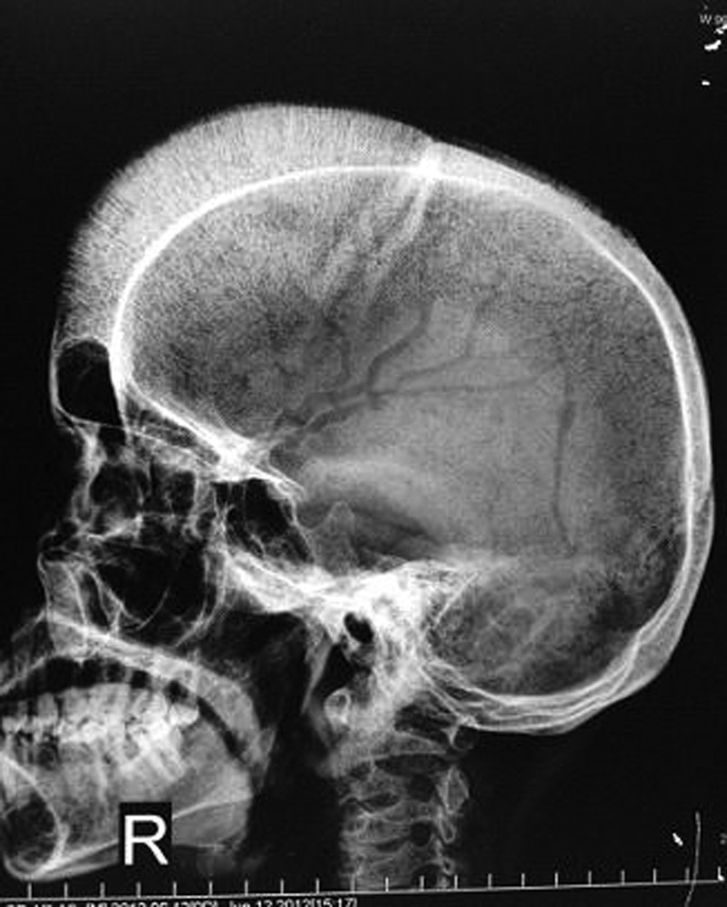
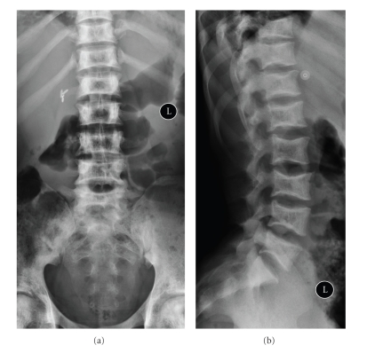
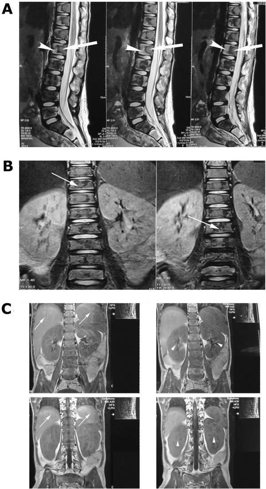

# Skeletal changes in haematological disease (thalassaemia, sickle cell, leukaemia) — Questions

## Previously asked (NBE)

- "Skeletal findings in leukaemia and haemolytic anaemia." — DNB Jun 2022, Paper I, Q8.

---

## Practice questions

Q1. Describe the skeletal manifestations of thalassaemia. [10]

Q2. Discuss the radiological findings in sickle cell disease, including how you would differentiate bone infarct from osteomyelitis. [6+4]

Q3. Describe the skeletal changes seen in leukaemia in children and the differential diagnosis of a permeative lesion. [6+4]

Q4. Short notes: (a) Extramedullary haematopoiesis — imaging [5] (b) Hair-on-end skull — causes [5]

Q5. Discuss the role of MRI in the assessment of bone marrow in haematological disease (incl. iron-overload). [10]

---

## Complete answers

### Q1. Skeletal manifestations of thalassaemia [10]

**Mechanism.** In thalassaemia major the anaemia is severe and lifelong, so the dominant skeletal change is **compensatory marrow hyperplasia** with expansion of the medullary space at the expense of the cortex and trabeculae. Superimposed effects come from **transfusional iron overload** and **chelation therapy**.

**Skull and facial bones.**
- Widening of the **diploic space** with thinning of the outer table.
- Vertical trabecular striations producing the **"hair-on-end"** appearance — classically florid and frontal, with **sparing of the occiput below the internal occipital protuberance** (no red marrow there).
- Failure of pneumatisation of the paranasal sinuses (especially maxillary) and lateral orbital displacement, giving **"rodent facies."**

**Axial and appendicular skeleton.**
- Generalised **osteopenia** with a coarse, reticulated **"honeycomb" trabecular pattern**.
- Long bones lose normal modelling — **medullary expansion, cortical thinning** and a widened, rectangular metaphysis (Erlenmeyer-flask-like).
- Hands/feet: medullary expansion of the small tubular bones with coarse trabeculae.
- Ribs: posterior expansion and a **"rib-within-a-rib"** appearance.

**Extramedullary haematopoiesis (EMH).** Smooth **paravertebral/posterior-mediastinal**, presacral or hepatosplenic soft-tissue masses; they are non-aggressive and may contain marrow signal.

**Complications.** Transfusional **iron overload** (marrow/organ T2* signal loss on MRI; secondary osteoporosis and arthropathy); growth disturbance and chelation-related dysplastic changes.

---

### Q2. Radiological findings in sickle cell disease; infarct vs osteomyelitis [6+4]

**Part A — Radiological findings [6].** In sickle cell disease marrow hyperplasia is present but **milder** than thalassaemia; **infarction and ischaemic growth changes dominate.**

- **H-shaped (Lincoln-log/fish-mouth) vertebrae** — central, square-shouldered endplate depressions from growth-plate ischaemia; a near-specific sign.
- **Hand-foot syndrome (dactylitis)** in infancy — soft-tissue swelling, then periosteal reaction and a moth-eaten appearance of the small tubular bones, usually self-healing.
- **Avascular necrosis** of the femoral (and humeral) heads — subchondral "crescent" lucency, sclerosis, flattening and secondary osteoarthritis.
- **Medullary bone infarcts** — serpentine sclerosis/lucency with a sclerotic rim in the metadiaphysis.
- Milder **marrow hyperplasia** (mild diploic widening); **autosplenectomy** (small calcified spleen); pigment gallstones.
- **Osteomyelitis** — *Salmonella* is the classic association (*S. aureus* remains common overall; verify emphasis).

**Part B — Infarct vs osteomyelitis [4].** This is a classic dilemma because both cause pain, swelling and marrow oedema; MRI is the modality of choice.

| Feature | Infarct | Osteomyelitis |
|---|---|---|
| Multiplicity | Often multifocal, rapid onset | Usually focal |
| Soft tissue | Little/none | Collection, sinus tract, abscess |
| MRI | Marrow oedema, thin/linear rim enhancement | Marked oedema, **rim-enhancing collection**, cortical breach |
| Marrow (sulphur-colloid) scan | Photopenic | Preserved/increased uptake |

Overlap is real; correlate with sequential bone/marrow scintigraphy or labelled-WBC studies (verify protocol).

---

### Q3. Skeletal changes in childhood leukaemia; differential of a permeative lesion [6+4]

**Part A — Skeletal changes [6].** Childhood acute lymphoblastic leukaemia (ALL) is the prototype; radiographs are insensitive but examinable, while MRI is the most sensitive modality.

- **Diffuse osteopenia** — often the earliest and commonest finding; may cause vertebral collapse and simulate metabolic bone disease.
- **Leukaemic lucent metaphyseal bands ("leukaemic lines")** — transverse radiolucent bands at the metaphyses of long bones; beyond infancy these suggest marrow infiltration (non-specific in neonates).
- **Permeative/moth-eaten osteolysis** and **periosteal reaction**; occasionally **osteosclerosis** or focal lytic lesions.
- **MRI** — diffuse **low-T1 marrow** replacing fat (signal lower than adjacent muscle/disc is a useful red flag), heterogeneous T2/STIR hyperintensity, diffuse enhancement; also detects **chloroma (granulocytic sarcoma)** and epidural disease.

**Part B — Differential of a permeative lesion [4].** A permeative (moth-eaten, ill-defined) pattern reflects an aggressive process with multiple small lucencies and a wide zone of transition:

1. **Small round blue cell tumours** — Ewing sarcoma, metastatic neuroblastoma.
2. **Marrow infiltration** — leukaemia, lymphoma.
3. **Infection** — acute/aggressive osteomyelitis.
4. **Langerhans cell histiocytosis** (eosinophilic granuloma).
5. **Aggressive primary bone tumour** — osteosarcoma (in older children).

Clinical age, multiplicity, soft-tissue mass and laboratory findings help discriminate.

---

### Q4. Short notes [5+5]

**(a) Extramedullary haematopoiesis (EMH) — imaging [5].** EMH is compensatory blood-cell production outside the marrow, seen in chronic anaemias (thalassaemia >> sickle cell) and myeloproliferative disease.

- **Sites:** paravertebral/posterior-mediastinal, presacral, hepatosplenic, perirenal; rarely intraspinal (epidural) causing cord compression.
- **Radiograph/CT:** smooth, lobulated, **well-marginated paraspinal soft-tissue masses**, often **fat-containing**, with no bone destruction; associated marrow-hyperplasia changes elsewhere.
- **MRI:** signal that may follow active (cellular) or inactive (fatty) marrow; active lesions enhance.
- **Nuclear:** uptake on marrow-specific agents (e.g. Tc-99m sulphur colloid) confirms haematopoietic tissue.
- **Key point:** the masses are **non-aggressive**; the clinical context of a haemoglobinopathy plus marrow-signal content allows confident diagnosis and avoids biopsy.

**(b) Hair-on-end skull — causes [5].** "Hair-on-end" describes vertical diploic trabecular striations from marrow expansion and perpendicular new bone.

| Cause | Discriminator |
|---|---|
| Thalassaemia | Most florid; frontal; **occiput spared**; facial "rodent facies" |
| Sickle cell / other chronic haemolytic anaemias | Milder, with systemic clues |
| Severe iron-deficiency anaemia, cyanotic congenital heart disease | Clinical context |
| Hereditary spherocytosis and other chronic anaemias | Clinical/lab correlation |
| Skull haemangioma | Focal "sunburst," not diffuse |

The combination of florid frontal hair-on-end with occipital sparing and facial changes points to **thalassaemia**.

---

### Q5. Role of MRI in assessing bone marrow in haematological disease (incl. iron-overload) [10]

**Why MRI.** MRI is the most sensitive modality for marrow because it directly images the fat–cell balance; ultrasound has **no role in marrow assessment** and radiography/CT are insensitive to early infiltration.

**Normal and reconverted marrow.** Normal adult **yellow (fatty) marrow** is bright on T1. **Red (cellular) marrow** is **hypointense to fat on T1** and intermediate-to-mildly hyperintense on T2/STIR. In chronic anaemia, **reconversion** proceeds in reverse order to normal maturation (axial first, then proximal-to-distal in the limbs); loss of the expected fatty signal indicates hyperplasia.

**Marrow replacement (leukaemia/lymphoma).** Diffuse **low-T1 marrow** replacing fat — **marrow signal lower than adjacent muscle or disc on T1 is a useful red flag** — with heterogeneous T2/STIR hyperintensity and diffuse enhancement. MRI also detects **chloroma** and epidural disease causing cord compression, and is valuable for assessing treatment response.

**Infarction/AVN (sickle cell).** Geographic lesion with a **serpentine low-signal rim**; the **"double-line sign"** on T2 (inner bright granulation tissue, outer dark sclerosis) indicates AVN. STIR/T2 oedema marks acute infarct, and MRI best distinguishes **infarct from osteomyelitis** (the latter favouring a rim-enhancing collection, sinus tract and cortical breach — overlap is real; verify case-by-case).

**Iron overload.** Transfusional haemosiderosis causes **marked T2*/T2 signal loss** ("dark" marrow, liver, spleen, sometimes pancreas/myocardium). **T2\*/R2\* mapping** (and liver R2 / FerriScan-type techniques) **quantify hepatic and cardiac iron** to guide chelation (verify exact thresholds locally) — a key non-invasive role replacing biopsy.

**Summary.** MRI characterises hyperplasia/reconversion, detects and stages infiltration and its complications, differentiates infarct from infection, and quantifies iron — making it central to modern management of haematological skeletal disease.

---

## Further reading

- Resnick, *Diagnosis of Bone and Joint Disorders* — haemoglobinopathies and marrow disorders.
- Greenspan, *Orthopedic Imaging: A Practical Approach* — haematological/marrow chapter.
- *Grainger & Allison's Diagnostic Radiology* — marrow imaging and haemoglobinopathies.
- Vogler & Murphy, marrow imaging review (red/yellow marrow distribution and reconversion).
- A dedicated review of MRI iron quantification (T2*/R2*, liver R2/FerriScan) for current thresholds and protocols (verify locally).
