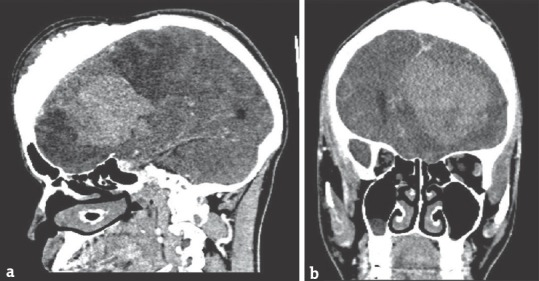
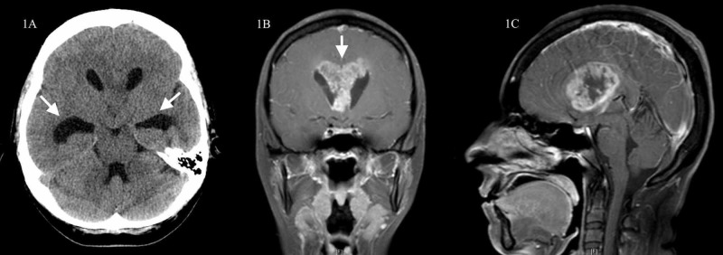
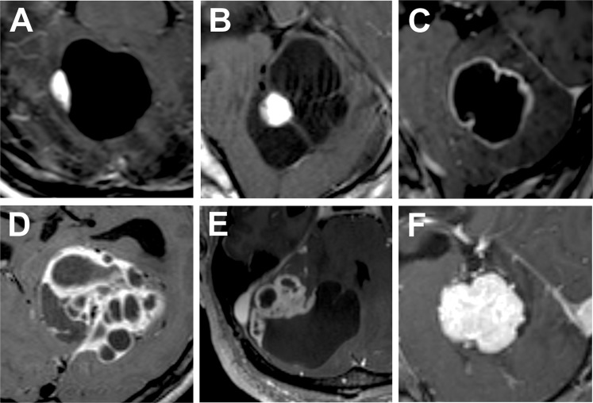
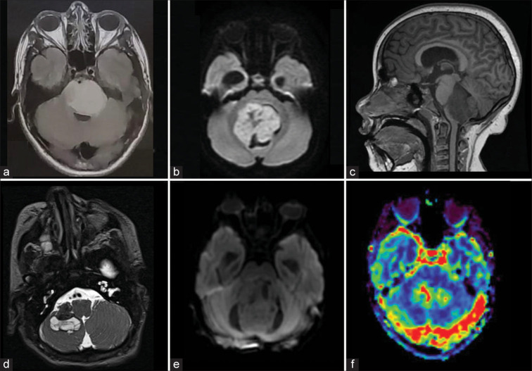
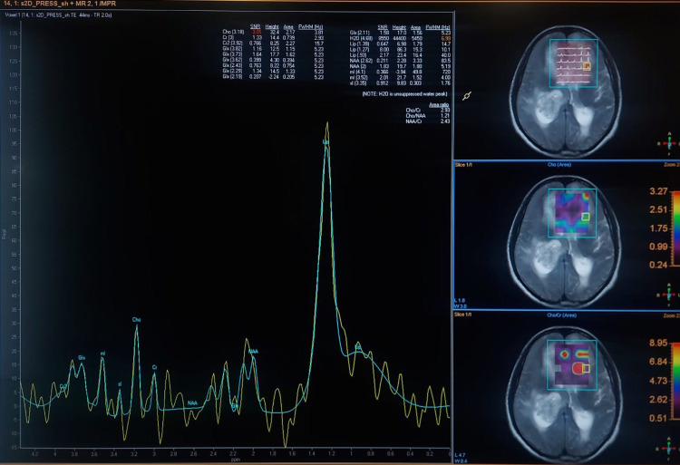

# Intracranial Tumours — Supra- and Infratentorial

A brain mass is interpreted not by pattern-matching a single appearance but by working through a disciplined chain of questions, because the same density or signal can mean very different things depending on where the lesion sits and whom it sits in. The single most useful first decision is intra-axial versus extra-axial; everything downstream — age, number, enhancement, advanced MR — refines the answer.

## Classification and the approach framework

The practical framework for any intracranial mass is a short ordered checklist, and you should be able to recite it before describing any individual tumour.

1. **Location — intra-axial vs extra-axial.** Extra-axial lesions arise outside the brain parenchyma (from meninges, nerves, skull, pituitary, pineal region) and displace the brain; intra-axial lesions arise within parenchyma and expand it. The signs that say extra-axial are a CSF cleft between lesion and brain, buckling (not effacement) of grey-white interface, broad dural base, cortical grey matter displaced inward, and pial vessels swept around the mass. Bone reaction (hyperostosis or remodelling) also favours extra-axial.
2. **Compartment — supratentorial vs infratentorial.** This interacts strongly with age (below).
3. **Age.** A posterior fossa mass in a child has a very different differential from one in an adult: in children the posterior fossa is the favoured site for primary tumours, whereas in adults an infratentorial mass is metastasis or haemangioblastoma until proven otherwise.
4. **Single vs multiple.** Multiple lesions in an adult strongly suggest metastases (or, in the right setting, lymphoma, abscesses, or a phakomatosis). A solitary lesion broadens the primary-tumour differential.
5. **Then characterise:** margins, enhancement pattern, calcification, haemorrhage, necrosis, diffusion, perfusion and spectroscopy.

A useful age-and-location grid: **supratentorial adult** — glioma (low- and high-grade), metastasis, meningioma (extra-axial), lymphoma; **supratentorial paediatric** — low-grade glioma, supratentorial PNET/embryonal tumours, choroid plexus tumours; **infratentorial adult** — metastasis and haemangioblastoma dominate; **infratentorial paediatric** — medulloblastoma, pilocytic astrocytoma, ependymoma, brainstem (diffuse pontine) glioma.

A note on tumour nomenclature: the contemporary WHO CNS classification is molecularly defined (e.g., IDH status, 1p/19q codeletion, H3 K27 alteration), and grade designations have shifted over recent editions. For revision, anchor on the imaging discriminators and use grading language qualitatively; quote a specific WHO grade number only where you are confident and append "(verify exact value)" otherwise.

## Modality-wise findings

For intracranial tumours, plain radiography and ultrasound play minor roles, CT is the workhorse for calcification/haemorrhage/bone, and MRI with advanced sequences is the decisive tool. The sections below follow XR -> US -> CT -> MRI -> advanced MR, but weight reflects real practice.

### Plain radiograph (XR)
Now largely historical for brain tumours and not a primary tool. It can occasionally show indirect signs: abnormal intracranial calcification (e.g., the speckled calcification of an oligodendroglioma), bony changes (hyperostosis or a permeative destructive pattern), widening of the internal auditory canal with a vestibular schwannoma, or in chronic raised intracranial pressure in children, suture diastasis and a "copper-beaten" skull. XR is insensitive and non-specific and has been superseded by cross-sectional imaging.

### Ultrasound (US)
Limited to specific windows. In neonates and young infants, transfontanelle US can detect intraventricular and large parenchymal masses and hydrocephalus. Intraoperative US is used to localise lesions and guide resection. Beyond these settings US has no role through the intact adult skull.

### Computed tomography (CT)
CT remains valuable as the first-line study in acute presentation (headache, seizure, deficit) and excels at three things: detecting **calcification**, detecting **acute haemorrhage**, and showing **bone**. Key tumour-relevant CT observations: an extra-axial mass that is hyperdense and avidly enhancing with a broad dural base and possible hyperostosis suggests **meningioma**; coarse/clumped calcification in a peripheral, cortically based supratentorial mass suggests **oligodendroglioma**; a heterogeneous infiltrating hypodense mass with central necrosis crossing the midline suggests **glioblastoma**; multiple lesions at the **grey-white junction** with surrounding low-density vasogenic oedema suggest **metastases**. CT also rapidly identifies hydrocephalus and mass effect (midline shift, herniation) that change management urgently. CT is limited for posterior fossa lesions (beam-hardening artefact) and for low-contrast intra-axial detail, where MRI is required.

### Magnetic resonance imaging (MRI)
MRI is the definitive modality for tissue characterisation, extent, and surgical planning. A standard tumour protocol includes T1 pre- and post-gadolinium, T2, FLAIR, DWI/ADC, and susceptibility imaging (SWI/GRE); advanced sequences (perfusion, spectroscopy) are added for grading and follow-up.

General MR signatures by tumour:

- **Meningioma (extra-axial):** isointense to grey matter on T1 and T2, intense homogeneous enhancement, a **dural tail** (enhancing thickened dura tapering from the mass), a **CSF cleft** and vascular rim confirming the extra-axial location, and frequently a broad dural base. A subset is densely calcified.
- **Schwannoma (extra-axial, especially vestibular):** an enhancing mass centred on a cranial nerve; the vestibular schwannoma widens the internal auditory canal and forms an acute angle with the petrous bone, classically an "ice-cream-cone" shape with the canal component as the cone. Larger lesions are heterogeneous with cystic change.
- **Diffuse glioma, lower grade:** a non-enhancing or minimally enhancing T2/FLAIR-hyperintense expansile mass with relatively little oedema and mass effect for its size; the **T2-FLAIR mismatch** sign (high T2 with relatively low FLAIR centrally) suggests an IDH-mutant astrocytoma (verify exact value).
- **Glioblastoma (high-grade):** a heterogeneous mass with thick irregular **ring enhancement** around central necrosis, marked surrounding non-enhancing infiltrative oedema, and a tendency to **cross the corpus callosum** producing a **butterfly** configuration across both hemispheres. Haemorrhage and restricted diffusion in the cellular rim are common.
- **Oligodendroglioma:** a cortically based supratentorial (frontal predilection) mass with **calcification**, heterogeneous signal, frequent cortical involvement and remodelling, variable enhancement.
- **Metastases:** typically multiple, at the **grey-white junction**, round, enhancing (solid or ring), with oedema disproportionate to lesion size; haemorrhage suggests melanoma, renal, thyroid or choriocarcinoma primaries.
- **Haemangioblastoma (adult posterior fossa):** the classic **cyst with an enhancing mural nodule** abutting the pia; flow voids may be seen in the vascular nodule. Association with von Hippel-Lindau (then often multiple).
- **Medulloblastoma (child):** a midline (vermian/fourth-ventricular roof) densely cellular mass, hyperdense on CT, **restricting diffusion** (low ADC), with variable enhancement; propensity for CSF/leptomeningeal seeding (image the whole neuraxis).
- **Pilocytic astrocytoma (child):** a cerebellar **cyst with an avidly enhancing mural nodule**; well-circumscribed, does NOT typically restrict diffusion, low-grade behaviour.
- **Ependymoma (child):** a fourth-ventricular mass that is "plastic," extruding through the foramina of Luschka and Magendie into the cisterns; often calcified and heterogeneous.
- **Brainstem (diffuse intrinsic pontine) glioma:** an expansile T2-hyperintense infiltrative pontine mass that engulfs the basilar artery, often with little or no early enhancement.

### Nuclear and advanced MR (DWI, perfusion, spectroscopy, SWI)
Advanced MR answers two recurrent clinical questions: **what grade** is this, and is new enhancement **recurrence or post-treatment change**.

- **DWI/ADC:** hypercellular tumours restrict diffusion (low ADC). This is most useful for distinguishing a densely cellular medulloblastoma or lymphoma (low ADC) from a pilocytic astrocytoma or low-grade tumour (higher ADC), and for distinguishing an abscess (markedly restricting pus centrally) from a necrotic tumour (non-restricting necrotic centre).
- **Perfusion (DSC, rCBV):** elevated relative cerebral blood volume reflects neovascularity and tracks with higher tumour grade — high-grade gliomas show high rCBV in the solid tumour, low-grade gliomas low rCBV. Important pitfalls: oligodendrogliomas can show elevated rCBV despite lower grade; and **lymphoma** typically shows relatively low/modest rCBV despite being highly cellular.
- **Spectroscopy (MRS):** tumours show **elevated choline** (membrane turnover) and **reduced NAA** (neuronal loss), so the **Cho/NAA ratio rises** with grade; a **lipid-lactate** peak indicates necrosis/anaerobic metabolism and accompanies high-grade tumours. MRS helps separate tumour from non-neoplastic mimics.
- **SWI/GRE:** demonstrates haemorrhage and tumoral microvascularity/calcification, useful in metastases and high-grade gliomas.
- **Recurrence vs post-treatment change (pseudoprogression / radiation necrosis):** new or growing enhancement after chemoradiation may be treatment effect rather than tumour. Recurrent tumour tends to show **higher rCBV** and **higher Cho**, whereas radiation necrosis shows **low rCBV** and lacks elevated choline. No single threshold is definitive; combine perfusion, spectroscopy, diffusion and serial follow-up (verify exact value for any quoted ratio/cut-off).
- **Nuclear imaging:** amino-acid PET tracers can help differentiate recurrence from treatment effect and guide biopsy in selected centres; FDG-PET is limited by high background cortical uptake.

## Differentials and comparison tables

### Intra-axial vs extra-axial
| Feature | Intra-axial | Extra-axial |
|---|---|---|
| Origin | Brain parenchyma | Meninges/nerve/bone |
| CSF cleft | Absent | Present |
| Grey-white interface | Effaced/expanded | Buckled inward |
| Cortex | Involved/expanded | Displaced inward |
| Dural tail / broad base | No | Yes (meningioma) |
| Bone reaction | Rare | Common (hyperostosis/remodelling) |

### Paediatric posterior fossa discriminators
| Tumour | Typical site | CT density | DWI/ADC | Enhancement | Clue |
|---|---|---|---|---|---|
| Medulloblastoma | Midline / 4th-ventricle roof (vermis) | Hyperdense | Restricts (low ADC) | Variable | CSF seeding; whole-neuraxis imaging |
| Pilocytic astrocytoma | Cerebellar hemisphere | Low (cystic) | No restriction | Avid mural nodule | Cyst + enhancing nodule |
| Ependymoma | 4th ventricle floor | Mixed, often calcified | Variable | Heterogeneous | "Plastic," extrudes through foramina |
| Brainstem (DIPG) glioma | Pons | Low/expansile | Variable | Often minimal early | Engulfs basilar artery |

### Advanced MR by question
| Question | DWI/ADC | rCBV (perfusion) | MRS |
|---|---|---|---|
| Higher grade glioma | Low ADC in cellular areas | High | High Cho/NAA, lipid-lactate |
| Abscess vs necrotic tumour | Abscess centre restricts | — | Cytosolic amino acids in abscess |
| Lymphoma | Low ADC | Low/modest | High Cho |
| Recurrence vs radiation necrosis | Variable | High = recurrence; low = necrosis | High Cho = recurrence |

## Pearls and buzzwords
- "Dural tail" and "CSF cleft" — meningioma; extra-axial confirmation.
- "Ice-cream cone" widening the IAC — vestibular schwannoma.
- "Butterfly" lesion crossing the corpus callosum with ring enhancement — glioblastoma (also consider lymphoma and demyelination).
- Cortically based calcified frontal mass — oligodendroglioma.
- Multiple lesions at the grey-white junction with disproportionate oedema — metastases.
- "Cyst with enhancing mural nodule" — posterior fossa: haemangioblastoma in adults, pilocytic astrocytoma in children.
- Midline 4th-ventricular hyperdense restricting mass in a child — medulloblastoma; image the whole spine.
- "Plastic" tumour squeezing out of the 4th-ventricular foramina — ependymoma.
- High rCBV + high Cho/NAA = high grade / recurrence; low rCBV + no Cho elevation = radiation necrosis.
- Lymphoma is densely cellular (low ADC) but often only modestly perfused — a classic discordance.

## What to draw
- The intra- vs extra-axial diagram: CSF cleft, inward cortical buckling, dural base and tail versus cortical expansion with effaced grey-white margin.
- A meningioma with broad dural base, dural tail and hyperostosis.
- A butterfly glioblastoma: ring-enhancing necrotic mass crossing the corpus callosum into both frontal lobes with surrounding oedema.
- Cyst-with-mural-nodule in the posterior fossa, labelled for the adult (haemangioblastoma) vs child (pilocytic) interpretation.
- A simple graph/triad linking rising grade to rising rCBV and rising Cho/NAA with appearance of a lipid-lactate peak.

## Further reading
- Osborn's Brain: Imaging, Pathology, and Anatomy — chapters on astrocytomas, embryonal tumours, meningiomas and metastases.
- Grossman & Yousem, Neuroradiology: The Requisites — intracranial neoplasms.
- The current WHO Classification of Tumours of the Central Nervous System (consult the latest edition for molecular definitions and grading; verify any grade numbers).
- A dedicated review of advanced MR (perfusion, spectroscopy, diffusion) in glioma grading and post-treatment assessment.
