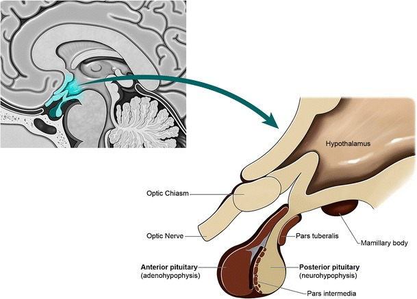
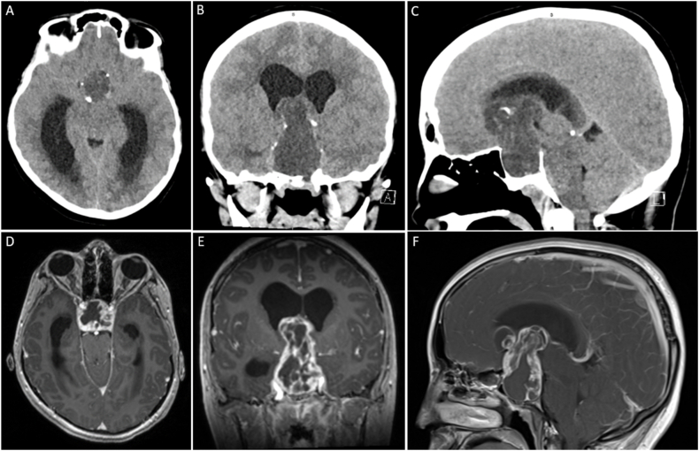
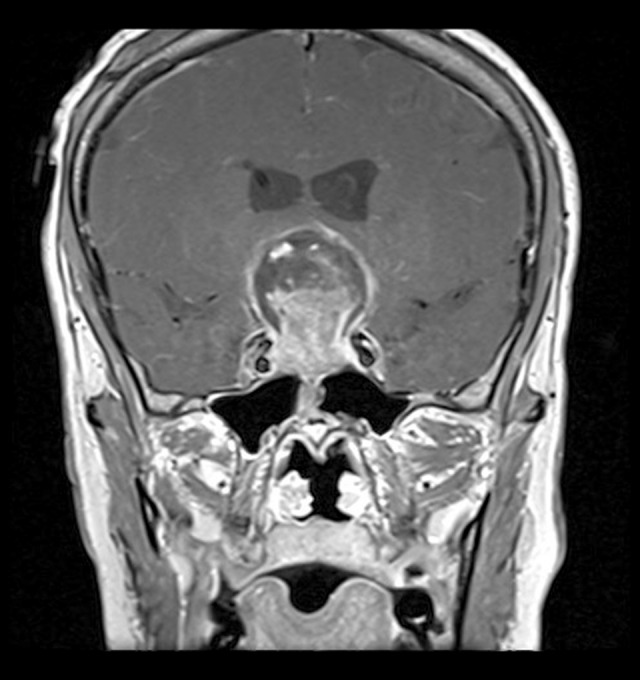
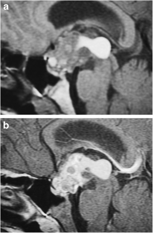
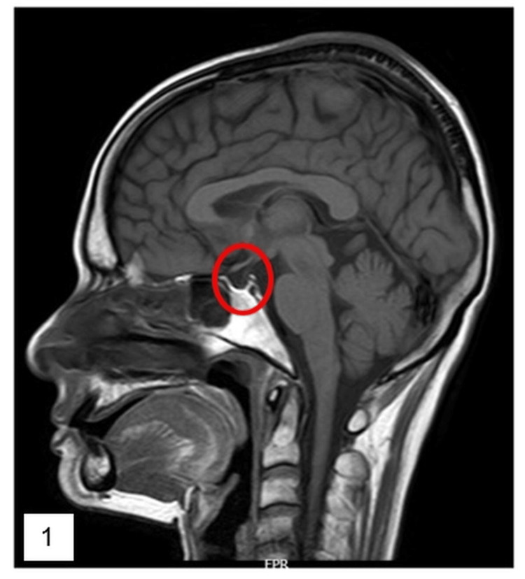

# Pituitary & Sellar Region Masses

The sella turcica is a small anatomical compartment in which a large differential of lesions arises; the diagnostic task is part localisation (intrasellar vs suprasellar vs parasellar, and the relationship to the pituitary gland, infundibulum, optic chiasm and cavernous sinuses) and part pattern recognition (solid vs cystic, calcified vs not, enhancing vs not, age of the patient). MRI is the workhorse; CT is reserved for calcification, bone and the emergency setting; and one differential — the aneurysm — must be actively excluded before any biopsy.

## Classification framework (build the differential by compartment and age)

The single most useful first step is to decide **where the lesion is centred** and **how old the patient is**.

By compartment of origin:
- **Intrasellar** — pituitary adenoma (micro/macro), Rathke cleft cyst, pituitary hyperplasia, hypophysitis, metastasis, intrasellar aneurysm.
- **Suprasellar** — craniopharyngioma, meningioma (tuberculum/diaphragma sellae), Rathke cleft cyst (may extend up), germinoma, hypothalamic/optic-chiasm glioma, Langerhans cell histiocytosis (LCH), aneurysm, epidermoid/dermoid, hamartoma of the tuber cinereum, arachnoid cyst.
- **Parasellar / cavernous sinus** — meningioma, schwannoma (CN V), cavernous internal carotid artery (ICA) aneurysm, cavernous haemangioma, perineural tumour spread, metastasis.

A widely taught mnemonic for the **suprasellar mass** is **SATCHMO**: **S**ellar lesion extending up (adenoma) / **S**arcoid, **A**neurysm, **T**eratoma & germ-cell tumours (germinoma), **C**raniopharyngioma / Rathke cleft cyst, **H**ypothalamic glioma / **H**amartoma / **H**istiocytosis (LCH), **M**eningioma / **M**etastasis, **O**ptic glioma. (Mnemonic expansions vary between sources — verify the exact letter-to-lesion mapping you are taught.)

By age — a fast discriminator:
- **Child / adolescent suprasellar mass**: craniopharyngioma (adamantinomatous, calcified, cystic), optic-chiasm/hypothalamic glioma, germinoma, LCH, hamartoma of tuber cinereum (precocious puberty, "gelastic" seizures).
- **Adult**: pituitary macroadenoma, meningioma, Rathke cleft cyst, papillary craniopharyngioma, metastasis, aneurysm.

## Normal anatomy (the reference frame)

The bony sella turcica houses the pituitary gland on the floor of the middle cranial fossa, roofed by the diaphragma sellae through which the infundibulum (pituitary stalk) passes. The **anterior lobe (adenohypophysis)** is isointense to grey matter; the **posterior lobe (neurohypophysis)** shows intrinsic **T1 hyperintensity — the "posterior pituitary bright spot"** (attributed to stored neurosecretory vasopressin/ADH); its absence is abnormal (e.g., central diabetes insipidus, ectopic posterior lobe, stalk transection). The stalk normally enhances avidly and tapers from above (wider at the median eminence) to below. Normal gland height varies physiologically — taller and convex in adolescents, pregnancy and lactation (a "physiological hypertrophy", not a mass). The chiasm sits above the diaphragma; laterally the cavernous sinuses contain the ICA and cranial nerves III, IV, VI and V1–V2.

## Modality-wise findings

### Plain radiograph (XR)
Now largely historical for this region but still examinable. The lateral skull film may show an **enlarged, ballooned sella** with thinning/erosion of the dorsum sellae and a **"double floor"** (asymmetric expansion of the sellar floor on the lateral projection) in a macroadenoma; a **"J-shaped"** or shallow sella in some conditions; and **suprasellar curvilinear or "popcorn" calcification** suggesting craniopharyngioma or aneurysm. XR cannot characterise soft tissue and is not used for diagnosis today.

### Ultrasound (US)
No role in the adult sella (bony shielding). The only relevant context is **neonatal/infant transfontanelle US**, which can occasionally show a large suprasellar cystic mass, but cross-sectional imaging is required.

### CT
CT is the **emergency and "calcium/bone" tool**. Its strengths:
- **Calcification** — peripheral/curvilinear or chunky calcification favours craniopharyngioma (especially adamantinomatous in a child), meningioma (psammomatous/hyperostosis) or a calcified aneurysm wall. Adenomas almost never calcify.
- **Bone** — sellar floor expansion/erosion, hyperostosis of the tuberculum (meningioma), or skull-base destruction.
- **Acute presentation** — pituitary apoplexy may show intrinsic hyperdensity of acute haemorrhage; CT also rapidly excludes other causes of acute headache.
- **CT angiography** — to confirm/exclude an aneurysm when MRI is equivocal or unavailable.
Limitations: poor soft-tissue contrast at the skull base, beam-hardening artefact, and inability to reliably show a microadenoma. MRI is superior for everything except calcium and bone.

### MRI (the primary modality)
**Standard protocol**: thin-section sagittal and coronal **T1 (pre-contrast)**, coronal **T2**, and **dynamic contrast-enhanced** coronal T1 for adenoma; add **DWI** (epidermoid, abscess, some tumours) and consider **T2*/SWI** (haemorrhage, calcium). High field and small field-of-view are essential because key lesions are millimetric.

**Microadenoma** (conventionally < 10 mm — verify exact value): on routine post-contrast images it may be invisible. On **dynamic contrast-enhanced MRI** the normal gland enhances early and briskly; the adenoma enhances **more slowly**, so on early dynamic phases it appears as a **relatively hypoenhancing focus** against the rapidly enhancing normal gland (it may become iso/hyperenhancing on delayed images — hence dynamic timing is the whole point). Indirect signs: focal upward gland convexity, floor depression/erosion, and stalk deviation away from the lesion. Functioning microadenomas (prolactinoma, ACTH-secreting in Cushing) are the common indication.

**Macroadenoma** (>= 10 mm): an intrasellar mass that grows superiorly through the diaphragma sellae; the constriction at the diaphragm gives the classic **"snowman" / "figure-of-8" / "dumbbell"** waist. It is typically isointense soft tissue, enhances heterogeneously, and may contain cystic/necrotic or haemorrhagic foci. It may elevate and compress the **optic chiasm** (bitemporal hemianopia) and invade laterally into the **cavernous sinus**. Lateral extension is assessed with the **Knosp concept**: lines drawn through the cavernous ICA on coronal imaging (commonly described through the medial, cross-sectional/intercarotid and lateral tangents) grade increasing probability of cavernous sinus invasion; encasement of the cavernous ICA (the tumour surrounding > ~50% of the artery circumference) strongly predicts invasion and incomplete resectability (do not quote specific grade numbers unless certain — describe qualitatively).

**Pituitary apoplexy**: acute haemorrhagic and/or ischaemic infarction of a pituitary tumour (usually a pre-existing macroadenoma), presenting with thunderclap headache, sudden visual loss, ophthalmoplegia and hypopituitarism — a neuro-endocrine emergency. MRI shows an enlarged sellar mass with **blood products of varying age** (T1 hyperintensity of subacute methaemoglobin, susceptibility blooming on SWI), often a fluid–fluid level, and reduced/peripheral enhancement of the infarcted portion. CT may show acute hyperdensity. Distinguish from a simple cystic adenoma.

**Rathke cleft cyst (RCC)**: a benign non-neoplastic remnant of Rathke's pouch, classically located in the **pars intermedia** (between anterior and posterior lobes), intra- and/or suprasellar, **non-enhancing** and typically without calcification. Signal is variable with cyst content (often T1 hyperintense due to proteinaceous/mucoid fluid). A characteristic feature is a small **intracystic non-enhancing nodule** (proteinaceous concretion). A thin rim of enhancement may represent displaced compressed gland rather than a true enhancing wall — a discriminator from cystic craniopharyngioma.

**Craniopharyngioma**: arises along the craniopharyngeal duct, usually suprasellar (often with an intrasellar component).
- *Adamantinomatous* (children, but also adults): **cystic, calcified, enhancing solid/nodular components**; the cyst fluid is often **T1 hyperintense ("motor-oil"/"crankcase oil"/machinery-oil fluid** rich in cholesterol/protein). The combination **cystic + calcified + enhancing suprasellar mass in a child** is the buzzword pattern.
- *Papillary* (adults, almost exclusively): more often **solid, predominantly non-calcified**, well-circumscribed.
Mass effect on chiasm and hypothalamus and obstructive hydrocephalus are common.

**Meningioma (parasellar / suprasellar)**: arises from the tuberculum sellae, diaphragma or cavernous sinus dura; **extra-axial**, isointense, **avidly and homogeneously enhancing**, with a **dural tail**, **hyperostosis** of adjacent bone and possible psammomatous calcification. A key discriminator: a parasellar/cavernous **meningioma characteristically encases AND narrows (constricts) the cavernous ICA lumen**, whereas a **macroadenoma encases/surrounds the ICA without narrowing its lumen** — a favourite exam point. The meningioma also displaces the gland rather than arising from it. A meningioma typically does **not** widen the sella the way an adenoma does.

**Aneurysm (do NOT biopsy)**: a parasellar or suprasellar aneurysm (cavernous or supraclinoid ICA) can perfectly mimic a solid sellar mass. Clues: **pulsation artefact**, a **flow void** on spin-echo MRI, mixed signal from laminated **thrombus**, a **curvilinear/peripheral calcified wall** on CT, and avid filling on CTA/MRA/DSA. **Always interrogate vascular sequences before biopsy of any sellar/parasellar mass** — biopsy of an aneurysm is catastrophic.

**The wider suprasellar differential (SATCHMO members):**
- **Germinoma**: midline (suprasellar and/or pineal), often a child/young adult with diabetes insipidus; solid, avidly enhancing, restricts on DWI, exquisitely radiosensitive. A thickened enhancing infundibulum with central DI is germinoma until proven otherwise (also LCH, hypophysitis).
- **Hypothalamic / optic-chiasm glioma**: typically pilocytic in children (association with NF1 for optic gliomas); fusiform enlargement of chiasm/optic nerves or a hypothalamic mass, variable enhancement.
- **Langerhans cell histiocytosis (LCH)**: thickened (> ~3 mm) enhancing infundibulum, absent posterior bright spot and central DI in a child; look for lytic skull lesions elsewhere.
- **Hamartoma of the tuber cinereum**: a non-enhancing, T1/T2 isointense pedunculated mass at the tuber cinereum; **gelastic seizures and precocious puberty**; classically **does not enhance and does not change over time**.

**Empty sella**: CSF fills an enlarged sella with the gland flattened against the floor and the infundibulum coursing through CSF to reach it (the **"infundibulum sign"** — a midline stalk traversing CSF, distinguishing an empty sella from a cystic mass). *Primary* empty sella results from a deficient diaphragma sellae with CSF pulsation (often incidental, may relate to idiopathic intracranial hypertension); *secondary* follows treatment, surgery, apoplexy or Sheehan syndrome. The pituitary tissue is normal — recognising this avoids mistaking it for a cyst.

## Differentials and comparison tables

| Lesion | Calcification | Enhancement | Signal clue | Typical patient |
|---|---|---|---|---|
| Macroadenoma | Rare | Heterogeneous | Snowman/figure-of-8; cavernous invasion | Adult |
| Microadenoma | No | Hypoenhancing on dynamic (early) | Focal gland convexity, stalk shift | Adult (functioning) |
| Rathke cleft cyst | Rare | None (rim = compressed gland) | Pars intermedia; intracystic nodule; often T1 bright | Adult |
| Craniopharyngioma (adamantinomatous) | Yes (common) | Solid/nodular + cyst wall | Motor-oil T1-bright cyst | Child |
| Craniopharyngioma (papillary) | Uncommon | Solid enhancing | Mostly solid | Adult |
| Meningioma | Psammomatous; hyperostosis | Avid, homogeneous, dural tail | Encases AND narrows ICA lumen; doesn't widen sella | Adult |
| Aneurysm | Curvilinear wall | Lumen fills on CTA/MRA | Flow void, pulsation artefact, thrombus | Adult |
| Germinoma | No | Avid | DWI restriction; midline; DI | Child/young adult |
| Hamartoma tuber cinereum | No | None | Isointense pedunculated; gelastic seizures | Child |

| Feature | Adenoma | Meningioma |
|---|---|---|
| Origin | Pituitary gland (intrasellar) | Dura (tuberculum/diaphragma/cavernous) |
| Sella | Widened/ballooned | Usually normal; hyperostosis |
| Enhancement | Heterogeneous, often less avid | Avid, homogeneous, dural tail |
| ICA | Encases/surrounds, lumen usually preserved | Encases AND narrows (constricts) the lumen |
| Snowman waist | Yes (diaphragma constriction) | No |

| Cystic suprasellar lesion | Discriminator |
|---|---|
| Rathke cleft cyst | Pars intermedia, non-enhancing, intracystic nodule, no calcification |
| Cystic craniopharyngioma | Calcification + enhancing solid/wall, motor-oil fluid |
| Cystic/necrotic macroadenoma | Centred in sella, snowman shape, enhancing rim of tumour |
| Arachnoid cyst | Follows CSF on all sequences, no enhancement |
| Empty sella | CSF + infundibulum sign + flattened normal gland |

## Pearls and buzzwords
- **Snowman / figure-of-8 / dumbbell** = macroadenoma waisted at the diaphragma sellae.
- **Dynamic MRI**: microadenoma is the **relatively hypoenhancing focus** in the early arterial-to-capillary phase (catch it before it equilibrates).
- **Knosp** grades cavernous sinus invasion by the relation of tumour to the cavernous ICA tangent lines; ICA encasement > ~half circumference predicts invasion (describe, don't over-quote numbers).
- **Motor-oil / machinery-oil cyst fluid** + calcification + child = adamantinomatous craniopharyngioma.
- **Posterior pituitary bright spot absent** + thick enhancing stalk + central DI in a child = think **germinoma / LCH** (also hypophysitis).
- **Infundibulum sign** distinguishes empty sella from a cystic sellar mass.
- **Do NOT biopsy** a sellar/parasellar mass until an **aneurysm** is excluded (flow void, CTA/MRA).
- **Gelastic seizures + precocious puberty + non-enhancing tuber cinereum mass** = hypothalamic hamartoma.
- Pituitary apoplexy = thunderclap headache + visual loss/ophthalmoplegia + haemorrhagic sellar mass — endocrine emergency (steroids).
- Physiological gland hypertrophy (puberty, pregnancy, lactation) is convex but normal — do not over-call a "mass".

## What to draw
- A **midline sagittal cartoon** of the sella: bony sella, anterior lobe, posterior bright spot, diaphragma sellae, infundibulum, optic chiasm above — your reference frame.
- The **snowman/figure-of-8** macroadenoma with the diaphragm waist and an arrow showing chiasm elevation.
- A **coronal Knosp diagram**: cavernous ICA cross-sections with the medial / intercarotid / lateral tangent lines and tumour encircling the artery.
- The **empty sella with the infundibulum sign** (stalk descending through CSF to a flattened gland).
- A small **dynamic-MRI time curve**: normal gland enhancing early and fast, microadenoma lagging behind.

## Further reading
- Osborn's Brain (Osborn) — sellar and suprasellar region chapters.
- Grainger & Allison's Diagnostic Radiology — pituitary and sella.
- Knosp E et al., original description of the cavernous sinus invasion grading (verify primary citation).
- Standard DNB/FRCR neuroradiology revision texts for the suprasellar differential and SATCHMO mnemonic.
