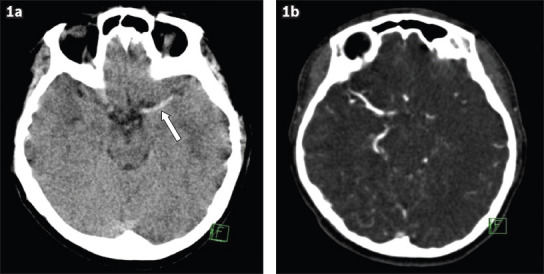
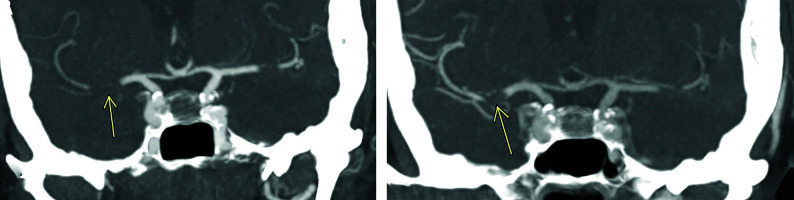
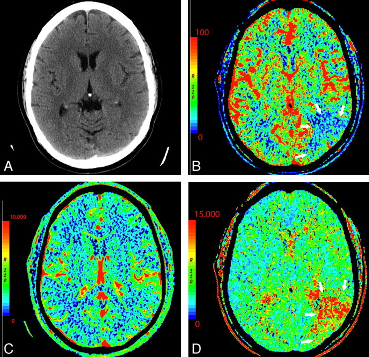
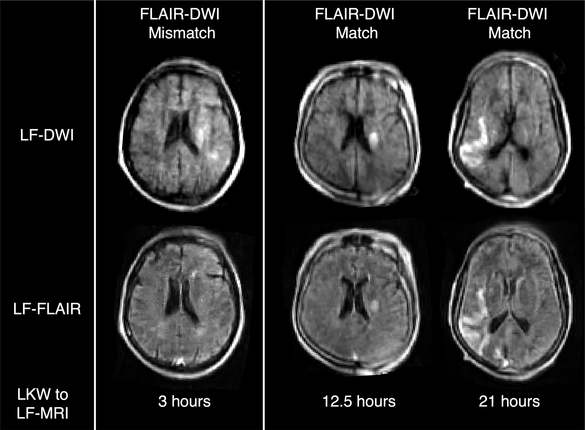

# Ischaemic Stroke — CT/MRI & Penumbra

Acute ischaemic stroke imaging answers two questions fast: is there haemorrhage, and is there salvageable brain (penumbra) supplied by a treatable occluded vessel? The pathway is time-critical and protocol-driven, and the radiologist's role is to triage patients toward intravenous thrombolysis and/or mechanical thrombectomy while excluding mimics and contraindications.

## Classification / Framework First

It helps to organise the topic along three axes before discussing individual findings.

**1. Temporal staging (informs which findings to expect):**
- **Hyperacute** (0-6 h): NCCT often subtle or normal; DWI is positive within minutes.
- **Acute** (6-24 h): NCCT hypodensity and mass effect become evident.
- **Subacute** (days to weeks): the CT **"fogging" phase classically occurs in the second to third week** (~2–3 weeks), when the resolving infarct transiently regains near-normal attenuation and can become inconspicuous; contrast enhancement and evolving oedema are also seen.
- **Chronic** (> ~1 month): encephalomalacia, gliosis, volume loss, ex-vacuo dilatation.

**2. Pathophysiological zones (the core concept of selection):**
- **Infarct core** — irreversibly dead tissue (markedly reduced CBF and CBV; bright DWI / dark ADC).
- **Penumbra** — hypoperfused but viable tissue at risk, kept alive by collaterals; the target of reperfusion. On CT perfusion it is the **perfusion (delay) abnormality minus core** ("mismatch").
- **Benign oligaemia** — mildly hypoperfused tissue that will survive without intervention.

**3. Imaging decision pathway (what actually happens clinically):**
1. **NCCT** — exclude haemorrhage; look for early ischaemic signs; score ASPECTS.
2. **CT angiography (CTA)** — identify large-vessel occlusion (LVO) and assess collaterals; survey arch-to-vertex.
3. **CT perfusion (CTP)** or **MRI (DWI/perfusion)** — quantify core vs penumbra when in an extended/uncertain time window.
4. **Disposition** — IV thrombolysis (time/eligibility based) and/or endovascular thrombectomy (LVO + favourable core/penumbra profile).

A useful enumeration of NCCT early ischaemic signs (MCA territory): **hyperdense vessel sign**, **loss of the insular ribbon**, **obscuration of the lentiform nucleus**, **loss of grey-white differentiation at the cortex**, **sulcal effacement** from cytotoxic oedema. These feed the **ASPECTS** semi-quantitative score.

## Modality-wise Findings

### Plain radiograph (XR)
No role in ischaemic stroke. Mentioned only to be dismissed in an exam answer.

### Ultrasound (US)
Not a primary acute parenchymal tool. **Carotid Doppler** characterises extracranial atherosclerotic stenosis as a stroke source, and **transcranial Doppler (TCD)** can detect intracranial stenosis, monitor recanalisation and detect microembolic signals. US is adjunctive for aetiology, not for the acute parenchymal decision.

### Computed tomography (CT) — the workhorse
**Non-contrast CT (NCCT)** is first because it is fast and excludes haemorrhage, the principal contraindication to thrombolysis. Early ischaemic changes reflect cytotoxic oedema (a small rise in tissue water lowers attenuation by roughly a few Hounsfield units):

- **Hyperdense MCA sign** — an intraluminal thrombus appears as a dense MCA (typically the M1 segment); the **"dot sign"** is dense thrombus in an M2/M3 branch in the Sylvian fissure. Interpret cautiously: a high haematocrit or vessel calcification can mimic it, so compare with the contralateral side and use the **hyperdense-to-normal ratio** concept rather than absolute density alone.

- **Insular ribbon loss** — obscuration of the normally visible grey-matter band of the insular cortex.
- **Lentiform nucleus obscuration** — loss of the sharp margin/attenuation of the putamen and globus pallidus, an early sign of deep MCA (lenticulostriate) ischaemia.
- **Loss of grey-white differentiation and sulcal effacement** — generalised cortical changes with swelling.

**ASPECTS (Alberta Stroke Program Early CT Score)** is a 10-point system for the MCA territory: the hemisphere is divided into defined regions (caudate, lentiform, insula, internal capsule, and cortical regions M1-M6 across two axial levels), and one point is **subtracted** for each region showing early ischaemic change. A normal scan scores 10; lower scores indicate larger established core. Higher scores are generally associated with better thrombectomy outcomes; specific cut-offs used for patient selection have shifted over time, so quote the principle rather than a hard threshold (verify exact value for current guidelines).

**CT angiography (CTA)** from aortic arch to vertex is the key test for **large-vessel occlusion** (intracranial ICA, MCA M1/M2, basilar). It localises the clot, defines the proximal vascular anatomy for access, and — on **multiphase CTA** or delayed/peak-venous reconstructions — grades **collateral circulation**, a strong predictor of tissue fate and outcome. Good collaterals support a larger penumbra and better thrombectomy benefit.

**CT perfusion (CTP)** tracks a contrast bolus over time to derive parametric maps:
- **CBF (cerebral blood flow)** — volume of blood per tissue mass per unit time.
- **CBV (cerebral blood volume)** — volume of blood per tissue mass.
- **MTT (mean transit time)** and **Tmax (time-to-maximum of the residue function)** — timing parameters that prolong with hypoperfusion.

The interpretive rule: ischaemic tissue shows **prolonged MTT/Tmax**. Within that, **core** = tissue with severely reduced CBF (and reduced CBV) — autoregulation has failed; **penumbra** = tissue with prolonged transit and reduced CBF but **preserved or relatively maintained CBV** (collateral compensation). The **core/penumbra mismatch** (large penumbra, small core) identifies patients likely to benefit from reperfusion in extended windows. Software-defined thresholds (e.g., relative-CBF and Tmax cut-offs, and target mismatch ratios) are vendor- and trial-dependent — state the concept and append "(verify exact value)" rather than commit to numbers.

### Magnetic resonance imaging (MRI) — most sensitive for early ischaemia
**DWI (diffusion-weighted imaging)** is the **earliest and most sensitive** parenchymal sign, positive within minutes. Cytotoxic oedema restricts water diffusion: the lesion is **bright on high-b DWI and dark on the ADC map** (true restriction; this combination distinguishes it from T2 "shine-through", which is bright on DWI but not dark on ADC). ADC darkening is most pronounced acutely and **pseudonormalises** toward the end of the first week (verify exact timing), later becoming bright in chronic infarct.

**DWI-FLAIR mismatch** is used for timing in **wake-up / unknown-onset stroke**: an infarct visible on DWI but **not yet bright on FLAIR** suggests the lesion is young (broadly within the early-window range, often quoted around the first several hours — verify exact value), supporting treatment when the actual onset time is unknown. When the lesion is bright on both DWI and FLAIR, it is likely older.

Other MRI sequences: **T2/FLAIR** show parenchymal hyperintensity once vasogenic change develops and demonstrate chronic gliosis. **SWI/GRE** detect haemorrhagic transformation and microbleeds and can show the **susceptibility (blooming) thrombus** within an occluded vessel. **MR angiography (TOF)** demonstrates the occlusion non-invasively. **MR perfusion (PWI)** provides the same core/penumbra logic as CTP, with the classic **diffusion-perfusion mismatch** (small DWI core, larger PWI deficit) defining tissue at risk. **MR spectroscopy** is not routine acutely but shows raised lactate in ischaemic tissue.

### Nuclear / advanced
PET (oxygen extraction fraction, the classic research definition of penumbra) and SPECT are not part of routine acute care but underpin the physiological concept of the penumbra. In practice CTP and MR diffusion-perfusion are the clinical surrogates.

## Differentials and Comparison Tables

### Core vs penumbra (the central concept)

| Feature | Infarct core | Penumbra |
|---|---|---|
| Viability | Irreversibly infarcted | Viable, at risk |
| CBF | Severely reduced | Reduced |
| CBV | Reduced | Preserved / relatively maintained |
| MTT / Tmax | Prolonged | Prolonged |
| DWI/ADC | Bright DWI, dark ADC | Usually normal diffusion (until it dies) |
| Treatment goal | Cannot salvage | Salvage by reperfusion |

### Arterial vs venous infarction

| Feature | Arterial infarct | Venous infarct |
|---|---|---|
| Distribution | Conforms to an arterial territory | Does **not** respect arterial territories; matches venous drainage |
| Haemorrhage | Less common early | Frequent, often "out of proportion" to clinical state |
| Oedema | Cytotoxic early, follows territory | Prominent vasogenic oedema, often before infarction |
| Key sign | Vessel occlusion on CTA/MRA | Filling defect ("empty delta"), dense sinus, restricted flow on CTV/MRV |
| Typical setting | Atherosclerosis, cardioembolism | Hypercoagulable states, dehydration, pregnancy/puerperium |

### Major arterial territories (orientation)

| Vessel | Typical territory |
|---|---|
| ACA | Medial frontal/parietal cortex (parasagittal); leg-dominant deficit |
| MCA | Most of lateral hemisphere, deep grey via lenticulostriates; face/arm-dominant deficit |
| PCA | Occipital lobe, medial temporal, thalamus |
| Vertebrobasilar | Brainstem, cerebellum, posterior thalamus/occipital |
| Watershed | Borderzones between territories (haemodynamic/hypotensive pattern) |

### Selection logic (qualitative)

| Therapy | Core requirement | Vessel requirement |
|---|---|---|
| IV thrombolysis | Haemorrhage excluded; eligibility within accepted window | Not strictly required, but LVO predicts poorer lysis-alone response |
| Mechanical thrombectomy | Limited core / favourable mismatch (esp. in extended window) | Demonstrated proximal LVO (e.g., ICA, M1) |

## Pearls and Buzzwords
- **DWI is the earliest sign** — positive within minutes; restricted = bright DWI **plus** dark ADC.
- **"Dense MCA / dot sign"** = intraluminal thrombus; always compare with the opposite side.
- **Insular ribbon loss** and **lentiform obscuration** are classic early NCCT signs.
- **ASPECTS** — start at 10, subtract for each ischaemic region; lower = larger core.
- **Mismatch = penumbra.** CTP: core has low CBF/CBV; penumbra has prolonged MTT/Tmax with preserved CBV. MRI: DWI-PWI mismatch.
- **DWI-FLAIR mismatch** dates a wake-up stroke as likely "young."
- **Venous infarct** ignores arterial territories and bleeds out of proportion — look for the **empty delta sign**.
- **Haemorrhagic transformation** is best shown on **SWI/GRE**; reperfused, large or cardioembolic infarcts are higher risk.
- Beware DWI mimics: T2 shine-through, abscess, and hypercellular tumour can also restrict — correlate with ADC and clinical context.

## What to Draw
- An axial MCA-territory diagram labelling the **ASPECTS** regions (caudate, lentiform, insula, internal capsule, M1-M6) on the two standard levels.
- A **core vs penumbra** schematic: concentric zones (dead core, surrounding penumbra, outer benign oligaemia) annotated with CBF/CBV/MTT behaviour.
- A simple **arterial territory map** (ACA medial, MCA lateral + deep, PCA posterior) on an axial slice.
- A flowchart: **NCCT (exclude bleed) -> CTA (find LVO) -> CTP/MRI (core vs penumbra) -> lysis ± thrombectomy.**

## Further Reading
- Osborn's Brain — acute infarction and stroke imaging chapters.
- Grainger & Allison's Diagnostic Radiology — cerebral ischaemia/infarction.
- A current national/international acute stroke imaging guideline for the up-to-date selection thresholds (verify exact values, which change between trial cohorts).
