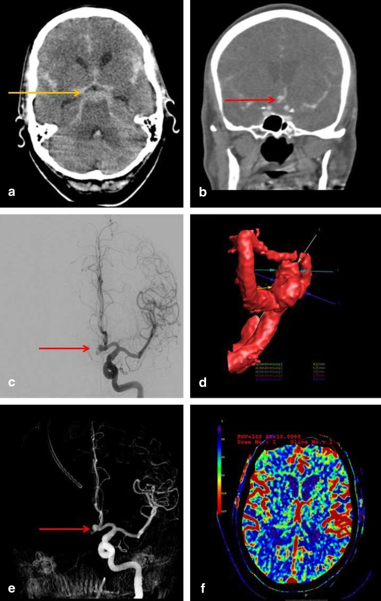
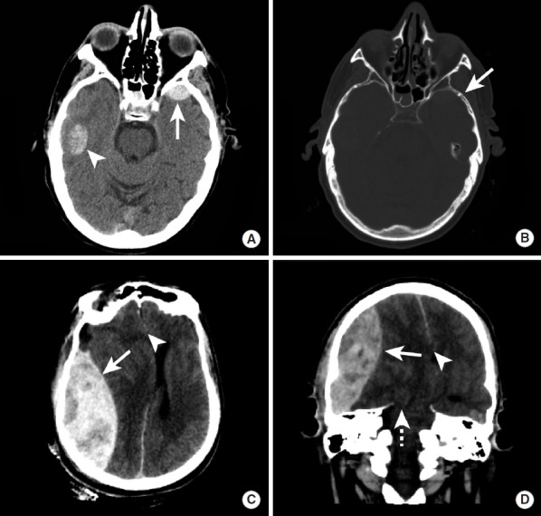
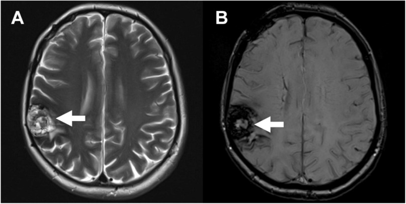
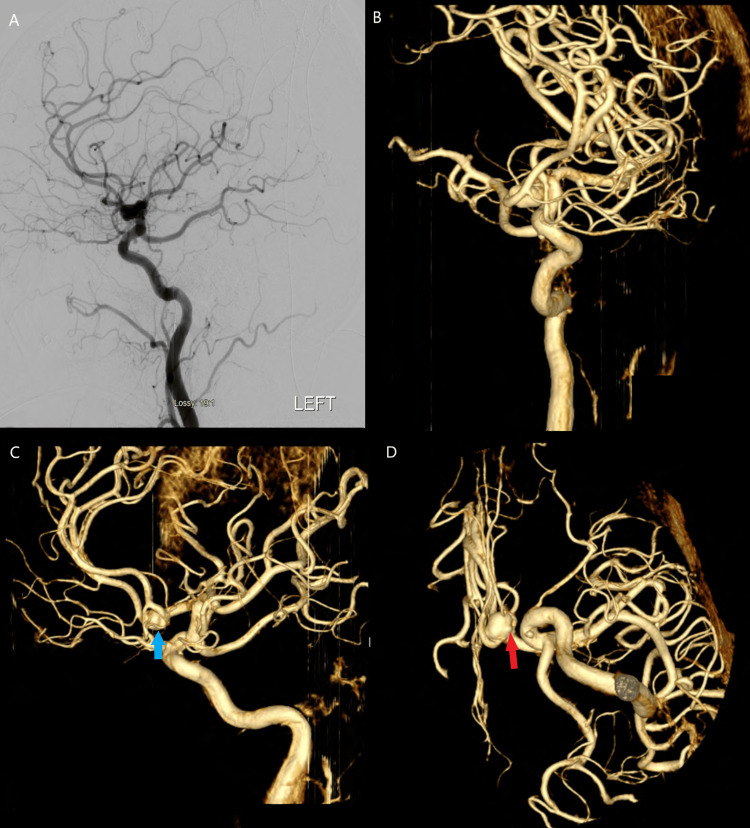
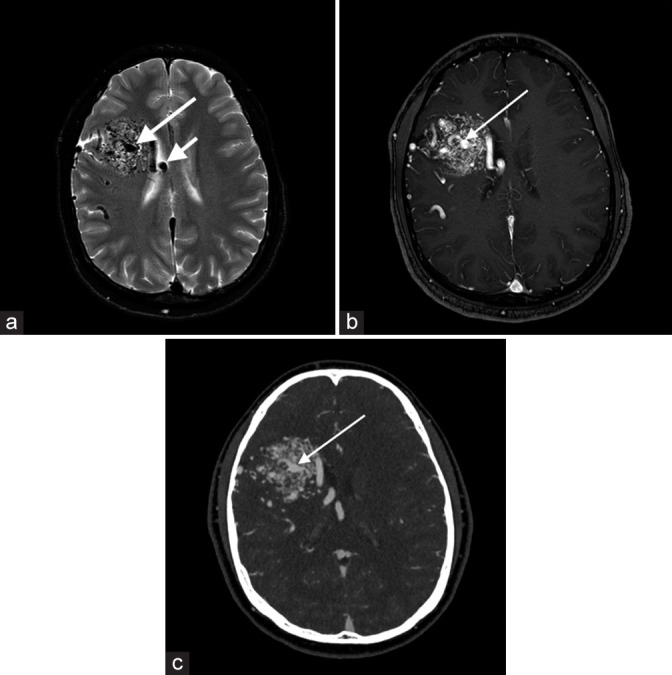

# Intracranial Haemorrhage & Aneurysm / AVM

Intracranial haemorrhage is a pattern-recognition problem: *where* the blood sits tells you the likely *cause*, and *how* it looks (on CT density or MRI signal) tells you *how old* it is. Aneurysms and vascular malformations are the structural culprits you must actively hunt for once you have characterised the bleed. This chapter builds the framework first, then walks modality by modality.

## 1. Classification framework (learn this before anything else)

**By compartment (the single most useful first cut):**

- **Intra-axial (within brain parenchyma)**
  - Intraparenchymal haemorrhage (IPH)
  - Intraventricular haemorrhage (IVH) — usually an extension of IPH or aneurysmal SAH
- **Extra-axial (outside brain, within the meningeal layers)**
  - Epidural / extradural haematoma (EDH)
  - Subdural haematoma (SDH)
  - Subarachnoid haemorrhage (SAH)
  - (Intraventricular is sometimes grouped here but is functionally intra-axial in origin)

**Intraparenchymal haemorrhage — by cause and location:**

- **Hypertensive** — *deep / central*: basal ganglia (especially putamen/external capsule), thalamus, pons, cerebellar dentate. Mechanism: rupture of small perforator vessels (lenticulostriate, thalamoperforators) weakened by chronic hypertension (Charcot-Bouchard type microaneurysms).
- **Cerebral amyloid angiopathy (CAA)** — *lobar / peripheral*, in the **elderly**, often recurrent, spares the deep grey nuclei. Reflects amyloid-beta deposition in cortical/leptomeningeal vessels. Associated with multiple peripheral cortical microbleeds and superficial siderosis on SWI.
- **Underlying structural lesion** — AVM, dural AV fistula, aneurysm, cavernoma, venous sinus thrombosis (venous infarct with haemorrhage), or a **haemorrhagic tumour** (metastasis: melanoma, RCC, thyroid, choriocarcinoma, lung; or primary glioblastoma).
- **Other** — coagulopathy / anticoagulation, haemorrhagic transformation of infarct, vasculitis, drug-related (sympathomimetics), trauma.

**Extra-axial — quick distinguishing template (detailed table later):**

- **EDH** — biconvex (lentiform), does NOT cross sutures, may cross dural attachments/midline, arterial (middle meningeal artery) classically, lucid interval.
- **SDH** — crescentic, crosses sutures, does NOT cross midline (limited by falx), venous (bridging veins), common in elderly/alcoholics/shaken infants.
- **SAH** — blood in sulci/cisterns/fissures; trauma is the commonest overall cause, aneurysm rupture the commonest non-traumatic cause.

## 2. Modality-wise findings

For intracranial haemorrhage, plain radiography and ultrasound have almost no role in adults; **CT and MRI dominate**, with **DSA** as the definitive vascular roadmap. Ultrasound is relevant only in neonates.

### Radiography (XR)
No role in characterising parenchymal or subarachnoid blood. Skull radiographs may incidentally show a fracture line crossing the middle meningeal groove (raising suspicion for EDH) but CT has entirely superseded this. Do not rely on it.

### Ultrasound (US)
Only useful in the **neonate** through the open anterior fontanelle: germinal matrix / intraventricular haemorrhage is graded (germinal matrix only; IVH without dilatation; IVH with ventricular dilatation; parenchymal venous extension) — the exact grade numbers are standard but learn the descriptive tiers and append "(verify exact grade definitions)" if quoting numbers. Transcranial Doppler also tracks **vasospasm** velocities after aneurysmal SAH. No role through the intact adult skull for diagnosing bleeds.

### CT (the front-line test)
Non-contrast CT (NCCT) is the first investigation for any suspected acute intracranial haemorrhage — fast, sensitive for acute blood, and triages surgery.

- **Acute blood is hyperdense** (~ high attenuation, roughly 50-90 HU; "verify exact value" but distinctly brighter than grey matter). Hyperacute/very anaemic or coagulopathic blood may be less dense or show a **fluid-fluid level** (swirl sign suggests active/unclotted bleeding and ongoing extravasation).
- Density **falls with age**: blood becomes isodense to brain at roughly 1-2 weeks and hypodense (CSF-like) by several weeks (these windows are approximate — verify exact values). An **isodense subacute SDH** is a classic trap in an elderly patient — look for mass effect, sulcal effacement and grey-white interface displacement.
- **Pattern reading**: deep/central bleed -> think hypertensive; lobar bleed in the elderly -> think amyloid; bleed with disproportionate oedema, ring/nodular enhancement or multiplicity -> think underlying tumour; bleed at a typical aneurysm site with SAH -> think aneurysm.
- **CTA** is now routinely added to detect an underlying aneurysm or vascular malformation, and to look for a **spot sign** (a focus of contrast extravasation within an acute IPH predicting haematoma expansion).
- **SAH**: blood outlines the basal cisterns, sylvian and interhemispheric fissures and sulci. The *distribution* hints at the ruptured aneurysm: anterior interhemispheric -> anterior communicating artery; sylvian -> middle cerebral artery / posterior communicating; perimesencephalic/prepontine only, with no aneurysm -> benign **non-aneurysmal perimesencephalic SAH** (good prognosis, presumed venous).

### MRI (characterisation, ageing, and the subtle bleed)
MRI is superior for **dating** a haematoma, detecting **microbleeds and old blood**, and finding an **underlying lesion** the CT missed. The signal of a parenchymal haematoma evolves predictably as haemoglobin degrades and as red cells lyse; this is examinable and worth memorising.

**Ageing of haematoma on MRI** (the canonical sequence — note in vivo timing is approximate, so describe qualitatively):

| Stage | Approx. time | Haemoglobin form | Compartment | T1 | T2 |
|---|---|---|---|---|---|
| Hyperacute | < ~24 h | Oxyhaemoglobin | Intracellular | Iso / slightly low | High (bright) |
| Acute | ~1-3 days | Deoxyhaemoglobin | Intracellular | Iso to low | Low (dark) |
| Early subacute | ~3-7 days | Methaemoglobin | Intracellular | **High (bright)** | Low (dark) |
| Late subacute | ~1 week-months | Methaemoglobin | Extracellular (cells lysed) | High (bright) | High (bright) |
| Chronic | months-years | Haemosiderin / ferritin | Extracellular (macrophages) | Low | **Very low (dark) rim** |

Mnemonic for T1/T2 evolution: think "**I**t **B**e **B**right **B**right **D**arker / **D**ark **D**ark **B**right **B**right" — but the reliable memory hook is: **early subacute = T1 bright (methaemoglobin)**, **chronic = haemosiderin dark rim**. The bright-on-T1 early-subacute clot and the dark-rim chronic clot are the two most commonly tested points.

- The signal behaviour is driven by **magnetic susceptibility**: deoxyhaemoglobin, intracellular methaemoglobin and haemosiderin are paramagnetic and cause T2/T2* shortening (dark), whereas extracellular methaemoglobin shortens T1 (bright) once cell membranes break down.
- **GRE / T2\*** and especially **SWI (susceptibility-weighted imaging)** exquisitely show **blooming** — old blood, microbleeds and calcium all "bloom" dark and look larger than they are.

### Advanced / problem-solving MR
- **SWI** is the workhorse for: cortical **microbleeds** (peripheral pattern -> amyloid; deep pattern -> hypertensive), **superficial siderosis**, the **popcorn** appearance and blooming rim of a **cavernoma**, and the radial collecting-vein "caput medusae" of a **developmental venous anomaly**. SWI also shows susceptibility within tumours and venous thrombus. (Caveat: SWI cannot reliably distinguish calcium from blood without phase data — verify with the phase image.)
- **DWI** distinguishes haemorrhagic infarct from primary haemorrhage and helps with abscess vs haemorrhagic tumour.
- **Perfusion / spectroscopy** help when a haemorrhagic mass might be tumour (elevated relative cerebral blood volume; choline peak), but blood products degrade spectroscopy and perfusion — interpret cautiously.
- **MRA / MRV** screen for aneurysms, AVMs and venous sinus thrombosis non-invasively.

### DSA (digital subtraction angiography — the gold standard for the vasculature)
DSA remains the definitive test for **aneurysm** detection and morphology (neck, dome-to-neck ratio, daughter sacs), for delineating **AVM** angioarchitecture (feeding arteries, nidus, draining veins, flow-related/intranidal aneurysms) and for diagnosing and grading **dural AV fistulas** (cortical venous reflux is the danger sign). It is therapeutic too (coiling, embolisation). If CTA is negative after a clear SAH, **DSA is mandatory**, and a repeat DSA is performed if the first is negative.

## 3. Aneurysmal SAH — the focused work-up

1. **NCCT** confirms SAH (sensitivity is very high in the first 6-24 h, then falls as blood washes out — verify exact figures). Pattern suggests aneurysm location.
2. **The Fisher concept** relates the **amount and distribution of cisternal blood on CT to the risk of vasospasm** — thicker and more clot, and the presence of intraventricular blood, predict higher vasospasm risk (the modified Fisher scale formalises this; learn the *concept* and append "(verify exact grade cut-offs)" rather than guessing numbers).
3. **CTA / DSA** localise the aneurysm. DSA is the reference standard; CTA is fast and good for surgical/endovascular planning.
4. If imaging is negative but the lumbar puncture shows **xanthochromia**, treat as SAH and repeat angiography.
5. **Vasospasm** typically develops in a delayed window (around days 4-14, peaking ~day 7 — verify exact window) and causes delayed cerebral ischaemia. Monitor with transcranial Doppler; confirm and treat (e.g. intra-arterial therapy) at DSA. CT perfusion can show the resulting hypoperfusion.

## 4. Vascular malformations — comparison

| Lesion | Key imaging signature | Flow | DSA visible? | Bleed risk |
|---|---|---|---|---|
| **AVM (pial)** | Nidus of tangled vessels, enlarged feeding arteries + early draining veins; flow voids on MRI | High | Yes (defining) | Significant; risk relates to deep drainage / associated aneurysms |
| **Dural AV fistula** | Direct artery-to-dural-sinus/vein shunt, often near a sinus; engorged cortical veins if reflux | High | Yes (defining) | Depends on cortical venous reflux (the danger feature) |
| **Cavernoma (cavernous malformation)** | "Popcorn"/mulberry mixed-signal core with complete **haemosiderin rim**, blooms on SWI | Low / angiographically occult | No (occult) | Recurrent small bleeds; usually low-pressure |
| **Developmental venous anomaly (DVA)** | "Caput medusae" of dilated medullary veins draining to a single collecting vein | Normal venous | Venous phase only | Benign; leave alone (do not resect — drains normal brain) |
| **Capillary telangiectasia** | Faint brush-like enhancement, typically **pons**, often only on post-contrast/SWI | Low | No | Negligible |

Two practical pairings: a **DVA frequently coexists with a cavernoma** (so search for the popcorn lesion when you see a caput medusae), and a **mixed/transitional malformation** is recognised. AVMs are graded for surgical risk by a system combining size, eloquence of adjacent brain and venous drainage pattern (learn the three components; append "(verify exact grade points)" rather than inventing scores).

## 5. Differential / pattern table — IPH by cause

| Feature | Hypertensive | Amyloid (CAA) | Underlying tumour | Vascular malformation |
|---|---|---|---|---|
| Typical location | Deep: putamen, thalamus, pons, cerebellum | Lobar / peripheral, spares deep grey | Anywhere; often atypical | At the lesion |
| Age | Middle-aged/older hypertensive | Elderly | Any | Younger (AVM/cavernoma) |
| Microbleeds (SWI) | Deep distribution | Peripheral/cortical + siderosis | Variable | At/around lesion |
| Clues | Known HTN, deep site | Recurrent lobar, normotensive | Disproportionate oedema, enhancement, multiplicity | Flow voids, popcorn, caput medusae |
| Best confirmatory test | Clinical + CT | MRI/SWI | MRI +/- follow-up after blood clears | DSA (AVM/dAVF) or MRI/SWI (cavernoma) |

## 6. Pearls & buzzwords

- **Deep bleed = hypertensive; lobar elderly bleed = amyloid.**
- **Swirl sign / spot sign** -> active bleeding and haematoma expansion.
- **EDH biconvex, crosses midline, not sutures; SDH crescentic, crosses sutures, not midline.**
- **Isodense subacute SDH** in the elderly — use mass effect and grey-white displacement to catch it.
- **Early subacute clot is T1-bright (methaemoglobin); chronic clot has a haemosiderin dark rim.**
- **SWI blooms** old blood, microbleeds, cavernomas and calcium — but cannot alone separate calcium from blood (check phase).
- **Cavernoma = popcorn with complete haemosiderin rim, angiographically occult; DVA = caput medusae, benign, do not touch.**
- **Capillary telangiectasia favours the pons**, faint enhancement, negligible bleed risk.
- **Perimesencephalic SAH with a normal angiogram** is benign (venous origin).
- **Negative CTA after definite SAH -> proceed to DSA, and repeat if still negative.**
- If a haemorrhagic lesion looks like tumour, **re-image after the blood resolves** to unmask the underlying mass.

## 7. What to draw

- A **coronal brain** marking the classic hypertensive sites (putamen, thalamus, pons, cerebellum) versus the peripheral lobar amyloid distribution.
- **EDH vs SDH** silhouettes: biconvex lens vs crescent, with arrows for "crosses sutures / crosses midline".
- The **haematoma ageing table** as a 5-row grid (stage / Hb form / intra- vs extracellular / T1 / T2) — examiners love this drawn out.
- A **caput medusae** (radiating medullary veins to one collecting vein) next to a **popcorn cavernoma with a dark rim**.
- An **AVM schematic**: feeding artery -> nidus -> early draining vein.

## 8. Further reading

- A standard neuroradiology reference text (e.g. Osborn's Brain) — chapters on intracranial haemorrhage, vascular malformations and aneurysms.
- A general radiology reference (e.g. Grainger & Allison) — CNS haemorrhage and stroke sections.
- Review articles on cerebral amyloid angiopathy imaging, the modified Fisher scale, and SWI in cerebrovascular disease (consult for exact numeric thresholds before quoting them in the exam).
