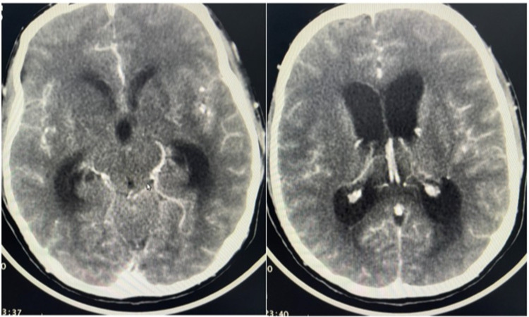
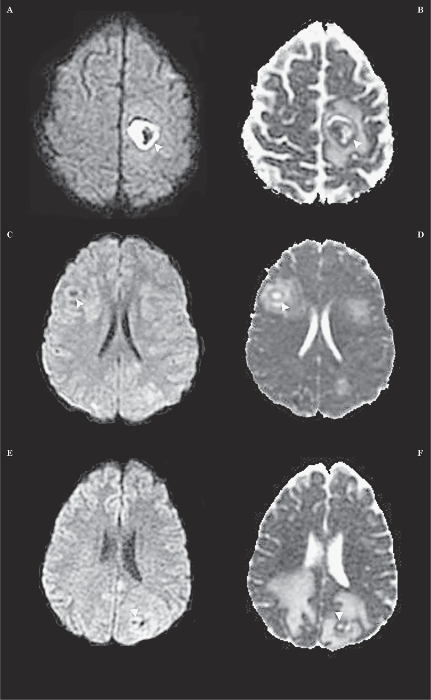
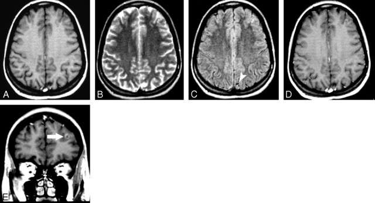
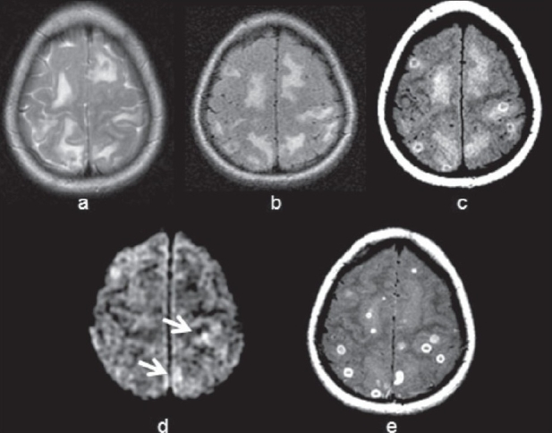

# CNS Infections (TB, NCC, Pyogenic, Fungal)

CNS infections are a high-yield neuroradiology topic where imaging frequently makes or strongly suggests the diagnosis, and where advanced MR (DWI, perfusion, spectroscopy, SWI) is genuinely decisive — most notably in separating a pyogenic abscess from a necrotic tumour. Read the morphology first, then layer the advanced sequences on top.

## 1. Classification / Enumeration framework (learn this first)

A clean way to organise the whole topic for the exam is by **organism class**, then by **compartment** (parenchymal vs meningeal vs ventricular), then **stage**.

**By organism class**
- **Pyogenic (bacterial):** cerebritis -> abscess; meningitis; empyema (subdural/epidural); ventriculitis.
- **Tuberculous (mycobacterial):** basal exudative meningitis (with its complications — hydrocephalus, vasculitic infarcts, cranial neuropathy), tuberculoma (parenchymal granuloma), miliary tuberculomata, tuberculous abscess, spinal arachnoiditis / Pott spine.
- **Parasitic — neurocysticercosis (NCC):** parenchymal (staged), subarachnoid/cisternal (racemose), intraventricular, and rarely spinal/ocular forms.
- **Viral:** encephalitis — HSV (limbic/temporal), Japanese encephalitis (thalami/basal ganglia), others.
- **Fungal:** parenchymal granuloma/abscess, meningitis (cryptococcal gelatinous pseudocysts), angioinvasive disease (Aspergillus, Mucor) with infarcts/haemorrhage; sino-orbital-cerebral extension.

**By compartment**
- **Parenchymal focal:** abscess, tuberculoma, NCC cyst, fungal granuloma.
- **Meningeal:** pyogenic meningitis (convexity), TB meningitis (basal), fungal/carcinomatous (DDx).
- **Ventricular/ependymal:** ventriculitis, intraventricular NCC, ependymitis.

**Stages (essential for two diseases)**
- **Pyogenic abscess:** early cerebritis -> late cerebritis -> early capsule -> late capsule.
- **Parenchymal NCC:** vesicular -> colloidal vesicular -> granular nodular -> calcified nodular.

## 2. Modality-wise findings (XR -> US -> CT -> MRI -> advanced)

### Plain radiograph (XR)
Largely historical for intracranial infection. The only durable role is detecting **calcification** — old calcified NCC may appear as small punctate intracranial calcific foci, and skull films historically showed sinus/mastoid opacification pointing to a source for empyema or otogenic abscess. Soft-tissue **cysticerci elsewhere** ("rice-grain" calcifications in thigh/calf muscles) on limb radiographs support disseminated cysticercosis. CT has otherwise replaced XR.

### Ultrasound (US)
Limited in the adult cranium. In **neonates/infants with open fontanelles**, cranial US shows ventriculitis (echogenic ependyma, debris/ventricular septations), abscess (complex fluid collection), and ventriculomegaly from meningitis. Transfontanelle US is a useful bedside complement but is operator-dependent and cannot characterise the deep/basal disease that defines TB. Otherwise US is not a primary CNS-infection tool.

### Computed tomography (CT)
CT is the first-line emergency study and remains the best modality for **calcification, bone, and acute haemorrhage**.

- **Pyogenic abscess:** non-contrast shows a hypodense centre with surrounding vasogenic oedema; post-contrast gives a **smooth, relatively thin ring** that is often slightly thinner along its medial (ventricular) margin. CT detects associated empyema, mastoiditis/sinusitis as a source, and complications (hydrocephalus, herniation).
- **NCC:** CT is excellent for the **calcified nodular** stage (a small dense calcific nodule, often the long-term endpoint) and for the **scolex** as a tiny dense dot within a cyst. Vesicular cysts are CSF-density with no oedema; colloidal cysts show ring enhancement with marked oedema.
- **TB meningitis:** non-contrast may show **basal cistern effacement/hyperdensity**; post-contrast shows intense **basal meningeal enhancement**. CT readily demonstrates the two major complications — **communicating hydrocephalus** and **infarcts** (typically in the basal ganglia/internal capsule territories supplied by perforators crossing the inflamed exudate). Tuberculomas appear as enhancing nodules, sometimes calcified ("target" appearance historically described).
- **Fungal:** CT may show sinonasal disease with bone erosion in invasive fungal sinusitis tracking intracranially; parenchymal lesions are often haemorrhagic/infarct-like in angioinvasive disease.

### Magnetic resonance imaging (MRI)
MRI is the workhorse for parenchymal and meningeal characterisation.

**Pyogenic abscess.** The mature abscess has a centre that is T2-hyperintense and T1-hypointense, surrounded by a **capsule that is characteristically T2-hypointense** (a useful sign of an organising abscess wall) and shows smooth ring enhancement. Surrounding vasogenic oedema is T2/FLAIR-hyperintense. The single most useful MR finding is on **DWI**: the abscess cavity shows **marked restricted diffusion** (bright on DWI, low ADC) because of the viscous, cellular pus. This contrasts with the necrotic centre of most tumours, which usually does NOT restrict. On **SWI**, abscesses may show a **"dual rim sign"** — two concentric rims, with an **outer hypointense rim and an inner hyperintense rim** (the inner rim is hyperintense relative to the outer; Toh et al.); this dual-layered wall favours abscess over glioblastoma, whose rim is typically a single hypointense layer.

**Neurocysticercosis (parenchymal staging on MRI).** This is a classic four-stage evolution:
- **Vesicular:** a thin-walled cyst with CSF-like signal, an eccentric **scolex** seen as a small mural nodule ("**hole-with-dot**" appearance), little or no surrounding oedema, and minimal/no enhancement (the larva is alive and immune-evading).
- **Colloidal vesicular:** the larva dies; cyst fluid becomes turbid (slightly higher signal than CSF), the wall enhances as a ring, and there is **prominent perilesional oedema** — this is the most symptomatic stage and the one most often confused with abscess/tumour.
- **Granular nodular:** the cyst retracts into a smaller enhancing nodule/disc with diminishing oedema.
- **Calcified nodular:** a small calcified nodule, no oedema, no enhancement (best seen on CT/SWI as blooming).

**Racemose NCC** is the extraparenchymal cisternal form: clustered "**bunch of grapes**" cysts in the basal/sylvian cisterns, often **without a scolex**, causing arachnoiditis and obstructive hydrocephalus — an aggressive form. Intraventricular cysts (commonly fourth ventricle) can cause acute obstruction.

**CNS tuberculosis.**
- *TB meningitis:* thick, enhancing **basal exudate** filling the suprasellar and ambient cisterns; complications as above (hydrocephalus, perforator infarcts, cranial nerve enhancement). FLAIR shows cisternal hyperintensity.
- *Tuberculoma:* a granuloma whose hallmark is a **T2-hypointense** core (caseating, with relatively low free water/paramagnetic effects) with peripheral enhancement — solid enhancement when non-caseating, ring enhancement with a hypointense centre when caseating with solid centre, and central T2-hyperintensity when there is central liquefactive caseation. The **T2-hypointense centre** is a key discriminator from a pyogenic abscess (which has a bright, restricting centre). MR spectroscopy of a tuberculoma classically shows a **large lipid peak** (~0.9-1.3 ppm) with depressed other metabolites.
- *Miliary TB:* numerous tiny enhancing nodules scattered through the parenchyma, usually with miliary lung disease.

**Viral encephalitis (HSV).** Herpes simplex encephalitis has a strong **limbic/temporal** predilection: asymmetric T2/FLAIR hyperintensity and swelling of the **medial temporal lobes, insula, and inferior frontal/cingulate (limbic) cortex**, classically **sparing the basal ganglia** (a feature that helps separate it from MCA infarct, which involves the basal ganglia). DWI is often the most sensitive early sequence (cortical restriction); gyriform enhancement and petechial haemorrhage (SWI/GRE blooming) appear later. Japanese encephalitis preferentially involves the **thalami** (often haemorrhagic) and basal ganglia — a useful contrast.

**Fungal disease.** Cryptococcus typically causes **gelatinous pseudocysts** in the basal ganglia/perivascular spaces (dilated VR spaces filled with organisms, little enhancement in immunocompromised hosts) and basal meningitis. Angioinvasive fungi (Aspergillus, Mucor) cause **infarcts, haemorrhage, and irregular/incomplete ring enhancement**; sino-orbital-cerebral mucormycosis tracks from the sinuses with cavernous sinus thrombosis and ICA involvement. Fungal abscess walls may show intracavity **T2-hypointense projections** and variable, often incomplete, diffusion restriction.

### Nuclear / advanced MR (the decisive part)
- **DWI/ADC:** pyogenic abscess centre = bright DWI / low ADC (restricting). Necrotic/cystic tumour centre = usually no restriction (high ADC). This single comparison answers most "ring lesion" questions, but note exceptions exist (some metastases, mucinous tumours, and treated lesions can confound — interpret with the whole picture).
- **MR spectroscopy:** *abscess* shows **amino acids (valine/leucine/isoleucine, ~0.9 ppm), acetate, succinate, lactate, alanine** — products of bacterial fermentation/proteolysis, with absent normal neuronal metabolites. *Tuberculoma* shows a dominant **lipid** peak. *Necrotic tumour* shows elevated **choline** in viable rim with reduced NAA. The amino-acid/acetate/succinate signature is fairly specific for pyogenic abscess (verify peak positions against your reference).
- **Perfusion (DSC/rCBV):** the enhancing **rim of an abscess shows LOW rCBV**, whereas the enhancing margin of a high-grade glioma shows **HIGH rCBV** — a useful adjunct.
- **SWI:** dual-rim sign in abscess; blooming for calcification (calcified NCC, old tuberculoma) and for haemorrhage in angioinvasive fungal disease and HSV.

## 3. Differentials / comparison tables

### Ring-enhancing lesion — core differential ("MAGIC DR" type list)
| Cause | Helpful discriminators |
|---|---|
| Pyogenic abscess | Smooth thin ring (thin medially), restricting bright centre on DWI/low ADC, low rim rCBV, AA/acetate/succinate on MRS, SWI dual-rim |
| High-grade glioma (GBM) | Thick/irregular nodular ring, non-restricting necrotic centre, high rim rCBV, high choline, crosses midline |
| Metastasis | Often multiple, grey-white junction, marked oedema, non-restricting centre, high rim rCBV |
| Tuberculoma (caseating) | T2-hypointense core, lipid peak on MRS, basal meningitis/other TB clues |
| NCC (colloidal) | Often a visible scolex, small cyst, marked oedema; calcified end-stage on CT |
| Subacute infarct/haematoma, demyelination (tumefactive — open ring), radiation necrosis | Clinical context; open/incomplete ring favours demyelination |

### Abscess vs necrotic/cystic tumour (the examiners' favourite)
| Feature | Pyogenic abscess | Necrotic tumour (GBM/met) |
|---|---|---|
| Ring on contrast | Smooth, thin, thinner medially | Thick, irregular, nodular |
| DWI centre | Restricts (bright, low ADC) | Usually no restriction (high ADC) |
| Rim rCBV (perfusion) | Low | High |
| MRS | Amino acids, acetate, succinate, lactate, alanine | Choline up, NAA down |
| SWI | Dual-rim sign | No dual rim |

### Cyst with a "dot" / cystic infective lesions
| Lesion | Key point |
|---|---|
| NCC (vesicular) | Scolex = hole-with-dot; CSF-signal cyst; minimal oedema |
| NCC (colloidal) | Ring enhancement + heavy oedema; dying larva |
| Hydatid (Echinococcus) | Large unilocular cyst, no scolex, no oedema, no enhancement, daughter cysts |
| Abscess | Restricting pus, enhancing wall, oedema |

### TB meningitis vs pyogenic meningitis vs viral
| Feature | TB meningitis | Pyogenic meningitis | Viral (HSV) encephalitis |
|---|---|---|---|
| Enhancement pattern | Thick BASAL cisternal exudate | Convexity/leptomeningeal | Gyriform (parenchymal), limbic |
| Hydrocephalus | Common (communicating) | Possible | Uncommon early |
| Infarcts | Common (perforators) | Less typical | N/A (encephalitis) |
| Parenchyma | Tuberculomas may coexist | Cerebritis/abscess if complicated | Medial temporal/limbic T2 bright, spares basal ganglia |

## 4. Pearls & buzzwords
- **"Hole-with-dot"** = scolex within a vesicular NCC cyst.
- **"Bunch of grapes"** in basal cisterns = racemose NCC.
- **Restricting centre + smooth thin ring** = pyogenic abscess until proven otherwise; tumour necrosis usually does NOT restrict.
- **T2-hypointense lesion core** = think caseating tuberculoma (also some haemorrhage, melanin, very cellular tumour).
- **Basal exudative meningitis + hydrocephalus + perforator infarcts** = TB meningitis triad.
- **Limbic/medial temporal disease sparing basal ganglia** = HSV encephalitis; **thalamic** disease = Japanese encephalitis.
- **MRS:** amino acids/acetate/succinate -> abscess; big lipid peak -> tuberculoma; high choline -> tumour.
- **SWI dual-rim sign** favours abscess over GBM.
- **Low rim rCBV** abscess vs **high rim rCBV** glioma.
- Ring thinner on the **medial (ventricular)** side in abscess (relates to ependymal rupture/ventriculitis risk).
- Calcified nodule on CT is the **end-stage** of NCC and may still cause seizures.

## 5. What to draw
- A labelled **ring lesion** with a table-style annotation: smooth thin ring (medial side thinnest), DWI-bright centre, low ADC — vs a thick irregular tumour ring with non-restricting centre.
- The **four-stage NCC sequence** as four small circles: clear cyst + dot (vesicular) -> ring + oedema (colloidal) -> small enhancing nodule (granular) -> dense dot (calcified).
- A **basal cistern diagram** showing suprasellar/ambient exudate, dilated temporal horns (hydrocephalus), and perforator infarcts in basal ganglia for TB meningitis.
- A **spectroscopy strip** annotating amino acid/acetate/succinate (abscess) vs lipid (tuberculoma) vs choline (tumour) peak positions.

## 6. Further reading
- Osborn's Brain — chapters on pyogenic infection, tuberculosis, parasitic infection, and viral encephalitis.
- Grainger & Allison's Diagnostic Radiology — CNS infection sections.
- Review articles on advanced MR (DWI, MRS, perfusion, SWI) in differentiating abscess from necrotic neoplasm.
- ICAO/national consensus guidance and radiology review articles on neurocysticercosis staging and TB neuroimaging (verify current criteria against the latest editions before the exam).
