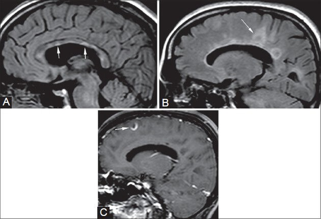
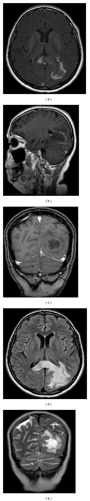
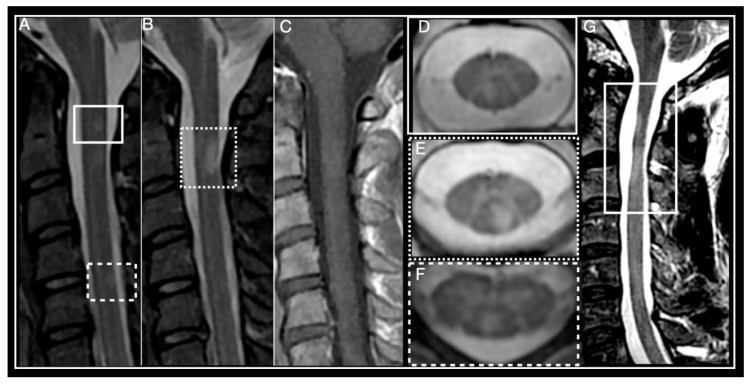
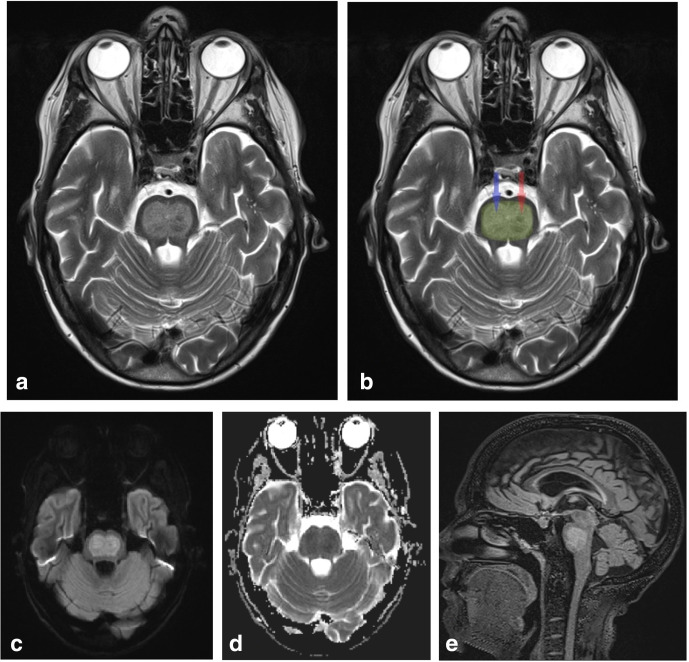
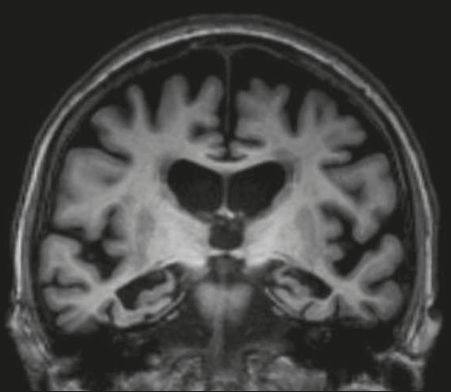
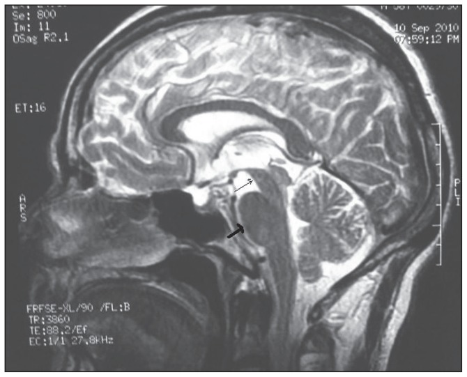

# Demyelinating & Degenerative Disorders

White-matter demyelination and neurodegeneration are dominated by MRI; CT plays a secondary, often confirmatory or complication-detecting role. The radiologist's task is pattern recognition: lesion distribution, enhancement morphology, diffusion behaviour, and regional atrophy patterns. This topic groups two clinically distinct families — inflammatory/infectious/metabolic demyelination and the dementias/parkinsonian-plus atrophy patterns — because both are read primarily off morphology and signal.

## 1. Classification / enumeration framework

A practical way to structure the demyelinating differential before describing any film:

**A. Demyelinating & related white-matter disease**
- **Primary (idiopathic) inflammatory demyelination**
  - Multiple sclerosis (relapsing-remitting, secondary/primary progressive); variants — tumefactive MS, Marburg (fulminant), Balo concentric sclerosis, Schilder.
  - Acute disseminated encephalomyelitis (ADEM) — monophasic, post-infectious/post-vaccinial.
  - Neuromyelitis optica spectrum disorder (NMOSD, aquaporin-4 antibody) and MOG-antibody-associated disease (MOGAD).
- **Infective demyelination** — progressive multifocal leukoencephalopathy (PML, JC virus, immunosuppressed).
- **Toxic/metabolic (osmotic) demyelination** — central pontine and extrapontine myelinolysis (osmotic demyelination syndrome, ODS).
- **Other white-matter mimics** — small-vessel ischaemic disease, vasculitis, CADASIL, leukodystrophies, posterior reversible encephalopathy, radiation/chemotherapy leukoencephalopathy.

**B. Neurodegenerative / dementia & parkinsonian-plus patterns** (read by regional atrophy)
- Alzheimer disease (medial temporal/hippocampal and parietotemporal atrophy).
- Frontotemporal dementia (frontal and/or anterior temporal lobar atrophy).
- Normal-pressure hydrocephalus (NPH) — communicating ventriculomegaly out of proportion to atrophy.
- Progressive supranuclear palsy (PSP) — midbrain atrophy, "hummingbird/penguin" sign.
- Multiple system atrophy (MSA) — pontine "hot-cross-bun", putaminal changes.

A useful first sieve when faced with white-matter lesions: **distribution** (periventricular vs subcortical vs deep grey vs brainstem/cord), **age/clinical setting** (immunosuppression -> PML; rapid sodium correction -> ODS; child post-viral -> ADEM), and **enhancement/diffusion behaviour**.

## 2. Modality-wise imaging findings

### Radiography (XR)
No role in demyelination or dementia. Mentioned only to be dismissed — plain films do not assess brain parenchyma.

### Ultrasound (US)
No role in adults. In neonates/infants, cranial US through the anterior fontanelle can show ventriculomegaly and periventricular changes but cannot characterise demyelination; MRI is required.

### CT
CT is insensitive for early or small demyelinating plaques and is largely a triage/complication tool. Active MS plaques may be invisible or appear as ill-defined low-attenuation periventricular foci; tumefactive lesions can show mass effect and incomplete rim enhancement and may be mistaken for tumour or abscess. In ADEM, CT is often normal or shows subtle low-attenuation white-matter foci. In PML, CT shows non-enhancing low-attenuation white-matter lesions without mass effect. In osmotic demyelination, CT may show central pontine hypodensity but frequently lags behind MRI and is commonly normal early. For dementia, CT can demonstrate generalised or regional atrophy and ventricular enlargement (useful where MRI is unavailable), and is the standard first-line study to exclude a surgical cause (tumour, subdural, hydrocephalus) in a patient with cognitive decline. In NPH, CT shows ventriculomegaly with rounded frontal horns and tight high-convexity sulci.

### MRI — the dominant modality
MRI is the workhorse. A typical protocol uses T2/FLAIR, T1 pre- and post-gadolinium, DWI/ADC, and increasingly SWI; for cord disease, sagittal and axial T2 with post-contrast sequences; for optic neuritis, fat-suppressed orbital sequences.

**Multiple sclerosis.** Plaques are T2/FLAIR hyperintense and characteristically ovoid, oriented perpendicular to the ventricular margin along deep medullary veins — **Dawson fingers** — best appreciated on sagittal FLAIR.

Lesions favour characteristic sites: periventricular, juxtacortical/cortical, infratentorial (brainstem, cerebellar peduncles), and the spinal cord (typically short-segment, peripheral, < 2 vertebral segments). The callososeptal interface is a high-yield location. Acute/active plaques show enhancement; the classic pattern is **open-ring (incomplete-ring) enhancement**, with the open margin typically facing the grey matter / cortical side — a feature favouring demyelination over abscess or neoplasm (which tend to enhance as complete rings).

The McDonald criteria concept (for examination purposes, describe the principle rather than reciting a table): a diagnosis of MS requires demonstration of **dissemination in space** (lesions in two or more of four characteristic CNS locations — periventricular, juxtacortical/cortical, infratentorial, spinal cord) and **dissemination in time** (new lesions on follow-up, or the simultaneous presence of enhancing and non-enhancing lesions on a single scan, indicating lesions of different ages). On chronic disease, the "central vein sign" on SWI and paramagnetic rim lesions are increasingly recognised supportive features; corpus callosum and cord atrophy reflect disease burden. Tumefactive MS is a large (often > 2 cm) lesion with relatively little mass effect for its size, open-ring enhancement, and a low rCBV on perfusion — helping separate it from high-grade glioma.

**ADEM.** Large, often bilateral but asymmetric, fluffy/ill-defined T2/FLAIR lesions in subcortical and deep white matter, frequently involving deep grey nuclei (thalami, basal ganglia) and the brainstem; lesions tend to be of similar age (monophasic), in contrast to MS where lesions are of differing ages. Enhancement is variable. Clinical context (recent infection/vaccination, child, encephalopathy) is key.

**NMOSD / MOGAD.** NMOSD (AQP4) characteristically causes **longitudinally extensive transverse myelitis** (cord lesion spanning three or more vertebral segments, often central/holocord) and optic neuritis (often posterior/chiasmal); brain lesions favour AQP4-rich periependymal regions — around the third/fourth ventricles, hypothalamus, area postrema (the "area postrema syndrome" with intractable vomiting/hiccups). MOGAD also produces optic neuritis (often anterior, with perineural enhancement) and ADEM-like brain lesions, with cord and conus involvement; many MOG brain lesions are reversible. Distinguishing these from MS matters because disease-modifying drugs for MS can worsen NMOSD.

**PML.** Asymmetric, confluent, subcortical white-matter T2/FLAIR hyperintensity involving the U-fibres, typically **without mass effect and without enhancement** (enhancement, if present, suggests immune reconstitution inflammatory syndrome, IRIS). Predilection for parieto-occipital white matter and middle cerebellar peduncles; lesions progress and do not respect vascular territories. Setting: HIV/AIDS or other profound immunosuppression (e.g. natalizumab).

**Osmotic demyelination (central pontine/extrapontine myelinolysis).** Symmetric central pontine T2/FLAIR hyperintensity with sparing of the peripheral pons and corticospinal tracts — the classic "**trident**" or bat-wing shape on axial images.

Extrapontine sites include basal ganglia, thalami, and external/extreme capsules. DWI may show restriction early, often before T2 changes are conspicuous; CT and even MRI can lag behind symptom onset by days, so a normal early scan does not exclude it. Classic setting: rapid correction of hyponatraemia (also alcoholism, malnutrition, liver transplant).

### Nuclear medicine / advanced MR
- **DWI/ADC**: complete rim diffusion restriction favours abscess over tumefactive demyelination; PML lesions show a leading edge of restricted diffusion at the advancing margin; ODS may restrict early.
- **MR spectroscopy**: demyelination shows reduced NAA, raised choline, and a lactate/lipid peak in acute lesions — overlapping with tumour, so interpret with morphology.
- **MR perfusion**: low rCBV in tumefactive demyelination versus high rCBV in high-grade glioma — a discriminating clue.
- **SWI**: central vein sign and iron-rim lesions in MS; microbleeds in small-vessel disease mimics.
- **FDG-PET / perfusion SPECT** in dementia: temporoparietal and posterior cingulate hypometabolism in Alzheimer disease; frontotemporal hypometabolism in FTD; amyloid-PET and dopamine-transporter (DaT) imaging are problem-solving adjuncts. PET/SPECT do not displace MRI for structural pattern recognition.

### Neurodegenerative atrophy patterns (MRI/CT)
- **Alzheimer disease**: disproportionate **medial temporal lobe / hippocampal atrophy** with widening of the choroid fissure and temporal horn; later parietotemporal cortical atrophy. Coronal T1 angled to the long axis of the hippocampus is the key view.

- **Frontotemporal dementia**: focal frontal and/or anterior temporal lobar atrophy, often asymmetric, sometimes "knife-edge" gyri.
- **NPH**: ventriculomegaly disproportionate to sulcal atrophy, with tight high-convexity sulci and widened Sylvian fissures (the **DESH** pattern — disproportionately enlarged subarachnoid-space hydrocephalus), often with a transependymal CSF signal; an elevated callosal angle is reduced in NPH (narrow/acute angle). MRI may show a CSF flow void in the aqueduct.
- **PSP**: midbrain atrophy with concave/flattened upper midbrain tegmentum — the "**hummingbird**" (penguin) sign on midsagittal images and the "Mickey Mouse"/morning-glory appearance on axial; the midbrain-to-pons ratio is reduced (verify exact value).

- **MSA**: pontine "**hot-cross-bun**" sign (cruciform T2 hyperintensity in the pons from selective degeneration of transverse pontocerebellar fibres) in MSA-cerebellar; putaminal atrophy with a hyperintense rim and T2-hypointense putamen in MSA-parkinsonian; middle cerebellar peduncle atrophy.

## 3. Differentials and comparison tables

**MS vs ADEM**

| Feature | Multiple sclerosis | ADEM |
|---|---|---|
| Age/onset | Young adult, relapsing | Often child, monophasic, post-infectious |
| Lesion margins | Discrete, ovoid | Large, fluffy, ill-defined |
| Lesion ages | Different (DIT) | Similar (single insult) |
| Deep grey matter | Uncommon | Common (thalami, basal ganglia) |
| Periventricular Dawson fingers | Typical | Less typical |
| Course | New lesions over time | Usually no new lesions |

**Tumefactive demyelination vs high-grade glioma vs abscess**

| Feature | Tumefactive MS | High-grade glioma | Abscess |
|---|---|---|---|
| Enhancement | Open (incomplete) ring | Thick irregular complete ring | Thin smooth complete ring |
| Mass effect | Less than expected for size | Marked | Moderate |
| DWI | Variable, often no central restriction | Variable | Central restriction (pus) |
| rCBV (perfusion) | Low | High | Low |

**PML vs HIV encephalopathy vs osmotic demyelination**

| Feature | PML | HIV encephalopathy | Osmotic demyelination |
|---|---|---|---|
| Symmetry | Asymmetric | Symmetric | Symmetric central pons |
| U-fibres | Involved | Spared | n/a |
| Mass effect/enhancement | Absent (enhancement = IRIS) | Absent | Absent |
| Setting | Immunosuppression (JCV) | Advanced HIV | Rapid Na+ correction |

**Parkinsonian-plus quick table**

| Disorder | Key sign | Site |
|---|---|---|
| PSP | Hummingbird/penguin | Midbrain tegmentum |
| MSA-C | Hot-cross-bun | Pons |
| MSA-P | Putaminal rim/hypointensity | Putamen |

## 4. Pearls & buzzwords
- **Dawson fingers** — periventricular ovoid lesions along medullary veins, perpendicular to ventricle.
- **Open-ring enhancement** — incomplete ring open toward grey matter; favours demyelination.
- **Dissemination in space and time** — the conceptual core of MS diagnosis (DIS = characteristic locations; DIT = lesions of different ages or new lesions over time).
- **Longitudinally extensive transverse myelitis (>= 3 segments)** and **area postrema syndrome** — think NMOSD/AQP4.
- **U-fibre involvement, no enhancement, no mass effect, immunosuppressed** — think PML; new enhancement = IRIS.
- **Trident/bat-wing central pons** — central pontine myelinolysis; remember rapid hyponatraemia correction and possible imaging lag.
- **Hummingbird = PSP; hot-cross-bun = MSA; hippocampal/medial temporal atrophy = Alzheimer; DESH/high callosal-angle change = NPH.**
- Tumefactive demyelination: large lesion, little mass effect, low perfusion — do not over-call tumour.

## 5. What to draw
- Sagittal ventricle with ovoid Dawson fingers radiating perpendicular to the callososeptal interface.
- An open (incomplete) enhancing ring with the gap facing the cortex.
- Axial pons with central T2 bright "trident" sparing the rim (CPM).
- Axial pons with a cruciform "hot-cross-bun".
- Midsagittal hummingbird (atrophic midbrain beak, preserved pons body).
- Coronal hippocampi with dilated temporal horns and widened choroid fissures (Alzheimer).

## 6. Further reading
- McDonald criteria (current revision) for diagnosis of multiple sclerosis — concept and CNS locations.
- Osborn's Brain — demyelinating, infectious, and toxic/metabolic disease chapters.
- NMOSD and MOGAD diagnostic consensus criteria.
- Radiology review articles on imaging patterns of dementia and atypical parkinsonism.
