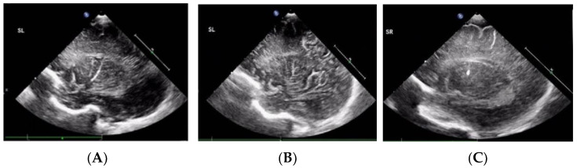
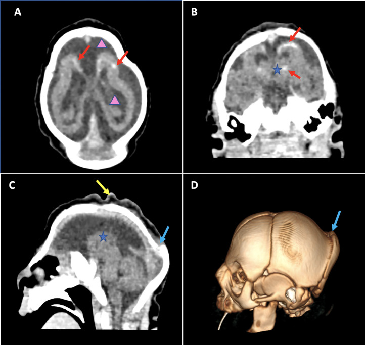
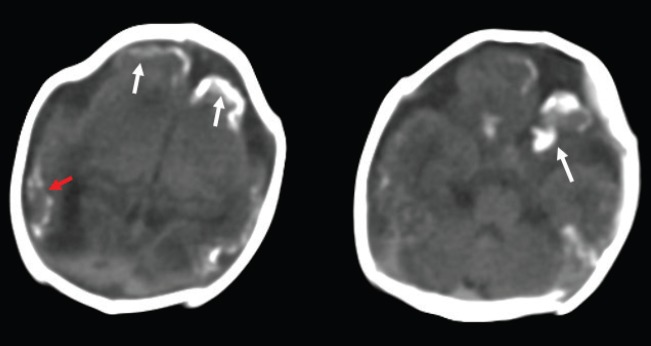
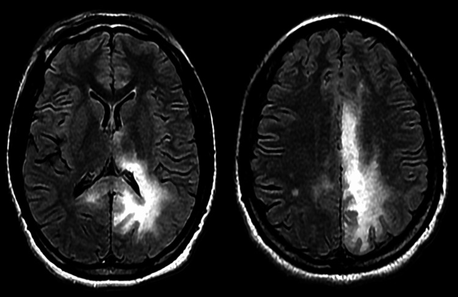
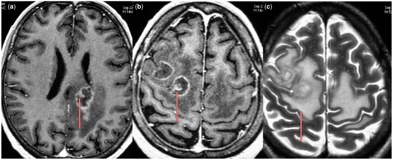

# CNS in HIV & Congenital TORCH Infections

A two-part neuroradiology topic: acquired CNS disease in the HIV-positive host (opportunistic infection, neoplasm and the direct effects of the virus) and the congenital TORCH spectrum (TOxoplasma, Rubella, CMV, Herpes and "Others"), where the recurring exam currency is the pattern of intracranial calcification combined with associated malformation. Imaging is read in the context of CD4 count for HIV, and in the context of gestational timing for congenital infection.

---

## 1. Classification / enumeration framework (learn this first)

### A. CNS disease in HIV — organise by mechanism
1. **Direct effect of HIV** — HIV encephalopathy / HIV-associated neurocognitive disorder, with cerebral atrophy.
2. **Opportunistic infection** (CD4-dependent; the lower the CD4, the more "exotic"):
   - Toxoplasmosis (most common cerebral mass in AIDS in many populations).
   - Progressive multifocal leukoencephalopathy (PML) — JC virus.
   - Cryptococcosis (Cryptococcus neoformans) — meningitis, gelatinous pseudocysts, cryptococcoma.
   - Cytomegalovirus (CMV) — ependymitis / ventriculitis, encephalitis, radiculomyelitis.
   - Tuberculosis (meningitis, tuberculoma) — endemic populations.
3. **Neoplasm** — primary CNS lymphoma (PCNSL), almost always EBV-driven in AIDS.
4. **Cerebrovascular** — HIV vasculopathy, accelerated atherosclerosis, opportunistic vasculitis.
5. **Immune reconstitution inflammatory syndrome (IRIS)** — paradoxical worsening after starting antiretroviral therapy.

A useful CD4 anchor: opportunistic CNS infections and PCNSL cluster at low CD4 counts (commonly quoted as below ~200 cells/mm3, and PML/CMV/cryptococcus typically lower still, around ~100 or below) (verify exact value). HIV encephalopathy progresses with advancing immunosuppression.

### B. Congenital TORCH — organise by calcification pattern + malformation
- **T**oxoplasmosis
- **O**thers (syphilis, varicella-zoster, parvovirus B19, Zika, HIV, etc.)
- **R**ubella
- **C**MV (cytomegalovirus) — the most common congenital infection overall
- **H**erpes simplex (usually HSV-2, perinatal acquisition)

The single most examined discriminator: **CMV gives periventricular calcification with a neuronal migration anomaly (lissencephaly/pachygyria, polymicrogyria) and microcephaly; toxoplasmosis gives scattered/random parenchymal (and sometimes basal ganglia) calcification with hydrocephalus and without a primary migration disorder.** Timing of infection in gestation determines the malformation: earlier insult produces migrational/destructive anomalies; later insult produces gliosis/atrophy.

---

## 2. Modality-wise findings

For both halves of this topic CT and MRI dominate. Plain radiography and ultrasound have a niche role (cranial US in the neonate; skull film historically for calcification). DWI, perfusion, spectroscopy, SWI and nuclear medicine (thallium SPECT / FDG-PET) carry real diagnostic weight, particularly in separating toxoplasmosis from lymphoma.

### Radiography (XR)
Essentially obsolete for these diagnoses but worth a sentence: a neonatal skull film may show intracranial calcification in advanced congenital infection, and the historic teaching of "periventricular" (CMV) versus "scattered" (toxoplasma) calcification originated here. Microcephaly may be inferred from a small calvarium. CT has entirely superseded this.

### Ultrasound (US)
Neonatal cranial ultrasound through the open fontanelle is the practical first-line tool in suspected congenital infection. Findings include:
- Echogenic foci representing parenchymal and periventricular calcification.
- **Lenticulostriate vasculopathy** — branching echogenic lines in the basal ganglia / thalami; a non-specific marker associated with congenital infection (CMV, rubella) among other causes.
- Ventriculomegaly, germinolytic (subependymal) cysts, and white-matter echogenicity.
US has no role in adult HIV CNS disease.

### CT
CT is excellent for **calcification** (its great strength in TORCH) and is often the first cross-sectional study in an acutely unwell HIV patient.

HIV-related:
- **Toxoplasmosis**: multiple lesions favouring basal ganglia and the grey-white junction; iso-to-hypodense with **ring or nodular enhancement** and surrounding vasogenic oedema. Lesions may show central necrosis.
- **PCNSL in AIDS**: often hypo/isodense masses, frequently periventricular, contacting the ependyma; enhancement may be ring-like (with necrosis) in the immunosuppressed, unlike the more homogeneous enhancement of immunocompetent PCNSL.
- **PML**: asymmetric, non-enhancing low attenuation in subcortical/periventricular white matter; no mass effect for lesion size.
- **Cryptococcosis**: often a normal or near-normal CT; may show dilated perivascular spaces (gelatinous pseudocysts) as low-density foci in basal ganglia, hydrocephalus, or rarely a cryptococcoma.
- **CMV ventriculitis**: subtle periventricular hypodensity; ependymal enhancement is better seen on MRI.
- **HIV encephalopathy**: diffuse atrophy with ventricular and sulcal enlargement, often with symmetric white-matter hypodensity.

Congenital TORCH:
- **CMV**: periventricular calcification (the classic pattern), ventriculomegaly, microcephaly, and migration anomalies (lissencephaly, polymicrogyria).
- **Toxoplasmosis**: scattered parenchymal calcification (cortex, basal ganglia, periventricular can also occur) with marked hydrocephalus from aqueductal obstruction.
- **Herpes (neonatal HSV)**: extensive destructive change, later multicystic encephalomalacia and cortical/gyral calcification.
- **Rubella**: calcification (basal ganglia, periventricular), microcephaly, and a vasculopathy.

### MRI
The workhorse for characterisation in both settings.

HIV-related:
- **Toxoplasmosis**: multiple ring-enhancing lesions; T2 typically hyperintense centre with variable rim signal; the **"eccentric target sign"** — an asymmetric enhancing mural nodule along one wall of the ring — is the most quoted MRI clue and favours toxoplasmosis over lymphoma. (A "concentric target" with alternating signal layers is also described.) Lesions are usually **restricting less** than the densely cellular lymphoma.
- **PCNSL (AIDS)**: periventricular/subependymal, often abutting ventricles, crossing the corpus callosum; tends to show **restricted diffusion** (low ADC) reflecting high cellularity. In immunosuppression, central necrosis and ring enhancement are common, blurring the classic picture. **Subependymal spread is a strong pointer to lymphoma.**
- **PML**: **asymmetric, confluent T2/FLAIR hyperintense white-matter disease that involves the subcortical U-fibres**, characteristically **non-enhancing**, with little or no mass effect. Often begins in parieto-occipital white matter; spares cortex. A faint peripheral rim of restricted diffusion at the advancing edge may be seen. Enhancement, when present, suggests PML-IRIS.
- **Cryptococcosis**: **gelatinous pseudocysts** — clusters of dilated perivascular spaces in the basal ganglia following CSF signal on all sequences (the "soap-bubble" appearance), typically non-enhancing; leptomeningeal enhancement of cryptococcal meningitis; a true cryptococcoma enhances and may show oedema.
- **CMV ventriculitis/ependymitis**: **thin periventricular T2/FLAIR hyperintense rim with ependymal enhancement** lining the ventricles; may be associated with subependymal nodularity and ventriculomegaly.
- **HIV encephalopathy**: symmetric, confluent, **non-enhancing** periventricular/deep white-matter T2/FLAIR hyperintensity that spares the U-fibres (contrast with PML), plus atrophy out of proportion to age.

Congenital TORCH:
- **CMV**: white-matter T2 hyperintensity (notably anterior temporal, with temporal-pole cysts a useful clue), polymicrogyria/pachygyria/lissencephaly reflecting migration arrest, cerebellar hypoplasia, ventriculomegaly, germinolytic cysts, delayed myelination; calcification is better on CT/SWI.
- **Toxoplasmosis**: hydrocephalus, parenchymal destruction and calcification; macrocephaly from hydrocephalus.
- **Herpes**: diffuse cortical and white-matter injury progressing to cystic encephalomalacia.

### Advanced MR (DWI, perfusion, spectroscopy, SWI)
This cluster of techniques is the practical answer to the classic exam question "**how do you tell toxoplasmosis from lymphoma**":
- **DWI / ADC**: lymphoma is densely cellular and tends to **restrict diffusion (low ADC)**; toxoplasmosis abscesses usually show **higher ADC** centrally. Overlap exists, especially with necrotic AIDS lymphoma.
- **Perfusion (DSC) / relative CBV**: **lymphoma shows elevated rCBV; toxoplasmosis shows low rCBV** (avascular necrotic lesion). This is one of the more reliable discriminators.
- **MR spectroscopy**: lymphoma shows elevated choline with depressed NAA and a lipid-lactate peak; toxoplasmosis is dominated by **lipid and lactate** with marked reduction of all normal metabolites (necrosis), without the choline elevation of tumour.
- **SWI / gradient echo**: superb for **calcification** (TORCH) and for haemorrhage; helps demonstrate mineralisation that may be inconspicuous on conventional MRI.

### Nuclear medicine (thallium-201 SPECT, FDG-PET)
A high-yield differentiator with a clean rule of thumb: **lymphoma is metabolically active and concentrates tracer; toxoplasmosis does not.**
- **Thallium-201 SPECT**: **increased uptake favours lymphoma; absent/low uptake favours toxoplasmosis.**
- **FDG-PET**: **hypermetabolism favours lymphoma; hypometabolism favours toxoplasmosis (and PML).**
These complement perfusion/diffusion and are valuable when a therapeutic trial of anti-toxoplasma treatment is being considered (lymphoma will not respond; failure to improve on empirical therapy raises lymphoma).

---

## 3. Differentials / comparison tables

### Toxoplasmosis vs primary CNS lymphoma (AIDS)
| Feature | Toxoplasmosis | PCNSL (AIDS) |
|---|---|---|
| Number | Usually multiple | May be single or multiple |
| Favoured site | Basal ganglia, grey-white junction | Periventricular / subependymal, may cross corpus callosum |
| Enhancement | Ring / nodular; **eccentric target sign** | Ring (necrotic, in AIDS) or homogeneous |
| Subependymal spread | Uncommon | Suggestive when present |
| DWI/ADC | Higher ADC (less restriction) | Lower ADC (restricts) |
| Perfusion rCBV | Low | Elevated |
| Spectroscopy | Lipid/lactate dominant | High choline, lipid-lactate |
| Thallium-201 / FDG-PET | Low uptake / hypometabolic | High uptake / hypermetabolic |
| Response to empirical anti-toxo therapy | Improves | No improvement |

### White-matter disease in HIV: PML vs HIV encephalopathy
| Feature | PML (JC virus) | HIV encephalopathy |
|---|---|---|
| Symmetry | Asymmetric, multifocal | Symmetric, diffuse |
| U-fibres | **Involved** | Spared |
| Enhancement / mass effect | None (enhancement = IRIS) | None |
| Course | Subacute, progressive | Chronic, with atrophy |

### Congenital infection by calcification pattern
| Infection | Calcification pattern | Key associations |
|---|---|---|
| CMV | **Periventricular** | Migration anomaly (lissencephaly, polymicrogyria), microcephaly, temporal-pole cysts, cerebellar hypoplasia |
| Toxoplasma | **Scattered/random parenchymal** (± basal ganglia, periventricular) | **Hydrocephalus** (aqueductal obstruction), chorioretinitis |
| Rubella | Basal ganglia / periventricular | Microcephaly, vasculopathy, sensorineural deafness, cataract |
| Herpes (HSV) | Cortical/gyral, late | Diffuse destruction, multicystic encephalomalacia |

---

## 4. Pearls & buzzwords
- **Eccentric target sign** = toxoplasmosis (asymmetric mural nodule on the ring).
- **Subependymal spread + restricted diffusion** = think lymphoma; **thallium/PET hot** = lymphoma; **perfusion rCBV high** = lymphoma.
- **Toxoplasmosis is "cold"** on thallium/PET, low rCBV, lipid-lactate on spectroscopy, and **responds to a therapeutic trial.**
- **PML**: asymmetric, **non-enhancing**, **U-fibre** white-matter disease, **no mass effect**; enhancement implies IRIS.
- **HIV encephalopathy**: symmetric white-matter change that **spares U-fibres**, plus atrophy.
- **Cryptococcus**: **gelatinous pseudocysts / soap-bubble** dilated perivascular spaces in basal ganglia; non-enhancing.
- **CMV (adult HIV)**: periventricular **ependymal enhancement** = ventriculitis.
- **Congenital CMV**: **periventricular calcification + migration anomaly + microcephaly**; temporal-pole white-matter cysts are a clue.
- **Congenital toxoplasma**: **scattered calcification + hydrocephalus**.
- Timing rule: earlier gestational insult → malformation (migration/destruction); later → gliosis/atrophy.
- Always correlate HIV findings with **CD4 count**.

---

## 5. What to draw
- A two-circle ring lesion: one with an **eccentric mural nodule** (toxoplasmosis target sign) versus one with **subependymal spread** abutting a ventricle (lymphoma).
- A 2x2 grid contrasting **PML** (asymmetric, U-fibre, no enhancement) versus **HIV encephalopathy** (symmetric, U-fibre sparing, atrophy).
- Basal ganglia with clustered "soap bubbles" for cryptococcal **gelatinous pseudocysts**.
- A coronal brain outline showing **periventricular calcification + polymicrogyria + small head (CMV)** beside **scattered parenchymal dots + dilated ventricles (toxoplasma)**.
- A decision arrow: ring lesion -> DWI/perfusion/spectroscopy -> thallium/PET -> empirical anti-toxo trial -> biopsy if no response.

---

## 6. Further reading
- Osborn's Brain — chapters on HIV/AIDS CNS infection, opportunistic infection and congenital infection.
- Barkovich & Raybaud, Pediatric Neuroimaging — congenital infections (CMV, toxoplasma) and malformations of cortical development.
- A standard neuroradiology review of "ring-enhancing lesions in AIDS: toxoplasmosis versus lymphoma" (advanced MR and nuclear correlation).
- Society/institutional reviews on TORCH neuroimaging patterns of calcification and malformation.
