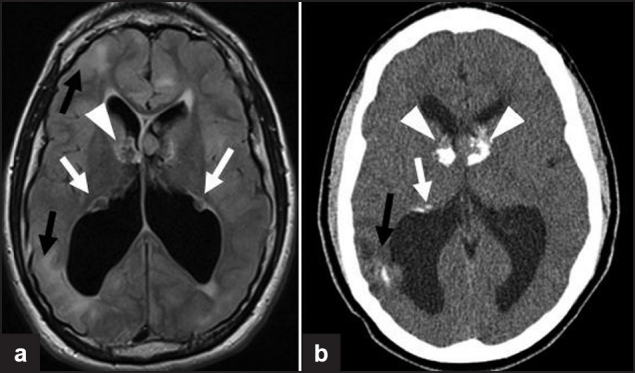
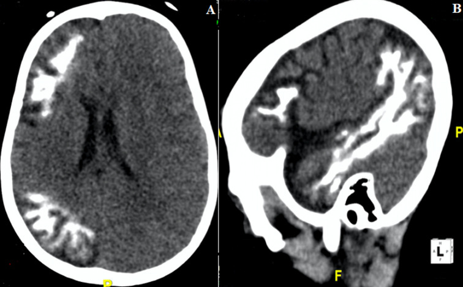
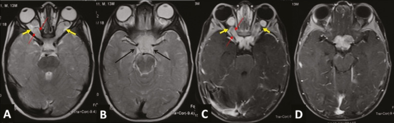
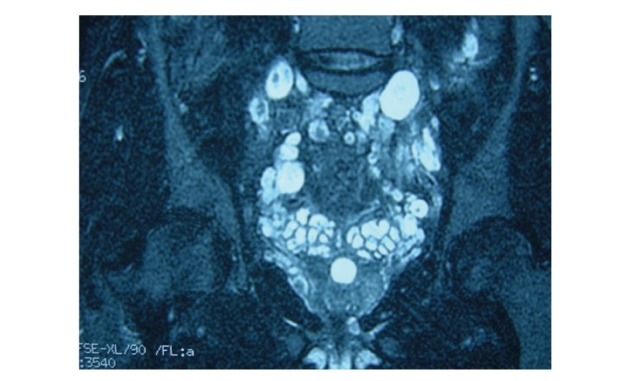
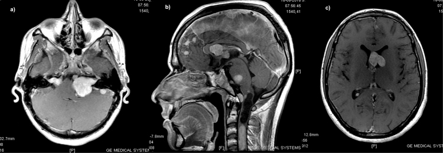
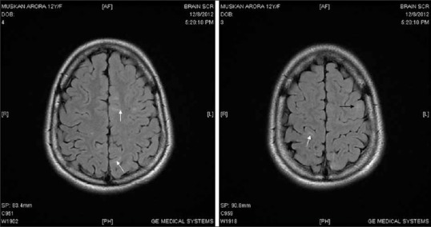
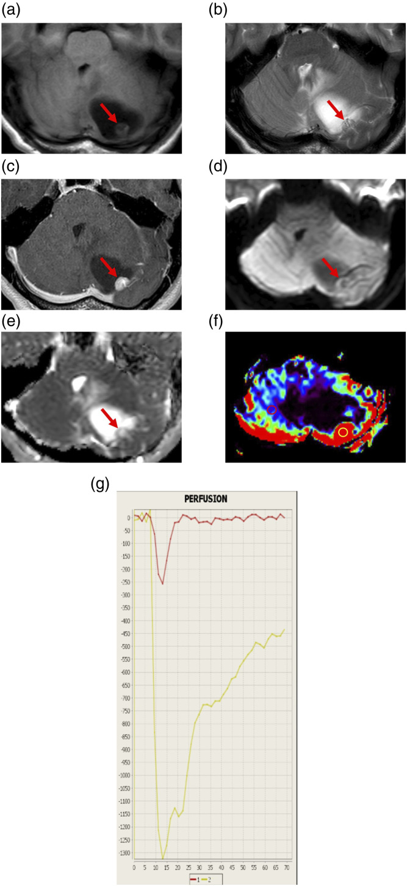

# Neurocutaneous Syndromes (NF, Sturge-Weber, TS, VHL)

The phakomatoses are dysplastic disorders affecting tissues of ectodermal and mesodermal origin, producing characteristic skin, neural, ocular and visceral lesions. For DNB purposes the four "classic" syndromes — neurofibromatosis (types 1 and 2), tuberous sclerosis, Sturge-Weber syndrome and von Hippel-Lindau disease — are best learnt as a comparison framework, since exam questions almost always ask you to differentiate them by imaging signature.

## Classification / enumeration framework

A workable way to enumerate the group:

1. **Neurofibromatosis type 1 (NF1, von Recklinghausen disease)** — autosomal dominant; gene on chromosome 17 (neurofibromin). Predominantly peripheral and skin disease with characteristic CNS lesions.
2. **Neurofibromatosis type 2 (NF2)** — autosomal dominant; gene on chromosome 22 (merlin/schwannomin). Dominated by multiple intracranial and intraspinal tumours — the **MISME** complex (Multiple Inherited Schwannomas, Meningiomas and Ependymomas).
3. **Tuberous sclerosis complex (TSC, Bourneville disease)** — autosomal dominant; *TSC1* (hamartin, chromosome 9) or *TSC2* (tuberin, chromosome 16). Hamartomatous lesions of brain, skin, kidney, heart and lung.
4. **Sturge-Weber syndrome (SWS, encephalotrigeminal angiomatosis)** — sporadic (somatic *GNAQ* mutation); a non-inherited vascular phakomatosis with a facial port-wine stain and ipsilateral leptomeningeal angioma.
5. **Von Hippel-Lindau disease (VHL)** — autosomal dominant; *VHL* tumour-suppressor gene on chromosome 3. CNS and visceral haemangioblastomas plus visceral cysts and tumours.

Two of these (NF1, NF2, TSC, VHL) are inherited tumour-predisposition/hamartoma syndromes; Sturge-Weber is the odd one out as a sporadic vascular malformation syndrome.

The classic NF1 clinical diagnostic checklist (two or more required) is worth knowing: six or more cafe-au-lait macules, two or more neurofibromas or one plexiform neurofibroma, axillary/inguinal freckling, optic pathway glioma, two or more Lisch nodules (iris hamartomas), a distinctive osseous lesion (sphenoid wing dysplasia or long-bone cortical thinning), and a first-degree relative with NF1.

---

## Imaging findings by modality

For the phakomatoses, CT and MRI dominate; plain radiographs and ultrasound have niche roles, and advanced MR/nuclear techniques are mainly problem-solving or research tools.

### Radiographs (XR)

Plain films are largely historical for CNS assessment but retain teaching value. In **NF1**, the classic plain-film signs include sphenoid wing dysplasia (a defect or absence of the greater wing of sphenoid producing the "bare orbit" / "empty orbit" sign and pulsatile exophthalmos), posterior vertebral body scalloping (from dural ectasia), ribbon ribs, enlarged neural foramina from dumbbell neurofibromas, and "twisted ribbon"/pseudoarthrosis of long bones (classically tibia). In **Sturge-Weber**, a lateral skull film may show the gyriform parallel-line ("tram-track" or "railroad-track") cortical calcification, though this is a late finding and CT is far more sensitive. In **tuberous sclerosis**, scattered intracranial calcifications may occasionally be visible on skull films. Plain films contribute little in NF2 and VHL.

### Ultrasound (US)

Ultrasound has no primary role in intracranial phakomatosis imaging in adults but is relevant for systemic surveillance and in neonates. Cranial US through the fontanelle in tuberous sclerosis may show subependymal nodules and cardiac rhabdomyomas are detected on fetal/neonatal echocardiography. In VHL, abdominal US screens for renal cysts/renal cell carcinoma, pancreatic cysts and phaeochromocytoma; in TSC it screens for renal angiomyolipomas. For peripheral nerve sheath tumours in NF1, US shows the "target sign" (hypoechoic rim, echogenic centre) and a fusiform mass in continuity with a nerve.

### CT

CT remains valuable chiefly for **calcification** and **bone**.

- **NF1**: best demonstrates sphenoid wing dysplasia and bony defects; orbital and skull base remodelling; may show optic nerve/chiasm enlargement and low-density change. Lambdoid suture defects may be seen.
- **NF2**: bilateral cerebellopontine angle masses widening the internal auditory canals; calcified meningiomas; intraventricular/ependymal lesions.
- **Tuberous sclerosis**: this is a CT-friendly disease — **calcified subependymal nodules** along the lateral ventricle walls (the "candle-guttering" appearance), calcified cortical/subcortical tubers, and a mass at the **foramen of Monro** (subependymal giant cell astrocytoma, SEGA) often causing obstructive hydrocephalus. Calcification increases with age.
- **Sturge-Weber**: the signature is **gyriform "tram-track" cortical/subcortical calcification** (typically parieto-occipital), **cerebral hemiatrophy** with calvarial thickening and elevation of the petrous ridge/orbital roof (Dyke-Davidoff-Masson-like compensatory change), and an enlarged ipsilateral choroid plexus.
- **VHL**: CT shows posterior fossa cystic masses with an enhancing mural nodule; systemic CT screens abdominal lesions.

### MRI

MRI is the workhorse for all four CNS phakomatoses.

**NF1.** Key intracranial findings:
- **Optic pathway glioma (OPG)** — a low-grade pilocytic astrocytoma; fusiform enlargement and kinking of the optic nerve, chiasm or tracts, T2-hyperintense, variable enhancement. Bilateral optic nerve gliomas are essentially pathognomonic of NF1.
- **Focal areas of signal intensity (FASI)**, also called "NF bright spots" or unidentified bright objects (UBOs) — T2/FLAIR-hyperintense foci in the globi pallidi, thalami, brainstem, cerebellar white matter and internal capsule, without mass effect, usually no enhancement, and tending to regress in adulthood. They represent myelin vacuolation/spongiotic change, not tumour.
- **Plexiform neurofibroma** — a transspatial, infiltrative nerve sheath tumour ("bag of worms"), often with a **target sign** on T2 (central low signal, peripheral high signal); when along the orbit/face may co-exist with sphenoid wing dysplasia.
- Sphenoid wing dysplasia with herniation of temporal lobe/CSF into the orbit; dural ectasia and lateral thoracic/intraspinal meningoceles; dumbbell spinal neurofibromas.
- Increased risk of other gliomas (brainstem) and, in peripheral lesions, malignant peripheral nerve sheath tumour (MPNST).

**NF2 (MISME).** The defining lesion is **bilateral vestibular (acoustic) schwannomas** — avidly enhancing masses in the internal auditory canal/cerebellopontine angle ("ice-cream-on-cone" morphology). Add multiple **meningiomas** (dural-based, enhancing, may have dural tail), **ependymomas** (especially spinal cord), and schwannomas of other cranial and spinal nerves. Mnemonic for NF2: "MISME" — Multiple Inherited Schwannomas, Meningiomas, Ependymomas. Cataracts (posterior subcapsular) are an associated finding. NF2 has comparatively few skin and bone lesions, contrasting with NF1.

**Tuberous sclerosis.** Four characteristic CNS lesions:
- **Cortical/subcortical tubers** — T2/FLAIR-hyperintense, expanded gyri; in neonates may be T1-hyperintense/T2-hypointense (reversed signal due to incomplete myelination); usually no enhancement; may calcify with age.
- **Subependymal nodules** — small lesions projecting into the ventricle along the caudothalamic groove/lateral wall; calcify and may enhance.
- **Radial migration lines (radial bands)** — linear T2/FLAIR-hyperintense bands extending from ventricle to cortex along lines of neuronal migration.
- **SEGA** — an enhancing mass at or near the **foramen of Monro**; suspect when a subependymal lesion grows or causes hydrocephalus. SEGA is the lesion that mandates follow-up.

**Sturge-Weber.** The primary abnormality is a **pial (leptomeningeal) angioma**, best shown as **leptomeningeal enhancement** on post-contrast T1, typically parieto-occipital and unilateral. Secondary changes reflect chronic venous ischaemia: cortical/subcortical calcification (low signal/blooming on SWI/GRE), **cerebral hemiatrophy**, accelerated myelination, an **enlarged and enhancing ipsilateral choroid plexus**, and prominent deep/medullary collateral veins with paucity of normal superficial cortical veins. SWI is sensitive for the calcification and abnormal venous drainage; perfusion may show hypoperfusion of the affected cortex.

**VHL.** **Haemangioblastomas** are the hallmark CNS tumour — cerebellum, brainstem and spinal cord (and retina). Classic morphology is a **cyst with an avidly enhancing mural nodule** abutting the pia; the nodule may show flow voids from feeding/draining vessels. Lesions are often multiple. Spinal cord and posterior fossa locations predominate. Associated systemic lesions (clear cell renal cell carcinoma, phaeochromocytoma, pancreatic/renal cysts, endolymphatic sac tumour) are part of the syndrome and drive whole-body surveillance.

### Nuclear / advanced techniques

Advanced MR is mostly problem-solving. **DWI/ADC**: FASI in NF1 and tubers in TSC do not restrict; restriction would suggest something else. **MR spectroscopy/perfusion**: helps assess optic pathway and brainstem gliomas in NF1 and distinguish a stable SEGA from a high-grade tumour. **SWI/GRE**: highly sensitive for the cortical calcification and abnormal venous structures of Sturge-Weber and the calcified nodules of TSC. **PET/FDG and PET-MR**: in Sturge-Weber, FDG-PET shows hypometabolism in the affected hemisphere and can guide epilepsy surgery; in NF1, functional imaging (e.g. FDG-PET) is used to flag malignant transformation of a plexiform neurofibroma to MPNST (a "hot," rapidly enlarging, heterogeneous lesion). Nuclear medicine has little role in NF2 and a systemic (not neuro) role in VHL.

---

## Differential / comparison tables

### Core comparison of the four syndromes

| Feature | NF1 | NF2 | Tuberous sclerosis | Sturge-Weber | VHL |
|---|---|---|---|---|---|
| Inheritance | AD, chr 17 | AD, chr 22 | AD, chr 9/16 | Sporadic (GNAQ) | AD, chr 3 |
| Skin marker | Cafe-au-lait, axillary freckling | Few skin lesions | Ash-leaf macules, adenoma sebaceum, shagreen patch | Facial port-wine stain (V1/V2) | None specific |
| Signature CNS lesion | Optic pathway glioma; FASI; plexiform NF | Bilateral vestibular schwannomas (MISME) | Tubers, subependymal nodules, SEGA | Leptomeningeal angioma | Haemangioblastoma |
| Classic calcification | — | Meningiomas may calcify | Subependymal nodules, tubers | Gyriform tram-track | — |
| Eye finding | Lisch nodules, OPG | Posterior subcapsular cataract | Retinal hamartoma | Glaucoma, choroidal angioma | Retinal haemangioblastoma |
| Bone | Sphenoid wing dysplasia, scoliosis, pseudoarthrosis | Minimal | — | Calvarial thickening, hemiatrophy | — |

### NF1 vs NF2

| | NF1 | NF2 |
|---|---|---|
| Gene/chromosome | Neurofibromin / 17 | Merlin / 22 |
| Predominant burden | Peripheral nerve + skin + bone | Intracranial/intraspinal tumours |
| Hallmark | Optic pathway glioma, plexiform NF, FASI | Bilateral vestibular schwannomas |
| Other tumours | Astrocytomas, MPNST | Meningiomas, ependymomas, other schwannomas |
| Mnemonic | "Peripheral / cafe-au-lait" | "MISME" / "central" |

### Posterior fossa cystic-mass-with-nodule mimics (VHL context)

| Lesion | Helpful pointer |
|---|---|
| Haemangioblastoma | Pia-abutting nodule, flow voids, adult, multiple in VHL |
| Pilocytic astrocytoma | Child, larger nodule, less vascular |
| Metastasis | Older patient, primary known, oedema |

---

## Pearls & buzzwords

- **NF1**: "cafe-au-lait," "Lisch nodules," "bare/empty orbit" and pulsatile exophthalmos (sphenoid wing dysplasia), "bag of worms" / **target sign** (plexiform neurofibroma), "UBOs/FASI" that regress with age, bilateral optic nerve gliomas are pathognomonic.
- **NF2**: **MISME**; "ice-cream-on-cone" bilateral vestibular schwannomas; think NF2 in a young patient with a meningioma or bilateral CPA masses.
- **TSC**: "candle-guttering" subependymal nodules; ash-leaf macule, adenoma sebaceum (facial angiofibroma), shagreen patch; **SEGA at the foramen of Monro**; cardiac rhabdomyoma in infants, renal angiomyolipoma in adults; neonatal tubers show reversed signal.
- **Sturge-Weber**: "**tram-track / railroad-track**" gyriform calcification; pial angioma with leptomeningeal enhancement; **enlarged ipsilateral choroid plexus**; hemiatrophy; port-wine stain in the trigeminal V1 distribution; SWI shows calcium + abnormal veins.
- **VHL**: **cyst-with-mural-nodule** haemangioblastoma; multiple lesions; retina to spinal cord; remember the systemic checklist (RCC, phaeochromocytoma, pancreatic/renal cysts).
- General trap: NF1 brain "bright spots" (FASI) are benign and should not be over-called as tumour; an enlarging subependymal nodule near the foramen of Monro in TSC is the one that becomes a SEGA.

## What to draw

- A four/five-column comparison grid (NF1 / NF2 / TSC / SWS / VHL) with rows for gene, skin sign, hallmark CNS lesion and classic calcification — a single high-yield table reproduces most marks.
- A coronal brain sketch for tuberous sclerosis: subependymal nodules along the lateral ventricle walls, a SEGA at the foramen of Monro causing dilated lateral ventricles, plus a peripheral cortical tuber with a radial band.
- A Sturge-Weber sketch: unilateral parieto-occipital gyriform tram-track calcification, hemiatrophy with thickened skull, and an enlarged ipsilateral choroid plexus.
- A simple haemangioblastoma diagram: posterior fossa cyst with an enhancing mural nodule against the pial surface.
- An NF1 orbit sketch: fusiform optic nerve/chiasm glioma plus sphenoid wing defect ("empty orbit").

## Further reading

- Osborn's Brain — chapters on inherited tumour syndromes / phakomatoses.
- Barkovich & Raybaud, Pediatric Neuroimaging — neurocutaneous syndromes chapter.
- Grainger & Allison's Diagnostic Radiology — neurocutaneous disorders.
- A current radiology review article on imaging of the phakomatoses for the comparison framework.
