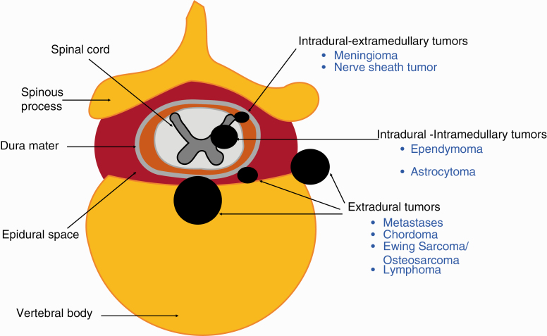
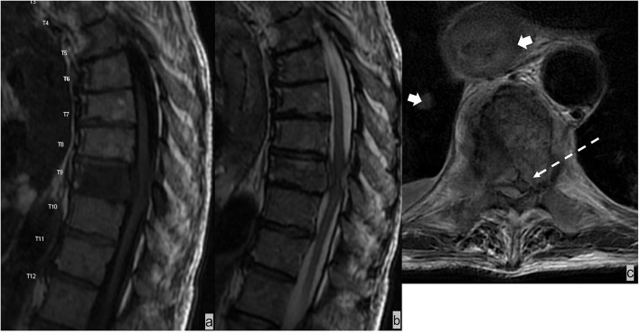
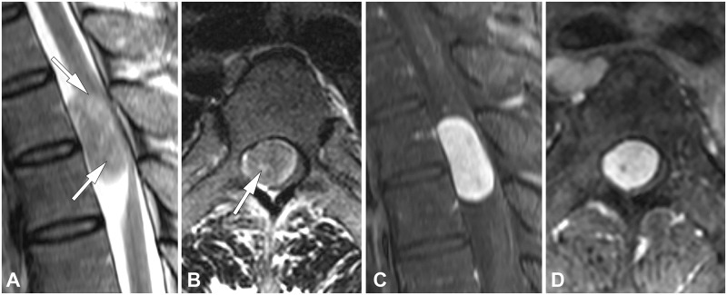
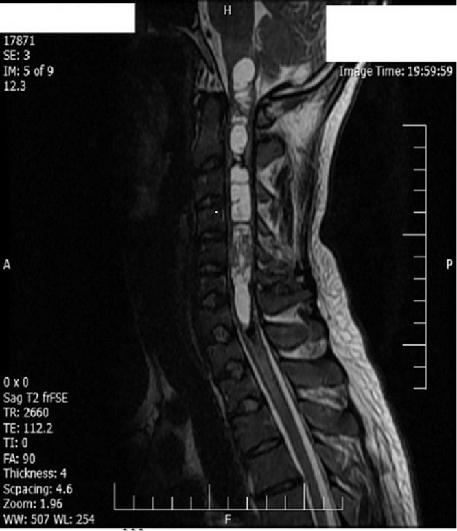
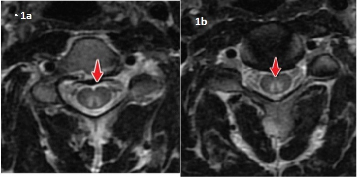
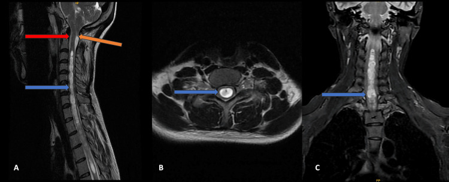

# Spine — Approach, Cord & Canal Tumours, Myelopathy

A spinal mass or a cord signal abnormality is read first by *where* it sits, then by *what* it is. Compartment localisation drives almost the entire differential, so the disciplined approach is: localise the lesion to one of three spaces, generate the compartment-specific differential, then refine with signal and enhancement. Myelopathy (cord dysfunction) is approached separately along a compressive versus non-compressive axis.

## 1. Classification / enumeration framework

### The three-compartment model
The key habit is to decide whether the lesion is **extradural**, **intradural-extramedullary (IDEM)**, or **intramedullary**, by reading the subarachnoid (CSF) space and the cord margin.

- **Extradural** — arises outside the dura; pushes the thecal sac (dura + cord + CSF) away from the lesion. The CSF column is **displaced/compressed toward the cord**, the cord is pushed away, and there is often associated bone or disc disease. The subarachnoid space ipsilateral to the mass is **effaced**.
- **Intradural-extramedullary (IDEM)** — inside the dura but outside the cord. Classic sign: the lesion **widens the ipsilateral CSF space at its poles** (the meniscus / CSF cap above and below the mass), the cord is **displaced and compressed against the opposite wall**, and the contralateral subarachnoid space narrows.
- **Intramedullary** — within the cord substance. The cord is **expanded** (fusiform widening), and the **subarachnoid space is symmetrically narrowed on both sides**.

A simple memory aid for the CSF behaviour: extradural pushes CSF in toward the cord; IDEM caps the lesion with CSF and pushes the cord across; intramedullary expands the cord and squeezes CSF on both sides.

### Compartment-specific differentials (the spine "menu")
- **Extradural (most common compartment overall):** metastasis (commonest extradural tumour), degenerative disc / herniation, epidural abscess, epidural haematoma, lymphoma, primary bone tumours and myeloma, extramedullary haematopoiesis.
- **IDEM:** nerve sheath tumour (schwannoma, neurofibroma), meningioma, drop/CSF-disseminated metastases, myxopapillary ependymoma (filum/conus), dermoid/epidermoid, arachnoid cyst, paraganglioma (filum).
- **Intramedullary:** ependymoma (commonest cord tumour in adults, typically central), astrocytoma (commonest in children, eccentric/infiltrative), haemangioblastoma, metastasis, plus the non-neoplastic mimics — demyelination, inflammation, infarct, syrinx.

### Myelopathy axis
Cord dysfunction is divided into:
- **Compressive** — extrinsic mass on the cord (degenerative canal stenosis, disc, tumour, abscess, haematoma, fracture). MRI shows the offending structure plus cord signal change.
- **Non-compressive** — no extrinsic compressor; intrinsic cord pathology. Subgroups: **demyelinating** (MS, ADEM, NMOSD/MOG), **vascular** (cord infarct, dural AV fistula), **inflammatory/infective** (transverse myelitis, viral, post-infectious), **metabolic/toxic** (B12 subacute combined degeneration, copper deficiency, nitrous oxide), **neoplastic**, and **paraneoplastic**.

## 2. Modality-wise findings

### Plain radiography (XR)
Limited and largely historical for cord/canal lesions, but still the first film many candidates encounter. Look for **canal widening** (increased interpedicular distance, posterior vertebral body scalloping) suggesting a slow-growing IDEM/intramedullary mass; **pedicle erosion or a "winking owl" absent pedicle** in metastasis; **neural foraminal enlargement** with a dumbbell schwannoma; and **vertebral body destruction, collapse or sclerosis** in metastatic and primary bone disease. Disc-space loss with endplate erosion suggests infection rather than tumour (tumour tends to spare the disc). XR cannot image the cord and is normal in most non-compressive myelopathy.

### Ultrasound (US)
Has essentially no role in the adult bony spine. It is useful in **neonates/infants** (non-ossified posterior elements) to screen for cord tethering, syrinx and conus position, and **intraoperatively** to localise tumour, define cyst margins and confirm decompression. Otherwise omit US from adult spinal tumour and myelopathy work-up.

### CT (and CT myelography)
CT excels at **bone**: cortical destruction versus sclerosis, pattern of vertebral collapse, canal/foraminal bony narrowing, and matrix. In metastasis it distinguishes lytic, sclerotic and mixed disease and shows pedicle involvement. In infection it shows endplate erosion and paravertebral collection. It is the modality for **trauma** (fracture, retropulsed fragment causing compression).

**CT myelography** is the principal fallback when **MRI is contraindicated** (non-conditional pacemaker, certain implants) or non-diagnostic, and to clarify equivocal compression. Intrathecal contrast outlines the thecal sac and cord so the same three-compartment logic applies: an extradural mass indents the contrast column from outside, an IDEM mass produces a sharp meniscus/CSF cap with cord displacement, and an intramedullary mass widens the cord with symmetric thinning of the contrast columns. The morphology of a complete block helps localise it: an **extradural block gives a frayed, feathered "paintbrush" termination**, whereas an **intradural-extramedullary block gives a smooth, concave cup-shaped "meniscus"** capping the mass. CT myelography also remains useful to detect a **CSF leak** and to opacify a **syrinx** (delayed filling).

### MRI — the primary modality
MRI is the workhorse for cord and canal disease; multiplanar T1, T2, STIR/fat-saturated sequences and post-gadolinium imaging answer compartment, extent and (often) histology. General principles: most tumours are **T1 hypo- to isointense and T2 hyperintense** and enhance; the value lies in pattern.

**Extradural disease.** Marrow-replacing metastases are **T1 hypointense** against fatty marrow (a sensitive sign), variably T2 bright, and enhance; STIR increases conspicuity. The mass is centred outside the dura, may track epidurally and compress the cord; sclerotic metastases are T1 and T2 low. Disc herniation is contiguous with the disc, low T2 if degenerate, and the cord above a chronic compression may show focal **T2 hyperintensity (myelomalacia/gliosis)** — a poorer-prognosis sign. **Epidural abscess** shows a rim-enhancing or homogeneously enhancing epidural collection with **restricted diffusion** in frank pus, usually with adjacent discitis-osteomyelitis (T2-bright disc, endplate enhancement) and a paraspinal phlegmon. **Epidural haematoma** follows blood-product evolution and is typically biconvex.

**IDEM tumours.** **Schwannoma** — well-defined, often eccentric to the cord, may be a **dumbbell** lesion through an enlarged neural foramen; T2 bright, avidly enhancing, prone to cystic change and a **target sign** (central low, peripheral high T2). **Meningioma** — broad **dural base**, often T2 iso- to slightly hypointense (more so than schwannoma), homogeneous enhancement frequently with a **dural tail**, classically thoracic and in women; may calcify (CT). **Drop metastases** show nodular leptomeningeal enhancement coating cord and nerve roots, "sugar-coating", often with a primary intracranial tumour (medulloblastoma, ependymoma, GBM) or CSF-spreading systemic cancer. **Myxopapillary ependymoma** sits at the **conus/filum terminale**, is often haemorrhagic and enhancing.

**Intramedullary tumours.** **Ependymoma** — adult, **central** within the cord, well-circumscribed, enhances, classically with a **haemosiderin "cap" of low T2 signal** at the poles and associated cysts/syrinx. **Astrocytoma** — children/young adults, **eccentric**, more **infiltrative and ill-defined**, patchy enhancement, often longer-segment. **Haemangioblastoma** — strongly enhancing nodule often abutting the **pial/dorsal surface** with disproportionately large cyst and **prominent flow voids/serpentine vessels**; consider von Hippel-Lindau if multiple. Cord metastasis shows an enhancing nodule with disproportionate oedema ("flame" / rim-enhancing pattern).

**Cord signal change and non-compressive myelopathy.** Read **length, cross-sectional location, and enhancement**:
- **Demyelination (MS):** short-segment (typically less than two vertebral bodies), **peripheral/dorsolateral**, often occupying less than half the cord cross-section; acute plaques may enhance; look for brain lesions.
- **NMOSD/MOG:** **longitudinally extensive transverse myelitis (LETM)** spanning three or more vertebral segments, **central/holocord**, with cord swelling; consider area postrema/optic involvement.
- **Transverse myelitis (idiopathic/post-infectious):** central T2 hyperintensity over one to several segments, cord expansion, variable patchy enhancement.
- **B12 deficiency / subacute combined degeneration:** symmetric T2 hyperintensity of the **dorsal columns** (and sometimes lateral columns), cervical/upper thoracic, an **"inverted V" or "rabbit-ears"** sign on axial; usually non-enhancing. Copper deficiency and nitrous-oxide abuse mimic this.
- **Dural AV fistula:** older patient, gradual myelopathy, **central long-segment cord oedema with sparing of the periphery** and **dorsal perimedullary flow voids/serpiginous vessels**; the missed diagnosis to actively exclude.

**Cord infarct.** Acute onset, often **anterior spinal artery** territory producing an **"owl-eye"/snake-eye"** pattern of bilateral anterior grey matter T2 hyperintensity on axial (anterior two-thirds), frequently with **DWI restriction** acutely (DWI of the cord is technically difficult but supportive), minimal early enhancement, sometimes an adjacent vertebral body infarct. Aortic pathology/surgery, hypotension and fibrocartilaginous embolism are causes.

**Syrinx.** A CSF-signal intramedullary cavity (follows CSF on all sequences, non-enhancing). Always seek a cause: **Chiari I** (tonsillar ectopia), prior trauma, arachnoiditis, or an associated **tumour** (tumour-associated syrinx enhances at the nodule, not the cavity). Distinguish hydromyelia/syringomyelia (often used interchangeably as "syringohydromyelia") from myelomalacic cystic change.

### Nuclear / advanced
- **Bone scan / SPECT** and **FDG-PET** for staging skeletal metastatic burden (PET for marrow and soft-tissue extent; sclerotic disease may be PET-cold).
- **DWI** — supports cord infarct and frank abscess (pus restricts); epidermoid restricts.
- **MR spectroscopy / perfusion** — limited and technically demanding in cord; occasionally used to support neoplasm versus demyelination, interpret cautiously.
- **CSF analysis** (oligoclonal bands, aquaporin-4 and MOG antibodies, cytology) is the essential non-imaging adjunct for non-compressive myelopathy and drop metastases.

## 3. Differentials / comparison tables

### Compartment localisation at a glance
| Feature | Extradural | IDEM | Intramedullary |
|---|---|---|---|
| Cord | Displaced away | Displaced, compressed to opposite wall | Expanded (fusiform) |
| CSF space | Effaced on side of mass | Widened CSF cap at poles, narrowed contralaterally | Symmetrically narrowed both sides |
| Bone change | Frequent (destruction/sclerosis) | Occasional (foraminal widening) | Uncommon (chronic scalloping) |
| Top differentials | Metastasis, disc, abscess | Schwannoma, meningioma, drop mets | Ependymoma, astrocytoma, haemangioblastoma |

### IDEM: schwannoma vs meningioma vs drop metastasis
| | Schwannoma | Meningioma | Drop metastasis |
|---|---|---|---|
| Typical patient | Any adult; NF2 if multiple | Middle-aged women | Known CNS/systemic primary |
| Location | Eccentric, foraminal (dumbbell) | Broad dural base, thoracic | Coats cord/roots, often lumbar |
| T2 signal | Bright; target sign; cystic | Iso/slightly low | Variable nodular |
| Enhancement | Avid, may be heterogeneous | Homogeneous, dural tail | Nodular leptomeningeal "sugar-coating" |
| Calcification | Rare | May calcify | No |

### Intramedullary tumours
| | Ependymoma | Astrocytoma | Haemangioblastoma |
|---|---|---|---|
| Age | Adults | Children/young adults | Adults; VHL if multiple |
| Position in cord | Central, well-defined | Eccentric, infiltrative | Pial/dorsal nodule + large cyst |
| Classic clue | Haemosiderin polar cap, cysts | Ill-defined, long segment | Flow voids, intense nodule |
| Enhancement | Yes, fairly well-defined | Patchy | Intense nodular |

### Compressive vs non-compressive myelopathy
| | Compressive | Non-compressive |
|---|---|---|
| Cause | Stenosis, disc, tumour, abscess, haematoma, trauma | Demyelination, infarct, TM, B12/SCD, dAVF |
| MRI cord change | Focal at compression level | Pattern by aetiology (see length/location rules) |
| Decompressing structure | Present | Absent |
| Key action | Identify and grade compressor | Characterise signal, get CSF/serology |

### Cord T2 lesion by length and location
| Pattern | Favoured diagnosis |
|---|---|
| Short, peripheral/dorsolateral, less than half cord | MS plaque |
| Long (3+ segments), central, swollen | NMOSD/MOG, transverse myelitis |
| Long, central, peripheral sparing + dorsal flow voids | Dural AV fistula |
| Dorsal columns, symmetric, "inverted V" | B12 / SCD |
| Anterior grey matter "owl eyes", DWI restriction | Cord infarct |

## 4. Pearls & buzzwords
- "CSF cap / meniscus + cord pushed across" = IDEM; "cord expanded, CSF squeezed both sides" = intramedullary; "CSF pushed in toward cord" = extradural.
- T1-hypointense marrow lesion on sagittal = think metastasis; tumour spares the disc, infection destroys it.
- Dumbbell + foraminal widening + target sign = schwannoma; dural tail + thoracic + female = meningioma.
- Central cord tumour with polar haemosiderin cap = ependymoma; eccentric infiltrative in a child = astrocytoma; intense nodule + big cyst + flow voids = haemangioblastoma (think VHL).
- "Owl-eye / snake-eye" anterior grey-matter signal with restricted diffusion = anterior spinal artery infarct.
- "Inverted V / rabbit ears" dorsal-column signal = B12 subacute combined degeneration.
- LETM (3+ segments, central) shifts you away from MS toward NMOSD/MOG/TM.
- Long central cord oedema in an older patient with dorsal flow voids = exclude dural AV fistula (do not miss).
- Always hunt for the cause of a syrinx (Chiari, trauma, tumour); the tumour nodule enhances, the cavity does not.
- MRI contraindicated -> CT myelography is the validated fallback for compartmentalising and detecting block/leak.

## 5. What to draw
- The three-compartment diagram: a cord-in-thecal-sac cross-section showing (a) extradural mass effacing ipsilateral CSF and pushing cord away, (b) IDEM mass with CSF caps at poles and cord shifted across, (c) intramedullary expansion with symmetric CSF narrowing.
- Axial cord schematic mapping signal patterns: dorsal columns ("inverted V" for B12), anterior grey "owl eyes" (infarct), peripheral dorsolateral plaque (MS), central holocord (NMOSD/TM).
- A schwannoma "dumbbell" through a widened neural foramen versus a dural-based meningioma with a dural tail.

## 6. Further reading
- A standard neuroradiology reference text (e.g. Osborn, *Diagnostic Imaging: Brain/Spine*) — spinal tumour and myelopathy chapters.
- A general radiology reference (e.g. Grainger & Allison) — spine tumours and infection.
- Review articles on the imaging approach to myelopathy and to longitudinally extensive cord lesions.
