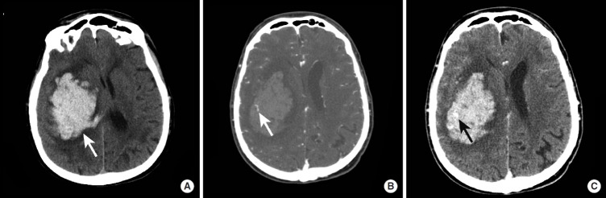
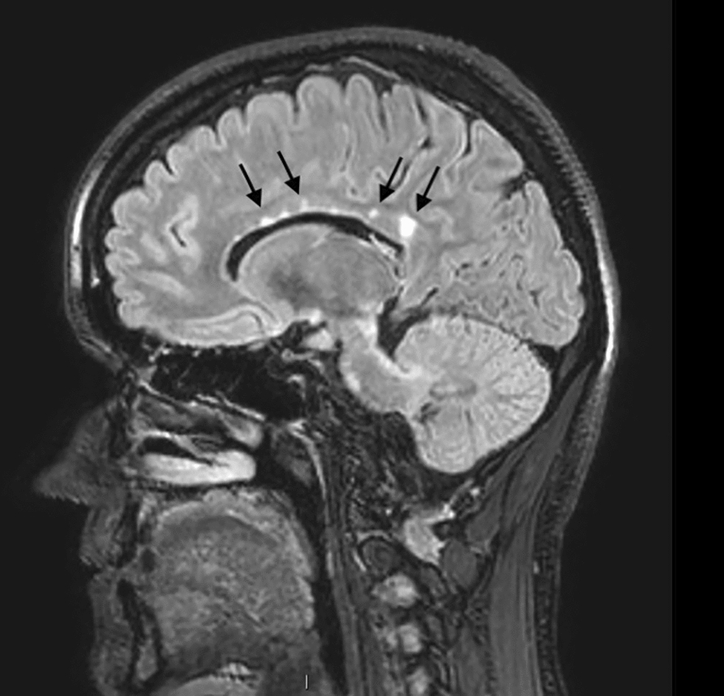
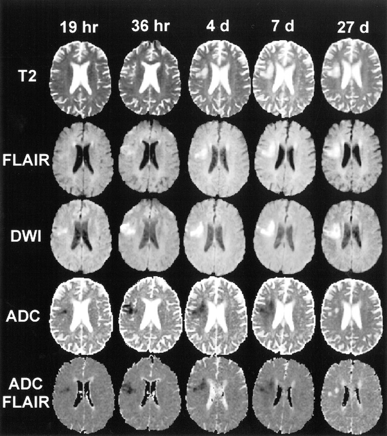
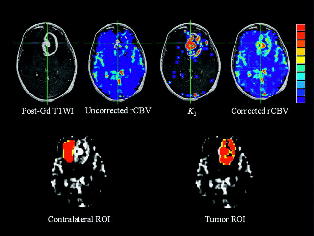
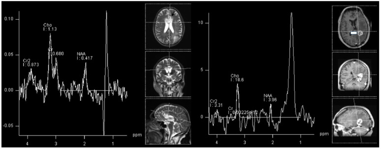

# CNS Imaging Methods, Perfusion & Spectroscopy

A methods/technique answer: how each CNS imaging tool works, what unique information it adds, and how the advanced MR techniques (diffusion, perfusion, spectroscopy, SWI, fMRI/DTI, CSF-flow) are combined to characterise disease. For the brain, CT and MRI dominate; ultrasound is limited to neonates (open fontanelle) and intra-operative use, and plain radiography has almost no role in modern parenchymal work.

## 1. Classification / framework

Organise CNS imaging methods into anatomical (structural) techniques and physiological (functional/advanced) techniques.

**A. Structural / anatomical techniques**
- Computed tomography (CT): non-contrast CT (NCCT), contrast-enhanced CT (CECT), CT angiography (CTA), CT venography (CTV), CT perfusion (CTP).
- Magnetic resonance imaging (MRI) conventional sequences: T1, T2, FLAIR, proton density; post-gadolinium T1; gradient-echo (GRE) and susceptibility-weighted imaging (SWI); MR angiography (TOF/phase-contrast/contrast-enhanced) and MR venography.

**B. Physiological / advanced techniques**
- Diffusion-weighted imaging (DWI) with ADC mapping; diffusion tensor imaging (DTI) and tractography.
- Perfusion: DSC (dynamic susceptibility contrast, T2*-based, gives rCBV/rCBF), DCE (dynamic contrast-enhanced, T1-based, gives Ktrans/permeability), and ASL (arterial spin labelling, non-contrast).
- MR spectroscopy (MRS): single-voxel and multi-voxel/chemical-shift imaging.
- Functional MRI (BOLD fMRI) for eloquent cortex mapping.
- CSF-flow imaging (phase-contrast MRI; cine flow).

A useful way to frame any neuro case: CT answers "is there blood, bone, calcium or mass effect now?"; conventional MRI answers "where is it and what tissue signal?"; DWI/perfusion/spectroscopy answer "what is it (cellularity, vascularity, metabolites)?".

## 2. Modality-wise roles and findings

### Ultrasound and radiography (limited role)
Transfontanellar neonatal ultrasound assesses germinal-matrix/intraventricular haemorrhage, ventricular size and hydrocephalus, and is portable/radiation-free. Intra-operative US helps localise lesions and assess resection. Beyond the neonate the closed skull precludes brain US. Plain skull radiography is essentially obsolete for parenchymal disease (occasional role in shunt-series, gross fractures, or radio-opaque foreign bodies).

### CT (including CTA/CTP)
NCCT is the front-line emergency tool: fast, widely available, excellent for acute haemorrhage (hyperdense), bone (fracture, skull base), calcification, and gross mass effect/herniation. It is the standard first study in acute stroke (to exclude haemorrhage) and trauma. Limitations: lower soft-tissue contrast than MRI, posterior fossa beam-hardening artefact, and ionising radiation.

CECT adds detection of breakdown of the blood-brain barrier (enhancing tumour, abscess wall, meningitis). CTA (timed arterial-phase volumetric acquisition) demonstrates large-vessel occlusion, aneurysm, dissection and stenosis; CTV demonstrates dural venous sinus thrombosis. CT perfusion (CTP) tracks a contrast bolus over time to derive CBF, CBV and MTT/Tmax; in acute stroke the mismatch between the infarct core (markedly reduced CBV/CBF) and the salvageable penumbra (prolonged MTT/Tmax with relatively preserved CBV) guides reperfusion decisions.

### MRI: conventional sequences and what each adds
MRI gives superior soft-tissue contrast, multiplanar capability, and no ionising radiation. Know the role of each sequence:

- **T1-weighted**: best anatomy; fat, subacute (methaemoglobin) blood, melanin and proteinaceous fluid are bright; CSF dark. Baseline for post-contrast comparison.
- **T2-weighted**: most pathology (oedema, gliosis, most tumours) is bright; CSF bright.
- **FLAIR**: T2 with CSF signal nulled, so periventricular/cortical and juxta-CSF lesions (MS plaques, cortical infarct, subarachnoid blood/meningitis with abnormal sulcal signal) stand out.
- **DWI/ADC**: detects restricted diffusion (see below).
- **GRE/SWI**: susceptibility-sensitive; blooming of blood products, calcium and iron. SWI is more sensitive than GRE for microbleeds, cavernomas, mineralisation and venous structures, and can show intratumoural susceptibility signal.
- **Post-contrast T1 (gadolinium)**: enhancement indicates blood-brain barrier breakdown or normally enhancing structures; patterns (ring, solid, leptomeningeal, ependymal) drive differentials.

### Diffusion-weighted imaging (DWI/ADC)
DWI measures the random motion of water protons. Restricted diffusion = high signal on DWI with corresponding low ADC (dark on ADC map); confirm on the ADC map to avoid "T2 shine-through" (bright on DWI but bright/normal ADC, i.e. no true restriction). Causes of true restriction:
- **Cytotoxic oedema of acute infarction** — the earliest reliable sign of ischaemic stroke, positive within minutes-hours, before CT/conventional MRI change.
- **Pyogenic abscess cavity** — viscous pus restricts (helps separate abscess from necrotic tumour, which usually does not).
- **Epidermoid cyst** — restricts (distinguishes it from arachnoid cyst, which follows CSF and does not restrict).
- **Hypercellular tumours** — densely packed cells (e.g. lymphoma, medulloblastoma, other small-round-blue-cell tumours, high-grade glioma) restrict because of reduced extracellular space.
- Others: acute demyelination, herpes encephalitis, Creutzfeldt-Jakob cortical ribboning, hyperviscous/haemorrhagic states.

### Perfusion MRI
Perfusion characterises microvascular blood volume, flow and permeability.
- **DSC (dynamic susceptibility contrast)**: T2*/GRE echo-planar tracking of a gadolinium bolus causing transient signal drop; the main output is relative cerebral blood volume (**rCBV**). Elevated rCBV reflects neovascularity/angiogenesis and correlates with higher glioma grade; rCBV helps target biopsy to the most malignant region and helps distinguish high-grade from low-grade tumour. A key application is **recurrent/progressive tumour (high rCBV) versus radiation necrosis (low rCBV)** after treatment.
- **DCE (dynamic contrast-enhanced)**: T1-based; models contrast leakage to give permeability parameters (Ktrans, Ve, Vp). Reflects blood-brain barrier integrity; complements DSC for grading and treatment-response assessment.
- **ASL (arterial spin labelling)**: magnetically labels arterial blood as an endogenous tracer — no gadolinium, repeatable, good in renal impairment and children. Gives cerebral blood flow; useful for tumour vascularity, hyperperfused arteriovenous shunts, and ictal/post-ictal perfusion changes.

Caution interpreting absolute thresholds: rCBV cut-offs for grading and for recurrence-versus-necrosis vary by technique and institution (verify exact value); report trends and side-to-side ratios rather than memorised numbers.

### MR spectroscopy (MRS)
MRS displays tissue metabolite concentrations as peaks along a chemical-shift (ppm) axis. Key metabolites:
- **NAA (N-acetylaspartate, ~2.0 ppm)**: neuronal marker; reduced when neurons are lost/displaced (tumour, infarct, most pathology).
- **Choline (Cho, ~3.2 ppm)**: membrane turnover; elevated with high cellular proliferation (tumour, active demyelination).
- **Creatine (Cr, ~3.0 ppm)**: relatively stable, used as an internal reference.
- **Lactate (~1.3 ppm, doublet that inverts at intermediate TE)**: anaerobic metabolism — necrosis, ischaemia, high-grade tumour, abscess.
- **Lipid (~0.9-1.3 ppm)**: necrosis/membrane breakdown — high-grade tumour, abscess, metastasis.
- **Amino acids/acetate/succinate** within an abscess cavity support pyogenic infection.

Disease patterns to recognise:
- **Tumour**: elevated Cho, reduced NAA, raised **Cho/NAA ratio**; lipid/lactate suggest higher grade/necrosis. The ratio rising in peritumoural tissue suggests infiltrative (glioma) rather than purely vasogenic (metastatic) oedema.
- **Recurrent tumour vs radiation necrosis**: recurrence tends to show elevated Cho/Cho-Cr; pure radionecrosis shows low metabolites with lipid-lactate.
- **Abscess**: cytosolic amino acids, acetate, succinate, lactate within the cavity (with low Cho), unlike necrotic tumour.

### Functional MRI, DTI and tractography (concepts)
- **BOLD fMRI** exploits the blood-oxygen-level-dependent signal: neuronal activation increases local blood flow, altering the oxy/deoxy-haemoglobin ratio and T2* signal. Task-based or resting-state fMRI localises eloquent cortex (motor, language, visual) for pre-surgical planning.
- **DTI** measures the direction and magnitude of water diffusion. Fractional anisotropy (FA) is high in organised white-matter tracts; mean diffusivity reflects overall diffusion. **Tractography** reconstructs major fibre bundles (e.g. corticospinal tract, arcuate fasciculus) to show displacement, infiltration or disruption by a mass — guiding the surgical approach to spare tracts.

### CSF-flow imaging
**Phase-contrast (cine) MRI** encodes velocity to quantify and visualise CSF flow across a chosen plane (typically the aqueduct or foramen magnum). Applications: confirming aqueductal patency versus stenosis, assessing communicating versus non-communicating/obstructive hydrocephalus, demonstrating to-and-fro flow through the foramen magnum in Chiari I, evaluating arachnoid cysts/web obstruction, and predicting/assessing shunt or third-ventriculostomy function (verify exact normal velocity values).

## 3. Differentials / comparison tables

### CT versus MRI: core strengths

| Feature | CT | MRI |
|---|---|---|
| Acute haemorrhage | Excellent, fast | Good (GRE/SWI), slower |
| Bone / fracture / calcium | Excellent | Limited |
| Soft-tissue contrast | Moderate | Excellent |
| Acute infarct (early) | Insensitive early | DWI positive within hours |
| Posterior fossa | Beam-hardening artefact | Superior |
| Speed / availability / unstable patient | Superior | Limited |
| Radiation | Yes | None |

### Restricted diffusion: key discriminators

| Lesion | DWI / ADC | Discriminating point |
|---|---|---|
| Acute infarct | Bright DWI / low ADC | Vascular territory, earliest sign |
| Pyogenic abscess | Restricting centre | Vs necrotic tumour (no central restriction) |
| Epidermoid | Restricts | Vs arachnoid cyst (follows CSF, no restriction) |
| Hypercellular tumour (lymphoma, medulloblastoma) | Restricts | Dense cellularity, often homogeneous enhancement (lymphoma) |

### Perfusion techniques

| Technique | Basis | Contrast | Main output | Typical use |
|---|---|---|---|---|
| DSC | T2*/susceptibility | Gadolinium bolus | rCBV (rCBF) | Glioma grade; recurrence vs necrosis |
| DCE | T1 leakage | Gadolinium | Ktrans, Ve, Vp | Permeability/BBB, grading, response |
| ASL | Magnetic labelling | None | CBF | No-contrast vascularity, children, AV shunt |
| CTP | Iodinated bolus tracking | Iodine | CBF/CBV/MTT/Tmax | Acute stroke core/penumbra |

### Recurrent tumour vs radiation necrosis (advanced MR)

| Parameter | Recurrent/progressive tumour | Radiation necrosis |
|---|---|---|
| DSC rCBV | Elevated | Low |
| MRS Cho / Cho-Cr | Elevated | Low metabolites |
| MRS lipid-lactate | May be present | Often prominent |
| Note | Mixed/overlapping picture common — combine techniques and follow-up | |

## 4. Pearls & buzzwords
- Always confirm "restriction" on the ADC map — guard against **T2 shine-through**.
- **DWI is the earliest sign of acute infarction**, positive before CT/conventional MRI change.
- **Abscess restricts; necrotic/cystic tumour usually does not** — a classic DWI distinction.
- **Epidermoid restricts; arachnoid cyst follows CSF** on all sequences including DWI/FLAIR.
- **SWI > GRE** for microbleeds, cavernoma, calcium/iron and small veins.
- **High rCBV = high grade / recurrence; low rCBV = radionecrosis** (overlap exists; verify exact thresholds).
- MRS tumour triad: **high Cho, low NAA, raised Cho/NAA**; lipid-lactate flags necrosis/high grade.
- Abscess MRS: **amino acids, acetate, succinate, lactate** in the cavity.
- **ASL needs no gadolinium** — ideal for renal impairment and serial paediatric studies.
- **Phase-contrast cine MRI** quantifies CSF flow (aqueductal patency, Chiari, hydrocephalus, shunt assessment).
- fMRI maps eloquent cortex; **DTI/tractography** shows tract displacement vs infiltration vs disruption for surgical planning.

## 5. What to draw
- A labelled MRS spectrum: ppm axis with peaks for lipid/lactate (~0.9-1.3), NAA (~2.0), Cr (~3.0) and Cho (~3.2); annotate the tumour pattern (up Cho, down NAA).
- A DSC signal-intensity-versus-time curve showing the transient drop with the bolus, and a note that area under the curve relates to rCBV.
- A two-circle Venn-style sketch contrasting infarct core (low CBV/CBF) and penumbra (prolonged MTT/Tmax, preserved CBV).
- A simple decision tree: bright DWI -> check ADC -> low ADC (true restriction: infarct/abscess/epidermoid/hypercellular tumour) vs high/normal ADC (T2 shine-through).
- A flow diagram of MRI sequence roles (T1/T2/FLAIR/DWI/SWI/post-contrast) mapped to "what each adds".

## 6. Further reading
- Osborn's Brain (imaging techniques and advanced MR chapters).
- Grossman & Yousem, Neuroradiology: The Requisites (technique and perfusion/spectroscopy sections).
- Barkovich & Raybaud, Pediatric Neuroimaging (CSF-flow and advanced techniques).
- A current review on DSC/DCE perfusion and MRS in glioma grading and post-treatment assessment (confirm institutional thresholds locally).
